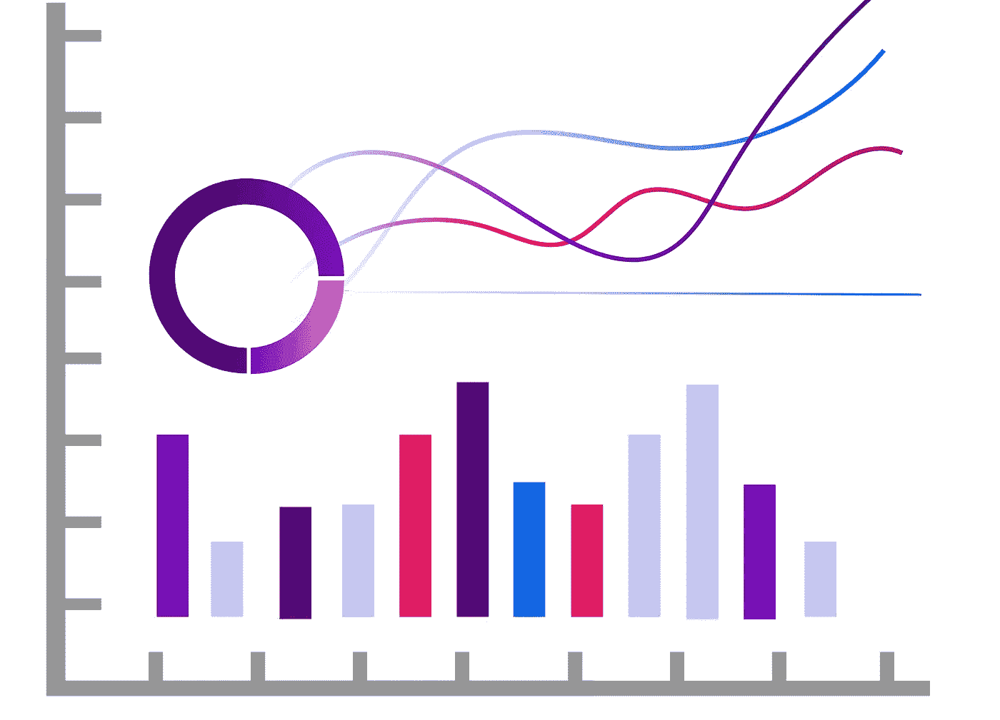

# 如何设计机器学习交易机器人——第二部分:数据分析

> 原文：<https://medium.com/coinmonks/how-to-design-a-machine-learning-trading-bot-part2-data-analysis-f42a669dcd4c?source=collection_archive---------3----------------------->

## 通过阅读这篇文章，你将有机会节省至少 59 美元。

**《如何设计机器学习交易机器人》前情提要**

我们已经从[开始收集数据](https://25mordad.medium.com/how-to-design-a-machine-learning-trading-bot-part1-data-collection-b63e36a7e606):

我们发现了什么是 OHLCV 数据，我们了解了为什么我们需要历史数据和在线数据。

因此，让我们开始第二步，考虑到我们已经收集了数据，我们有它。
本文是题为“如何设计一个机器学习交易机器人”系列文章的第二集

## **第二步:数据分析**

清理数据、过滤数据和描述工程数据是机器学习方法的基本步骤之一。
为了说明这一段的意义有多重要，我可以把整个开发时间拆分成十帧，“分析数据”要占整个过程的一半时间，也就是五帧。换句话说，您正在处理历史数据，以便为机器提供预期的数据版本。
请记住，这些数据就像是机器的饲料，如果你给它们提供一份健康、低脂肪的食物，它们会运行得更好，但如果你给它们提供劣质食物，那么即使你有世界上最贵、质量最好的机器，它也不会正常工作。如果你有数学或统计学背景，你很适合这部分，但如果你没有，不要担心:)你可以用基本知识达到你的目标。

Visualizing Data

## **可视化数据:**

可视化数据是一种以简单而完美的方式查看和分析数据的方法。因此，到了这个阶段，你将会大量使用图表，它们会帮助你看到你在原始数据中遗漏了什么。

## **关键数据** **分析术语:**

在数据分析中有两个主要的关键词，你应该在继续深入之前知道。“标签”和“特征”
在[谷歌机器学习速成班](https://developers.google.com/machine-learning/crash-course/framing/ml-terminology)中，你可以找到关于这些术语的精细解释。

## **最后但同样重要的是**

在许多机器学习课程和教程中，他们为你提供准备好的数据，课程从你如何训练机器开始。他们在示例中使用的数据完全是经过工程设计的，可以用于培训，但实际上，这些数据并不是为您提供的。你应该为你的目的准备好数据。请记住，资源和参考仍然是有限的。在下一季的开发部分，我们将看到如何对 OHLCV 数据进行“特征工程”,并为训练做准备。

## 我们现在要做什么？

**大约 1DES**

1DES 是由机器学习驱动的交易解决方案。在 1DES，我们提供了一种利用机器学习技术进行交易的创新方法。
1 des 为所有用户提供“免费试用”计划。此外，如果你想更专业地交易，还有其他计划，目前他们都有 50%的折扣。

此外，作为对本文读者的特别优惠，如果您在 2021 年 3 月 20 日之前选择 Avion 或 Rocket 计划之一，1DES 将退还第一个月的订阅费。

 [## 机器学习驱动的交易解决方案

### 1 月 1 日免费注册…

1des.com](https://1des.com/?utm_source=medium&utm_medium=story&utm_campaign=how_design&utm_term=e_2&utm_content=data_analysis)