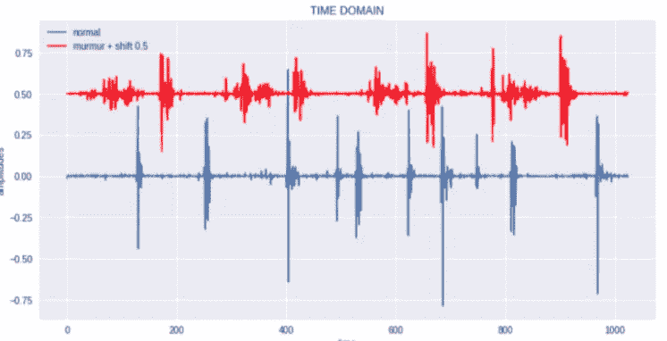

# 如何利用来自移动电话的声音检测心脏音频信号处理中的异常

> 原文：<https://medium.com/coinmonks/how-to-detect-anomalies-in-audio-signal-processing-of-the-heart-with-sound-coming-from-mobile-e034e8fd709b?source=collection_archive---------2----------------------->

这项工作旨在用声音检测心脏的不规则性。通常由医生用听诊器进行常规检查(可能一年一次)。听诊器对于发现异常非常有用，这表明需要进一步研究。