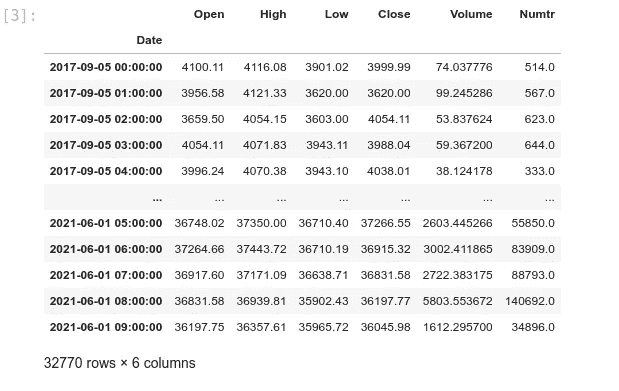
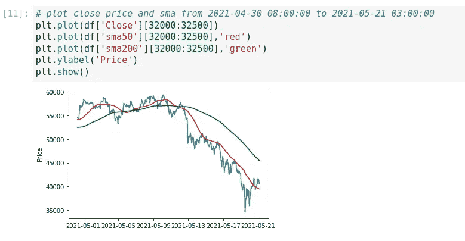
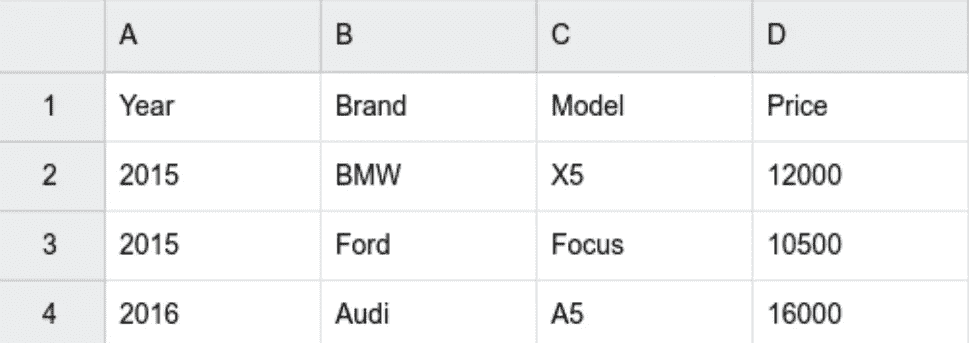
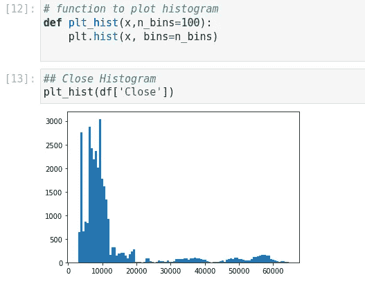
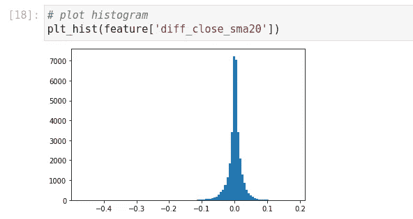
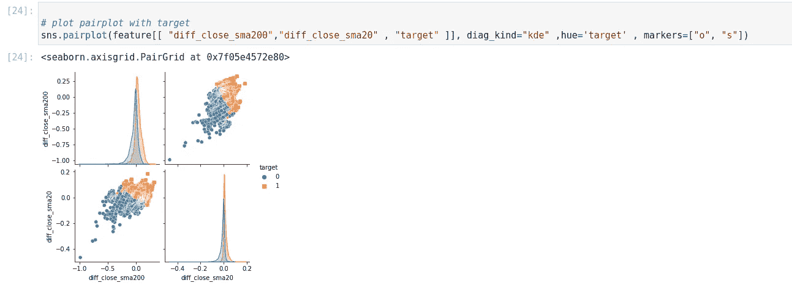

# 如何开发一个机器学习交易机器人:数据分析

> 原文：<https://medium.com/coinmonks/how-to-develop-a-machine-learning-trading-bot-data-analysis-b6903b36f496?source=collection_archive---------3----------------------->

## **《如何开发》前情提要:**

如果您想最大限度地提高开发和编码的性能，请在继续之前阅读“[如何设计一个机器学习交易机器人—第二部分:数据分析](https://1des.com/blog/posts/how-to-develop-machine-learning-trading-bot-data-collection)”。

接下来，我们来看发展。

数据分析是机器学习的关键组成部分。当与金融市场的数字数据相结合时，它变得更加重要。本系列中的文章旨在作为教育材料。结果，复杂的问题被简化为非常简单的问题。这项研究还使用基本数据来说明如何对它们进行分析。最终，我们将在这一系列文章中探索如何通过机器学习来改善交易。

# 数据分析:

上一篇文章讨论了如何收集 OHLCV 数据(流数据)以及如何使用历史数据。我们利用历史数据来训练机器，并基于该模型对数据进行流处理以做出预测。

Data analysis

在这一步，我们需要历史数据，我们使用下面的存储库: [1H.csv](https://github.com/the1des/historical_data/blob/main/binance/1H.csv)

在 CSV 文件中，您会发现币安 1 小时 OHLCV 活动从 2017 年 9 月 5 日开始，到 2021 年 6 月 1 日结束。

我们这次探索的是 Jupyterlab 中的代码。Jupyterlab 为教育和研究目标提供了更好的环境。

[crypto_data_analysis](https://github.com/the1des/crypto_data_analysis) 和 [analysis.ipynb](https://github.com/the1des/crypto_data_analysis/blob/main/analysis.ipynb)

区块[1–3]

首先，让我们看看我们的数据中有什么。我们将只显示 CSV 文件中的数据表。请注意，我们需要将日期从字符串重新格式化为日期时间，并将其设置为索引。

Data Frame

区块[4–6]

我们有两块价格相近的土地。第一个显示了整个数据框。第二个显示了从 2021 年 4 月 30 日 08:00:00 到 2021 年 5 月 21 日 03:00:00 的收盘价图。这有助于您理解数据集是如何工作的。

> 不要害怕可视化您的数据。这将有助于你的分析。以下是我们将用于绘图的两个最有用的 Python 库:

matplotlib:[https://matplotlib.org](https://matplotlib.org/)

海伯恩:[https://seaborn.pydata.org](https://seaborn.pydata.org/)

区块[7–8]:

我们这里使用的是清理过的数据，丢失的数据早些时候已经修复了。在继续之前，您必须检查您的数据，并更正任何不正确和丢失的数据。例如，我们只是检查 Close 列中是否有空值。

区块[9–11]:

让我们在数据帧中加入一些接近(SMA9，SMA20，SMA50，SMA200)的移动平均线。将包含 SMA50 和 SMA200 的图表可视化。

Chart with SMA

现在，让我们回顾一下数据分析中的两个主要关键词:

1-特征

双标签

在下一篇文章中，我们将更详细地讨论标签。这次我们将重点放在特性上。

选择正确的功能至关重要。在我们进一步讨论之前，这里是特征定义(来自谷歌机器学习速成班):

要素是输入变量，即简单线性回归中的 x 变量。一个简单的机器学习项目可能使用单个特征，而一个更复杂的机器学习项目可能使用数百万个特征。

假设我们有一组汽车价格，如下所示，我们想预测给定汽车的价格:

Car Data Sample

价格是我们的标签，年份、型号、品牌是我们的特色。

回到我们的数据，我们需要找到一些特征来填充我们的机器。

Q?

我们需要的特征是否已经包含在我们的数据集中，或者我们应该构建它？

成交率是一个值得选择的有用特性吗？

标签呢？我们计划预测价格吗？还有其他计划吗？

在这项研究中，我们不会预测价格，这意味着成交率不会成为一个标签。

[analysis.ipynb](https://github.com/the1des/crypto_data_analysis/blob/main/analysis.ipynb)

区块[12–13]

关闭和打开都不能成为特征。即使您将速率标准化，您仍然可以获得与机器训练速率不同的速率。

您可以通过观察成交率直方图来了解成交是如何分布的。如果要选择一个特征，直方图应该类似于正态分布。

Close Histogram

区块[14–20]

我们数据框中的这些列都不是我们的潜在功能。这引导我们建造一个。让我们为 close 和 SMA 20 之间的差异添加一个新列。从直方图可以看出，它比以前更类似于正态分布。但是，这里还是有问题。收盘价和 SMA 20 的方差在-2000 和+2000 之间。这表明我们的更新功能仍然取决于收盘价格。因此，将结果除以成交率，我们可以将方差改为-0.1 和+0.1。机器喜欢这个数字范围:)

diff_close_sma20 histogram

区块[21–24]

在结束本节之前，让我们先来看看几个有用的函数:

通过绘制相关热图，您可以识别哪些要素是相关的，并避免使用它们。示例中 diff_close_sma20 和 diff_close_sma200 的行为非常相似。实际上，这已经足够了。

我们将在下一篇文章中更多地讨论标签，但是为了使它更实用，考虑标签的这个规则:

高于 SMA50 的收盘价标记为 1，反之标记为 0。

使用 Pairplot，我们可以看到特征如何覆盖目标。

Pairplot

> 加入 Coinmonks [电报频道](https://t.me/coincodecap)和 [Youtube 频道](https://www.youtube.com/c/coinmonks/videos)了解加密交易和投资

## 另外，阅读

*   [电网交易机器人](https://blog.coincodecap.com/grid-trading) | [Cryptohopper 审查](/coinmonks/cryptohopper-review-a388ff5bae88) | [Bexplus 审查](https://blog.coincodecap.com/bexplus-review)
*   [7 个最佳零费用加密交易平台](https://blog.coincodecap.com/zero-fee-crypto-exchanges)
*   [加拿大最佳加密交易机器人](https://blog.coincodecap.com/5-best-crypto-trading-bots-in-canada) | [库币评论](https://blog.coincodecap.com/kucoin-review)
*   [火币加密交易信号](https://blog.coincodecap.com/huobi-crypto-trading-signals) | [HitBTC 审核](/coinmonks/hitbtc-review-c5143c5d53c2)
*   [如何在 FTX 交易所交易期货](https://blog.coincodecap.com/ftx-futures-trading) | [OKEx vs 币安](https://blog.coincodecap.com/okex-vs-binance)
*   [OKEx vs KuCoin](https://blog.coincodecap.com/okex-kucoin) | [摄氏替代品](https://blog.coincodecap.com/celsius-alternatives) | [如何购买 VeChain](https://blog.coincodecap.com/buy-vechain)
*   [币安期货交易](https://blog.coincodecap.com/binance-futures-trading)|[3 commas vs Mudrex vs eToro](https://blog.coincodecap.com/mudrex-3commas-etoro)
*   [如何购买 Monero](https://blog.coincodecap.com/buy-monero) | [IDEX 评论](https://blog.coincodecap.com/idex-review) | [BitKan 交易机器人](https://blog.coincodecap.com/bitkan-trading-bot)
*   [尤霍德勒 vs 考尼洛 vs 霍德诺特](/coinmonks/youhodler-vs-coinloan-vs-hodlnaut-b1050acde55a) | [Cryptohopper vs 哈斯博特](https://blog.coincodecap.com/cryptohopper-vs-haasbot)
*   [顶级付费加密货币和区块链课程](https://blog.coincodecap.com/blockchain-courses)
*   [MXC 交易所评论](/coinmonks/mxc-exchange-review-3af0ec1cba8c) | [Pionex vs 币安](https://blog.coincodecap.com/pionex-vs-binance) | [Pionex 套利机器人](https://blog.coincodecap.com/pionex-arbitrage-bot)
*   [如何在印度购买比特币？](/coinmonks/buy-bitcoin-in-india-feb50ddfef94) | [WazirX 审查](/coinmonks/wazirx-review-5c811b074f5b)