# 如何使用 Node.js 开发一个亚马逊 Alexa 技能

> 原文：<https://medium.com/coinmonks/how-to-develop-an-amazon-alexa-skill-using-node-js-b872ef5320b1?source=collection_archive---------3----------------------->


在本教程中，我们将通过使用 *nodejs* 、 *npm* 和 *AWS Lambda 函数*为**亚马逊 Alexa** 实现一个*自定义技能*。这个技能基本上就是一个 **Hello World** 的例子。通过本教程，你将能够为 Amazon Alexa 创建自定义技能，使用 *nodejs* 实现功能，并从本地计算机和 AWS 启动自定义技能。

本教程包含来自不同资源的材料，可在*资源*部分查看。

# 先决条件

*   一个 NPM 项目。有关如何建立 NPM 项目的信息，请参见此。

*   一个合适的 Node.js 开发环境。*向 SDK v2* 请求 Node.js 需要**节点 4.3.2** 或以上的**。**
*   一个亚马逊开发者账户。这是创建和配置 Alexa 技能所必需的。
*   亚马逊网络服务(AWS)账户。本指南将带你了解如何在 AWS Lambda 上掌握一项技能。(或者如果你想在不使用 AWS 的情况下创建一个技能，你可以使用一个名为[alexa-skill-local]的 npm 包。([https://www.npmjs.com/package/alexa-skill-local](https://www.npmjs.com/package/alexa-skill-local)))

# 将 ASK SDK 添加到项目中

*   从您的 NPM 项目中，运行以下命令来安装标准 ASK SDK v2 for Node.js 发行版:

`npm install --save ask-sdk`

# 配置亚马逊 Alexa 自定义技能

*   [在开发者控制台](https://developer.amazon.com/docs/devconsole/create-a-skill-and-choose-the-interaction-model.html)创建新技能。当提示选择模型时，选择自定义模型。
*   转到[developer.amazon.com/alexa](https://developer.amazon.com/alexa)。


*   点击**你的 Alexa 控制台**然后点击**技能**。这将打开开发人员控制台，并显示您已经创建的所有技能。

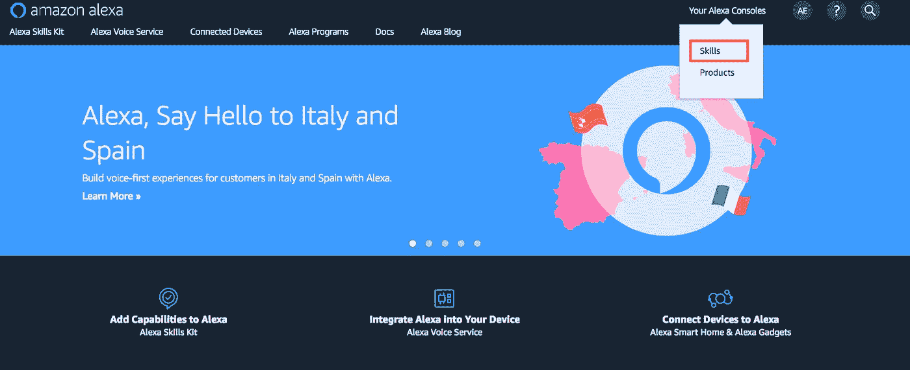

*   点击**创造技能**。

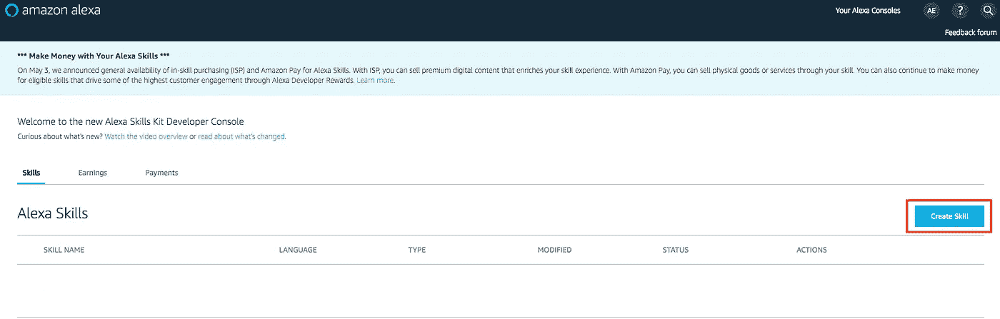

*   输入技能名称。这是您发布技能时客户将看到的名称。您可以稍后在**发行版**页面上编辑该名称。

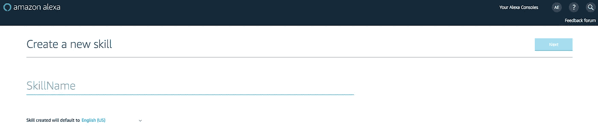

*   如有必要，更改技能的初始语言，然后点击**下一步**。
*   点击选择按钮选择你想要包含的模型(对于本教程，我们将使用**自定义**)。

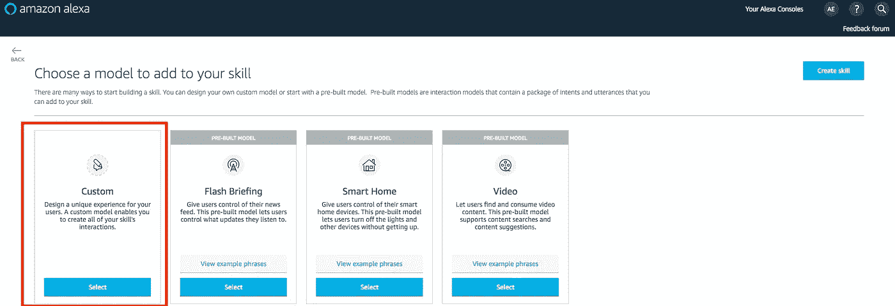

# 实现请求处理程序

首先创建处理不同类型的传入请求所需的请求处理程序。

# 启动请求处理程序

下面的代码示例显示了如何配置当技能接收到`LaunchRequest`时调用的处理程序。当技能在没有特定意图的情况下被调用时，就会发生`LaunchRequest`事件。

创建一个名为`index.js`的文件，并粘贴以下代码。

```
const LaunchRequestHandler = {
    canHandle(handlerInput) {
        return handlerInput.requestEnvelope.request.type === 'LaunchRequest';
    },
    handle(handlerInput) {
        const speechText = 'Welcome to the Alexa Skills Kit, you can say hello!';return handlerInput.responseBuilder
            .speak(speechText)
            .reprompt(speechText)
            .withSimpleCard('Hello World', speechText)
            .getResponse();
    }
};
```

如果传入的请求是一个`LaunchRequest`，那么`canHandle`函数返回 true。`handle`函数生成并返回一个基本的问候响应。

# HelloWorldIntent 事件处理程序

下面的代码示例显示了如何配置当技能接收到`HelloWorldIntent`时调用的处理程序。

将以下代码粘贴到您的`index.js`文件中，在前一个处理程序之后。

```
const HelloWorldIntentHandler = {
    canHandle(handlerInput) {
        return handlerInput.requestEnvelope.request.type === 'IntentRequest'
            && handlerInput.requestEnvelope.request.intent.name === 'HelloWorldIntent';
    },
    handle(handlerInput) {
        const speechText = 'Hello World!';return handlerInput.responseBuilder
            .speak(speechText)
            .withSimpleCard('Hello World', speechText)
            .getResponse();
    }
};
```

`canHandle`函数检测传入的请求是否为`IntentRequest`，如果 intent 名称为`HelloWorldIntent`，则返回 true。`handle`函数生成并返回一个基本的“Hello world”响应。

# 帮助意图处理程序

下面的代码示例显示了如何配置一个处理程序，以便在技能接收到内置意图`AMAZON.HelpIntent`时调用。

将以下代码粘贴到您的`index.js`文件中，在前一个处理程序之后。

```
const HelpIntentHandler = {
    canHandle(handlerInput) {
        return handlerInput.requestEnvelope.request.type === 'IntentRequest'
            && handlerInput.requestEnvelope.request.intent.name === 'AMAZON.HelpIntent';
    },
    handle(handlerInput) {
        const speechText = 'You can say hello to me!';return handlerInput.responseBuilder
            .speak(speechText)
            .reprompt(speechText)
            .withSimpleCard('Hello World', speechText)
            .getResponse();
    }
};
```

与前面的处理程序类似，这个处理程序将一个`IntentRequest`与预期的意图名称相匹配。将返回基本的帮助说明。

# CancelAndStopIntent 处理程序

CancelAndStopIntenthandler 类似于 HelpIntent 处理程序，因为它也是由内置意图触发的。下面的例子使用一个处理程序来响应两个不同的意图，`Amazon.CancelIntent`和`Amazon.StopIntent`。

将以下代码粘贴到您的`index.js`文件中，在前一个处理程序之后。

```
const CancelAndStopIntentHandler = {
    canHandle(handlerInput) {
        return handlerInput.requestEnvelope.request.type === 'IntentRequest'
            && (handlerInput.requestEnvelope.request.intent.name === 'AMAZON.CancelIntent'
                || handlerInput.requestEnvelope.request.intent.name === 'AMAZON.StopIntent');
    },
    handle(handlerInput) {
        const speechText = 'Goodbye!';return handlerInput.responseBuilder
            .speak(speechText)
            .withSimpleCard('Hello World', speechText)
            .getResponse();
    }
};
```

对这两种意图的响应是相同的，因此使用单一处理程序可以减少重复代码。

# SessionEndedRequestHandler

虽然在接收到一个`SessionEndedRequest`之后，您不能用任何语音、卡片或指令返回一个响应，但是 SessionEndedRequestHandler 是一个放置您的清理逻辑的好地方。

将以下代码粘贴到您的`index.js`文件中，在前一个处理程序之后。

```
const SessionEndedRequestHandler = {
    canHandle(handlerInput) {
        return handlerInput.requestEnvelope.request.type === 'SessionEndedRequest';
    },
    handle(handlerInput) {
        //any cleanup logic goes here
        return handlerInput.responseBuilder.getResponse();
    }
};
```

# 错误处理程序

ASK SDK v2 for Node.js 带来了更好的错误处理支持，让 skill 轻松确保流畅的用户体验。错误处理程序是注入错误处理逻辑的好地方，比如未处理的请求、api 服务超时等。以下示例向您的技能添加了一个“捕捉所有错误”处理程序，以确保技能在出现所有错误时返回有意义的消息。

将以下代码粘贴到您的`index.js`文件中，在前一个处理程序之后。

```
const ErrorHandler = {
    canHandle() {
      return true;
    },
    handle(handlerInput, error) {
      console.log(`Error handled: ${error.message}`);return handlerInput.responseBuilder
        .speak('Sorry, I can\'t understand the command. Please say again.')
        .reprompt('Sorry, I can\'t understand the command. Please say again.')
        .getResponse();
    },
};
```

# 创建 Lambda 处理器

Lambda 处理程序是 AWS Lambda 函数的入口点。下面的代码示例创建一个 Lambda 处理函数，将所有入站请求路由到您的技能。Lambda handler 函数创建一个 SDK `Skill`实例，该实例配置了您刚刚创建的请求处理程序。

在您的`index.js`文件的开头添加以下代码。代码应该在您之前创建的处理程序之前。(记住，这是 ASK SDK v2！)

```
'use strict';const Alexa = require('ask-sdk-core');
// use 'ask-sdk' if standard SDK module is installed////////////////////////////////
// Code for the handlers here //
////////////////////////////////exports.handler = Alexa.SkillBuilders.custom()
     .addRequestHandlers(LaunchRequestHandler,
                         HelloWorldIntentHandler,
                         HelpIntentHandler,
                         CancelAndStopIntentHandler,
                         SessionEndedRequestHandler)
     .lambda();
```

# 配置您的技能

从侧边栏中选择**调用**选项，并输入“greeter”作为**技能调用名称**。

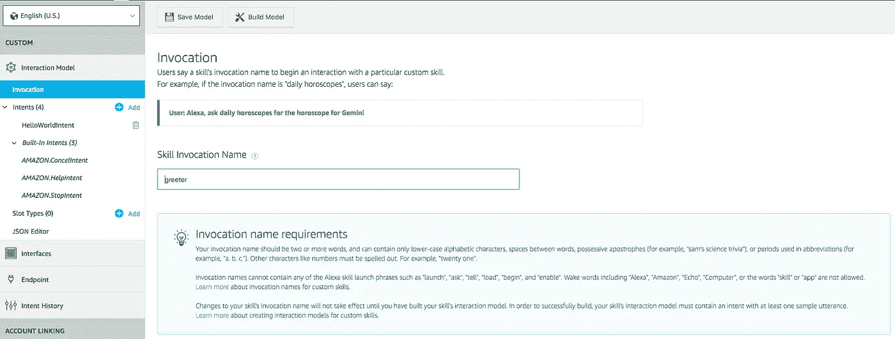

接下来，向交互模型添加一个名为`HelloWorldIntent`的意图。点击交互模型 Intents 部分下的 **Add** 按钮。

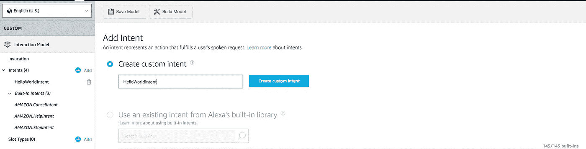

保持选中“创建自定义目的”，输入“HelloWorldIntent”作为目的名称，然后创建目的。在 intent detail 页面上，添加一些示例语句，用户可以说出这些语句来调用 intent。对于本例，您可以使用这些:

```
say hello
say hello world
hello
say hi
say hi world
hi
how are you
```

由于`AMAZON.CancelIntent`、`AMAZON.HelpIntent`和`AMAZON.StopIntent`是内置的 Alexa 意图，您不需要为它们提供示例语句。

开发人员控制台还允许您以 JSON 格式编辑整个技能模型。从侧边栏中选择 **JSON 编辑器**。对于这个示例，您可以使用下面的 JSON 模式。

```
{
  "interactionModel": {
    "languageModel": {
      "invocationName": "greeter",
      "intents": [
        {
          "name": "AMAZON.CancelIntent",
          "samples": []
        },
        {
          "name": "AMAZON.HelpIntent",
          "samples": []
        },
        {
          "name": "AMAZON.StopIntent",
          "samples": []
        },
        {
          "name": "HelloWorldIntent",
          "slots": [],
          "samples": [
            "how are you",
            "hi",
            "say hi world",
            "say hi",
            "hello",
            "say hello world",
            "say hello"
          ]
        }
      ],
      "types": []
    }
  }
}
```

编辑完交互模型后，一定要保存并构建模型。

# 在本地开始你的 Alexa 技能

## 安装 NPM 软件包和配置文件

我们将为这部分使用一个名为 [alexa-skill-local](https://www.npmjs.com/package/alexa-skill-local) 的 npm 包。为了启动您的应用程序，您还应该在根目录下创建一个 **asl-config.json** 文件。配置文件必须采用以下格式(如果您不确定“阶段”，大多数情况下是“开发”):

```
{
    "skillId" : "your_skill_id_here",
    "stage" : "stage_of_the_skill"
}
```

你可以在 Alexa 控制台页面找到你的技能 id，看起来像**amzn 1 . ask . skill . 6 F2 f 04 b 5-ABBA-3f 47–9fc 9–0 sbba 79 b 1535**。使用 **Node.js v8.x.x** 运行。你可以全局安装 alexa-skill-local(推荐)或者安装在你的项目目录中(在这种情况下，你可能想从 package.json 中的 npm 脚本运行它)。

```
$ npm install -g alexa-skill-local
```

**用途**

运行以下命令。出现提示时，在浏览器中打开 [http://localhost:3001](http://localhost:3001`) 。登录亚马逊，授予 *alexa-skill-local* 更新技能终点的权限。

```
$ alexa-skill-local
```

之后，按照控制台上的说明进行操作。

## 配置亚马逊 Alexa 技能

为技能配置端点。在**端点**下选择 **HTTPS** 并粘贴命令行上已经提供的 **URL。选择 SSL 证书类型为`My Development endpoint is a sub-domain of a domain that has a wildcard certificate from a certificate authority.`，其余设置可以保留默认值。单击保存端点。**

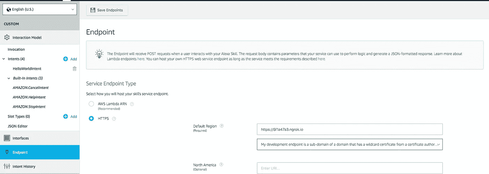

# 使用 AWS Lambda 开始你的 Alexa 技能

## 创建 AWS Lambda 函数

*   如果您还没有 AWS 帐户，请转到[亚马逊网络服务](http://aws.amazon.com/)并创建一个帐户。
*   登录 [AWS 管理控制台](http://aws.amazon.com/)并导航至 AWS Lambda。

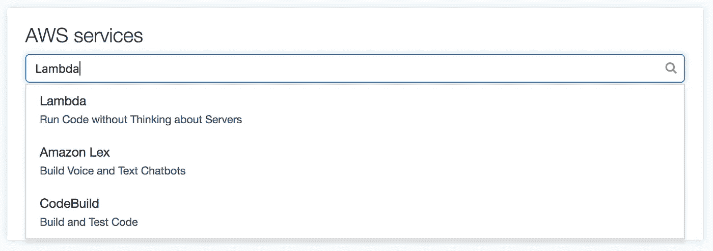

*   单击控制台右上角的区域下拉列表，选择 Alexa 技能支持的区域之一:亚太地区(东京)、欧盟(爱尔兰)、美国东部(N. Virginia)或美国西部(Oregon)。

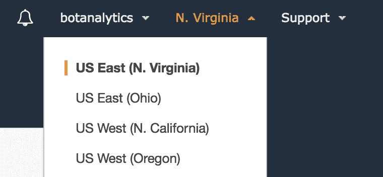

*   如果你还没有 Lambda 函数，点击**立即开始**。否则，点击**创建 Lambda 函数**。

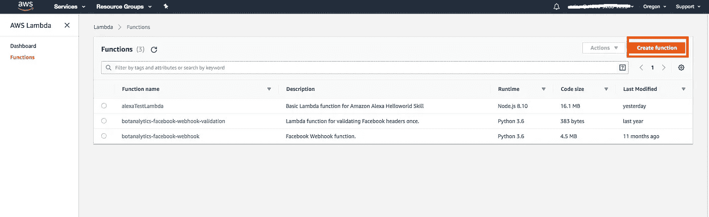

*   从头选择**作者**。
*   为该功能输入一个**名称**。
*   为该功能选择**角色**。这定义了该函数可以访问的 AWS 资源。
*   要使用现有角色，选择**现有角色**下的角色。
*   要创建新角色，参见[为功能](https://developer.amazon.com/docs/custom-skills/host-a-custom-skill-as-an-aws-lambda-function.html#define-new-role)定义新角色。记住我们需要一个**简单的微服务权限**给这个角色！
*   选择要用于运行时的语言(Node.js、Java 或 Python)。对于本教程，我们使用 Node.js。
*   点击**创建功能**。

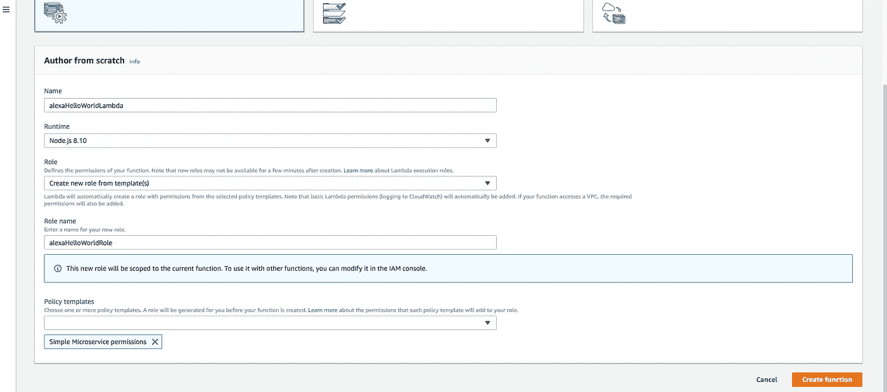

*   配置 **Alexa 技能包触发器**。

## 添加 Alexa 技能包触发器

*   去 https://www.developer.amazon.com/alexa 的。
*   点击**你的 Alexa 控制台**，然后点击**技能**。这将打开开发人员控制台，并显示您已经创建的任何技能。
*   在列表中找到技能。该 ID 显示在技能名称下方。

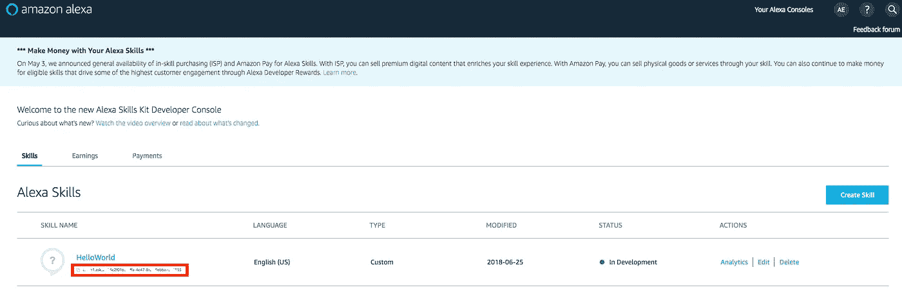

获得技能 ID 后，将触发器添加到函数中:

*   登录 [AWS 管理控制台](http://aws.amazon.com/)并导航至 AWS Lambda。
*   单击列表中的函数以打开配置详细信息。
*   确保您在**配置**页面上。
*   在**设计器**部分，在**添加触发器**下，点击 **Alexa 技能包**选择触发器。

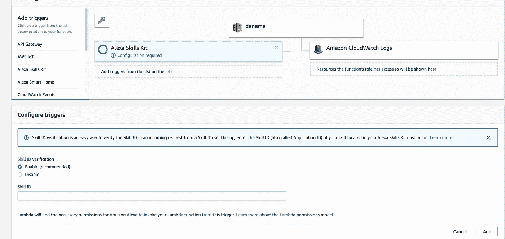

*   在**配置触发器**下，选择**启用**进行**技能 ID** 验证。
*   在技能 ID 编辑框中输入您的**技能 ID** 。
*   点击**添加**。
*   点击**保存**保存更改。

## 创建技能包

技能代码完成后，您可以创建技能包。为了准备上传到 AWS Lambda 的技能，创建一个包含技能文件和`node_modules`文件夹的 zip 文件。确保直接压缩所有项目文件，**而不是**项目文件夹。

## 将您的技能上传到 AWS Lambda

一旦您创建了 AWS Lambda 函数并将“Alexa 技能工具包”配置为触发器，请上传。zip 文件，并将处理程序保留为默认的`index.handler`。最后，复制 AWS Lambda 函数的 ARN，因为在 Amazon 开发人员控制台中配置技能时会用到它。

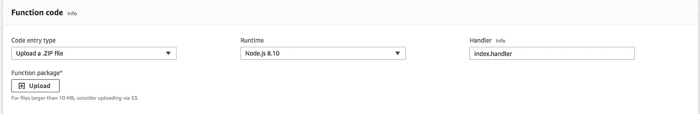

## 配置亚马逊 Alexa 技能

为技能配置端点。在**端点**下选择 **AWS Lambda ARN** 并粘贴到您之前创建的函数的 ARN 中。其余设置可以保留默认值。点击**保存端点**。

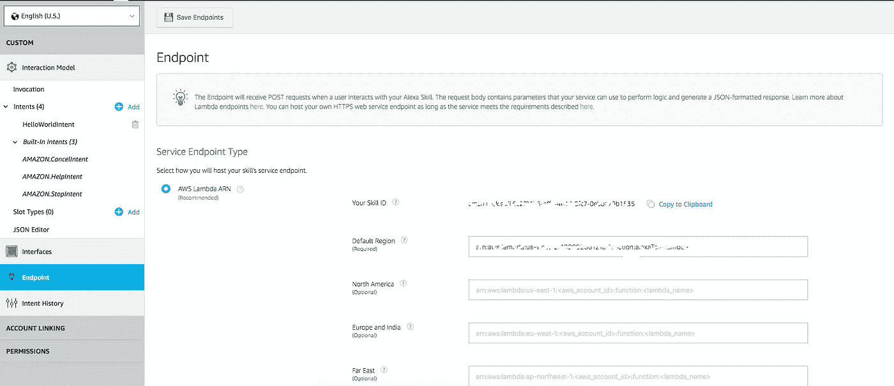

# 测试你的技能

此时您可以测试技能。单击顶部导航栏中的“测试”,转到“测试”页面。确保该技能选项的测试已启用。您可以使用测试页面以文本和语音形式模拟请求。使用调用名和一个示例语句。例如，“告诉迎宾员说你好，世界”应该导致你的技能回应“你好，世界”。测试一项新技能有多种选择:

使用调用名和我们刚刚配置的一个示例语句作为指导。例如，“告诉迎宾员说你好”应该导致你的技能回应“你好世界”。你也应该能够进入 Alexa 应用程序(在你的手机上或在[https://alexa.amazon.com](https://alexa.amazon.com/))并看到你的技能列在你的技能下。从这里开始，你可以在你的帐号上启用这个技能，从一个支持 Alexa 的设备上进行测试。

你需要定期跟踪你的机器人的表现，密切关注它的表现，让它登上排行榜。

最后，将你的技能与**机器人分析**联系起来，获得亚马逊 Alexa 技能的[免费分析。你不能改进你没有测量的东西，对吗？你可以使用我们的官方](https://botanalytics.co/voice-analytics) [Node.js 库](https://www.npmjs.com/package/botanalytics)来轻松集成僵尸分析。


# 参考

*   [https://github.com/alexa/alexa-skills-kit-sdk-for-nodejs](https://github.com/alexa/alexa-skills-kit-sdk-for-nodejs)
*   [https://github . com/Alexa/Alexa-skills-kit-SDK-for-nodejs/wiki/Developing-Your-First-Skill](https://github.com/alexa/alexa-skills-kit-sdk-for-nodejs/wiki/Developing-Your-First-Skill)
*   [https://developer . Amazon . com/docs/custom-skills/understanding-custom-skills . html](https://developer.amazon.com/docs/custom-skills/understanding-custom-skills.html)
*   [https://developer . Amazon . com/docs/custom-skills/steps-to-build-a-custom-skill . html](https://developer.amazon.com/docs/custom-skills/steps-to-build-a-custom-skill.html)
*   [https://developer . Amazon . com/docs/dev console/test-your-skill . html](https://developer.amazon.com/docs/devconsole/test-your-skill.html)
*   [https://developer . Amazon . com/docs/dev console/build-your-skill . html](https://developer.amazon.com/docs/devconsole/build-your-skill.html)
*   [https://medium . com/@ moon Ahmad/how-to-test-Alexa-locally-6d 498 e 307 A8](/@moonahmad/how-to-test-alexa-locally-6d498e307a8)
*   [https://www.npmjs.com/package/alexa-skill-local](https://www.npmjs.com/package/alexa-skill-local)
*   [https://developer . Amazon . com/docs/custom-skills/host-a-custom-skill-as-an-AWS-lambda-function . html](https://developer.amazon.com/docs/custom-skills/host-a-custom-skill-as-an-aws-lambda-function.html)


Clap to recommend this story to others

> 加入 Coinmonks [电报频道](https://t.me/coincodecap)和 [Youtube 频道](https://www.youtube.com/c/coinmonks/videos)获取每日[加密新闻](http://coincodecap.com/)

## 另外，阅读

*   [密码电报信号](http://Top 4 Telegram Channels for Crypto Traders) | [密码交易机器人](/coinmonks/crypto-trading-bot-c2ffce8acb2a)
*   [复制交易](/coinmonks/top-10-crypto-copy-trading-platforms-for-beginners-d0c37c7d698c) | [加密税务软件](/coinmonks/crypto-tax-software-ed4b4810e338)
*   [网格交易](https://coincodecap.com/grid-trading) | [加密硬件钱包](/coinmonks/the-best-cryptocurrency-hardware-wallets-of-2020-e28b1c124069)
*   [最佳加密交易所](/coinmonks/crypto-exchange-dd2f9d6f3769) | [最佳加密交易所](/coinmonks/bitcoin-exchange-in-india-7f1fe79715c9)
*   开发人员的最佳加密 API
*   最佳[密码借贷平台](/coinmonks/top-5-crypto-lending-platforms-in-2020-that-you-need-to-know-a1b675cec3fa)
*   杠杆代币的终极指南
*   [最适合加密交易的 VPN](https://coincodecap.com/best-vpns-for-crypto-trading)
*   [最佳加密分析或链上数据](https://coincodecap.com/blockchain-analytics) | [Bexplus 评论](https://coincodecap.com/bexplus-review)
*   [NFT 十大市场造币集锦](https://coincodecap.com/nft-marketplaces)
*   [AscendEx Staking](https://coincodecap.com/ascendex-staking)|[Bot Ocean Review](https://coincodecap.com/bot-ocean-review)|[最佳比特币钱包](https://coincodecap.com/bitcoin-wallets-india)
*   [Bitget 回顾](https://coincodecap.com/bitget-review)|[Gemini vs block fi](https://coincodecap.com/gemini-vs-blockfi)|[OKEx 期货交易](https://coincodecap.com/okex-futures-trading)