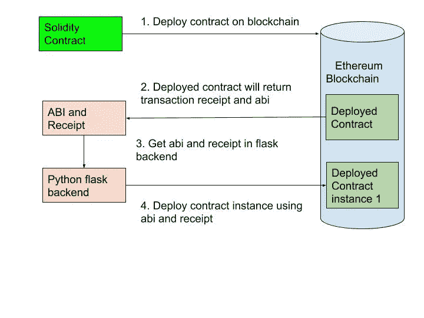
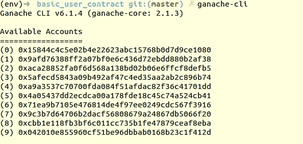
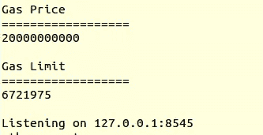
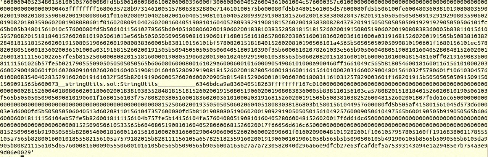
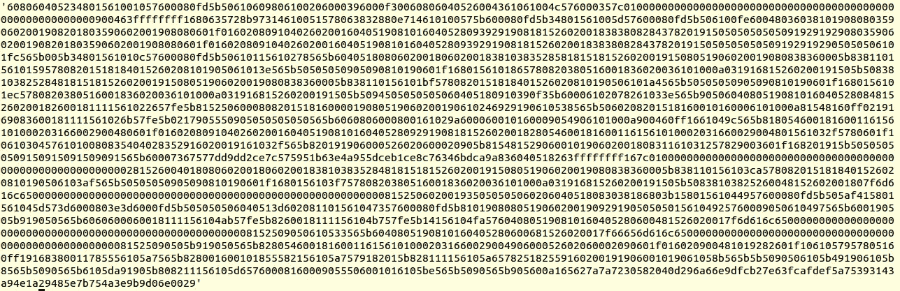
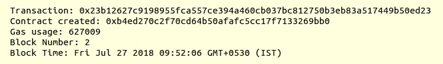

# 如何用 Python Flask 开发以太坊契约？

> 原文：<https://medium.com/coinmonks/how-to-develop-ethereum-contract-using-python-flask-9758fe65976e?source=collection_archive---------0----------------------->

在数据库中存储数据是任何软件应用程序不可或缺的一部分。谁控制了那个数据库，谁就是那个数据的主人。区块链技术将数据存储到区块链网络内部的区块中。因此，每当某个节点同步到网络时，它们将获得块中数据的副本。所以在这项技术中没有特定的数据主人。

在本教程中，我们将编写一个智能契约(我将进一步解释这一点)，用于在区块链上持久化用户数据。我们将使用 python web 3(python library for web 3)来制作和部署智能合约。一旦我们在区块链部署了智能合同。我们将使用 flask API 与智能合同进行交互，以存储一些数据/信息。我们将它存储在区块链上，这样它将是不可改变的。



“Ethereum smart contract deployment flow” by Neha [Ghogale](https://github.com/NehaGhogale)

## 要求:

Python 3.6

## I安装:

1.  创建一个 python 虚拟环境。

[Virtualenv](http://virtualenv.readthedocs.io/en/latest/) 将您的 Python 包保存在一个针对您的项目的虚拟环境中，而不是强迫您在系统范围内安装您的包。

```
*$ virtualenv -p /usr/bin/python3.6 venv
$ source venv/bin/activate*
```

2.现在我们需要像 ganache 这样的以太坊测试链。

[Ganache](https://github.com/trufflesuite/ganache-cli/blob/master/README.md) 是一个用于以太坊开发的个人区块链，您可以使用它来部署契约、开发应用程序和运行测试。

`$ npm install -g ganache-cli`

3.安装 python web3。

[Web3.py](https://web3py.readthedocs.io/en/stable/) 是一个用于与以太坊交互的 python 库。它的 API 源自 [Web3.js](https://github.com/ethereum/wiki/wiki/JavaScript-API) Javascript API，使用过 Web3.js 的人应该都很熟悉。

`$ pip3 install web3`

4.烧瓶:

[Flask](http://flask.pocoo.org/) *是 Python* 的微框架

`$ pip3 install flask`

5.烧瓶宁静

Flask-RESTful 是 Flask 的扩展，增加了对快速构建 REST APIs 的支持。

`$ pip3 install flask-restful`

6.烧瓶棉花糖

烧瓶棉花糖是一个对象序列化/反序列化库

`$ pip3 install flask-marshmallow`

## 启动以太坊测试区块链服务器。

要部署智能合约，我们应该开始测试以太坊服务器。我们正在使用 [ganache](https://github.com/trufflesuite/ganache-cli/blob/master/README.md) 进行测试。在终端中键入以下命令。

```
$ ganache-cli
```



Ganache Account Address

Ganache 给了我们 10 个默认的测试账户，每个账户有 100 个假乙醚用于交易。我们将使用这些帐户在合同中部署和设置价值。



Ganache port

我们可以看到 gas 奖励和限制以及部署 ganache 的 host:port。在部署合同时，我们将需要它。

## 创建 user.sol 文件

现在我们将在 [solidity](http://solidity.readthedocs.io/en/latest/) 中编写智能合约。Solidity 是以太坊上写智能合约的语言。智能合同由我们将存储在区块链上的数据组成，数据上有可选的验证函数和用于访问数据的 getter、setter 方法。

例如，要在区块链上创建一个考勤登记簿，您将拥有一个用户对象数组。它将有 getter，setter 方法来访问用户。因为每个用户每天只能标记一次她的出勤，所以需要一个验证函数来检查。智能合约非常类似于我们通常用其他语言开发的应用程序。

在下面的文件中，我们正在用 getter、setter 函数构建简单的用户契约。

1.  在中声明 [solidity 编译器](https://solidity.readthedocs.io/en/v0.4.24/layout-of-source-files.html#version-pragma)版本。sol 文件。

`pragma solidity ^0.4.21;`

要知道使用了哪个编译器版本
`$ solidity — version`

2.[导入库](https://solidity.readthedocs.io/en/v0.4.24/layout-of-source-files.html#importing-other-source-files/)文件。我们应该将库用于常见的实用功能。库只编译一次，然后反复使用([点击这里](http://source https://github.com/ethereum/dapp-bin/tree/master/library/)获得一些好的库资源)。

`import “stringUtils.sol”;`

3.为用户
申报合同`contract userRecords {}`

4.现在对于基本的演示，我们将存储用户的姓名和性别信息。所以使用 struct 和 enum 数据类型初始化这两个变量。

```
// enum type variable to store user gender 
enum genderType { male, female } 
// Actual user object which we will store in ethereum contract 
struct user{ 
    string name; genderType gender; 
}
```

5.现在我们将声明 user(struct)类型的用户对象。您还可以将它声明为 public 以从契约外部访问它(对于可见性范围[单击此处](https://solidity.readthedocs.io/en/v0.4.24/contracts.html#visibility-and-getters))。

```
user user_obj;
```

6.现在为用户对象添加 getter、setter 方法。我们将在区块链上保存每个用户的信息。我们应该总是公开这个方法，因为我们将从契约之外访问它们。

```
// set user public function
// This is similar to persisting object in db.
function setUser(string name, string gender) public {
    genderType gender_type = getGenderFromString(gender);
    user_obj = user({name:name, gender: gender_type});
}// get user public function
// This is similar to getting object from db.
function getUser() public returns (string, string) { 
    return (user_obj.name, getGenderToString(user_obj.gender));
}
```

7.注意，我们使用了两个内部辅助函数 getGenderFromString()和 getGenderToString()。让我们添加这个内部函数。将它们声明为内部的，因为我们不会在外部使用它们。

```
// Internal function to convert genderType enum from string
function getGenderFromString(string gender) internal returns(genderType) {
    if(StringUtils.equal(gender, "male")) {
        return genderType.male;
    } else {
        return genderType.female;
    }
}// Internal function to convert genderType enum to string
function getGenderToString(genderType gender) internal returns (string) {
    if(gender == genderType.male) {
        return "male";
    } else {
        return "female";
    }
}
```

我们使用的是 stringUtils.equal()库函数。因为这个版本的 solidity 不支持使用(==)进行字符串比较。

8.现在，我们的合同 user.sol 文件将如下所示:

```
pragma solidity ^0.4.21;
// import library file
import "stringUtils.sol";contract userRecords {
  // enum type variable to store user gender
  enum genderType { male, female };
  // Actual user object which we will store
  struct user{
    string name;
    genderType gender;
  }
  // user object
  user user_obj;
  //Internal function to conver genderType enum from string
  function getGenderFromString(string gender) internal returns   (genderType) {
    if(StringUtils.equal(gender, "male")) {
      return genderType.male;
    } else {
      return genderType.female;
    }
  } //Internal function to convert genderType enum to string
  function getGenderToString(genderType gender) internal returns (string) {
    if(gender == genderType.male) {
      return "male";
    } else {
      return "female";
    }
  } // set user public function
  // This is similar to persisting object in db.
  function setUser(string name, string gender) public {
    genderType gender_type = getGenderFromString(gender);
    user_obj = user({name:name, gender: gender_type});
  }

  // get user public function
  // This is similar to getting object from db.
  function getUser() public returns (string, string) {
    return (user_obj.name, getGenderToString(user_obj.gender));
  }
}
```

## 使用 python 脚本编译和部署上述 solidity 文件。

1.  在下面的 python 脚本中，我们需要使用 python-web3 实例化测试以太坊节点。我们正在将 ganche url 设置为一个测试以太坊节点。我们将使用以下 w3 对象来部署合同。

```
from web3 import Web3
# web3.py instance
w3 = Web3(Web3.HTTPProvider("http://127.0.0.1:8545"))
```

2.现在我们将编译 solidity 代码。为了编译 solidity 代码，我们使用了 python 对 solidity 编译器的扩展 [py-solc](https://github.com/ethereum/py-solc) 。

```
from solc import compile_files# compile all contract files
contracts = compile_files(['user.sol', 'stringUtils.sol'])# separate main file and link file
main_contract = contracts.pop("user.sol:userRecords")
library_link = contracts.pop("stringUtils.sol:StringUtils")
```

3.每当用 import 语句编译. sol 文件时。我们还需要将导入文件的部署地址与主合同链接起来。因此，首先通过编译部署所有链接(如果已经部署，然后保存地址),见下图主合同绑定。



compile contract bin

当你编译你的主合同时，如果你看到它的 bin 部分，你会发现*" _ string utils . sol:string utils _ _ _ _ _ _ _ _ _ "用于我们正在导入的库(它也可以用于合同)。这部分我们应该通过在契约前部署库地址来替换。*

4.然后我们会把库地址和主合同链接起来。

```
from solc import link_codedef deploy_contract(contract_interface):
    # Instantiate and deploy contract
    contract = w3.eth.contract(
        abi=contract_interface['abi'],
        bytecode=contract_interface['bin']
    )
    # Get transaction hash from deployed contract
    tx_hash = contract.deploy(
        transaction={'from': w3.eth.accounts[1]}
    )
    # Get tx receipt to get contract address
    tx_receipt = w3.eth.getTransactionReceipt(tx_hash)
    return tx_receipt['contractAddress']library_address = {
    "stringUtils.sol:StringUtils": deploy_contract(library_link)
}
main_contract['bin'] = link_code(
    main_contract['bin'], library_address
)
```

链接后，请参见主合同箱的下图



main contract bin 2

您将看到导入库 bin 已被添加。

5.现在使用 w3 对象部署主合同。使用以太坊账号*{ ' from ':w3 . eth . accounts[1]}*的默认地址进行部署。

```
def deploy_contract(contract_interface):
    # Instantiate and deploy contract
    contract = w3.eth.contract(
        abi=contract_interface['abi'],
        bytecode=contract_interface['bin']
    )
    # Get transaction hash from deployed contract
    tx_hash = contract.deploy(
        transaction={'from': w3.eth.accounts[1]}
    )
    # Get tx receipt to get contract address
    tx_receipt = w3.eth.getTransactionReceipt(tx_hash)
    return tx_receipt['contractAddress']contract_address = deploy_contract(main_contract)
```

您将在运行 ganache 测试服务器的选项卡中看到下面几行。



ganache receipt

这与合同部署后您将在 tx_receipt 中获得的信息相同。

6.现在将 abi 和 contract_address 存储在 json 文件中。以便我们以后可以在 flask api 中使用它来存储契约中的用户对象。

```
# add abi(application binary interface) and transaction reciept in json file
with open('data.json', 'w') as outfile:
    data = {
       "abi": main_contract['abi'],
       "contract_address": deploy_contract(main_contract)
    }
    json.dump(data, outfile, indent=4, sort_keys=True)
```

7.现在，我们完整的脚本将如下所示

```
import json
from web3 import Web3
from solc import compile_files, link_code, compile_source# web3.py instance
w3 = Web3(Web3.HTTPProvider("http://127.0.0.1:8545"))def deploy_contract(contract_interface):
    # Instantiate and deploy contract
    contract = w3.eth.contract(
        abi=contract_interface['abi'],
        bytecode=contract_interface['bin']
    )
    # Get transaction hash from deployed contract
    tx_hash =contract.deploy(transaction{'from':w3.eth.accounts[1]})
    # Get tx receipt to get contract address
    tx_receipt = w3.eth.getTransactionReceipt(tx_hash)
    return tx_receipt['contractAddress']# compile all contract files
contracts = compile_files(['user.sol', 'stringUtils.sol'])# separate main file and link file
main_contract = contracts.pop("user.sol:userRecords")
library_link = contracts.pop("stringUtils.sol:StringUtils")# print bin part in  console you will see 'stringUtils' in that we need to link library address in that bin code.
# to that we have to deploy library code first then link it
library_address = {
    "stringUtils.sol:StringUtils": deploy_contract(library_link)
}
main_contract['bin'] = link_code(
    main_contract['bin'], library_address)# add abi(application binary interface) and transaction reciept in json file
with open('data.json', 'w') as outfile:
    data = {
        "abi": main_contract['abi'],
        "contract_address": deploy_contract(main_contract)
    }
    json.dump(data, outfile, indent=4, sort_keys=True)
```

## 创建 flask api 为用户存储不同的值。

您将只部署一次合同。但是使用它的地址，你将一次又一次地存储数据。类似地，在 db 中，您将只定义一次模型/模式，但是您将在 DB 中添加不同的行/文档。

1.  我们将使 flask post api 从用户处获取用户信息并返回成功。

```
from flask import Flask, Response, request, jsonify
from marshmallow import Schema, fields, ValidationErrordef check_gender(data):
    valid_list = ["male", "female"]
    if data not in valid_list:
        raise ValidationError(
            'Invalid gender. Valid choices are'+ valid_list
        )#For api validations
class UserSchema(Schema):
    name = fields.String(required=True)
    gender = fields.String(required=True, validate=check_gender)# Initializing flask app
app = Flask(__name__)# api to set new user every api call@app.route("/blockchain/user", methods=['POST'])
def user():
    body = request.get_json()
    result, error = UserSchema().load(body)
    if error:
        return jsonify(error), 422
    return jsonify({"data": result}), 200
```

由于这不是烧瓶教程，我不会详细阐述这一点。我们的 API 用户将从客户端获取数据(curl 请求)并对其进行验证，然后将其返回给客户端(curl 请求)

2.现在，我们将初始化 web3 对象，以便与部署的用户契约进行通信。

```
from web3 import Web3# web3.py instance
w3 = Web3(Web3.HTTPProvider("http://127.0.0.1:8545"))
```

3.现在，我们将获得 abi 和合同地址，我们之前已经将它们存储在“data.json”文件中。

```
with open("data.json", 'r') as f:
     datastore = json.load(f)
     abi = datastore["abi"]
     contract_address = datastore["contract_address"]
```

4.选择交易记录的默认帐户地址。每次在合同中为用户设置新值时。你会从钱包里拿出一些汽油。

```
w3.eth.defaultAccount = w3.eth.accounts[1]
```

5.最后，您将设置您在以太坊契约中对用户对象的 api 调用中获得的值。

```
@app.route("/blockchain/user", methods=['POST'])
def user():
    # Create the contract instance with the newly-deployed address
    user = w3.eth.contract(address=contract_address, abi=abi) body = request.get_json()
    result, error = UserSchema().load(body)
    if error:
        return jsonify(error), 422 tx_hash = user.functions.setUser(
        result['name'],result['gender']
    )
    tx_hash = tx_hash.transact()
    # Wait for transaction to be mined...
    w3.eth.waitForTransactionReceipt(tx_hash)
    user_data = user.functions.getUser().call()
    return jsonify({"data": user_data}), 200
```

我们首先使用 abi 和 contract_address 获得部署的合同。

```
user = w3.eth.contract(address=contract_address, abi=abi)
```

然后，我们可以使用契约实例调用任何契约公共函数。在为用户设置值之后，我们将通过使用 [transact()](http://web3py.readthedocs.io/en/stable/contracts.html#web3.contract.ContractFunction.transact) 方法将其公开。这将使新用户在以太坊中增值。

```
tx_hash = user.functions.setUser(
    result['name'],result['gender']
).transact()
```

现在，我们可以使用 [call()](http://web3py.readthedocs.io/en/stable/contracts.html#web3.contract.ContractFunction.call) 方法在契约中获取已经设置的值，这将调用契约函数，而无需在区块链中添加任何块。

```
user_data = user.functions.getUser().call()
```

我们的 api 文件的最终代码如下所示。将此另存为“app.py”

```
import json
from flask import Flask, Response, request, jsonify
from marshmallow import Schema, fields, ValidationError
from web3 import Web3# web3.py instance
w3 = Web3(Web3.HTTPProvider("http://127.0.0.1:8545"))
w3.eth.defaultAccount = w3.eth.accounts[1]# Get stored abi and contract_address
with open("data.json", 'r') as f:
    datastore = json.load(f)
    abi = datastore["abi"]
    contract_address = datastore["contract_address"]def check_gender(data):
    valid_list = ["male", "female"]
    if data not in valid_list:
        raise ValidationError(
            'Invalid gender. Valid choices are'+ valid_list
        )#For api validations
class UserSchema(Schema):
    name = fields.String(required=True)
    gender = fields.String(required=True, validate=check_gender)# Initializing flask app
app = Flask(__name__)# api to set new user every api call@app.route("/blockchain/user", methods=['POST'])
def user():
    # Create the contract instance with the newly-deployed address
    user = w3.eth.contract(address=contract_address, abi=abi)
    body = request.get_json()
    result, error = UserSchema().load(body)
    if error:
        return jsonify(error), 422
    tx_hash = user.functions.setUser(
        result['name'],result['gender']
    ).transact()
    # Wait for transaction to be mined...
    receipt = w3.eth.waitForTransactionReceipt(tx_hash)
    user_data = user.functions.getUser().call()
    return jsonify({"data": user_data}), 200
```

运行以下命令启动您的服务器。

```
$ FLASK_APP=app.py flask run
```

## 使用 curl 调用 api。

```
$ curl -H "Content-Type: application/json" --request POST -d '{"name":"John Doe","gender":"male"}' [http://localhost:5000/blockchain/user](http://localhost:5000/blockchain/user)
```

你可以在这里找到完整的代码。

**资源:**

1.  [http://web3py.readthedocs.io/en/stable/quickstart.html](http://web3py.readthedocs.io/en/stable/quickstart.html)
2.  [https://www.ethereum.org/greeter](https://www.ethereum.org/greeter)
3.  [http://solidity.readthedocs.io/en/latest/](http://solidity.readthedocs.io/en/latest/)

> 加入 Coinmonks [电报频道](https://t.me/coincodecap)和 [Youtube 频道](https://www.youtube.com/c/coinmonks/videos)获取每日[加密新闻](http://coincodecap.com/)

## 另外，阅读

*   [复制交易](/coinmonks/top-10-crypto-copy-trading-platforms-for-beginners-d0c37c7d698c) | [加密税务软件](/coinmonks/crypto-tax-software-ed4b4810e338)
*   [网格交易](https://coincodecap.com/grid-trading) | [加密硬件钱包](/coinmonks/the-best-cryptocurrency-hardware-wallets-of-2020-e28b1c124069)
*   [最佳加密交易所](/coinmonks/crypto-exchange-dd2f9d6f3769) | [印度最佳加密交易所](/coinmonks/bitcoin-exchange-in-india-7f1fe79715c9)
*   面向开发者的最佳加密 API
*   [密码电报信号](http://Top 4 Telegram Channels for Crypto Traders) | [密码交易机器人](/coinmonks/crypto-trading-bot-c2ffce8acb2a)
*   最佳[密码借贷平台](/coinmonks/top-5-crypto-lending-platforms-in-2020-that-you-need-to-know-a1b675cec3fa)
*   [杠杆代币](/coinmonks/leveraged-token-3f5257808b22)终极指南
*   [加密交易的最佳 VPN](https://coincodecap.com/best-vpns-for-crypto-trading)
*   [火币加密交易信号](https://coincodecap.com/huobi-crypto-trading-signals) | [HitBTC 审核](/coinmonks/hitbtc-review-c5143c5d53c2)
*   [TraderWagon 回顾](https://coincodecap.com/traderwagon-review) | [北海巨妖 vs 双子 vs 比特亚德](https://coincodecap.com/kraken-vs-gemini-vs-bityard)
*   如何在 FTX 交易所交易期货
*   [OKEx vs KuCoin](https://coincodecap.com/okex-kucoin) | [摄氏替代品](https://coincodecap.com/celsius-alternatives) | [如何购买 VeChain](https://coincodecap.com/buy-vechain)
*   [3 commas vs . Pionex vs . crypto hopper](https://coincodecap.com/3commas-vs-pionex-vs-cryptohopper)
*   [如何使用 Cornix 交易机器人](https://coincodecap.com/cornix-trading-bot)
*   [Bitget 回顾](https://coincodecap.com/bitget-review)|[Gemini vs block fi](https://coincodecap.com/gemini-vs-blockfi)cmd |[OKEx 期货交易](https://coincodecap.com/okex-futures-trading)
*   [用信用卡购买密码的 10 个最佳地点](https://coincodecap.com/buy-crypto-with-credit-card)