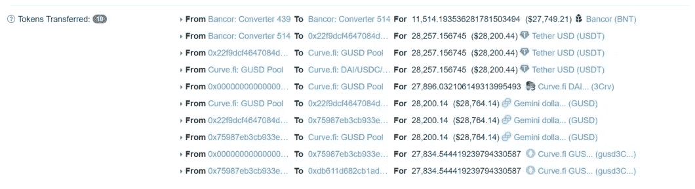
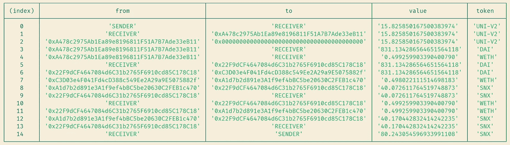

# 如何在 Truffle 测试中显示内部 ERC20 令牌传输？

> 原文：<https://medium.com/coinmonks/how-to-display-internal-erc20-token-transfers-in-truffle-tests-cdd953f400c9?source=collection_archive---------0----------------------->

在这篇文章中，我们将探索如何使用 [truffle-token-test-utils](https://www.npmjs.com/package/truffle-token-test-utils) 包来可视化 truffle 和 OpenZeppelin 测试中的令牌传输。



Etherscan’s Token Transfers

当我们在以太坊区块链上进行交易时，通过在以太坊扫描上查找，可以很容易地查看发生的内部令牌转移，如上所示。
在本地 ganache 或分叉 mainnet 上测试合同时，它可能是一个黑盒，因为您只能在交易前后检查令牌余额。

为了更容易实现类似于 Etherscan 的结果，我们将使用我的 npm 包:`[truffle-token-test-utils](https://www.npmjs.com/package/truffle-token-test-utils)`。

下面的教程是针对 Truffle 测试的，但是稍加修改(正如在 [README](https://github.com/CodinMaster/truffle-token-test-utils#readme) 中提到的)你也可以让它适用于 OpenZeppelin 测试！

这是我们最终将实现的终端输出:



## 第一步

在你的块菌项目
`npm install truffle-token-test-utils`中安装这个包

## 第二步

在您的测试文件
中导入包`const tokenTransfers = require("truffle-token-test-utils");`

## 第三步

像这样初始化`tokenTransfers`对象:

```
contract("ContractName", (accounts) => {
  tokenTransfers.setWeb3(web3);
  ...
}
```

在这里，`web3`对象在测试执行期间被 truffle 自动注入。

## 第四步

在您的测试用例的`it`块中，当您调用契约函数时，将它存储在`tx`变量中，并在控制台中打印令牌传输:

```
const tx = await someContract.someFunction();
await tokenTransfers.print(tx);
```

就是这样！运行测试并可视化令牌交易！

当调用“print”时，还有几个额外的参数可以传递，它们都在[自述文件](https://github.com/CodinMaster/truffle-token-test-utils#readme)中进行了解释。

*与我保持联系:*
**推特**:[https://twitter.com/apoorvlathey](https://twitter.com/apoorvlathey)
**网站**:[https://apoorvlathey.com/](https://apoorvlathey.com/)
**Github**:[https://github.com/CodinMaster](https://github.com/CodinMaster)