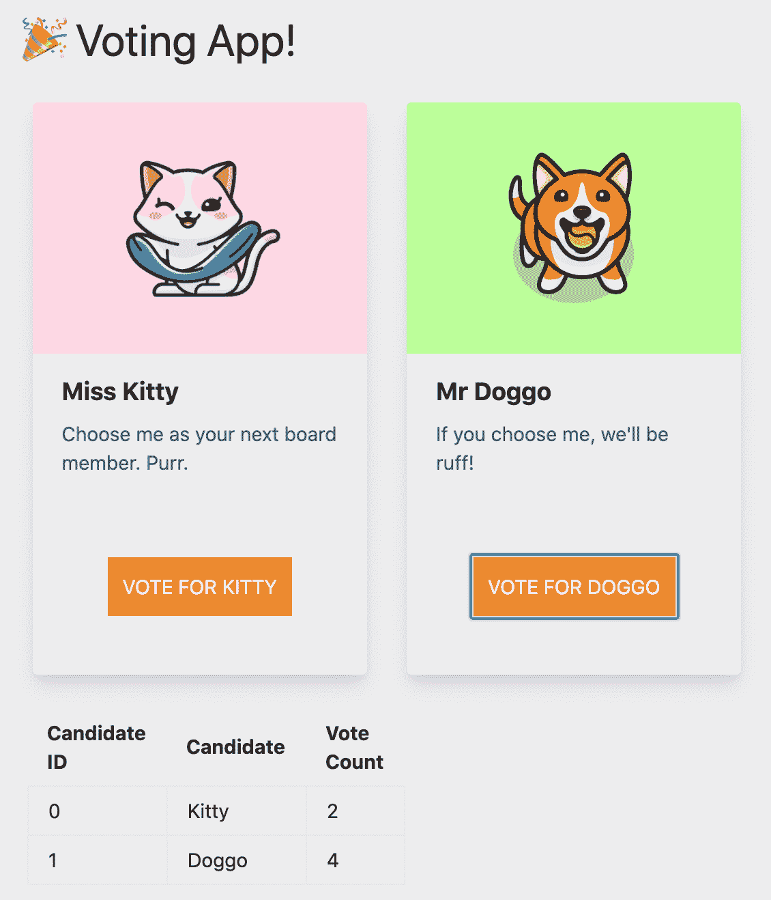

# 如何在 UI 上显示来自区块链的投票结果

> 原文：<https://medium.com/coinmonks/how-to-display-voting-results-from-blockchain-on-ui-6026c4b497cd?source=collection_archive---------2----------------------->

## *本文是区块链公司治理系列文章的一部分。*

[本系列的第 1 部分](https://www.trycrypto.com/blog/how-blockchain-could-change-corporate-governance-for-the-better)概述了区块链在公司治理中的潜在应用，并介绍了如何按照本系列设置您的项目。[第 2 部分](https://www.trycrypto.com/blog/part-2-voting-smart-contract)概述了股东投票智能合同的整个业务逻辑，包括智能合同开发的最佳实践。

在第 3 部分中，我们开始在 UI 中编织，并学习如何从区块链中读取。在[第 4 部分](https://www.trycrypto.com/guides-and-tutorials/part-4-add-voting-functionality)中，我们为两位候选人添加了投票功能，并学习了如何给区块链写信。

这一部分将是这个系列的最后一部分。到目前为止，我们只是在开发人员控制台上记录结果。在这个博客中，我们将学习如何在用户界面上显示投票结果。

我们将以表格的形式显示结果，如下所示:

## 我们将通过三个简单的步骤实现这一目标:

1.  创建一个隐藏的“<action-button>”,每次用户投票时都会触发。</action-button>
2.  创建一个占位符表来显示类似于上面绘制的表的结果。
3.  修改“showResults()”函数以在 UI 上显示表格。

# 我们开始吧！

# **第一步:创建一个隐藏的`<动作按钮> `**

这个“T13”将被“隐藏”，以便用户(投票者)在实际投票之前看不到当前的投票结果。

在“render()”函数内的“dapp-page.js”中创建此“T14”。此按钮将被包装在一个具有唯一 ID 的“div”中。这个“div”也应该是“hidden”。

在上面的代码片段中，您可以看到“<action-button>”的“hidden”属性被设置为“true”。这个“T16”也有一个唯一的 ID“get-candidates”。我们将 ID 设置为“get-candidates ”,因为这个“T17”本质上是获取与候选人相关的所有数据。这个`<action-button>'最重要的属性是`. click '属性。当单击这个隐藏的`<action-button>'时，调用“getCandidates()”方法。我们将通过操作 DOM 来点击这个按钮。一旦用户(投票者)投出他们的票，这个按钮将被点击，并且“getCandidates()”方法将被触发。</action-button></action-button></action-button>

让我们在“dapp-page.js”中创建“getCandidates()”方法。该函数应该靠近其他自定义函数，如“showResults()”。

函数“getCandidates()”通过调用智能协定从区块链获取数据。然后，接收的结果以具有唯一 ID“候选查找”的表格的形式呈现。该表将在步骤 2 中创建。

# **第二步:创建一个占位符表格**

我们需要创建一个占位符表，以便动态填充它。你可以把它做成你喜欢的任何样式。我们将使用[顺风 CSS](https://tailwindcss.com/) 。

我们将在步骤 1 中创建的 ID 为“tally”的“div”中添加这个占位符表。

现在，我们都准备好显示结果了。要填充的数据已经准备好被加载，占位符也准备好被填充。我们需要做的就是显示 ID 为“tally”的“div”。我们需要注意在加载“div”之前,“隐藏的”<action-button>被点击。</action-button>

# **第三步:修改“showResults()”函数**

到目前为止，我们只是在开发人员控制台中记录结果。现在，让我们操作 DOM 并以表格的形式显示结果。

在“dapp-page.js”的“showResults()”函数中，进行以下更改:

我们通过 ID(elid)捕获元素来访问 DOM。首先，我们单击“hidden `”<action-button>’来启动“getCandidates()”函数，然后我们从 ID 为“tally”的“div”中删除“hidden”类，使其在 DOM 中可见。</action-button>

## 这就是全部！

您的 dapp 现在应该可以成功显示当前的投票结果了。

这是我们想要添加到这个投票 dapp 的最后一个特性。

## 如果你一直在关注这个系列，并且一直坚持到现在，那么恭喜你！🎉

我们希望您学会了如何在以太坊区块链上制作端到端全栈投票 dapp。我们将在区块链的基础上推出更多有趣的用例系列。

## 敬请关注。

## 用 DappStarter 构建。

> [直接在您的收件箱中获得最佳软件交易](https://coincodecap.com/?utm_source=coinmonks)

