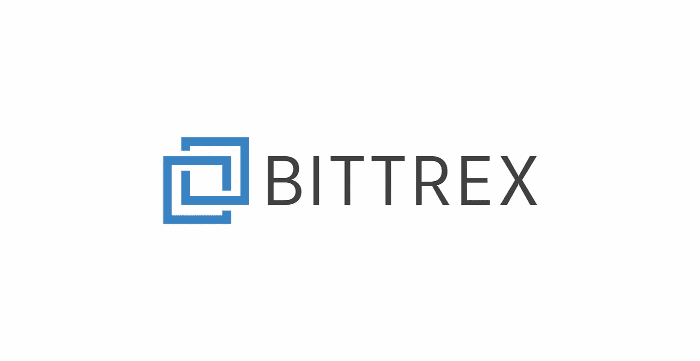
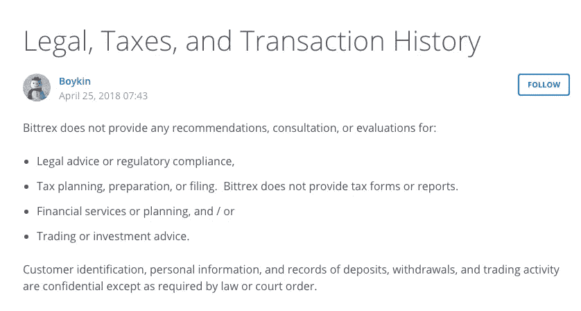
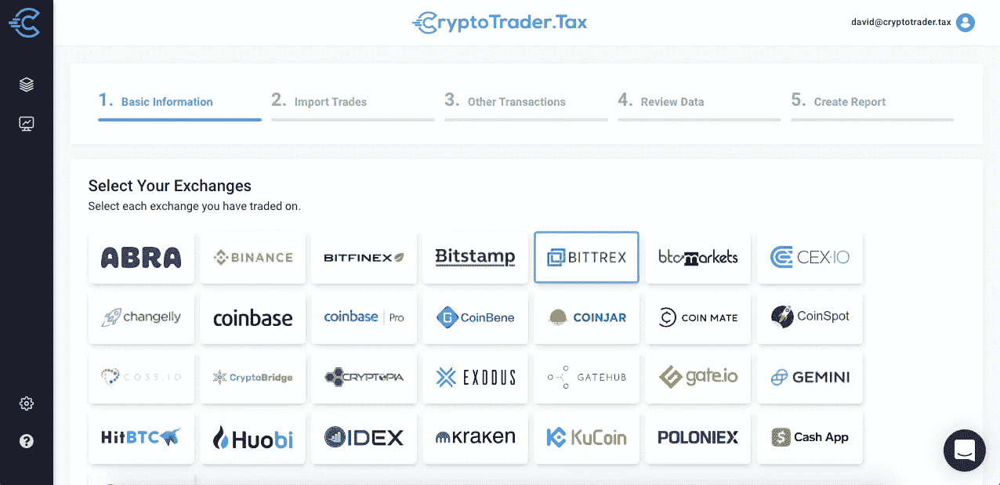

# 如何处理 Bittrex 税——创建加密税单

> 原文：<https://medium.com/coinmonks/how-to-do-your-bittrex-taxes-creating-your-crypto-tax-forms-b80e7b1c06f?source=collection_archive---------2----------------------->

Bittrex 已经成为美国最大的加密货币交易所之一。许多加密货币交易商使用 Bittrex，因为它在美国严格的监管环境下运营并符合规定。然而，当涉及到进行 Bittrex 税务和建立所需的 Bittrex 税务表格时，会出现许多挑战。

本文讨论了这些问题，并解释了构建所需 Bittrex 和 [**加密货币税单**](https://www.cryptotrader.tax/cryptocurrency-tax-reports) 的最简单方法。

# 加密货币如何征税

[**国税局出于税收目的将**](https://www.irs.gov/pub/irs-drop/n-14-21.pdf) 加密货币视为财产，而非货币。就像股票、债券、房地产等其他形式的财产一样，当你以高于或低于购买价格的价格出售、交易或以其他方式处置加密货币时，你需要进行纳税申报。

从这个意义上说，加密货币交易看起来类似于以税收为目的的股票交易。

例如，如果你在 2018 年 4 月以 1000 美元购买了 0.1 比特币，然后在两个月后以 2000 美元出售，你就有 1000 美元的资本收益。你在纳税申报单上申报这一收益，根据你所属的税级，你将为这一收益缴纳一定比例的税。税率根据你的税级浮动，也取决于它是短期收益还是长期收益。这适用于所有加密货币。

另一方面，如果你以低于购买价格的价格出售加密货币，你可以 [**注销资本损失**](https://www.cryptotrader.tax/blog/how-to-handle-your-bitcoin-and-crypto-losses-for-tax-purposes) 以节省加密税。

你可以阅读我们的博客文章， [**加密货币税完全指南**](https://www.cryptotrader.tax/blog/the-traders-guide-to-cryptocurrency-taxes) ，了解关于加密税的更深入的讨论。

# Bittrex 税——分解问题

由于多种原因，Bittrex 实际上无法向用户提供在股票交易领域普遍收到的必要税务报告。

第一个问题是，Bittrex 上的许多交易都是以加密货币报价的。因为您需要在交易时计算当地法定货币的公平市场价值，这变得非常有问题，并且 Bittrex 不跟踪原始成本基础或跨交易的公平市场价值数据。

第二个问题——也是更大的问题——来自加密货币的核心性质。因为您可以将加密发送到 Bittrex 网络和从 Bittrex 网络发送出去，例如将外部钱包中的比特币发送到我的 Bittrex 钱包中，所以 Bittrex 无法知道您以什么成本(成本基础)获得了该加密。成本基础是您在 [**计算**](https://www.cryptotrader.tax/blog/how-to-calculate-your-bitcoin-taxes-the-complete-guide) 的加密税时需要的必要数据。

在我们的博客文章 [**加密货币税收问题**](https://www.cryptotrader.tax/blog/cryptocurrency-tax-problem) 中，我们更深入地讨论了这个问题。

来自 Bittrex 支持文档

# Bittrex 不能给你准确的税务报告

因此，即使 Bittrex 想为您提供准确的税务报告，以详细说明您的资本损益以及您需要报告他们的税务的一切，他们实际上没有能力，因为 [**加密货币税务问题**](https://www.cryptotrader.tax/blog/cryptocurrency-tax-problem) 。所有主要的加密货币交易所都是如此，这给加密用户带来了一个大问题。

# 所以，如果 Bittrex 不能给我必要的税务表格，我如何得到它们？

因此，为了正确地构建必要的 [**加密税单**](https://www.cryptotrader.tax/cryptocurrency-tax-reports) ，你需要汇集你所有的加密货币数据，这些数据构成了你使用的所有交易所中的购买、销售、交易、空投、叉子、矿币、交易所和掉期。

您可以通过从交易所导出所有交易历史文件，并对每笔交易进行资本损益交易，来手动完成这一操作。Bittrex 在这里 分解了如何检索你的交易历史文件 [**。一旦你有了你的交易历史，每个税务事件都应该记录在表格 8949 上，你的净收益应该转移到你的 1040 表 d 中。我们在这里的文章中浏览手动申报流程:**](https://bittrex.zendesk.com/hc/en-us/articles/360003026992-Legal-Taxes-and-Transaction-History) **[**如何申报加密货币税**](https://www.cryptotrader.tax/blog/how-to-report-cryptocurrency-on-taxes) 。**

# 加密货币税务软件——一种替代方法

或者，您可以使用类似于 [**CryptoTrader 的加密税务软件。税务**](https://www.cryptotrader.tax/) 自动化整个纳税申报流程。

使用加密税务软件时，您只需将所有交易和交易历史从所有交易所导入平台。你可以从交易所下载你的交易历史文件，或者用 API 密匙连接你的账户。该软件将自动分类和清理这些数据，只需点击一个按钮，就能生成您需要的税务表格。

您可以将这些生成的税务报告交给您的税务专业人员，自己归档，或者使用 CryptoTrader 将它们上传到您喜欢的报税软件，如加密货币的[**turbo tax**](https://www.cryptotrader.tax/blog/how-to-file-your-cryptocurrency-taxes-with-turbotax)或 [**TaxAct**](https://www.cryptotrader.tax/blog/how-to-file-your-bitcoin-and-crypto-taxes-with-taxact) 。税务合伙。

你可以 [**了解更多**](https://www.cryptotrader.tax/how-crypto-trader-tax-works) 关于 CryptoTrader 如何。税务自动化加密纳税申报流程 [**此处**](https://www.cryptotrader.tax/how-crypto-trader-tax-works) ！

*原载于*[*https://www . crypto trader . tax*](https://www.cryptotrader.tax/blog/bittrex-taxes)*。*