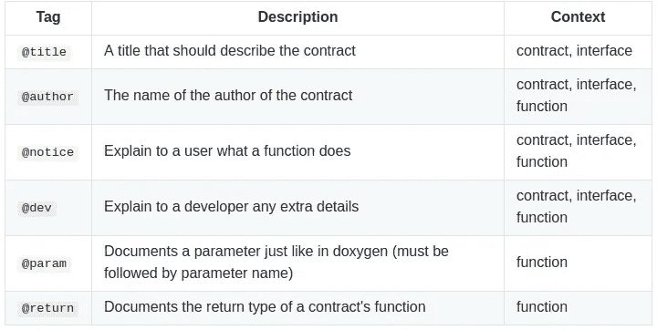

# 如何轻松记录可靠的智能合同

> 原文：<https://medium.com/coinmonks/how-to-document-solidity-smart-contracts-with-no-sweat-e78936ede833?source=collection_archive---------2----------------------->


与其他编程语言相比，在区块链上编程智能合约有时会比我们习惯的更难，特别是因为在这个过程中我们没有多少工具可以帮助我们。下面你会发现我们是如何在 Solidity 中解决文档生成的。

为什么评论可靠性智能合同很重要？有两个主要原因:

*   帮助将继承智能合同开发人员，
*   帮助将使用您的智能合同的开发人员或用户。

那么，应该怎么做呢？嗯，还有[以太坊自然规范格式](https://github.com/ethereum/wiki/wiki/Ethereum-Natural-Specification-Format)是以太坊自己开发推广的。它与其他流行编程语言的文档格式非常相似，但有一个区别——它使用`///`而不是`//`(尽管支持`/** ... */`块)。

以下是以太坊自然规范标签和规则:



Ethereum Natural Specification Format tags

不管是什么原因让你记录你的代码，你很快就会发现写文档是非常乏味和耗时的，因为每个函数都有大量的样板文本。这就是为什么我们做了简单的[**Atom**](https://atom.io/)**plugin—**[**solidity—comments**](https://atom.io/packages/solidity-comments)。它包含通过按下以下组合键为您的 Solidity smart contract 生成所有样板文件的基本功能:`Ctrl + Alt + G.`

例如，如果您有以下代码:

```
pragma solidity 0.4.24;contract SomeContract {function test(uint _param1, uint _param2) external {
        require(_param1 == 1 && _param2 == 2);
    }}
```

而你按下`Ctrl + Alt + G`，你会得到:

```
pragma solidity 0.4.24;/// [@title](http://twitter.com/title) SomeContract
/// [@notice](http://twitter.com/notice)
/// [@dev](http://twitter.com/dev)
contract SomeContract { /// [@notice](http://twitter.com/notice)
    /// [@dev](http://twitter.com/dev)
    /// [@param](http://twitter.com/param) _param1
    /// [@param](http://twitter.com/param) _param2
    /// [@return](http://twitter.com/return)
    function test(uint _param1, uint _param2) external {
        require(_param1 == 1 && _param2 == 2);
    }}
```

然后你只需要填空。很酷，对吧？

我们知道，不是每个人都使用 Atom，这就是为什么我们将逻辑提取到单独的[**solidity-comments-core**库](https://github.com/NodeFactoryIo/solidity-comments-core)中，并且我们将很快为此实现一个 CLI 接口。至于其他 ide，我们非常希望将这个插件移植到其他编辑器，特别是 [*Webstorm*](https://www.jetbrains.com/webstorm/) *，*，所以我们目前正在研究将 JavaScript 库移植到其他语言的最简单方法(Java 用于 Webstorm，Python 用于 [Sublime Text](https://www.sublimetext.com/) )。如果您对移植有任何建议，欢迎在下面留下您的评论！

插件仍然缺少一些必要的特性，其中最重要的一个是如果参数改变了就更新函数文档。如果您想为其他 IDE 贡献或制作插件，请查看我们的资源库:

[](https://github.com/NodeFactoryIo/solidity-comments-core) [## 节点工厂/实体-注释-核心

### 节点。根据 natspec 生成实体注释的 Js 模块。

github.com](https://github.com/NodeFactoryIo/solidity-comments-core) 

当您需要将文档导出为 HTML 时，您可以使用像以太坊的 [Doxity](https://github.com/DigixGlobal/doxity) 或 OpenZeppelin 的 [docgen](https://github.com/OpenZeppelin/solidity-docgen) 这样的文档生成器。

快乐的文档化编码！

*关注我们关于* [*中*](/@nodefactory) *或* [*推特*](https://twitter.com/nodefactoryio) *如果你想要更多区块链发展的真知灼见就像这样。*

> [直接在您的收件箱中获得最佳软件交易](https://coincodecap.com/?utm_source=coinmonks)

[](https://coincodecap.com/?utm_source=coinmonks)

*Node Factory 是一家区块链开发公司，致力于开发新技术，并利用它们在全球范围内开发更好的应用。让我们知道我们能为你做什么。*