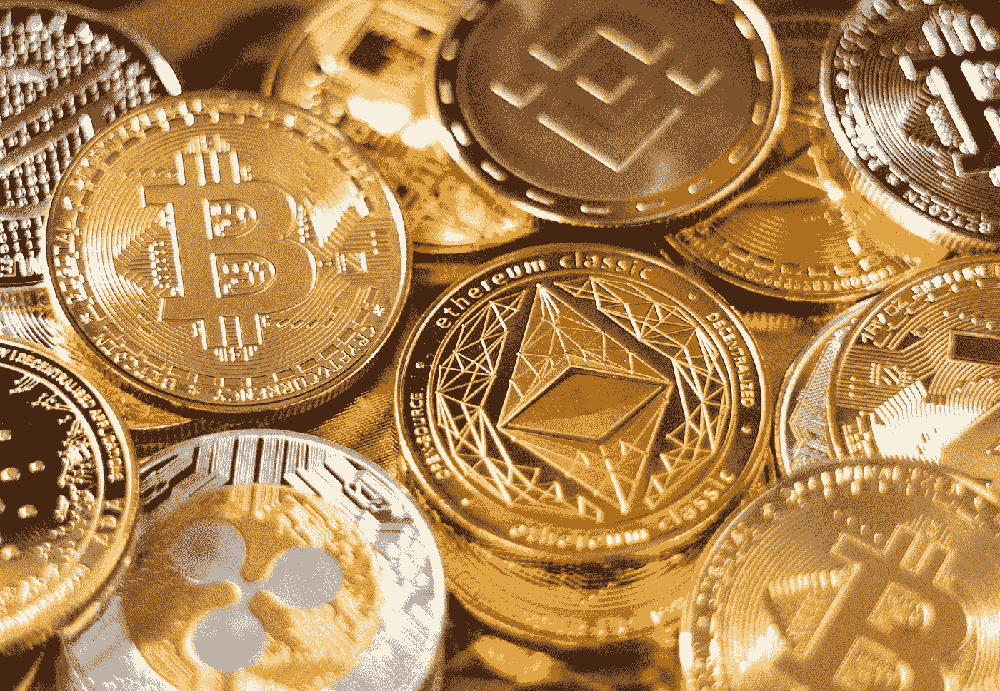
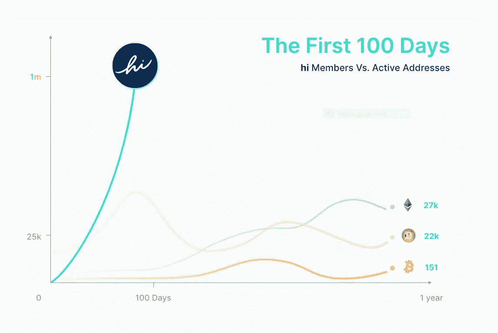
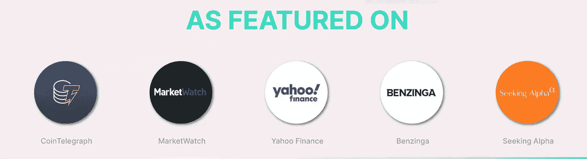
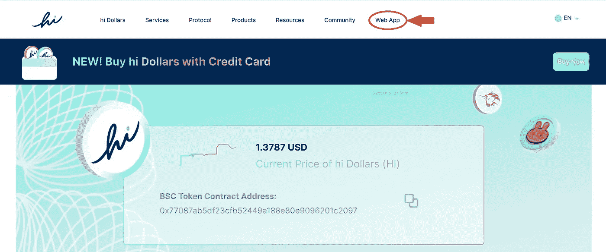
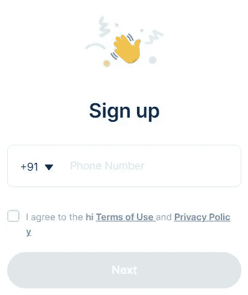
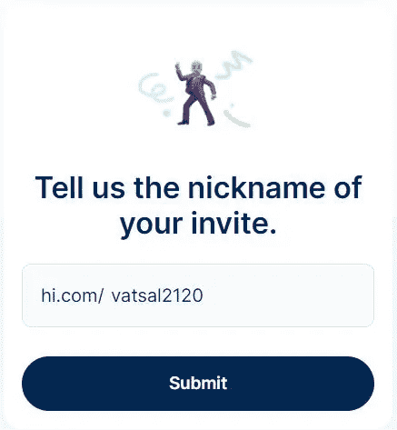
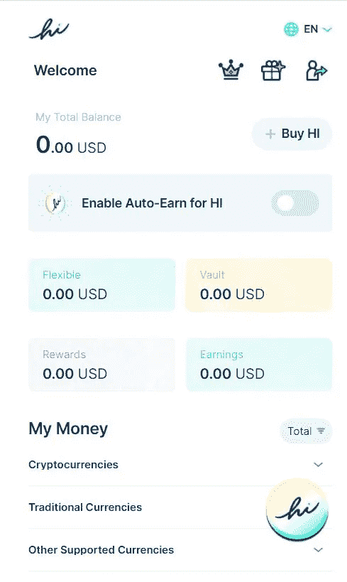
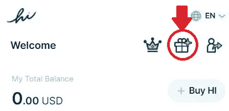

# 如何每天免费赚取 50 美元

> 原文：<https://medium.com/coinmonks/how-to-earn-50-for-free-daily-92675035d927?source=collection_archive---------0----------------------->

## 每天赚取免费加密硬币可以变成数百万

Photo by [Art Rachen](https://unsplash.com/@artrachen?utm_source=unsplash&utm_medium=referral&utm_content=creditCopyText) on [Unsplash](https://unsplash.com/s/photos/crypto?utm_source=unsplash&utm_medium=referral&utm_content=creditCopyText)

加密货币是一种数字或虚拟货币，通过加密技术进行保护，这使得伪造或重复消费几乎不可能。许多加密货币都是基于区块链技术的分散式网络——由不同的计算机网络执行的分布式账本。

加密货币在过去几年越来越流行。每个人都在购买或交易一块**比特币**或**以太**。但事实是，那些著名硬币的价格不会像过去那样再次暴涨。因此，更好的选择是寻找这样一种有可能成为下一个比特币的硬币。这样的硬币就是 **Hi** 。

# 什么是嗨？

[Hi](https://hi.com/vatsal2120) 是一种加密货币，它使用区块链来建立社区供电的“非营利性金融服务”。它提供被称为 Hi coins 的免费加密硬币。你可以像我一样每天免费领取一枚 Hi 币。它相当新，已经突破了 250 万用户。1 Hi 美元的价值目前约为**1.4 美元**。

Source:- [Hi.com](https://hi.com/vatsal2120)

虽然 Hi 是一个新硬币，但它是一个值得信赖的硬币，因为它有一个如此大的社区，而且它还出现在下面列出的各种平台上。

Source:- [Hi.com](https://hi.com/vatsal2120)

# 如何每日赚取免费嗨币？

你只需遵循 3 个简单的步骤就能赢得 Hi 硬币。

## 第一步

Source:- [Hi.com](https://hi.com/vatsal2120)

进入[**Hi.com**](https://hi.com/vatsal2120)，点击 **Web app** 打开报名页面。您可以使用您的电子邮件 id 或手机号码或其他注册方式注册，如 WhatsApp、Telegram 等。你也可以在 android 或 ios 设备上下载 Hi 应用。

Source:- [Hi.com](https://hi.com/vatsal2120)

## 第二步

注册并输入您的详细信息。如果它要求您邀请的的**昵称，输入 ***vatsal2120*** ，如下图所示:**

Source:- [Hi.com](https://hi.com/vatsal2120)

如果注册后显示您的帐户不存在，请重新注册。成功设置后，您的屏幕将如下所示:

Source:- [Hi.com](https://hi.com/vatsal2120)

## 第三步

点击下图所示的**奖励**图标领取 1 Hi 币。你每天都会得到一个奖励硬币**所以别忘了收集它:)**

Source:- [Hi.com](https://hi.com/vatsal2120)

你可以去[**https://hi.com/vatsal2120**](https://hi.com/vatsal2120)**按照这些简单的步骤，不用投资任何东西就能赚到免费的钱。**

# **如何把他们变成百万？**

**让我们来看看如何把这些硬币变成百万。**

**你可以推荐你的朋友加入[Hi.com](https://hi.com/vatsal2120)并赚取 Hi 美元。推荐人获得其推荐人(包括所有下游推荐人)获得的所有新会员奖金和推荐奖励的 50%**。****

**您还可以赚取高达 **25%** 的年度百分比收益(APY ),这些奖励存在您的 Hi 账户中。**

**此外，硬币的价值每天都在变化，而且已经在增加。也许有一天它的价格会像比特币和以太币一样飙升。想象有一天你的硬币的价格是 1000 美元，你每天都收集一枚硬币。你将得到 365 x 1000 = 365000 美元。那是一笔巨款，不是吗？你可能会有更多的硬币添加到这个值。**

**听起来像庞氏骗局，不是吗？但事实是，比特币和以太网也是以同样的方式开始的，让一些早期的人成为百万富翁。**

**Hi coin 可以让我们赚上百万，甚至不需要购买硬币，只需要收集奖励硬币和参考。我也是新的硬币，但对未来的奖励感到兴奋。**

**如果你觉得这篇文章有用，请给几个掌声，并分享这篇文章，让大家富裕:)**

> **加入 Coinmonks [电报频道](https://t.me/coincodecap)和 [Youtube 频道](https://www.youtube.com/c/coinmonks/videos)了解加密交易和投资**

## **也阅读**

*   **[德国最佳加密交易所](https://blog.coincodecap.com/crypto-exchanges-in-germany) | [WazirX P2P](https://blog.coincodecap.com/wazirx-p2p)**
*   **[如何购买 Monero](https://blog.coincodecap.com/buy-monero) | [IDEX 评论](https://blog.coincodecap.com/idex-review) | [BitKan 交易机器人](https://blog.coincodecap.com/bitkan-trading-bot)**
*   **如何在 Bitbns 上购买柴犬(SHIB)币？ | [币安](https://blog.coincodecap.com/binance-in-india)**
*   **[币安 vs 比特邮票](https://blog.coincodecap.com/binance-vs-bitstamp) | [比特熊猫 vs 比特币基地 vs Coinsbit](https://blog.coincodecap.com/bitpanda-coinbase-coinsbit)**
*   **[如何购买 Ripple (XRP)](https://blog.coincodecap.com/buy-ripple-india) | [非洲最好的加密交易所](https://blog.coincodecap.com/crypto-exchange-africa)**
*   **[非洲最佳密码交易所](https://blog.coincodecap.com/crypto-exchange-africa) | [胡交易所评论](https://blog.coincodecap.com/hoo-exchange-review)**
*   **[eToro vs robin hood](https://blog.coincodecap.com/etoro-robinhood)|[MoonXBT vs Bybit vs Bityard](https://blog.coincodecap.com/bybit-bityard-moonxbt)**
*   **[Stormgain 回顾](https://blog.coincodecap.com/stormgain-review) | [Bexplus 回顾](https://blog.coincodecap.com/bexplus-review) | [币安 vs Bittrex](https://blog.coincodecap.com/binance-vs-bittrex)**
*   **[Bookmap 评论](https://blog.coincodecap.com/bookmap-review-2021-best-trading-software) | [美国 5 大最佳加密交易所](https://blog.coincodecap.com/crypto-exchange-usa)**
*   **[如何在 FTX 交易所交易期货](https://blog.coincodecap.com/ftx-futures-trading) | [OKEx vs 币安](https://blog.coincodecap.com/okex-vs-binance)**
*   **[如何在势不可挡的域名上购买域名？](https://blog.coincodecap.com/buy-domain-on-unstoppable-domains)**
*   **[印度的秘密税](https://blog.coincodecap.com/crypto-tax-india) | [altFINS 审查](https://blog.coincodecap.com/altfins-review) | [Prokey 审查](/coinmonks/prokey-review-26611173c13c)**
*   **[布洛克菲 vs 比特币基地](https://blog.coincodecap.com/blockfi-vs-coinbase) | [比特坎评论](https://blog.coincodecap.com/bitkan-review) | [币安评论](/coinmonks/binance-review-ee10d3bf3b6e)**
*   **[Coldcard 评论](https://blog.coincodecap.com/coldcard-review) | [BOXtradEX 评论](https://blog.coincodecap.com/boxtradex-review)|[uni swap 指南](https://blog.coincodecap.com/uniswap)**
*   **[阿联酋 5 大最佳加密交易所](https://blog.coincodecap.com/best-crypto-exchanges-in-uae) | [SimpleSwap 评论](https://blog.coincodecap.com/simpleswap-review)**