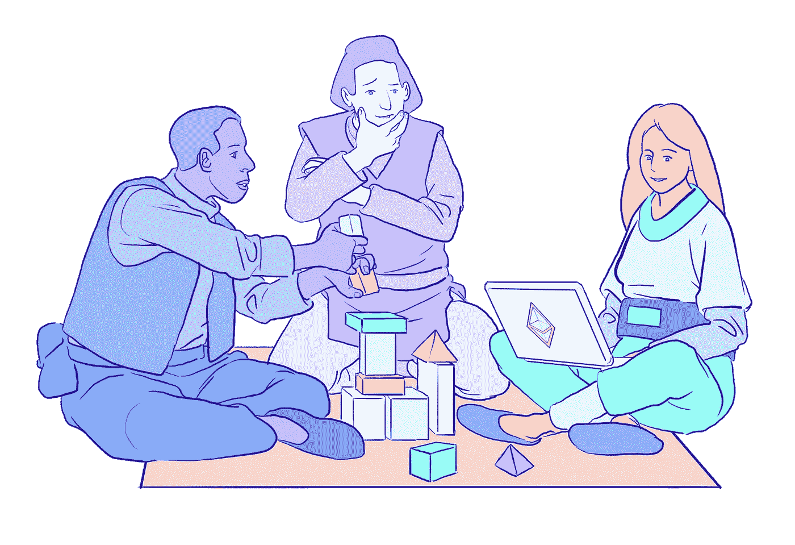

# 在 DeFi / Web3 做投稿人如何谋生？

> 原文：<https://medium.com/coinmonks/how-to-earn-a-living-as-a-contributor-in-defi-web3-eb9d841917c5?source=collection_archive---------2----------------------->

Image Credit: ethereum.org

DeFi & Web3 对开发者和贡献者来说充满了机会。DeFi 生态系统中的所有主要协议都有一个社区主导的资助计划，用于资助社区成员提交的想法。

> 你知道吗，有超过 500 万美元的 DeFi 资助，任何愿意为生态系统做贡献的人都可以获得。

如果你是这个领域的新手，并且正在寻找在 DeFi & Web3 中作为独立贡献者全职工作的方法，这里有一个你需要了解的主要资助项目列表:

# Uniswap 赠款方案

[Uniswap](https://uniswap.org/) 是以太坊生态系统中最大的分散式加密交易协议之一。如果你有兴趣在 [DEX](https://en.wikipedia.org/wiki/Decentralized_exchange) & [AMM](https://www.gemini.com/cryptopedia/amm-what-are-automated-market-makers) 空间投稿，那么你可以申请 Uniswap 的资助。

Uniswap 授予有用的链接:

1.  [资助网站](https://www.notion.so/unigrants/Welcome-to-UNI-Grants-6e3e84967a984a5fb127ae749649ddc9)
2.  [RFP](https://www.notion.so/RFPs-Challenges-3be614ba4e504b5caeee7b0159e64a42):开放的想法，任何人都可以为之工作以获得资助，
3.  [不和](https://discord.gg/FZdn8ByJnR)，[推特](https://twitter.com/uniswapgrants) & [论坛](https://gov.uniswap.org/)

> **注意**:从用于营销&教育的 300000 美元资助到用于协议开发的 300000 美元资助，各种规模的资助均可获得，并且这些资助面向技术&非技术贡献者。

# Aave 资助计划

Aave 是以太坊生态系统中领先的分散借贷&借贷协议之一。如果你有兴趣在信用&货币市场领域做出贡献，那么你可以申请 Aave 资助。

**Aave 授予有用的链接**:

1.  [资助网站](https://aavegrants.org/)
2.  RFP:开放的想法，任何人都可以为之努力以获得资助
3.  [龃龉](https://discord.gg/mYKg949JsX)、[推特](https://twitter.com/AaveGrants)、&T4 论坛

# 复合补助计划

[Compound](https://compoundgrants.org/) 是以太坊生态系统中仅次于 Aave 的第二大分散式借贷协议&。Compound 还向对信贷&货币市场空间做出有益贡献的人提供补助。

**复合授权有用链接**:

1.  [赠款网站](https://compoundgrants.org/)
2.  [RFPs](https://compoundgrants.org/request-for-proposals) :开放的想法，任何人都可以利用它来获得资助
3.  [不合](https://discord.gg/compound)、 [Twitter](https://twitter.com/compoundgrants) 、&论坛

# poolcome Grants 计划

[PoolTogether](https://pooltogether.com/) 是以太坊生态系统中的一种分散式零损失彩票协议。PoolTogether 向想出创新型零亏损彩票策略的投稿人以及构建社区工具的人员等提供赠款。

**pool collect 授予有用链接**:

1.  [赠款网站](https://poolgrants.org/)
2.  [RFPs](https://poolgrants.org/Request-for-proposals-RFPs-cdc1aed8e3854e85a4401dbc1f6776b9) :开放的想法，任何人都可以利用它来获得资助
3.  [Twitter](https://twitter.com/PoolGrants)T42[论坛](https://gov.pooltogether.com/)

# Graph 协议授权

[Graph](https://thegraph.com/en/)是一种索引协议，用于查询以太坊和 IPFS 等网络。图协议给出了部署子图&社区开发等的授权。

**图形赋予有用链接**:

1.  [资助网站](https://www.notion.so/The-Graph-Foundation-e822e66d7b614fdd899a647f5db51a68)
2.  RFP:开放的想法，任何人都可以为之努力以获得资助
3.  [推特](https://twitter.com/graphgrants) & [论坛](https://forum.thegraph.com/)

# 其他资助项目:

## Gitcoin 奖金和赠款:

Gitcoin 是一个平台，建筑商&贡献者可以在这个平台上为开源项目工作赚钱。你可以通过参与其他 Web3 项目主办的奖金或参与赞助的黑客马拉松或通过拨款来赚钱。

## 元资本赠款

[MetaCartel](https://www.metacartel.org/grants) 是一个非营利的 DAO，旨在资助和支持那些希望提高可用性或尝试新的 Web3 用例的项目。MetaCartel 为早期 DApps web 3 项目提供资金&风险投资。

## ETH 基金会赠款

以太坊基金会(EF)是一个非营利组织，致力于支持以太坊和相关技术。[以太坊资助](https://ethereum.org/en/community/grants/)项目资助范围广泛的项目，包括可扩展性、社区建设、安全性、隐私等方面的解决方案。

## 索拉纳基金会赠款

与以太坊基金会资助类似，[索拉纳资助](https://solana.com/grants)项目资助在索拉纳生态系统中工作的项目。他们专注于帮助新的基础设施项目、终端用户应用程序以及介于两者之间的一切。

上面提到的资助项目只是冰山一角，如果你有动力并且愿意贡献，在 DeFi & Web3 中获得的机会是无穷无尽的！

另外，我是一名 Web3 开发和产品人员，如果你想合作一些有趣的项目，或者只是想讨论有趣的想法，请在 Twitter @aparoksham 上给我发 DM。

> 加入 Coinmonks [电报频道](https://t.me/coincodecap)和 [Youtube 频道](https://www.youtube.com/c/coinmonks/videos)了解加密交易和投资

## 也阅读

 [## 杠杆代币[多头代币]终极指南

### 杠杆化令牌是具有杠杆化风险敞口的 ERC20 令牌，不考虑保证金、要求、管理…

medium.com](/coinmonks/leveraged-token-3f5257808b22)  [## 最佳加密交易所| 2021 年十大加密货币交易所

### 加密货币交易所的加密交易需要了解市场，这可以帮助你获得利润。之前…

blog.coincodecap.com](https://blog.coincodecap.com/crypto-exchange)  [## 2021 年最佳加密交换平台| CoinCodeCap

### 如果我们看看今天的场景，许多加密货币交换平台提供了广泛的功能和深度…

blog.coincodecap.com](https://blog.coincodecap.com/best-swap-platforms)  [## 2021 年最佳加密借贷平台| 6 大比特币借贷平台

### 获得比特币和其他加密货币的最佳贷款利率

medium.com](/coinmonks/top-5-crypto-lending-platforms-in-2020-that-you-need-to-know-a1b675cec3fa)  [## 2021 年最佳免费加密交易机器人

### 2021 年币安、比特币基地、库币和其他密码交易所的最佳密码交易机器人。四进制，位间隙…

medium.com](/coinmonks/crypto-trading-bot-c2ffce8acb2a)  [## 仙境提供了 83，412%的 APY 赌注:仙境是一个骗局吗？CoinCodeCap

### 仙境是雪崩网络的第一个基于时间令牌的分散储备货币协议。一篮子…

blog.coincodecap.com](https://blog.coincodecap.com/wonderland-offers-an-83412-apy-on-staking-is-wonderland-a-scam)  [## 天秤座货币——脸书的加密货币

### 自 2018 年马克·扎克伯格决定致力于改善区块链以来，关于天秤座货币的传言就一直存在…

blog.coincodecap.com](https://blog.coincodecap.com/libra-currency-a-cryptocurrency-by-facebook)