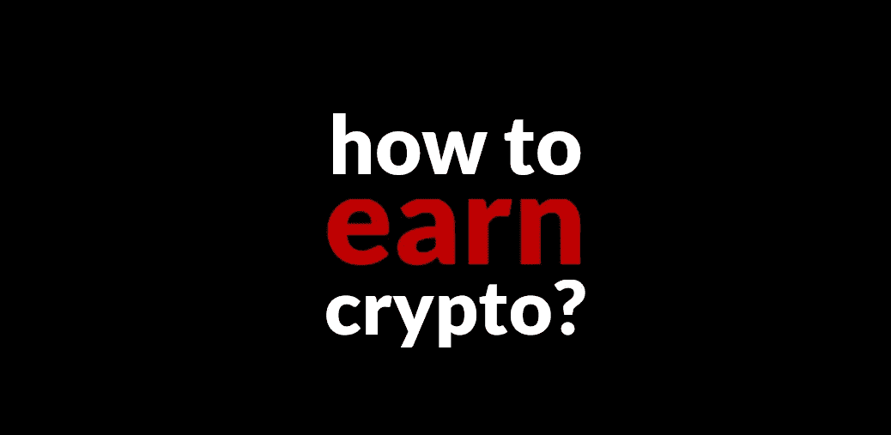

# 如何赚 Crypto？

> 原文：<https://medium.com/coinmonks/how-to-earn-crypto-19de67e3ec32?source=collection_archive---------0----------------------->

今天一些最有趣的秘密对话是关于区块链的优点。

从高层次来看，这些辩论大致分为以下几类:

1.  **比特币或泡沫**(“比特币是数字黄金”&稀缺 SOV &每个人都应该参与其中，因为这是更好的资金，X，Y，Z)
2.  **区块链不是比特币** ( [比特币](https://blog.coincodecap.com/tag/bitcoin/)很酷，但[区块链的独特属性](https://www.aclu.org/blog/privacy-technology/internet-privacy/edward-snowden-explains-blockchain-his-lawyer-and-rest-us)适用于[远比加密货币更广泛的使用案例](/cryptolawreview/token-taxonomy-frameworks-de968bf2605c)
3.  **以太是/不是金钱** ( [以太坊](https://blog.coincodecap.com/tag/ethereum/)=‘可编程金钱’对[以太坊=基于 BC 的操作系统](/altcoin-magazine/cryptos-finance-fetish-7cc88b4cf081))
4.  **Crypto 是解放**(银行无银行账户者；[DeFi](https://blog.coincodecap.com/tag/defi/)；[密码](https://blog.coincodecap.com/tag/crypto/)金融&资产化)
5.  **大规模采用**(# buy crypto v . # earn crypto v . # Libra crons[[Libra 的独角兽初创公司](/cryptolawreview/libras-endgame-7fde8704d304)据说将对原生加密应用产生“涓滴效应”)等。)
6.  **Crypto 的 Crypto** (小说 DAOs，chains，LAOs，federated chains，Urbit 等。比#1 到#5 做得好得多的#1 到#5)。

其中，大规模收养问题最近变得尤为严重。以下是来自 [IAmTexture](https://twitter.com/iamtexture) 的几条推文，充实了这一点:

Texture 是对的，但是他的建议对很多人来说还是太抽象了。尤其是因为这些建议伴随着可能被解释为宿命论或不屑一顾的信号，或者人们今天阅读建设性的批评。

因此，让我们尽可能具体地解决大规模收养问题，因为这是一件大事。

# 今日加密= #BuyCrypto

目前，加密货币/金融是主要的用例，尽管绝不是区块链技术的唯一或决定性用例。以下是这两种使用情形的基本产品市场适应性:

1.  **加密货币** =加密货币([比特币](https://blog.coincodecap.com/tag/bitcoin/) ) &代币(DAI/SAI)，比法定货币(美元、英镑、欧元)更“健全”，因此，人们会被这些加密货币和建立在它们之上的市场所吸引，特别是当法定货币崩溃，人们别无选择的时候。
2.  传统金融机构效率低下、腐败、破碎；加密为传统的金融形式、流程和机构提供了透明、简单、廉价的替代方案。随着各方寻求最大化其经济收益，他们将倾向于加密金融。

今天，仍然有很多方法可以进入加密领域，比如建造一个采矿平台，比如开采加密货币。但建造采矿钻机成本高昂，而且技术学习曲线很陡。所以只有爱好者和有大量资金预算的人才能通过这条入口。

> 如今，crypto 的主要入口是在某个加密交易所(比如说比特币基地)开设一个账户，然后#BuyCrypto。

具体来说，这要求普通人将 1000 美元存入一个兑换账户，然后将他们辛苦赚来的 1000 美元“交易”成神奇的互联网货币。

3000 多万比特币基地客户为什么这么做？因为 [crypto](https://blog.coincodecap.com/tag/crypto/) 投机是有利可图的:一个人可以用自己的加密货币交换其他加密货币，并获得可观的收益。当然，他们也可能遭受相当大的损失，但这并不像谈论收益那样性感。

除了交易，还有一个巨大的加密金融工具自助餐，人们可以通过他们的加密货币获得加密贷款。最简单的版本是交易所保证金交易限额；复杂的版本包括尚未构建的[加密](https://blog.coincodecap.com/tag/crypto/)应用的未来收入流的衍生合同权利。

基本的想法是，如果你有钱，你可以#购买加密，然后用这些可编程的“钱乐高”玩你认为合适的。

# #BuyCrypto 怎么了？

无论是 DAI-hard [DeFi](https://blog.coincodecap.com/tag/defi/) 的人，还是 Libra 的推广者，加密金融家都知道，他们无法在全球范围内推广一个需要人们投资加密的产品，而这些人根本没有钱。

作为精明的资本家，加密金融家理解#EarnCrypto 作为 OG 加密迷因的潜力。因此，他们想尽一切办法将#CryptoFinance 伪装成一个赚取密码的机会。

*   **比特币基地** : #EarnCrypto 由[观看视频](https://twitter.com/Chuck_Huber/status/1189146248160387072?s=20)并学习如何#购买 BuyCrypto
*   币安:把你的朋友介绍给币安，这样他们就可以#购买加密；
*   当市场转坏时，以加密贷款的高利率形式存在的# earn crypto&取消他人债务头寸的赎回权；
*   […]

但最终，这些所谓的#EarnCrypto 机会对于实际的潜在经济过程来说只是微不足道的。这些，本质上，(1)使用菲亚特购买密码；(2)以加密对加密的方式进行投机和交易；(3)让你的朋友和爱人加入#1，这样#NumberGoUp 和“每个人”都可以在#2 中赚更多的钱。

这些不是重要的加密收入用例。观看比特币基地的视频来学习如何#购买加密是比特币基地核心经济过程中的一部分……让人们买卖加密(并从每一步的佣金中致富)。

然而，**适合加密金融的产品市场的核心问题是，绝大多数人根本没有钱购买加密。**

# **今天如何#赚 Crypto？**

在加密开采之外，在[区块链](https://blog.coincodecap.com/tag/blockchain/)领域还有许多真正的#EarnCrypto 机会，包括:

*   ****/**[**git coin**](https://gitcoin.co/)(做特定任务赚取密码)**
*   **[**Brave/BAT**](https://brave.com/brave-rewards/)**(安装/使用 Brave 互联网浏览器赚取密码)****
*   ******(社交媒体应用程序，你可以通过发布高质量的内容获得加密******
*   ******[**垃圾币** & **垃圾现金**](/cleanapp/clean-block-tech-83a130417721) (通过举报垃圾并将其添加到开源数据库中获得密码)******
*   ****[**SpankChain**](https://spankchain.com/) (在镜头前拍打你的链条赚取密码)****
*   ****[…]****

****但是，如果加密金融内外有这么多不同的加密赚钱机会，为什么 Texture 说“加密永远不会成为主流”？****

****答案回到了人们的需求和愿望。****

****许多秘密金融都是基于这样的想法:( 1)穷人,( 11 ),( 12),“在非洲”或一些未指明的“发展中国家”,( 13 ),( 2 ),( 14)需要低息贷款,( 3)穷人想借秘密的钱来做秘密的事情。****

****但是这些假设是错误的。穷人不需要也不一定想要更容易的方式来负债。****

> ****穷人比任何人都清楚，十有八九，更多的债务会让他们更穷。****

****穷人只是想要更简单的方式来做对社会有益的工作，让他们可以在餐桌上吃面包。没必要想太多。让#EarnCrypto 做对社会有益的工作变得尽可能容易，你会得到一个获得巨大成功的加密杀手应用程序。****

****现在，SpankChain、Cent、Littercoin、Brave 和许多其他公司正在汇聚到这个 UX。越早到来越好。这是 crypto 失踪的钱的照片。****

1.  ****下载应用程序****
2.  ****拍摄照片/视频****
3.  ****单击按钮关闭或返回到 1****

*******不到一分钟，一个人从 nocoiner 到挣 crypto。*******

****照片上有什么？字面上，任何东西。从裸照(SpankChain)到垃圾热点(Littercoin ),再到你想让其他人使用的 WiFi 网络用户名和密码的照片，以换取一些加密因果报应。地图数据。天气数据。诸如此类。****

****关键是，在这种简化的形式中，没有登录，没有 kyc，没有钱，没有税，没有跟踪，没有广告软件。****

****为什么人们使用这些加密应用程序？人们为什么需要它们？****

*   *****简答* : **普通老百姓就是这样把面包摆上餐桌的**。只要问问任何一个优步司机，他作为一个“独立承包人”在一家中央公司工作，工资低于最低标准。****
*   *****长回答* : **加密盈利 dApps (A)将之前无法变现的**和/或**货币化(B)将之前无法变现的**和/或**市场化(C)通过更加高效和安全的分散路径，简单地连接人们并促进点对点数据共享**。****

****每一个优步，一个配音员。每一个 AirBnB，一个 dAirBnB。但那只是表面。做市和跨市场经济组织的真正潜力更具破坏性，特别是在允许实时激励调整的 tokenomic 模型下。****

****想想数量级的效率提升，而不仅仅是对现有流程的 10-30%的改进。明天的加密赚钱机会是加密的未来。句号。****

# ****有什么阻碍了？****

****有几件事阻碍了大规模采用加密技术。其中之一是令人费解的方式，即使是主要项目也通过限制自己的#EarnCrypto 产品来搬起石头砸自己的脚。****

****其中的一个例子是 KIK 的 KinIt 加密应用程序，目前正在接受美国证券交易委员会的审查，因为 [KIK 自己的高管不相信他们自己平台的效用潜力](https://twitter.com/CleanApp/status/1136014279407280128?s=20)。****

**** [## 大众的密码

### ALTCOIN 杂志上的 CleanApp

medium.com](/altcoin-magazine/crypto-for-the-masses-87f3608663bc) 

很多也是加密人员带来的意识形态包袱。

亚尼夫·塔尔在这里说对了一部分:

他说的没错，普通人并不在乎“审查阻力”或“去中心化”或“隐私/匿名”，不足以从根本上改变他们的经济习惯。当人们别无选择时(大棒)，或者当他们找到一种更简单的方法把面包放到谚语所说的桌子上时(胡萝卜)，他们会改变他们的习惯。

但是审查阻力、分散化、匿名化是 crypto 让穷人赚取更多面包和胡萝卜的幕后机制。

问题不在于这个或那个叙述(“审查阻力”、“Eth is Money”或“世界计算机”)。**问题在于总计化叙述**，尤其是当总计化叙述需要沿着特定弧线加强监管审查时(代币分类为货币、资产、证券；或者[将区块链网络归类为金融市场基础设施](https://papers.ssrn.com/sol3/papers.cfm?abstract_id=2879239)。**** 

****许多人认为这些叙述是良性的，只是看待许多秘密的一种方式。但事实并非如此。如果你想知道对某项特定技术的假设是如何影响结果的，请记住 KIK 发生的事情，或者浏览任何认为区块链不仅仅是“金钱”和“金融”的 Twitter 帖子****

****现实情况是，许多购买#CryptoMoney & #CryptoFinance 总计叙事的人可能真的认为，任何挑战这些叙事优势的事情都会削弱他们的投资。****

****但是，加密最有利可图的应用，包括最有利可图的货币应用，远远超出了现有的货币和金融框架。****

****从事对社会有益的工作越容易获得加密令牌和徽章，支持和维持这些新经济活动模式的技术栈的经济价值就越高:****

1.  ****[下载 app](https://cleanapp.io/2018/07/04/your-first-cleanapp-plog-in-2021/)****
2.  ****拍摄照片/视频****
3.  ****单击按钮关闭或返回到 1****

> ****[在您的收件箱中直接获得最佳软件交易](https://coincodecap.com/?utm_source=coinmonks)****

********