# 💰如何从币安赚钱

> 原文：<https://medium.com/coinmonks/how-to-earn-from-binance-67c38723f3a3?source=collection_archive---------0----------------------->

## 这是我在鬼混**Defi(其实还挺 Cefi 的)时的经验，这不是理财建议！自己拿主意别怪我！**

**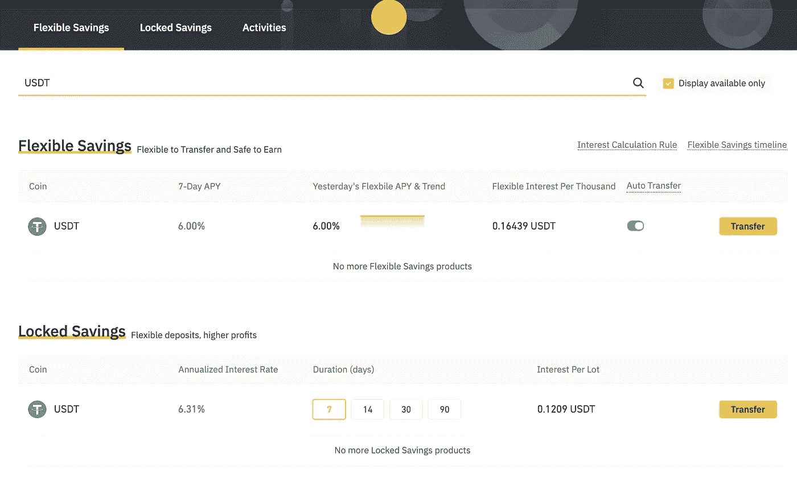**

**2021 rate = 6%**

# **先决条件**

1.  **币安帐户//这是我的参考，如果你愿意的话👉【https://www.binance.com/en/register?ref=13135950 **
2.  **存一些你可能会失去的钱。**
3.  **不要对 Defi 说不，这不是骗局，这是未来。**

# **首先要做的事**

*   **在那里，有许多失去和获得金钱方法。我们将重点放在“**赚**”而不是“**交易**”或其他什么事情上。**
*   **如果您通过 **P2P** 存款，将其移动到**菲亚特/现货**钱包，然后从那里点击**赚取**将会更容易。**
*   **完成保存后，您的余额将被移至**“赚取”**菜单。**

# **TLDR**

## **🌈低风险:只是储蓄**

**购买 **USDT** 或 **BUSD** 并转移到……[储蓄](https://www.binance.com/en/savings)**

1.  ****灵活储蓄**如果你想随时赎回(用于交易)。**
2.  ****锁定储蓄**如果您想在 7–90 天后赎回。**

**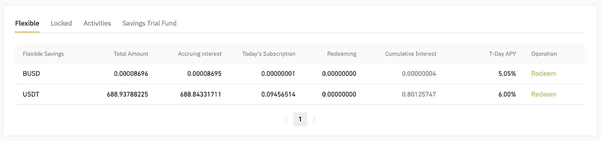**

**Flexible result**

**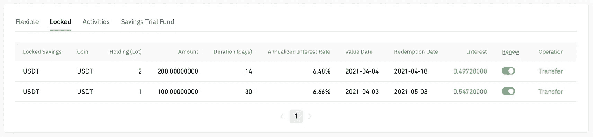**

**Locked result**

> **这很好，但这是稳定的硬币，所以让我们冒更大的风险！**

## **🌈中等风险:储蓄和[股份](https://www.binance.com/en/pos)**

**买一些你喜欢的硬币/代币，例如 **BTC** 、 **BNB** 、 **ETH** 、 **DOT** 、 **CAKE** 和 [stake](https://www.binance.com/en/pos) 一段你可以怀念的时间。**

**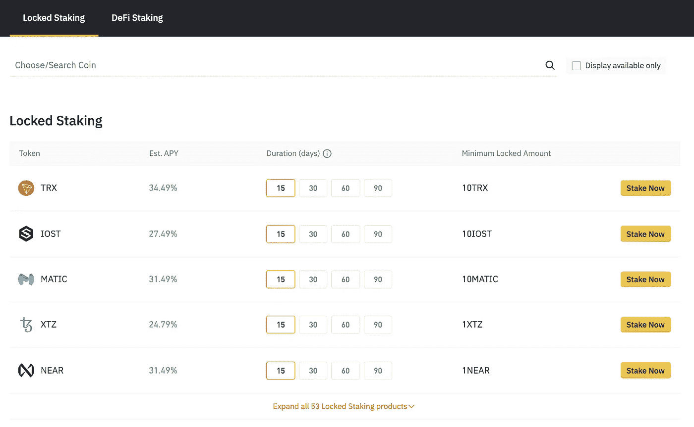**

**pick one**

**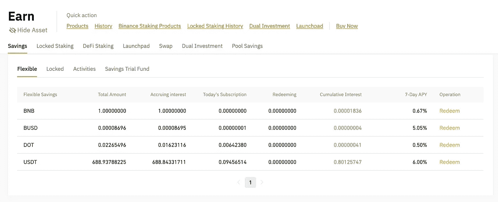**

**flexible saving result**

**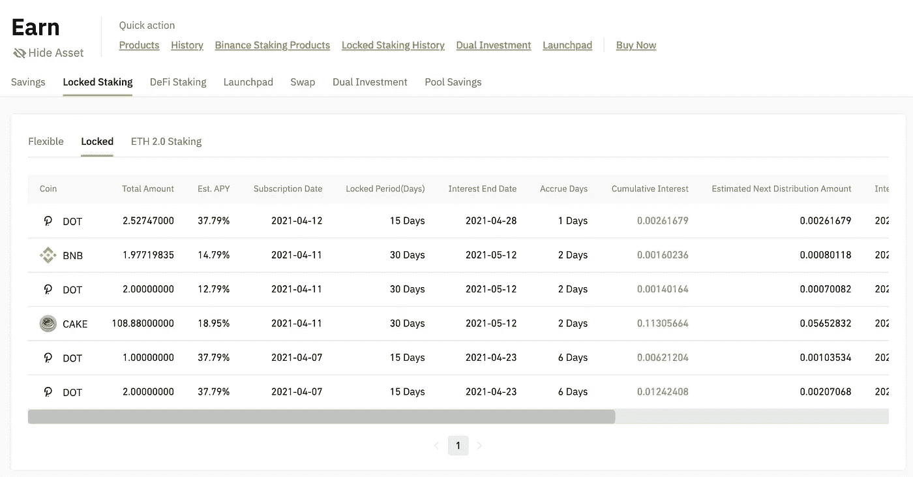**

**locked staking result**

****顺便说一句**:如果没有列在那里，可能已经卖完了，请稍后再来查看。**

**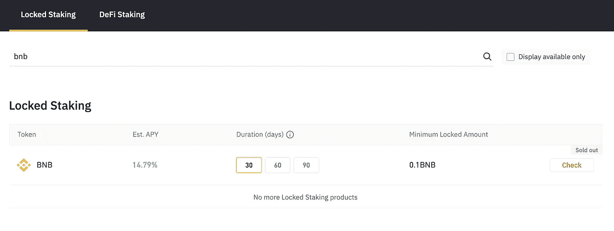**

**Awww, sold out!**

**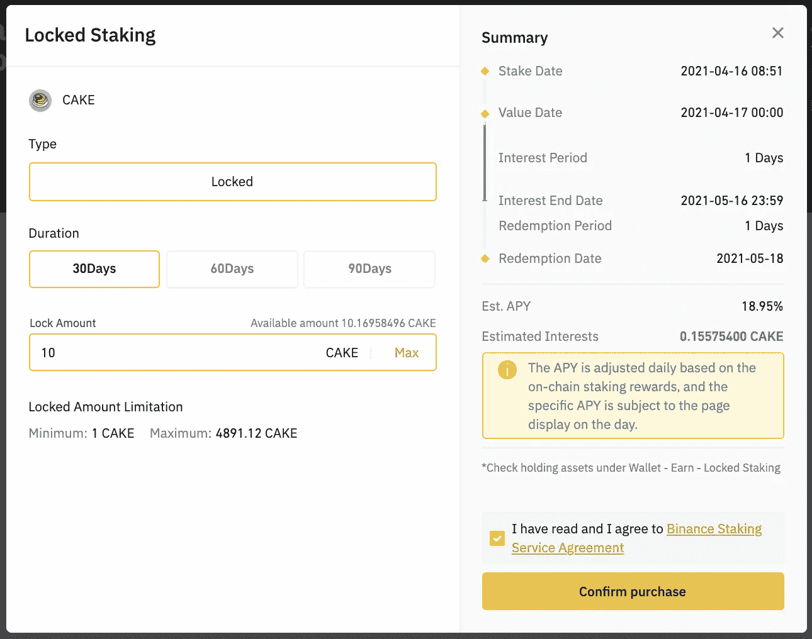**

**Get 0.1 CAKE = $2.2 in 30 Days**

> **风险来自硬币/代币价格本身。**

## **🌈高风险: [**液体互换**](https://www.binance.com/en/support/faq/85d614205d334128b76c0275aba61ea6)**

**选择 [**液体交换**](https://www.binance.com/en/swap/liquidity) 和你喜欢的任何一双，最少买一些，然后去尝试。可以看出他们是一些 [**无常损**](https://academy.binance.com/en/articles/impermanent-loss-explained) 以下为 **BNB/ETH** 。**

**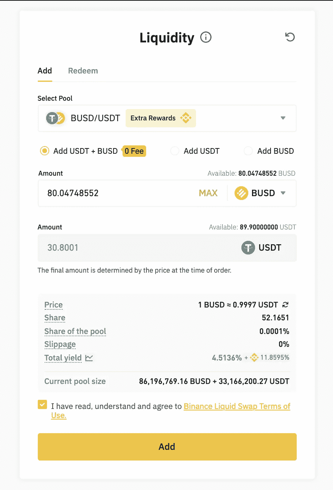**

**Add BUSD/USDT**

> **如果你只有 **USDT，**你可以将 [**互换**](https://www.binance.com/en/swap) USDT 到 BUSD 后再加入池中。**

**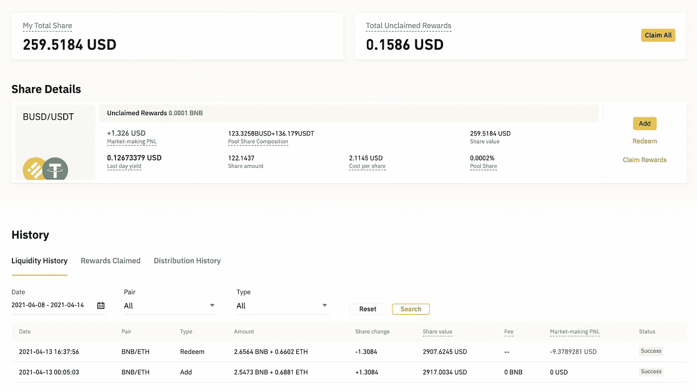**

**BNB/ETH is…not cool**

**如你所见 **BNB/ETH** 不好 **BUSD/USDT** 好。冒险！**

**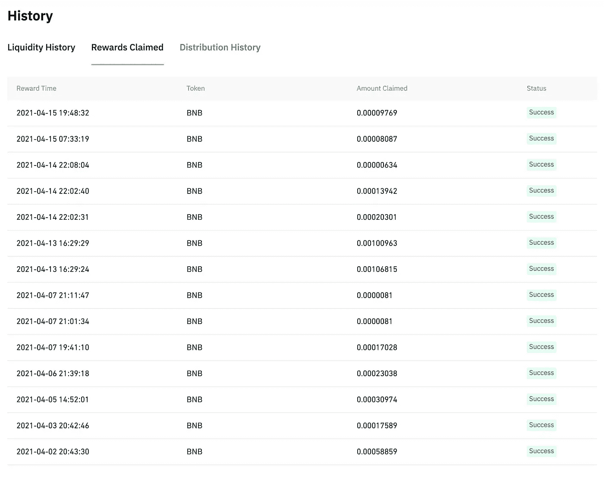**

**Cool!**

**在光明的一面，我得到了 BNB 流回我的天然气开发成本(是的！3…4 年过去了，我又回到了区块链开发！)**

> **风险来自 [**非永久性损失**](https://academy.binance.com/en/articles/impermanent-loss-explained) 和因锁定期而错失获利机会。**

## **🌈超高风险:**

**还有很多菜单，但我不会说那么多，这只是一个实验。我宁愿回到编码…🌝**

# **再见🤚**

**就是这样！如果你想给我一杯咖啡，☕️，这是我的钱包。👇**

> **ETH:0x d 63 ECF 4 fa 7 ef 94 ea 4 e 9 cf 7429 af 6a 4 f 482 b 447 b 7
> BNB(BSC):0x 0c 62 b 13 f 8116 EBA 444 defe 842 Abd 7 D1 f 68 f 964 f
> BNB(BC):bnb 1 uqht 090 p 2 fjs 9 dr 2um H5 w5 yk m 697 srgr 70 xkat**

**谢谢！**

> **加入 coin monks[Telegram group](https://t.me/joinchat/PmKOYQ9NNKZlZGNl)学习加密交易和投资**

## **另外，阅读**

*   **[什么是保证金交易](https://blog.coincodecap.com/margin-trading) | [美元成本平均法](https://blog.coincodecap.com/dca)**
*   **最好的[密码交易机器人](/coinmonks/crypto-trading-bot-c2ffce8acb2a) | [网格交易机器人](https://blog.coincodecap.com/grid-trading)**
*   **[3 商业评论](/coinmonks/3commas-review-an-excellent-crypto-trading-bot-2020-1313a58bec92) | [Pionex 评论](/coinmonks/pionex-review-exchange-with-crypto-trading-bot-1e459d0191ea) | [Coinrule 评论](/coinmonks/coinrule-review-2021-a-beginner-friendly-crypto-trading-bot-daf0504848ba)**
*   **[AAX 交易所评论](/coinmonks/aax-exchange-review-2021-67c5ea09330c) | [德里比特评论](/coinmonks/deribit-review-options-fees-apis-and-testnet-2ca16c4bbdb2) | [FTX 交易所评论](/coinmonks/ftx-crypto-exchange-review-53664ac1198f)**
*   **[n 零审核](/coinmonks/ngrave-zero-review-c465cf8307fc) | [Phemex 审核](/coinmonks/phemex-review-4cfba0b49e28) | [PrimeXBT 审核](/coinmonks/primexbt-review-88e0815be858)**
*   **[Bybit 交易所评论](/coinmonks/bybit-exchange-review-dbd570019b71) | [Bityard 评论](/coinmonks/bityard-review-7d104239be35) | [CoinSpot 评论](https://blog.coincodecap.com/coinspot-review)**
*   **[3 commas vs crypto hopper](/coinmonks/3commas-vs-pionex-vs-cryptohopper-best-crypto-bot-6a98d2baa203)|[赚取加密利息](/coinmonks/earn-crypto-interest-b10b810fdda3)**
*   **最好的比特币[硬件钱包](/coinmonks/the-best-cryptocurrency-hardware-wallets-of-2020-e28b1c124069?source=friends_link&sk=324dd9ff8556ab578d71e7ad7658ad7c) | [BitBox02 回顾](/coinmonks/bitbox02-review-your-swiss-bitcoin-hardware-wallet-c36c88fff29)**
*   **[莱杰 vs n rave](/coinmonks/ledger-vs-ngrave-zero-7e40f0c1d694)|[莱杰 nano s vs x](/coinmonks/ledger-nano-s-vs-x-battery-hardware-price-storage-59a6663fe3b0) | [币安评论](/coinmonks/binance-review-ee10d3bf3b6e)**
*   **[加密复制交易平台](/coinmonks/top-10-crypto-copy-trading-platforms-for-beginners-d0c37c7d698c) | [Coinmama 评论](/coinmonks/coinmama-review-ace5641bde6e)**
*   **[CoinLoan 评论](/coinmonks/coinloan-review-18128b9badc4) | [YouHodler 评论](/coinmonks/youhodler-4-easy-ways-to-make-money-98969b9689f2) | [BlockFi 评论](/coinmonks/blockfi-review-53096053c097)**
*   **最好的[加密税务软件](/coinmonks/best-crypto-tax-tool-for-my-money-72d4b430816b) | [硬币追踪评论](/coinmonks/cointracking-review-a-reliable-cryptocurrency-tax-software-5114e3eb5737)**
*   **最佳[加密借贷平台](/coinmonks/top-5-crypto-lending-platforms-in-2020-that-you-need-to-know-a1b675cec3fa) | [杠杆令牌](/coinmonks/leveraged-token-3f5257808b22)**
*   **[BlockFi vs Celsius](/coinmonks/blockfi-vs-celsius-vs-hodlnaut-8a1cc8c26630)|[Hodlnaut 点评](/coinmonks/hodlnaut-review-best-way-to-hodl-is-to-earn-interest-on-your-bitcoin-6658a8c19edf) | [KuCoin 点评](https://blog.coincodecap.com/kucoin-review)**
*   **[Bitsgap 评审](/coinmonks/bitsgap-review-a-crypto-trading-bot-that-makes-easy-money-a5d88a336df2) | [Quadency 评审](/coinmonks/quadency-review-a-crypto-trading-automation-platform-3068eaa374e1) | [Bitbns 评审](/coinmonks/bitbns-review-38256a07e161)**
*   **[埃利帕尔泰坦评论](/coinmonks/ellipal-titan-review-85e9071dd029) | [赛克斯斯通评论](/coinmonks/secux-stone-hardware-wallet-review-15-discount-coupon-2020-7577032faa6e)**
*   **[本地比特币评论](/coinmonks/localbitcoins-review-6cc001c6ed56) | [加密货币储蓄账户](https://blog.coincodecap.com/cryptocurrency-savings-accounts)**
*   **最佳[区块链分析](https://bitquery.io/blog/best-blockchain-analysis-tools-and-software)工具| [赚比特币](/coinmonks/earn-bitcoin-6e8bd3c592d9)**
*   **[加密套利](/coinmonks/crypto-arbitrage-guide-how-to-make-money-as-a-beginner-62bfe5c868f6)指南| [如何做空比特币](/coinmonks/how-to-short-bitcoin-568a2d0b4ae5)**
*   **最佳[加密制图工具](/coinmonks/what-are-the-best-charting-platforms-for-cryptocurrency-trading-85aade584d80) | [最佳加密交易所](/coinmonks/crypto-exchange-dd2f9d6f3769)**
*   **[如何在印度购买比特币？](/coinmonks/buy-bitcoin-in-india-feb50ddfef94) | [瓦济克斯审查](/coinmonks/wazirx-review-5c811b074f5b)**
*   **[印度比特币交易所](/coinmonks/bitcoin-exchange-in-india-7f1fe79715c9) | [比特币储蓄账户](/coinmonks/bitcoin-savings-account-e65b13f92451)**
*   **[CoinDCX 评论](/coinmonks/coindcx-review-8444db3621a2) | [加密保证金交易交易所](https://blog.coincodecap.com/crypto-margin-trading-exchanges)**