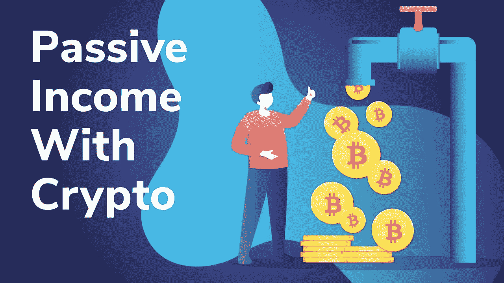
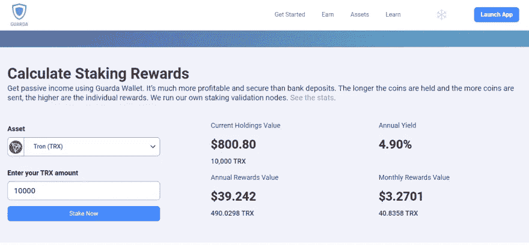
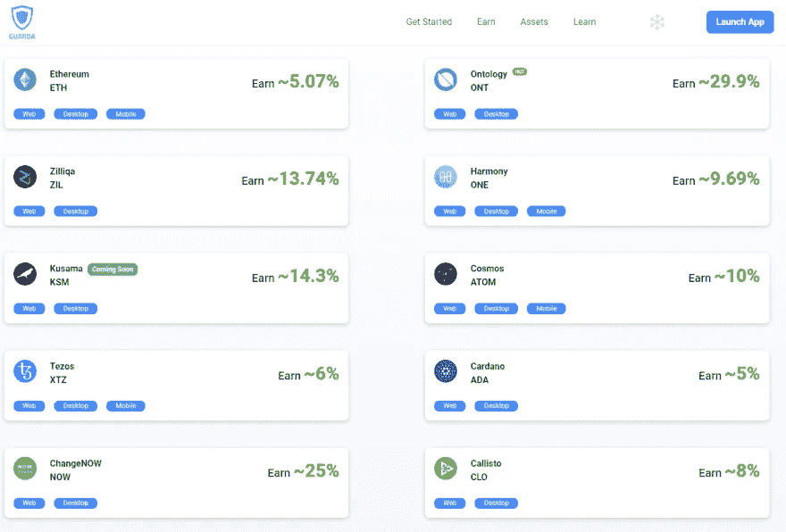

# 如何在 2022 年用加密赌注赚取被动收入

> 原文：<https://medium.com/coinmonks/how-to-earn-passive-income-with-crypto-staking-in-2022-99ae1ec0d53?source=collection_archive---------3----------------------->

很多来找我寻求建议的人认为在加密中赚钱的唯一方法是通过交易，因为这看起来太复杂了，他们中的大多数人最终都去了别处。

用加密赚钱，超级简单，交易不是唯一的方法。这就是为什么我决定提供另一种观点来看待通过赌注获得的加密收入。

我认为对于新手来说，下注是一种风险较小的投资，而且设置起来非常简单！！

这在 2022 年对你来说可能是非常好的消息，因为你将能够通过你的加密投资获得一些被动收入。

# 什么是赌注？

**简答:**通过冻结和持有某些加密货币来赚取奖励(更多硬币)的一种方式。

赌注是赚取加密被动收入的最佳方式之一，这意味着在区块链冻结你的硬币，这样你就可以得到一个利率，年化利率年利率或 APY 年收益率。

是一个比这更复杂的过程，它涉及验证区块链上的数据块的节点和许多其他因素，为了尽可能简单起见，我将在本指南中省略这些因素。

# 跑马圈地能赚多少钱？

今天运行一个简单的计算(市场条件随时间变化)。

假设你决定下注 10000 TRX，价值约 800 美元，将硬币下注 3 年后，你将得到 11440 TRX。

11440 TRX，如果 3 年后价格达到 0.80，意味着你将有:9152 美元。**从 800 美元到 9000 美元对于加密的被动收入来说还不错。**

这不是财务建议，只是让你知道一些情况和赌注如何工作。我鼓励你多研究一下硬币和这个选项。

*我想现在就做，我说现在*

有许多方法可以开始下注 TRX 和许多其他硬币，你需要几个应用程序来完成:

**瓜达钱包:**[https://grd.to/ref/GcgX](https://grd.to/ref/GcgX)

**https://accounts.binance.com/en/register?ref=K5XIYGD8**[币安](https://accounts.binance.com/en/register?ref=K5XIYGD8)

> 这些链接是朋友推荐链接，它们会给你一些额外的优惠，比如在币安购买所有硬币打九折。

另一种下注方式是通过 DEFI 方式，在这种情况下，我会建议你看看 Pancakeswap.finance

使用 Metamask 作为钱包，您可以轻松地在 Pancakeswap 中下注一些硬币和代币。(关于这方面的问题，请通过电报联系我，链接如下)

有许多其他的 DEFI 交易和赌注平台，其中一些提供令人敬畏的年利率%,但它们运行在以太坊网络上，交易费用如此之高，以至于我不认为它们是可行的选择。

# 在 2022 年将 crypto 作为被动收入的 3 个简单步骤:

**第一步:**获得一个能够跑马圈地的钱包或交易平台。

**第二步:**购买你想投资的加密软件。

**第三步:**点击赚取，选择加密，点击赌注。

**瓜尔达一些最高的年百分比率 APR%有:**

这些利率因平台而异，你可能会发现一个交易应用程序的条件比另一个更好，我鼓励你在做出决定时比较一下瓜达和币安。

如果你正在寻找一种方法来获得额外的投资回报，那么我建议你看看这篇文章:

# [2022 年如何购买 9 折 8 折返现的 Crypto](/@lumabooks/how-to-buy-crypto-with-10-discount-and-8-cashback-in-2022-4488c1bde8d1)

# 帮助和支持:

我可以通过不和谐和电报帮助您解决任何问题:

**不和:**https://discord.gg/kTQpdTMArN

**电报:**[https://t.me/cryptominingadvisor](https://t.me/cryptominingadvisor)

# 赌注有任何风险吗？

是的，作为加密中的一切，有些事情你应该在下注前知道。

赌注的主要缺点之一是你的硬币可能会被锁定一段时间，在某些情况下，平台可能会锁定你的硬币 30 天。

这意味着你不能交易你的硬币，如果你在约定的时间之前决定退出，你可能会被罚款，比如失去你到目前为止获得的 APR。

在瓜达赌 TRX 的情况下，你的硬币只能锁定前 3 天。之后，您可以在任何给定的时间获得您的硬币和您的全部奖励。

另一个要考虑的风险是硬币价格的变化，对于长期持有的人来说，赌注是很大的，他们把硬币押在一个美好的未来上。

# 2022 年跑马圈地的主要优势是什么？

对于交易者和赌注者来说，在 2022 年下注的两个优势之一是，你将能够产生更多的硬币和奖励，而不是把硬币留在你的钱包里。

堆栈的第二个优点是对于区块链，它有助于区块链的安全性和效率。这是通过对将保护链上的块的某些验证器节点进行投票来完成的。

如果你想在 2022 年获得一些加密的被动收入，赌注是一个非常好的方式，我邀请你加入赌注，如果你有任何疑问，请随时联系我，我可以回答你的问题！！

如果你也想学习更多关于交易和赌注的知识，我试着为初学者准备了一个非常基础的迷你课程，你可以在下面找到:

> 加入 Coinmonks [电报频道](https://t.me/coincodecap)和 [Youtube 频道](https://www.youtube.com/c/coinmonks/videos)了解加密交易和投资

## 也阅读

 [## 杠杆代币[多头代币]终极指南

### 杠杆化令牌是具有杠杆化风险敞口的 ERC20 令牌，不考虑保证金、要求、管理…

medium.com](/coinmonks/leveraged-token-3f5257808b22)  [## 最佳加密交易所| 2021 年十大加密货币交易所

### 编辑描述

blog.coincodecap.com](https://blog.coincodecap.com/crypto-exchange)  [## 2021 年最佳加密交换平台| CoinCodeCap

### 编辑描述

blog.coincodecap.com](https://blog.coincodecap.com/best-swap-platforms)  [## 2021 年最佳加密借贷平台| 6 大比特币借贷平台

### 获得比特币和其他加密货币的最佳贷款利率

medium.com](/coinmonks/top-5-crypto-lending-platforms-in-2020-that-you-need-to-know-a1b675cec3fa)  [## 2021 年 6 大最佳硬件钱包|顶级加密硬件钱包[更新]

### 最好的加密货币硬件钱包是绝对必要的。我们将在 NGRAVE、Ledger Nano X 和…

medium.com](/coinmonks/the-best-cryptocurrency-hardware-wallets-of-2020-e28b1c124069)  [## 2021 年最佳免费加密交易机器人

### 2021 年币安、比特币基地、库币和其他密码交易所的最佳密码交易机器人。四进制，位间隙…

medium.com](/coinmonks/crypto-trading-bot-c2ffce8acb2a)  [## 最佳 4 个加密交易信号电报通道

### 这是乏味的找到正确的加密交易信号提供商。因此，在本文中，我们将讨论最好的…

medium.com](/coinmonks/best-crypto-signals-telegram-5785cdbc4b2b)  [## 获取信号、交易机器人和套利

### 在本文中，我们将讨论 bits gap——一个满足您所有交易需求的一站式加密交易平台…

blog.coincodecap.com](https://blog.coincodecap.com/bitsgap-review)  [## 40 个最佳电报频道，用于加密、电影、表演和演讲| CoinCodeCap

### 编辑描述

blog.coincodecap.com](https://blog.coincodecap.com/best-telegram-channels)