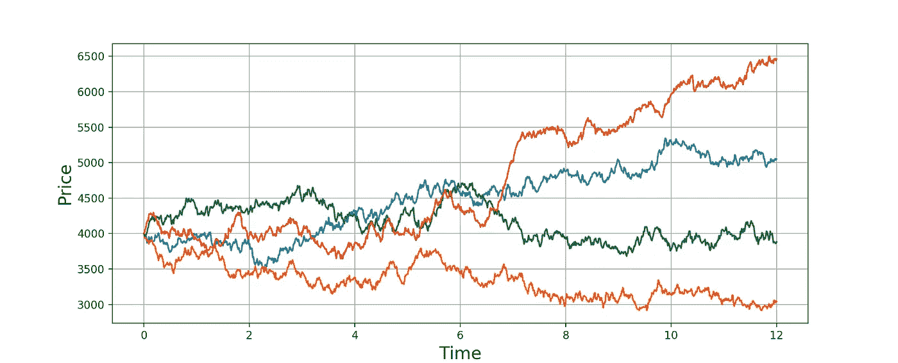

# 如何用加密货币挖矿获得被动收入

> 原文：<https://medium.com/coinmonks/how-to-earn-passive-income-with-cryptocurrency-mining-c7adce1d34d5?source=collection_archive---------0----------------------->

## 加密货币挖掘何时以及为何具有金融意义

Photo by [Hans Eiskonen](https://unsplash.com/@eiskonen?utm_source=medium&utm_medium=referral) on [Unsplash](https://unsplash.com?utm_source=medium&utm_medium=referral)

我的表弟昨天打电话给我，咨询如何进入加密货币(特别是以太坊)采矿。我看得出他很兴奋，但不知道从何说起。随着最近价格的飙升，成千上万的人开始将加密采矿视为产生被动收入的一种有吸引力的途径。我有一些业余爱好者规模的采矿经验，非常熟悉作为投资工具的加密采矿的好处和缺点。这是我给他的演讲，现在给你:

## 这是一种投资。不要想太多

购买、构建和操作加密货币采矿计算机是一项投资活动，因此应该从金融角度进行分析。抛开挖掘算法、GPU 效率、区块链协议以及与挖掘相关的其他复杂性，我们可以通过简单的成本和利润分析来理解加密挖掘的好处。

> 与拥有基础加密货币相比，挖掘加密货币将减少你在熊市中的损失。

在熊市中，你必须准备好承受潜在的损失，坚持到未来的牛市。如果你还没有准备好，你就不应该进入采矿业。这当然是假设市场恢复到上升趋势，我认为任何密码爱好者都会同意这是一个公平的假设。作为业余爱好者，停滞的市场正是你想去的地方。当你看到下面的例子时，这将更有意义。

> 投资加密货币矿是一种市场对冲。

*什么是树篱？*本质上，对冲是一种降低整体投资风险的方法。在这种情况下，采矿以某种独特的方式改变了你的回报特征:(1) ***上行利润潜力减少*** ，因为你不会有拥有基础资产所固有的市场风险。相反，你将在相对稳定的基础上获得回报，这取决于你的平台的计算能力(你在 GPU 上花了多少钱)，而对基础资产的投资没有这种限制，可以提供无限的上升空间。(2) ***下行风险适度降低*** 。通过购买这种硬件，你用一种资产交换了另一种产生资产的资产。你还继承了一系列其他负债，如折旧费用和运营风险，然而，因为采矿回报独立于基础资产的财务价值，你最好在熊市期间采矿，而不是拥有基础资产。

> (3)采矿在一个停滞的市场中创造了一个以前没有的上升空间。

矿商在均值回归市场中繁荣发展，因为他们能够产生整体回报，不会在牛市中支付与采矿相关的机会成本，也不会像在熊市中那样亏损。

## 例子

让我们假设我们有 4000 美元投资于加密货币，我们希望尽可能多地赚钱。我们有两个选择:

*选项 1:*

用我们的 4000 美元购买零件并建造一个加密货币采矿钻机。假设我们以大约 500 美元的价格购买了一个库存电源、处理器、显示器、机箱(机架)，并以 3500 美元的价格购买了一个 GeForce RTX 3080 和一个 GeForce RTX 3070。

*选项 2:*

购买 4000 美元的基础资产。

# 比较三种市场条件下的两种投资选择:

Figure 1: Brownian Motion Simulation

***红色*** =牛市， ***绿色*** =停滞市场， ***橙色*** =熊市

我使用了一个[布朗运动函数](https://scipy-cookbook.readthedocs.io/items/BrownianMotion.html)来模拟高波动性加密货币的运动，以创建一个无偏的市场运动模拟。上面的图 1 显示了 4 个这样的模拟，说明了投资 4000 美元(价格)12 个月(时间)的可能结果。

## 1a)采矿(停滞)

利润=～975 美元

[假设 12 个月内价格不变，我们的日利润大约为 16 美元，采矿收入为 6000 美元。我们的 GPU 折旧大约为 525 美元，我们的电力成本为 500 美元(假设每千瓦时的电力成本为 20 美分)。我们最初的投资是 4000 美元，给我们留下了 975 美元的利润。](https://www.tomshardware.com/best-picks/best-mining-gpus-benchmarked-and-ranked)

## 1b)自有基础(停滞)

利润= 0 美元

根据定义，我们在这个市场上赚不到钱。

## **2a)矿业(熊市)**

利润= 480 美元

为了简化派息计算，我减少了每日利润，与最后时刻标的价值成比例。我们的平均日利润约为 12.27 美元，收入为 4480 美元。

## 2b)自有标的(熊市)

利润(损失)=-1000 美元

## 3a)采矿(牛市)

利润= 2539 美元

假设我们采矿的日平均收入是 20 美元。我们在 t(0)时的初始每日支付额和 t(12)时的最终每日支付额的粗略平均值。保守估计，到年底，我们的收入将达到 7465 美元，GPU 的折旧将达到 525 美元，电费为 500 美元。

## 3b)自有基础(牛市)

利润= 2500 美元

很容易得出我们的最终价值(6500 美元)并减去我们的原始投资(4000 美元)。

# 预期收益(TLDR；)

预期收益=(概率熊*回报熊)+(概率牛*回报牛)+(概率停滞*回报停滞)

** *假设结果概率相等*

> 预期回报(自有基础)= 500 美元

> **预期回报(采矿)=～1331 美元**

# 结论

采矿的好处在于它能够 ***保护你免受由于市场低迷而带来的潜在损失*** 以及 ***在停滞的市场中创造独特的机会来创造财富*** 。虽然加密货币开采不太类似于印刷钞票，但如果做得正确，它非常接近，如果在本文描述的情况下完成，可以提供非常可靠的投资回报。

折旧费用在第一年将是最大的，到第五年年底，您的 GPU 将几乎过时。电费当然会有所不同。这篇文章没有考虑到寻找、建造和操作采矿钻机所需要的时间。设置起来可能会有很多工作，但维护起来不应该是一个沉重的负担。

# 资源

 [## 最佳采矿 GPU 基准测试和排名

### (图片鸣谢:Tom 的硬件)有哪些最好的挖矿 GPU，值得涉足整个加密货币吗…

www.tomshardware.com](https://www.tomshardware.com/best-picks/best-mining-gpus-benchmarked-and-ranked)  [## 布朗运动-科学食谱文档

### 布朗运动是一个随机过程。布朗运动方程的一种形式是$X(0) = X_0$ $X(t + dt) = X(t)…

scipy-cookbook.readthedocs.io](https://scipy-cookbook.readthedocs.io/items/BrownianMotion.html) 

> 加入 coin monks[Telegram group](https://t.me/joinchat/JaY3hVVw2WhiNmFl)并了解加密交易和投资

## 另外，阅读

*   最好的[加密交易机器人](/coinmonks/crypto-trading-bot-c2ffce8acb2a) | [网格交易机器人](https://blog.coincodecap.com/grid-trading)
*   [加密复制交易平台](/coinmonks/top-10-crypto-copy-trading-platforms-for-beginners-d0c37c7d698c) | [如何在 WazirX](/coinmonks/buy-bitcoin-on-wazirx-2d12b7989af1) 上购买比特币
*   [CoinLoan 点评](/coinmonks/coinloan-review-18128b9badc4)|[Crypto.com 点评](/coinmonks/crypto-com-review-f143dca1f74c) | [火币保证金交易](/coinmonks/huobi-margin-trading-b3b06cdc1519)
*   [尤霍德勒 vs 科恩洛 vs 霍德诺特](/coinmonks/youhodler-vs-coinloan-vs-hodlnaut-b1050acde55a) | [Cryptohopper vs 哈斯博特](https://blog.coincodecap.com/cryptohopper-vs-haasbot)
*   [杠杆令牌](/coinmonks/leveraged-token-3f5257808b22) | [最佳密码交易所](/coinmonks/crypto-exchange-dd2f9d6f3769) | [Paxful 点评](/coinmonks/paxful-review-4daf2354ab70)
*   [加密套利](/coinmonks/crypto-arbitrage-guide-how-to-make-money-as-a-beginner-62bfe5c868f6)指南| [如何做空比特币](/coinmonks/how-to-short-bitcoin-568a2d0b4ae5) | [1xBit 回顾](https://blog.coincodecap.com/1xbit-review)
*   [如何在印度购买比特币？](/coinmonks/buy-bitcoin-in-india-feb50ddfef94) | [WazirX 评论](/coinmonks/wazirx-review-5c811b074f5b) | [BitMEX 评论](https://blog.coincodecap.com/bitmex-review)
*   [印度比特币交易所](/coinmonks/bitcoin-exchange-in-india-7f1fe79715c9) | [比特币储蓄账户](/coinmonks/bitcoin-savings-account-e65b13f92451)
*   [币安收费](/coinmonks/binance-fees-8588ec17965) | [Botcrypto 审查](/coinmonks/botcrypto-review-2021-build-your-own-trading-bot-coincodecap-6b8332d736c7) | [Hotbit 审查](/coinmonks/hotbit-review-cd5bec41dafb) | [KuCoin 审查](https://blog.coincodecap.com/kucoin-review)
*   [我的密码交易经验](/coinmonks/my-experience-with-crypto-copy-trading-d6feb2ce3ac5) | [购买硬币评论](https://blog.coincodecap.com/buycoins-review)
*   [逐位融资融券交易](/coinmonks/bybit-margin-trading-e5071676244e) | [币安融资融券交易](/coinmonks/binance-margin-trading-c9eb5e9d2116) | [超位审核](/coinmonks/overbit-review-9446ed4f2188)
*   [加密货币储蓄账户](/coinmonks/cryptocurrency-savings-accounts-be3bc0feffbf) | [YoBit 审核](/coinmonks/yobit-review-175464162c62) | [Bitbns 审核](/coinmonks/bitbns-review-38256a07e161)
*   [Botsfolio vs nap bots vs Mudrex](/coinmonks/botsfolio-vs-napbots-vs-mudrex-c81344970c02)|[gate . io 交流回顾](/coinmonks/gate-io-exchange-review-61bf87b7078f)
*   [最佳比特币保证金交易](/coinmonks/bitcoin-margin-trading-exchange-bcbfcbf7b8e3) | [萝莉点评](/coinmonks/lolli-review-e6ddc7895ad8) | [比特币保证金交易](https://blog.coincodecap.com/bityard-margin-trading)
*   [创造并出售你的第一个 NFT](https://blog.coincodecap.com/create-nft) | [本地比特币评论](/coinmonks/localbitcoins-review-6cc001c6ed56)
*   [加密保证金交易交易所](/coinmonks/crypto-margin-trading-exchanges-428b1f7ad108) | [赚取比特币](/coinmonks/earn-bitcoin-6e8bd3c592d9) | [Mudrex 投资](https://blog.coincodecap.com/mudrex-invest-review-the-best-way-to-invest-in-crypto)
*   [如何在印度购买以太坊？](https://blog.coincodecap.com/buy-ethereum-in-india) | [如何在币安购买比特币](https://blog.coincodecap.com/buy-bitcoin-binance)
*   [顶级付费加密货币和区块链课程](https://blog.coincodecap.com/blockchain-courses) | [币安评论](/coinmonks/binance-review-ee10d3bf3b6e)
*   [MXC 交易所评论](/coinmonks/mxc-exchange-review-3af0ec1cba8c) | [Pionex vs 币安](https://blog.coincodecap.com/pionex-vs-binance) | [Pionex 套利机器人](https://blog.coincodecap.com/pionex-arbitrage-bot)
*   [在美国如何使用 BitMEX？](https://blog.coincodecap.com/use-bitmex-in-usa) | [BitMEX 评论](https://blog.coincodecap.com/bitmex-review)