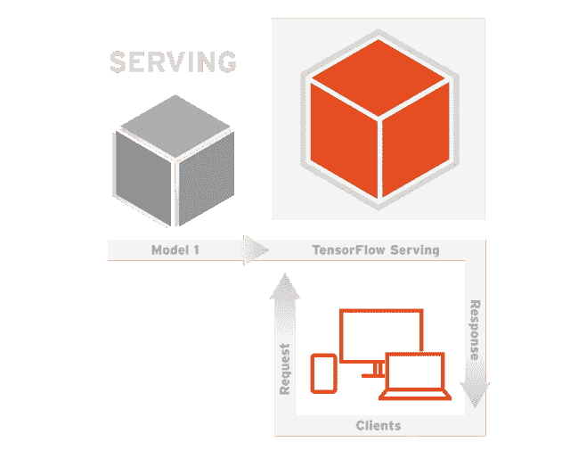

# 如何使用 Tensorflow 服务轻松将机器学习模型投入生产

> 原文：<https://medium.com/coinmonks/how-to-easily-put-machine-learning-models-into-production-using-tensorflow-serving-91998fa4b4e1?source=collection_archive---------4----------------------->

机器学习很有趣，对吗？？良好的..大多数时间，但是将模型投入生产有时很糟糕，尤其是在像**机器学习**这样快速发展的领域。您如何跟踪您的模特？你如何在你喜爱的模型上实现源代码控制？对于现实生活中的案例，您如何快速为他们提供服务？这些都是我在沃尔玛实验室一个很酷的绝密项目中遇到的一些问题。要找到关于这个主题的好例子和文档是很困难的，所以我想分享我的发现。

**Tensorflow service**是将机器学习模型引入生产的明显且最佳的解决方案。好处包括:

1.  **一个由谷歌**支持的超快的预建 rest api
2.  **源代码管理，可轻松访问不同型号和版本的产品**
3.  **跨所有平台服务模型的标准化方式**

然而，因为它是新的，所以缺少了很多东西，比如 **DOCUMENTATION** (真的是谷歌吗？？)以及对其他流行库(如 **Keras** )的文档支持。Keras 与 Tensorflow Serving 完全兼容。唯一的挑战是保存模型，以便 Tensorflow Serving 可以使用它。**因此，本教程系列试图通过一个易于使用的生产应用编程接口快速启动和运行，并解决在尝试这样做时可能遇到的许多问题。**

我将把它分成 **3 个主要部分**，点击下面的任何一个部分指向正确的文章。

1.  [设置和**配置** Tensorflow 服务](/@brianalois/how-to-setup-tensorflow-serving-for-production-3cc2abf7efa)
2.  [训练并保存为](/@brianalois/simple-keras-trained-model-export-for-tensorflow-serving-23fa5dfeeecc)服务的 Tensorflow 的**预测**模型
3.  [训练保存一个**分类**模型为](/@brianalois/train-and-save-a-classification-model-in-keras-for-tensorflow-serving-productionize-ai-ddfbc3e57d6a)Tensorflow 服务

让我知道我是否应该添加什么或更具描述性。

— — Brian Alois Schardt