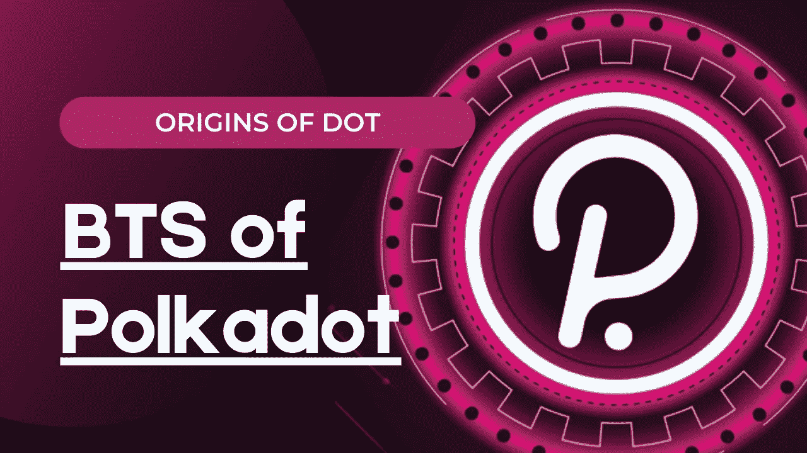

# 如何轻松理解波尔卡多！一个快速的幕后花絮。

> 原文：<https://medium.com/coinmonks/how-to-easily-understand-polkadot-a-quick-behind-the-scenes-look-2992611460e7?source=collection_archive---------4----------------------->

## 一个能够兑现以太坊未能兑现的承诺的项目。

Thumbnail from [Günter Ederegger](https://medium.com/u/4f0c50d16421?source=post_page-----2992611460e7--------------------------------)

金融去中心化是去年区块链最大的趋势之一。因此，适合 Defi 的项目引起了特别的兴趣。其中一个项目是**波尔卡多特。**