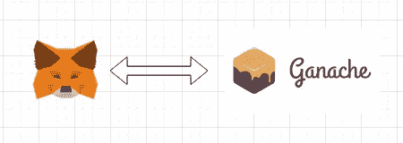

# 如何向一个 4 岁的孩子解释元面具

> 原文：<https://medium.com/coinmonks/how-to-explain-metamask-to-a-4-year-old-6444d60a0761?source=collection_archive---------11----------------------->

**Metamask** 是 crypto 中最流行的钱包。在这个故事中，我将解释什么是 metamask，以及如何以简单的方式将其与 Daap 集成。

[https://osync.io/posts/metamask-signing/](https://osync.io/posts/metamask-signing/)

**Metamask** 拥有超过 1000 万用户。它适用于以太坊和所有基于以太坊的区块链，如币安智能链或多边形。

元掩码存储用户的私钥。每个私钥都与一个公共以太坊地址相关联。私钥从不离开钱包，用于签署交易。该地址标识了一个帐户，可以显示给任何人。

*   用户使用 Daap 首先，Daap 的 html css 和 javascript 代码被加载到用户 web 浏览器中。
*   然后用户点击一个按钮来执行一些动作。
*   Daap 创建一个事务，用户使用元掩码弹出窗口确认该事务。
*   然后通过 metamask 将交易发送到以太坊。

要安装 metamask，请到 google chrome 商店搜索 metamask 扩展并安装它。之后，你应该会在你的扩展菜单中看到一个狐狸图标。当你第一次打开它时，它会要求你创建一个密码和一个新帐户。完成设置后，您将拥有几个带有相关私钥的地址。

如果您将 metamask 与像 ganache 这样的本地开发区块链联系起来，就需要注意一些问题。首先，将 ganache 的帐户与 metamask 同步会很有用。为此，您可以将 ganache 的助记短语导入元掩码。每次重启 ganache 时，请确保点击设置菜单中的重置帐户。如果你不这样做，你的交易将会失败。

在 Daap 的 javascript 代码中，您可能会使用像 web3 或 ethers 这样的库来集成。使用元掩码，这些库需要等待元掩码加载，以便它们可以连接到元掩码提供程序。您可以从头开始编写集成代码，但是很容易出错并触发竞争条件。此外，您可以使用一个库，例如:metamask detect provider 用于简单的应用程序，或者 web3 react 用于更强大的应用程序。

现在您知道什么是元掩码，以及如何将其与您的 Daap 集成。

> 加入 Coinmonks [电报频道](https://t.me/coincodecap)和 [Youtube 频道](https://www.youtube.com/c/coinmonks/videos)了解加密交易和投资

## 也阅读

 [## 杠杆代币[多头代币]终极指南

### 杠杆化令牌是具有杠杆化风险敞口的 ERC20 令牌，不考虑保证金、要求、管理…

medium.com](/coinmonks/leveraged-token-3f5257808b22)  [## 最佳加密交易所| 2021 年十大加密货币交易所

### 编辑描述

blog.coincodecap.com](https://blog.coincodecap.com/crypto-exchange)  [## 2021 年最佳加密借贷平台| 6 大比特币借贷平台

### 获得比特币和其他加密货币的最佳贷款利率

medium.com](/coinmonks/top-5-crypto-lending-platforms-in-2020-that-you-need-to-know-a1b675cec3fa)