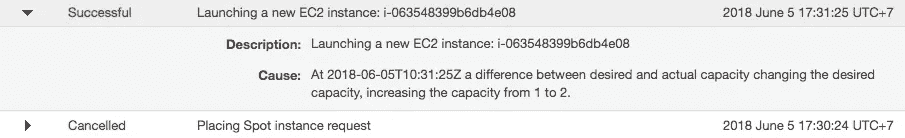

# 如何在 2 小时内以 10 美元的价格将整个 Ethereum Blockchain 导出到 CSV

> 原文：<https://medium.com/coinmonks/how-to-export-the-entire-ethereum-blockchain-to-csv-in-2-hours-for-10-69fef511e9a2?source=collection_archive---------0----------------------->

在我的上一篇文章[导出和分析 Ethereum Blockchain](/@medvedev1088/exporting-and-analyzing-ethereum-blockchain-f5353414a94e) 中，我介绍了 [Ethereum ETL](https://github.com/medvedev1088/ethereum-etl) 工具，并提供了将 Ethereum 数据导出到 CSV 文件并在 Amazon Athena 和 QuickSight 中进行分析的分步说明(也请阅读 Google BigQuery 上的[Ethereum block chain](/@medvedev1088/ethereum-blockchain-on-google-bigquery-283fb300f579))。

在本文中，我将向您展示如何使用 [AWS 数据管道](https://aws.amazon.com/datapipeline/)和 [AWS 自动缩放](https://aws.amazon.com/autoscaling)将导出过程并行化为几十个和几百个实例，并将导出时间减少到几个小时甚至几分钟，同时由于有了[EC2 Spot instance](https://aws.amazon.com/ec2/spot/)，可以保持低成本。

整个过程分为 4 个步骤:

*   增加 AWS 限额
*   准备自定义 AMI
*   创建数据管道
*   创建自动缩放组

## 增加 AWS 限额

AWS 维护每个帐户的服务限额，以帮助保证 AWS 资源的可用性，并最小化新客户的计费风险。当您使用 AWS 时，某些服务限制会随着时间的推移自动提高，尽管大多数 AWS 服务要求您手动请求提高限制。此过程可能需要几个小时或几天时间。

对于此任务，您需要增加:

*   数据管道中每个管道限制的对象:1000。*单个管道出口 400 万块以上，只需要增加即可。*
*   EC2 斑点实例:100。*如果您的账户是新账户，他们只会先将其增加到 20 个或更低。*

您可以在这里找到关于如何增加限额的详细说明[https://docs . AWS . Amazon . com/general/last/gr/AWS _ service _ limits . html](https://docs.aws.amazon.com/general/latest/gr/aws_service_limits.html)

## 准备自定义 AMI

此处列出了数据管道定制 AMI 的要求[https://docs . AWS . Amazon . com/Data Pipeline/last/developer guide/DP-custom-AMI . html](https://docs.aws.amazon.com/datapipeline/latest/DeveloperGuide/dp-custom-ami.html):

如果你运行的是 Ubuntu，你需要按照这些说明[创建一个名为`ec2-user`的账户【https://AWS . Amazon . com/premium support/knowledge-center/new-user-accounts-Linux-instance/】。](https://aws.amazon.com/premiumsupport/knowledge-center/new-user-accounts-linux-instance/)

您还需要将`ec2-user`添加到`sudoers`文件中。打开终端窗口并键入:

```
sudo visudo
```

在文件底部，键入以下内容:

```
ec2-user ALL=(ALL) NOPASSWD: ALL 
```

一些以太坊 ETL 相关的检查:

*   按照这里的说明安装 Geth[https://Geth . ether eum . org/docs/install-and-build/installing-Geth](https://geth.ethereum.org/docs/install-and-build/installing-geth)
*   确保系统上安装了 python 3.5 或更高版本，并且`python3`二进制文件在`PATH`中。
*   将以太坊 ETL 克隆到`/home/ec2-user/ethereum-etl`

```
> git clone [https://github.com/medvedev1088/ethereum-etl](https://github.com/medvedev1088/ethereum-etl)
> cd ethereum-etl
> pip3 install -e .
```

*   确保 geth 下载了您想要导出的块:

```
> geth attach 
> eth.syncing
{
  currentBlock: **5583296**,
  highestBlock: 5583377,
  knownStates: 65750401,
  pulledStates: 65729512,
  startingBlock: 5268399
}
```

*   确保 geth 在启动时启动。最简单的方法是将其添加到 crontab:

```
> echo "nohup geth --cache=1024 &" > ~/geth/start.sh && chmod +x ~/geth/start.sh
> crontab -e
@reboot  /home/ec2-user/geth/start.sh >>/home/ec2-user/geth/crontab.log 2>&1
```

*   下载并配置 DataPipeline TaskRunner。相关说明可以在这里找到[https://docs . AWS . Amazon . com/data pipeline/latest/developer guide/DP-how-task-runner-user-managed . html](https://docs.aws.amazon.com/datapipeline/latest/DeveloperGuide/dp-how-task-runner-user-managed.html)

下载完 jar 文件后，创建包含以下内容的`~/task-runner/start.sh`文件:

```
nohup java -jar /home/ec2-user/task-runner/TaskRunner-1.0.jar --config /home/ec2-user/task-runner/credentials.json --workerGroup=ethereum-etl --region=us-east-1 --logUri=s3://<your_bucket>/task-runner/logs --tasks 1 &
```

credentials.json 文件应该包含您的访问权限和可以访问 S3 存储桶的帐户的密钥:

```
{ "access-id":*"MyAccessKeyID"*, "private-key": *"MySecretAccessKey"* }
```

将其添加到 crontab:

```
chmod +x ~/task-runner/start.shcrontab -e
@reboot  /home/ec2-user/task-runner/start.sh >>/home/ec2-user/task-runner/crontab.log 2>&1
```

*   创建一个新的 AMI 并记住它的 ID。它将在下一步中使用。

## 创建数据管道

为了创建管道，我使用了对流层[https://github.com/cloudtools/troposphere](https://github.com/cloudtools/troposphere)，这是一个 Python 库来创建 AWS 云结构描述。

*   克隆以太坊导出管道:

```
> git clone [https://github.com/medvedev1088/ethereum-export-pipeline](https://github.com/medvedev1088/ethereum-export-pipeline)
> cd ethereum-export-pipeline
```

*   编辑文件`config.py`并修改您想要导出的块范围。默认情况下，将导出前 500 万个块:

*   生成 CloudFormation 模板文件:

```
> python3 generate_export_pipeline_template.py --output export_pipeline.template
```

*   登录 https://console.aws.amazon.com/cloudformation/home?弗吉尼亚州的云形成控制台地区=美国东部-1
*   通过指定生成的`export_pipeline.template`文件创建新的堆栈。您需要更改将上载 CSV 文件的存储桶名称。您也可以自定义**命令**字段，例如，如果您只需要导出块、交易或 ERC20 传输，您可以删除部分脚本。


*   登录弗吉尼亚州北部[https://console.aws.amazon.com/datapipeline/home](https://console.aws.amazon.com/datapipeline/home)的数据管道控制台，确保管道已创建。您可以在建筑师视图中看到它。


创建管道后，它将等待工人开始运行活动。

## 创建自动缩放组

*   登录您所在地区的自动缩放控制台[https://console.aws.amazon.com/ec2/autoscaling/home](https://console.aws.amazon.com/ec2/autoscaling/home)
*   **创建启动配置:**
*   选择您在上一步中创建的 AMI。
*   选择`t2.medium`实例类型。(正如 AusIV 在此指出的[https://www . Reddit . com/r/ethdev/comments/8oyjz8/how _ export _ the _ all _ ether eum _ 区块链 _ to/](https://www.reddit.com/r/ethdev/comments/8oyjz8/how_to_export_the_entire_ethereum_blockchain_to/)可能是一个更好的选择，如果您尝试了，请告诉我)
*   在配置详细信息页面上，选中**请求现货实例**框，并指定您愿意支付的最高价格。它还会向您显示所选实例类型的当前现货价格。在我创作 ASG 的时候，现货价格比点播价格低 3 倍。


*   选择安全组并继续创建向导。
*   **创建自动缩放组:**
*   选择您在上一步中创建的启动配置。
*   指定组大小—您希望并行导出多少个 CSV 实例。
*   继续执行向导。

创建 ASG 后，您可以在“活动历史记录”选项卡中看到它启动新实例:



您可以检查您的数据管道，在数据管道控制台的**执行详细信息**页面的实例上开始运行活动，为您提供所有的详细信息和日志:


每个实例一次将运行 10 个活动，不幸的是这个数字是不可定制的。

CSV 文件将位于您在创建管道时指定的 S3 桶中。

该过程完成后，您需要手动删除自动缩放组和数据管道堆栈。

您可能希望将 CSV 转换为 Parquet，以优化查询性能。你可以在这里找到说明:[将以太坊 ETL 文件转换成拼花](/@medvedev1088/converting-ethereum-etl-files-to-parquet-399e048ddd30)

另请参阅:

*   [如何在 BigQuery 中查询所有以太坊地址的余额](/google-cloud/how-to-query-balances-for-all-ethereum-addresses-in-bigquery-fb594e4034a7)
*   [实时以太坊免费通知大家](/google-cloud/real-time-ethereum-notifications-for-everyone-for-free-a76e72e45026)
*   [big query 中的以太坊:我们如何构建这个数据集](https://cloud.google.com/blog/products/data-analytics/ethereum-bigquery-how-we-built-dataset)
*   在推特上关注我们:[https://twitter.com/EthereumETL](https://twitter.com/EthereumETL)