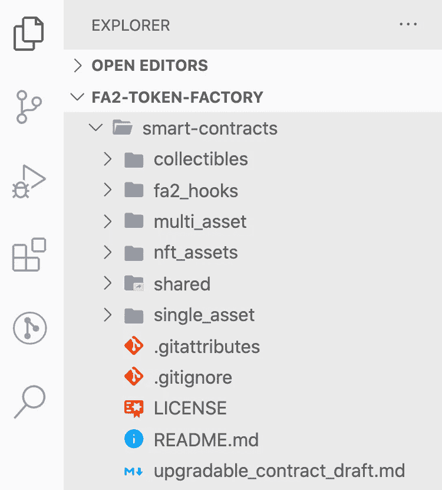
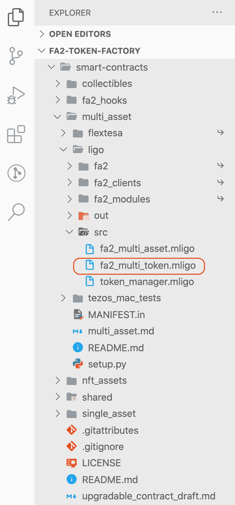
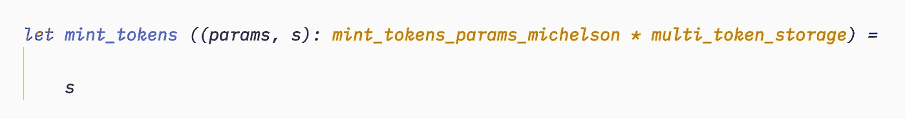
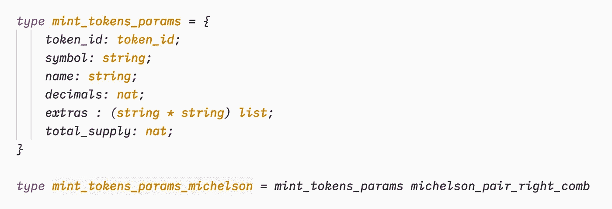
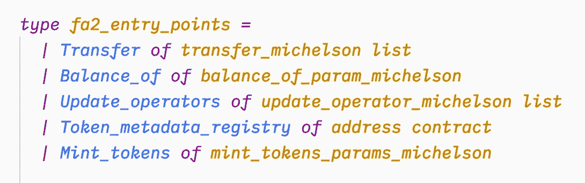
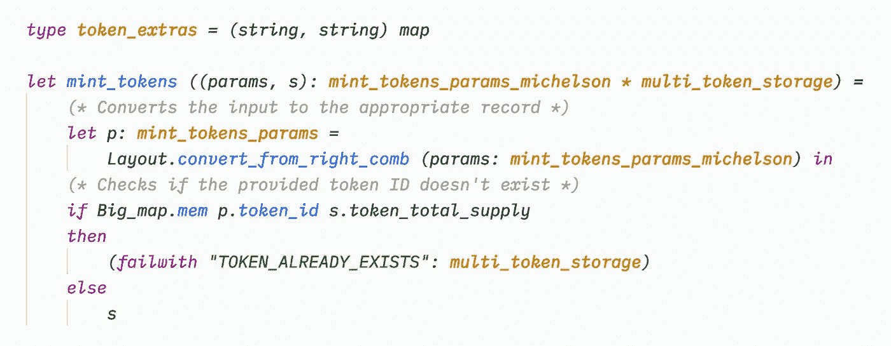
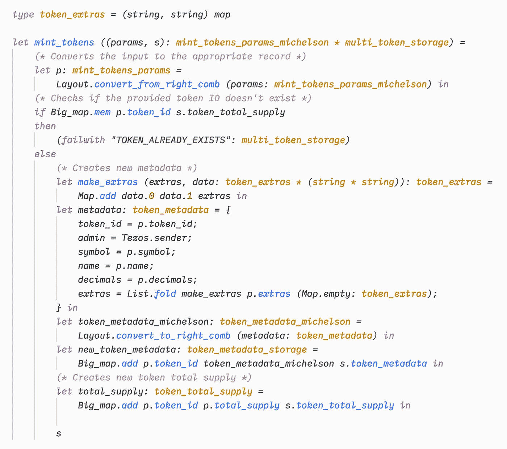
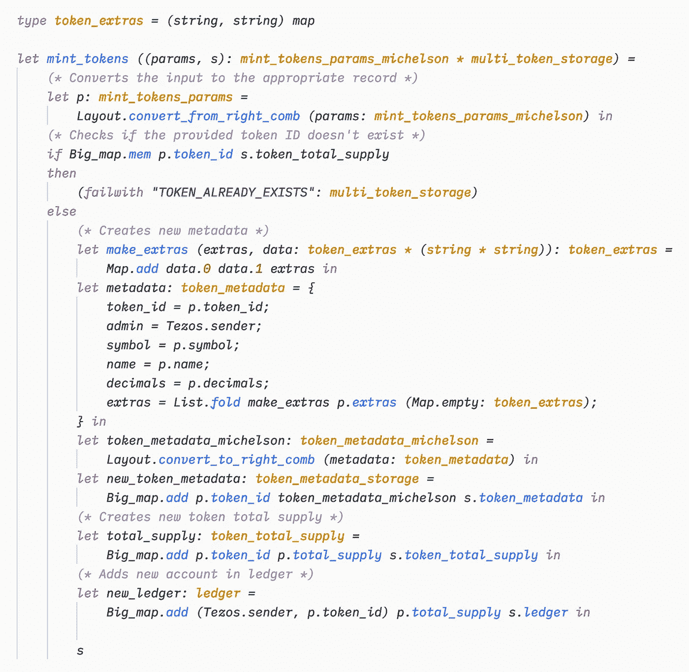
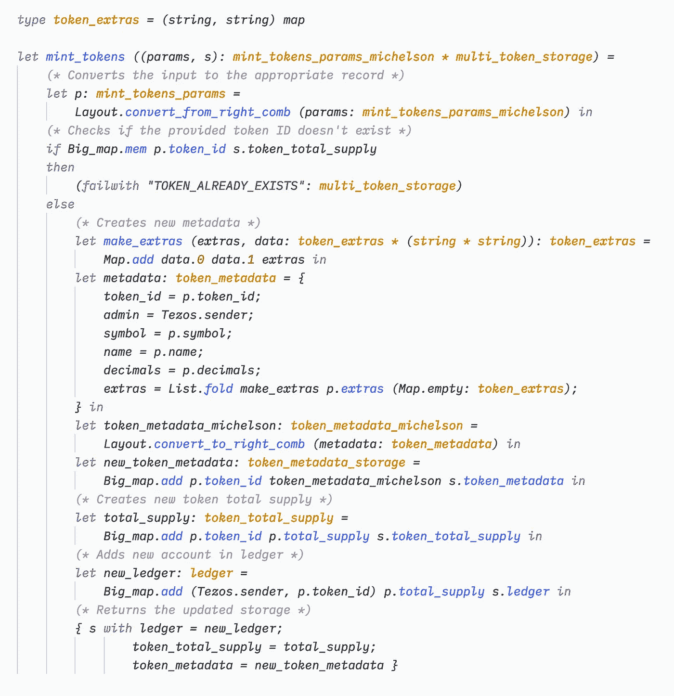

# 如何延长卡米莱戈的 FA2 合同

> 原文：<https://medium.com/coinmonks/how-to-extend-an-fa2-contract-in-cameligo-a673858cbe2b?source=collection_archive---------3----------------------->

## 如何在 FA2 合同中添加额外功能的快速教程


Image from [Pixabay](https://pixabay.com/photos/dawn-desert-sunset-panoramic-3291444/)

我决定在周末做一个小项目，尝试一下由 [TQ Tezos](https://github.com/tqtezos/smart-contracts) 提供的合同的更新版本。这些合约根据 TZIP-12 标准实现了 FA2 合约的基本特征。所以我煮了些咖啡，打开 VSCode，开始钻研用 CameLigo 写的代码(现在，Ligo 的新 [VSCode 扩展使整个事情变得容易多了，它允许在编辑器中突出显示语法)。当我在阅读它的时候，我觉得记录下延长 FA2 合同或者任何与 Ligo 签订的合同所涉及的思维过程和不同步骤会很有趣。事实证明，这比您想象的要容易得多，如果您首先仔细观察代码，那么只需少量的调试就可以成功。](https://marketplace.visualstudio.com/items?itemName=ligolang-publish.ligo-vscode#overview)

对于这个简短的教程，我们将通过添加一个“mint”函数来创建新的令牌，从而扩展**多资产**契约(FA2 标准没有描述创建令牌的唯一方式，这由开发人员自行决定)。这通常是您在自己实现令牌时想要做的事情。

所以也去买些咖啡，和我一起去☕️

# 下载存储库

首先，我们必须下载代码。转到 TQ Tezos 的[FA2 合同实施，点击带有“代码”的绿色按钮并复制 URL。接下来，创建一个新的文件夹，打开一个新的终端或 iTerm 窗口，键入`git clone` +你刚刚复制的 URL。下载应该需要几秒钟。然后，在 VSCode 中打开该文件夹，它应该看起来像这样:](https://github.com/tqtezos/smart-contracts)



The repo structure

在本教程中，我们将进入 **multi_asset** 文件夹，但是正如你所看到的，这个库包含了你可以使用的其他种类的 FA2 合同。现在，导航到**多资产** > **ligo** 。



您会发现一个名为“ *fa2_multi_token.mligo* ”的文件。这是我们要检查的第一个。在文件的底部，您可以找到下面带有伪入口点的`fa2_main`“真实”入口点。在文件的开头，您可以看到存储结构:

```
type multi_token_storage = {
    ledger : ledger;
    operators : operator_storage;
    token_total_supply : token_total_supply;
    token_metadata : token_metadata_storage;
}
```

这定义了`ledger`(保存地址/余额对的地方)、`operators`(允许谁代表谁传送令牌)、`token_total_supply`和`token_metadata`(提供关于每个令牌的更多信息)。

# 收集有关合同的信息

在开始编写代码之前，我们必须停下来，观察一下我们正在处理的契约的结构。事实上，制造令牌意味着向契约中添加新数据，因此我们必须理解契约如何存储和操作其数据。先检查一下储物吧！

分类帐(存储地址及其余额的地方)具有以下结构:

```
type ledger = (**(address * token_id)**, **nat**) big_map
```

这是一个大地图，它的键是成对的`address`和`token_id`(T5 本身是一个`nat`值)，它们的值是`nat`。现在我们知道余额将由它们的所有者的地址和它们所引用的令牌 ID 来标识。

```
type token_total_supply = (**token_id**, **nat**) big_map
```

`token_total_supply`也是一个大映射，其中键是令牌 ID(一个`nat`值)，值是`nat`。这是有意义的，因为我们正在处理一个可以同时存储和操作多个可替换令牌的契约。

我们还可以看看契约如何存储令牌元数据:

```
type token_metadata_storage = (**token_id**, **token_metadata_michelson**) big_map
```

这也是一个大图，其中令牌 ID 用于匹配元数据。`token_metadata_michelson`类型只是从 *fa2_interface.mligo* 中的记录转换而来的:

```
type **token_metadata** = {
    token_id : token_id;
    symbol : string;
    name : string;
    decimals : nat;
    extras : (string, string) map;
}type **token_metadata_michelson** = 
    **token_metadata** michelson_pair_right_comb
```

如您所料，令牌元数据非常标准，但是我们必须考虑到这样一个事实，即它们在被存储之前被转换为迈克尔逊类型。我们还将添加一个新字段`admin : address`，我们将在其中保存令牌创建者的地址。

# 建立合同

是时候写一些代码了👨‍💻

根据你想从代币制造者那里得到的行为，你将有很多不同的选择来铸造代币。在本教程中，我们将允许任何人创造和铸造限量供应的新代币。

让我们首先在 **fa2** 文件夹中创建一个名为" *mint_tokens.mligo"* 的新的空文件，并编写函数声明:



这是一个简单的函数，只返回存储，现在，这将帮助我们在开始编写内部逻辑之前测试设置。

该函数接受一个类型为`mint_tokens_params`的参数，该参数包含我们创建新令牌所需的不同值。我们将在 *fa2_interface.mligo* 文件中创建这个类型。将新类型小心地放入文件中很重要，这样就可以访问以前声明的类型。我们将把它放在`type fa2_entry_points =`之前:



我们将需要上面的所有细节来创建一个新的令牌，我们将它转换成一个迈克尔逊对，以加强正确的结构(否则这可能会导致意外的行为)。

现在让我们添加新的入口点 **Mint_tokens** ，因为入口点的类型如下:



让我们回到`mint_tokens`功能！

# 铸造代币

让我们暂停一分钟来思考一下铸造函数将要实现什么。它接收`mint_tokens_params`中描述的所有参数，并更新存储器的`ledger`、`token_total_supply`和`token_metadata`部分。用户将传递令牌 ID，契约将验证它是否已经存在，并将使用所有提供的数据创建它。

因此，首先，让我们检查一下契约中是否不存在令牌 ID:



> 注意:在开发过程中，我通常在最后返回期望值，这样解释器就不会返回关于这个值的错误，而是专注于代码中的错误。你也可以自由地一次性写出整个函数，然后一步一步地调试。

我们使用`Big_map.mem`来确定令牌 ID 是否已经不存在于`token_total_supply`大图中。如果是这样，合同就失效了。否则，它继续创建令牌。

现在我们已经检查了令牌 ID，让我们创建元数据:


首先，你可能会注意到我们在上面创建了一个新的类型，这将使我们的代码更加清晰。对于元数据，我们将用从参数中收集的信息填充一个`token_metadata`记录。我们添加新的令牌 ID 和各种细节，如令牌的符号和名称。我们还添加了`Tezos.sender`地址作为令牌的管理员。`extras`字段有点特殊:我们让用户传递一个包含 2 个字符串的元组列表来填充`extras`字段，但最终，这个字段是一个映射，所以我们使用`List.fold`和`make_extras`函数遍历列表并创建我们需要的`extras`映射。

创建记录后，在将新的令牌元数据添加到存储的`token_metadata`字段之前，我们将其转换为正确的结构(因为存储需要它)。

接下来，我们创建新的令牌供应:



如果您还记得前面的内容，总供应量是一个大图，其中的键表示令牌 ID，值表示其总供应量，因此我们只需用令牌 ID 和总供应量更新我们的`token_total_supply`大图。

对于更新存储的最后一步，我们在分类帐中添加新账户，并注明总供应量:



最后，我们可以返回更新后的存储:



这里没有什么复杂的，我们用新的分类帐、新的令牌供应大图和新的令牌元数据大图返回存储。

就是这样！你已经成功地延长了与铸造功能🥳的 FA2 合同

# 包裹

延长现有合同似乎总是一项令人生畏的任务，你必须小心地插入代码而不破坏任何东西。然而，这并不是必须的，它实际上非常简单。您只需观察代码的构造方式，并使用现有的类型或值来创建您自己的代码。把你的`#include`陈述放在正确的位置，然后你就可以开始了，你创造了一份新的合同！现在可能性是无限的！

# 感谢

如果没有 Eugene Mishura 在 [TQ Tezos 库](https://github.com/tqtezos/smart-contracts)的工作，本教程是不可能完成的，在那里，他精心设计的合同让其他开发人员节省了大量时间！

## 另外，阅读

*   最好的[密码交易机器人](/coinmonks/crypto-trading-bot-c2ffce8acb2a)
*   [密码本交易平台](/coinmonks/top-10-crypto-copy-trading-platforms-for-beginners-d0c37c7d698c)
*   最好的[加密税务软件](/coinmonks/best-crypto-tax-tool-for-my-money-72d4b430816b)
*   [最佳加密交易平台](/coinmonks/the-best-crypto-trading-platforms-in-2020-the-definitive-guide-updated-c72f8b874555)
*   最佳[加密贷款平台](/coinmonks/top-5-crypto-lending-platforms-in-2020-that-you-need-to-know-a1b675cec3fa)
*   [最佳区块链分析工具](https://bitquery.io/blog/best-blockchain-analysis-tools-and-software)
*   [加密套利](/coinmonks/crypto-arbitrage-guide-how-to-make-money-as-a-beginner-62bfe5c868f6)指南:新手如何赚钱
*   最佳[加密制图工具](/coinmonks/what-are-the-best-charting-platforms-for-cryptocurrency-trading-85aade584d80)
*   [莱杰 vs 特雷佐](/coinmonks/ledger-vs-trezor-best-hardware-wallet-to-secure-cryptocurrency-22c7a3fd391e)
*   了解比特币的[最佳书籍有哪些？](/coinmonks/what-are-the-best-books-to-learn-bitcoin-409aeb9aff4b)
*   [3 商业评论](/coinmonks/3commas-review-an-excellent-crypto-trading-bot-2020-1313a58bec92)
*   [AAX 交易所审核](/coinmonks/aax-exchange-review-2021-67c5ea09330c) |推荐代码、交易费用、利弊
*   [Deribit 审查](/coinmonks/deribit-review-options-fees-apis-and-testnet-2ca16c4bbdb2) |选项、费用、API 和 Testnet
*   [FTX 密码交易所评论](/coinmonks/ftx-crypto-exchange-review-53664ac1198f)
*   [n 零审核](/coinmonks/ngrave-zero-review-c465cf8307fc)
*   [Bybit 交换审查](/coinmonks/bybit-exchange-review-dbd570019b71)
*   [3Commas vs Cryptohopper](/coinmonks/cryptohopper-vs-3commas-vs-shrimpy-a2c16095b8fe)
*   最好的比特币[硬件钱包](/coinmonks/the-best-cryptocurrency-hardware-wallets-of-2020-e28b1c124069?source=friends_link&sk=324dd9ff8556ab578d71e7ad7658ad7c)
*   最佳 [monero 钱包](https://blog.coincodecap.com/best-monero-wallets)
*   [莱杰纳米 s vs x](https://blog.coincodecap.com/ledger-nano-s-vs-x)
*   [bits gap vs 3 commas vs quad ency](https://blog.coincodecap.com/bitsgap-3commas-quadency)
*   [莱杰纳米 S vs 特雷佐 one vs 特雷佐 T vs 莱杰纳米 X](https://blog.coincodecap.com/ledger-nano-s-vs-trezor-one-ledger-nano-x-trezor-t)
*   [block fi vs Celsius](/coinmonks/blockfi-vs-celsius-vs-hodlnaut-8a1cc8c26630)vs Hodlnaut
*   Bitsgap 评论——一个轻松赚钱的加密交易机器人
*   为专业人士设计的加密交易机器人
*   [PrimeXBT 审查](/coinmonks/primexbt-review-88e0815be858) |杠杆交易、费用和交易
*   [埃利帕尔泰坦评论](/coinmonks/ellipal-titan-review-85e9071dd029)
*   [赛克斯·斯通评论](https://blog.coincodecap.com/secux-stone-hardware-wallet-review)
*   [BlockFi 审查](/coinmonks/blockfi-review-53096053c097) |赚取高达 8.6%的加密利息