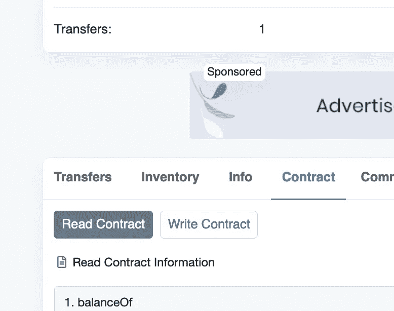

# 如何在 IPFS 找到你的 NFT

> 原文：<https://medium.com/coinmonks/how-to-find-your-nft-on-ipfs-e51bc5e7c8a1?source=collection_archive---------1----------------------->

*Selected work from TIMEPieces, a community initiative launched by Time.com on 9/23/21.*

所以你最近变成了一个 NFT，但你还看不到它，因为在高需求下，OpenSea 渲染元数据非常慢。在某些情况下，你也许可以将你的钱包连接到 [Rarible](http://rarible.com) 上，它也许可以在那里进行渲染。

如果没有，下面以 [**时计**](https://time.com/collection/timepieces-nft/) drop 为例，告诉你如何找到你的 NFT 的真实样子。

# 第一步。找到铸造智能合同

在您的 OpenSea(“OS”)个人资料页面上，找到未渲染的感兴趣的 NFT，然后转到页面的详细信息部分。这应该显示合同地址用于铸造你的 NFT。应该是超链接的。点击它！

Figure 1: Note your Token ID, and the Contract Address

或者，你可以直接进入以太坊交易——在操作系统上查看交易历史，或者在以太坊扫描上进入你的账户(例如[https://etherscan.io/{0x…..your](https://etherscan.io/{your)-以太坊-公钥})。某个地方会有一个链接，显示你的 NFT 铸造合同。

# 第二步。查找您的 NFT 元数据

现在我们在 Etherscan 上，导航到“合同”选项卡，并点击“阅读合同”。

Figure 2

这将显示一个函数列表，您可以使用 Etherscan 接口轻松查询这些函数。寻找一个名为“tokenURI”的函数。在“令牌 Id”字段中输入您的 NFT 令牌 ID。您应该能够在您的 NFT 的 OpenSea properties 字段中看到这个 id(参见图 1)。

Figure 3

正如你在上面看到的，在点击大的“查询”按钮后，合同返回如下结果:

*ipfs://qmygefqtrkwvnz 6 u 7 GfK 9 hddh 55 bbabyvyc 16 tf1 zx 658/69*

复制“ipfs://”后的所有内容

我已经将“*qmygefqtrkwvnz 6 u 7 GfK 9 hddh 55 bkabyvyc 16 tf1 zx 658/69*”复制到我的剪贴板中。

# 第三步。插入 IPFS 的网址

导航到下面的 ipfs.io/ipfs/{The-chunk-we-copied-above}.示例:

*https://ipfs . io/ipfs/qmygefqtrkwvnz 6 u 7 GfK 9 hddh 55 bbabyvyc 16 tf1 zx 658/69*

这应该会将您直接带到您的 NFT，或者是带有 NFT 元数据的页面。在我们的例子中，我们被带到一个页面，其中有很多关于我们的 NFT 的不同元数据。还没有图像！

Figure 4

无论我们期望我们的 NFT 是视频、gif 还是静态 jpeg，最后一步都是一样的。在“ipfs://”的后面复制文本**，就像我们在步骤 2 中所做的那样，用于图像字段(在图 4 中突出显示)。这是我们将需要带我们到图像在 IPFS 网络上的位置的 url。**

然后，简单地导航到:
ipfs.io/ipfs/{the-text-we-just-copied}喜欢这样:

*ipfs.io/ipfs/QmR36VFfo1hH2RAwVs4zVJ5btkopGip5cW7ydY4jUQBrKW*

# 第四步。瞧啊。

The NFT we’ve been waiting for! P.S. this is not my NFT.

如果它是一个视频，并且不能很好地加载到你的机器上(我就是这种情况)，你可以右键单击并选择“将视频另存为”——或者你的浏览器的等效选项。

希望这能帮你理清一些事情，让你更容易发现你的 NFT 是什么样子的！在以后的文章中，我希望更多地讨论什么是 IPFS，以及我所看到的一些陷阱，它是当今用来存储大多数 NFT 的主要网络。

我叫丹，是区块链的工程师。在 twitter @DanKazenoff 上关注我，获得我在加密领域经常遇到的最新消息。本博客上的观点是我个人的，当然，我的任何内容都不构成财务建议。感谢阅读！

> 加入 Coinmonks [电报频道](https://t.me/coincodecap)和 [Youtube 频道](https://www.youtube.com/c/coinmonks/videos)获取每日[加密新闻](http://coincodecap.com/)

## 另外，阅读

*   [密码电报信号](http://Top 4 Telegram Channels for Crypto Traders) | [密码交易机器人](/coinmonks/crypto-trading-bot-c2ffce8acb2a)
*   [复制交易](/coinmonks/top-10-crypto-copy-trading-platforms-for-beginners-d0c37c7d698c) | [加密税务软件](/coinmonks/crypto-tax-software-ed4b4810e338)
*   [网格交易](https://coincodecap.com/grid-trading) | [加密硬件钱包](/coinmonks/the-best-cryptocurrency-hardware-wallets-of-2020-e28b1c124069)
*   [最佳加密交易所](/coinmonks/crypto-exchange-dd2f9d6f3769) | [最佳加密交易所](/coinmonks/bitcoin-exchange-in-india-7f1fe79715c9)
*   开发人员的最佳加密 API
*   最佳[密码借贷平台](/coinmonks/top-5-crypto-lending-platforms-in-2020-that-you-need-to-know-a1b675cec3fa)
*   杠杆代币的终极指南
*   [最适合加密交易的 VPN](https://coincodecap.com/best-vpns-for-crypto-trading)
*   [最佳加密分析或链上数据](https://coincodecap.com/blockchain-analytics) | [Bexplus 评论](https://coincodecap.com/bexplus-review)
*   [NFT 十大市场造币集锦](https://coincodecap.com/nft-marketplaces)
*   [AscendEx Staking](https://coincodecap.com/ascendex-staking)|[Bot Ocean Review](https://coincodecap.com/bot-ocean-review)|[最佳比特币钱包](https://coincodecap.com/bitcoin-wallets-india)
*   [Bitget 回顾](https://coincodecap.com/bitget-review)|[Gemini vs block fi](https://coincodecap.com/gemini-vs-blockfi)|[OKEx 期货交易](https://coincodecap.com/okex-futures-trading)