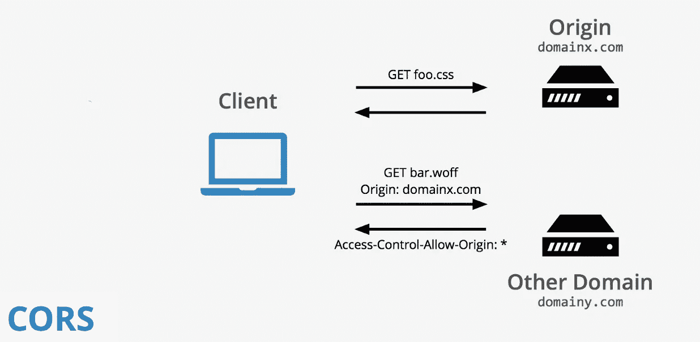

# 如何修复 CORS 网络服务器错误

> 原文：<https://medium.com/coinmonks/how-to-fix-cors-web-server-error-6c2c55938f95?source=collection_archive---------0----------------------->

> **Clojure 网络服务器**

跨源资源共享( [CORS](https://developer.mozilla.org/en-US/docs/Glossary/CORS) )是一种机制，它使用额外的 [HTTP](https://developer.mozilla.org/en-US/docs/Glossary/HTTP) 报头来告诉浏览器，让在一个源(域)上运行的 web 应用程序有权访问来自不同源的服务器的选定资源。当一个 web 应用程序请求一个不同来源(域、协议和端口)的资源时，它会发出一个**跨来源 HTTP 请求**。

在本文中，我将展示如何在我的例子中修复 Clojure 后端 web 服务器和 Angular web 应用程序前端之间的`Access-Control-Allow-Origin`错误。

> **什么是 Clojure？**

Clojure 是一种动态的通用编程语言，将脚本语言的易用性和交互式开发与多线程编程的高效且健壮的基础设施结合在一起。Clojure 是一种编译语言，但仍然是完全动态的——clo jure 支持的每个特性在运行时都是受支持的。Clojure 提供了对 Java 框架的简单访问，带有可选的类型提示和类型推断，以确保对 Java 的调用可以避免反射。

Clojure 是 Lisp 的一种方言，与 Lisp 共享代码作为数据的理念和强大的宏系统。Clojure 主要是一种函数式编程语言，具有丰富的不可变的持久数据结构。当需要可变状态时，Clojure 提供了软件事务内存系统和反应式代理系统，确保干净、正确的多线程设计。

> **什么是服务器？【简单英语】**

服务器只是一台具有更高性能(处理速度和存储能力)的计算机，它存储各种类型的信息或数据。然后将这些数据或信息提供给连接到互联网的其他计算机。

个人文件和数据存储在个人电脑中。服务器可能会存储构成网站、数据库的文件以及其他需要共享的数据。虽然个人计算机可能会被打开和关闭，但服务器始终保持运行，以确保数据的可用性(数据或网站始终可供用户使用和访问)。

个人计算机被设计用于人与计算机的联系(输入/输出接口、图形用户界面等)，服务器被设计用于计算机与计算机的联系。

虽然几乎任何满足最低硬件要求的**电脑**都可以运行**服务器**操作系统，但仅此一点并不能使台式**电脑**成为真正的**服务器**。相反，**服务器**管理所有网络资源。**服务器**通常是专用的(意味着除了**服务器**任务之外，它不执行其他任务)。

> **网络服务器**是指专用于运行所述软件的服务器软件或硬件，可以向万维网提供内容。web 服务器通过 HTTP 协议处理传入的网络请求。

# 如何将环形中间件 CORS 添加到基于环形适配器 jetty 的项目中？

如果您正在开发一个 Clojure web 服务器项目，那么当您试图从一台计算机而不是另一个域上的本地计算机访问您的 API 端点时，您肯定会遇到 CORS 错误。几周前，我用 Clojure 创建并安装了一个后端 web 服务器。

我在我的 Compojure API 项目中使用了环形适配器 jetty 服务器。我将环中间件 CORS 添加到我的项目中。我将展示我是如何在我的项目中添加环中间件 CORS 的。

我的 Clojure 后端服务器在前端的`localhost:3000`上运行，我的 Angular web 应用程序在前端的`localhost:4200`上运行。这个概念是，点击前端 web 应用程序的一个按钮，一个`POST — GET — DELETE`请求将被发送到后端的不同 API 端点，并执行适当的操作，包括添加、显示或删除在 Web 服务器上建立的数据库中的数据。

> 然而，从我的前端发出的每个请求都会导致以下错误: `**No 'Access-Control-Allow-Origin' header is present on the requested resource. Origin 'http://localhost:4200' is therefore not allowed access. The response had HTTP status code 404.**`

有几种方法可以解决这个问题，有些人会在他们的 chrome 浏览器中添加一个 CORS 扩展，但当试图从不同的计算机或网络浏览器访问网络服务器时，问题仍然存在。修复这个错误的最好方法是在我的后端 web 服务器中定义适当的 CORS。我通过在我的 Compojure 路由上添加包装器实现了这一点，如下所示:

上面的代码是我的项目文件的中间件代码部分。在代码上， **allow-cross-origin** 是一个中间件函数，它允许来自浏览器的跨 origin 请求，并完成所有的功能。当浏览器试图从不同的域调用 API 时，它首先发出一个选项请求，以查看服务器的跨源策略。因此，在这个方法中，当发出选项请求时，我们返回它。

此外，对于非选项请求，我们只需要返回“Access-Control-Allow-Origin”头，否则浏览器将无法正确读取数据。以上注释都是基于 Chrome 的工作原理。

> 关于这个项目代码的更多细节，查看我的 [**GitHub**](https://github.com/YannMjl/web-server-clojure) 资源库。
> 
> 如果你喜欢这篇文章，你可能也会喜欢“ [**如何部署 Angular Web App**](/coinmonks/how-to-deploy-an-angular-app-8db1af39f8c1) ”

> 请给它一些掌声以示支持，并对我可能遗漏的内容发表评论。干杯！！！！