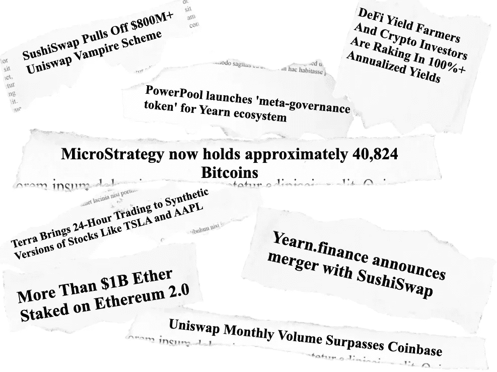

# 如何跟踪加密新闻

> 原文：<https://medium.com/coinmonks/how-to-follow-crypto-news-94a35c06e41c?source=collection_archive---------2----------------------->

根据您对加密领域的了解程度，您可能对过去 180 天内发生的部分或全部事情很熟悉:

这些天来，我每天花几个小时“插上”加密新闻。有太多的东西可以读、听、看或尝试。我整理了一份指南，力求成为一份全面的加密新闻指南。

我采取自上而下的方法，从鸟瞰新闻来源开始，到几乎每个社交媒体平台上的生态系统。每个生态系统实际上都很丰富，所以我试着去捕捉每个生态系统的情况。

# 普通加密新闻

## 遵循金融出版物的区块链部分

[**【福布斯】**](https://www.forbes.com/crypto-blockchain/)[**美国消费者新闻与商业频道**](https://www.cnbc.com/blockchain/)[**彭博**](https://www.bloomberg.com/crypto) 都有专门介绍区块链的章节。

他们对区块链行业提供了非常有见地的观点，但在许多方面只是冰山一角，在事后解释了主要的价格变动。

这里有一个有趣的图表来说明我的意思。下面是来自商业酒吧(福布斯、美国消费者新闻与商业频道和彭博)的加密标题的单词，以及来自加密酒吧的标题。

你可以与图表互动，可以做出一些有趣的观察——但主要的一点是，加密酒吧涵盖了更多的细节。

Made from a week’s worth of news from the publications mentioned

## 加密出版物

实际上有很多加密出版物，新的出版物不断涌现，那么您应该关注哪些呢？我试图用一种客观的方式来选择他们，所以这里有一个最受欢迎的加密酒吧的列表，是根据一年来对加密子网站的评论数量来衡量的。(我认为评论是衡量参与度的最佳标准，而不是帖子)

*根据一年的 reddit 股票价值排名，按评论数量排序*

1.  [**解密**](https://decrypt.co/)
2.  medium.com——这不是一本真正的出版物，而是许多出版物的集合。媒体上确实有很多秘密新闻——稍后会详细介绍——既有针对具体项目的博客，也有诸如 [**coinmonks**](https://medium.com/coinmonks) 之类的秘密出版物
3.  [**硬币电报**](https://cointelegraph.com/)
4.  [**coindesk**](https://www.coindesk.com/)
5.  [**www.forbes.com**](http://www.forbes.com)
6.  ****——一大堆价格谈资****
7.  ****[**coinrivet.com**](https://coinrivet.com/)****
8.  ****[**dailyhodl.com**](https://dailyhodl.com/)****
9.  ****[**beincrypto**](https://beincrypto.com/)****
10.  ****[【news.bitcoin.co】](https://news.bitcoin.com/)**米******
11.  ****[**www.bloomberg.com**](http://www.bloomberg.com)****
12.  ****[隐板岩 ](https://cryptoslate.com/)****
13.  ****[**www.cnbc.com**](http://www.cnbc.com)****
14.  ****[**blog.coinbase.com**](https://blog.coinbase.com/)—比特币基地的博客。他们不会发布太多消息，但会受到广泛关注，并能影响市场****
15.  ********

## ******加密推特******

******CryptoTwitter 是一个迷人的社区，也是一个巨大的信息来源。你会发现引人入胜的见解、论点和迷因。这是一个加密 Twitter 的视图，分为不同的组。******

******单击一个组以放大:******

******Twitter accounts are collected based lists from [Consensys](https://consensys.net/blog/trending/i-read-crypto-twitter-for-hours-daily-here-are-the-40-accounts-that-really-matter/), [Crypto Posters](https://www.cryptocurrencyposters.com/best-crypto-twitter-accounts-follow/), [CoinGecko](https://www.coingecko.com/buzz/10-crypto-twitter-accounts-to-follow-for-defi), [Superorder](/superorder/10-crypto-twitter-accounts-to-follow-right-now-f9c803d47c32), and [coinme](https://coinme.com/10-crypto-twitter-accounts-everyone-should-follow/)******

******如果你想关注这些账户，你可以点击查看列表******

## ******Reddit******

******以下是一般加密子字段的列表。这里列出的那些是活跃的，并且适度的。******

******[**r/CryptoCurrency**](https://www.reddit.com/r/CryptoCurrency/)**—官方消息来源为 CryptoCurrency，讨论&分析。********

******[**r/ethtrader**](https://www.reddit.com/r/ethtrader/)——社区驱动的以太坊新闻、迷因、投资、交易、杂项市场相关主题和其他相关技术的 sub。******

****[**r/crypto MoonShots**](https://www.reddit.com/r/CryptoMoonShots/)—讨论可能成为潜在 moon shots 的低市值加密货币的地方。****

****[**r/crypto markets**](https://www.reddit.com/r/CryptoMarkets/)**—加密货币外汇社区******

******[**r/Crypto _ Currency _ News**](https://www.reddit.com/r/Crypto_Currency_News/)—新闻的加密订阅******

****[**【r/defi】**](https://www.reddit.com/r/defi/)**—sub 致力于围绕分权财政发展的所有事情******

******[**r/加密货币**](https://www.reddit.com/r/CryptoCurrencies/) —类似 r/加密货币，但没有那么严格的审核规则******

## ****播客****

****另一个在潜在的多任务处理中赶上市场的好方法是听播客。在 crypto 空间有一些非常高质量的，对热门话题有很深入的讨论，或者对 crypto 创始人的采访。****

*   ****[**未经证实的**](https://unconfirmed.libsyn.com/) 和 [**未被解放的**](https://unchainedpodcast.com/) 由美国《福布斯》前资深编辑劳拉·申主持****
*   ******(连锁反应)——由研究门户网站 Delphi Research 发布的播客，对一些最热门的项目进行了高质量的采访******
*   ******[**震中**](https://epicenter.tv/)**——一个从 2013 年开始谈论 DeFi 的播客，在它被称为 DeFi 之前，由一个杰出的团队主持********
*   ******[**进入以太**](https://podcast.ethhub.io/)——探索以太坊生态系统的 ETHHub 官方播客******
*   ****[**飘渺播客**](https://www.etherealsummit.com/podcast)——来自飘渺峰会背后的团队，由 DefiDad 主持****
*   ****[**阿贝尔摘要**](https://anchor.fm/abelsabstracts)**——由 ETHGlobal 组织者和 Consensys 校友阿贝尔·谭德塞主持，采访 web 3.0 和 defi 的建设者******
*   ******[**怀尔会谈**](https://wyre-talks.simplecast.com/) —与顶尖 defi 项目的双周访谈******
*   ****[**block crunch**](https://blockcrunch.libsyn.com/)**——由 Spartan Capital 研究主管 Jason Choi 主持，专注于服务对加密货币和区块链感兴趣的投资者******
*   ******[**风险投资家**](https://www.venturecoinist.com/podcast)——一个面向密码交易员的播客，以采访行业领袖为特色******

****你可以在这里 收听这些播客 [**。**](https://coinfeeds.io/podcasts)****

## ****油管（国外视频网站）****

****还有一个很大的加密 YouTube 场景。我做了一个非常全面的搜索，发现了 173 个英语加密 YouTube 频道。以下是前 10 名的订阅者。****

*****包含关键词区块链、加密货币、比特币、以太坊或去中心化金融的 YouTube 账户，按订阅人数排序。*****

1.  ****[**数据 dash**](https://www.youtube.com/channel/UCCatR7nWbYrkVXdxXb4cGXw)(36.4 万用户)—每日价格分析和加密货币新闻****
2.  ****[**Ivan on Tech**](https://www.youtube.com/user/LiljeqvistIvan)(289k 订阅用户)——每日视频，提供比特币和以太坊的技术分析，以及 altcoin 新闻****

4.  ******(21.5 万订户)——著名的比特币倡导者******
5.  ******[**BitBoy Crypto**](https://www.youtube.com/channel/UCjemQfjaXAzA-95RKoy9n_g)(199k 订户)——投机性山寨币******
6.  ****[**加密每日**](https://www.youtube.com/channel/UC67AEEecqFEc92nVvcqKdhA)(16.8 万订户)——频繁的视频和加密内容****
7.  ****[**Lark Davis**](https://www.youtube.com/user/larksongbird01)(16.7 万订阅者)——一个不错的拾币者****
8.  ****[**月亮**](https://www.youtube.com/channel/UCc4Rz_T9Sb1w5rqqo9pL1Og) (157k 订户)——关注比特币新闻和比特币价格****
9.  ****[**加密僵尸**](https://www.youtube.com/channel/UCiUnrCUGCJTCC7KjuW493Ww) (149k 订户)——每天带给你的比特币、altcoin、加密货币新闻****

****这些频道较小，但非常适合 DeFi 教育:****

*   ******—关于 DeFi 中基本概念的动画教育视频******
*   ******[**Chris Blec 谈 DeFi**](https://www.youtube.com/channel/UCuulLHp0eyXnl9yAao_pbEA)——关于 DeFi 的采访和解说视频******

****你可以观看这些频道中的任何一个 [**这里**](https://coinfeeds.io/videos)****

# ****硬币特定新闻****

****如果你有兴趣关注一个特定的硬币，(尤其是如果这个硬币不是大盘股)，你最好关注这个硬币自己的新闻频道和社区。几乎每枚硬币都有一些这样的通道:****

*   ****twitter 项目****
*   ****项目博客，通常在媒体上****
*   ****reddit 上的一个社区****
*   ****电报频道****
*   ****不和谐的渠道****

# ****特定部门新闻****

****你可能已经注意到有数千种加密货币。这是一张按行业划分的所有加密公司的地图——矩形的大小与市值相对应。****

*****Sectors are determined by combining information from CoinGecko, CoinMarketCap, and Messari*****

****好了，比特币在这里占了很大篇幅。为了更好地形象化 altcoin 的景观，这里是没有比特币的同一张地图:****

****最大的两个领域是货币和智能合约平台，由比特币和以太坊驱动。你还可以看到其他新兴行业，如 Stablecoins 和分散金融(DeFi)。与市值相比，其他行业相形见绌。****

****DeFi 比看起来要大，因为许多 Stablecoins 都是因为 DeFi 而诞生的，而且它是建立在智能合约平台之上的。这是一个许多人关注的领域，有许多专门的新闻来源:****

*   ****[**defipulse.com**](https://defipulse.com/)****
*   ****[**thedefiant.com**](https://www.thedefiant.com/)****
*   ******[**无银行**](https://newsletter.banklesshq.com/)******
*   ****[**我们的网络**](https://ournetwork.substack.com/subscribe)****
*   ****[DeFi 教程 ](https://defitutorials.substack.com/)****
*   ****[**DeFi 值**](https://defivalue.substack.com/)****
*   ****[**德菲周刊**](http://defiweekly.substack.com/)****
*   ****[**剂量不足**](https://mailchi.mp/b95fc066ba08/doseofdefi)****

# ****研究和分析****

****有时候，自己筛选所有这些信息可能有点让人不知所措。无论你是谁，都值得关注那些以分析和/或投资密码市场为工作的人。我喜欢 crypto 的一点是，只要你擅长做一些互联网研究，你就可以免费获得大量高质量的阿尔法生成信息。****

## ****关注研究和分析公司的博客****

****这些公司包括新兴的密码基础研究公司和连锁分析公司，它们将研究成果出售给专业机构和交易商。他们中的许多人还免费向社区分享见解，这可能是一个很好的起点。****

*   ****[**Santiment 博客**](https://insights.santiment.net/) — Santiment 在此博客上提供链上分析并分享他们的一些见解****
*   ****[**Messari 博客**](https://messari.io/feed)——Messari 将大量的加密数据全部组合在一个地方。他们的博客是深入了解这个领域的好地方。****
*   ****[**【coin list 博客**](https://blog.coinlist.co/) — CoinList 是一个新硬币上市以及购买和跟踪加密货币的平台。他们还深入研究他们平台上的项目。这是了解一些最新最热门项目的好方法。****
*   ****[**令牌终端**](https://www.tokenterminal.com/) —将传统金融指标引入加密资产****
*   ****[**DeFi pulse**](https://defipulse.com/)—DeFi 的生命统计****
*   ****[**glass node insights**](https://insights.glassnode.com/)—连锁分析公司，发布每周见解****
*   ****[**into the block**](https://medium.com/intotheblock)—into the block 上链分析博客****
*   ****[**——鲸鱼警报**](https://whale-alert.io/)——听起来像什么****

## ****关注风投博客****

****有时风投们会分享他们的想法，或者他们所做的投资。在非加密领域，这些通常是私人投资，因此我们其他人对此无能为力。但是在密码世界里，你经常可以交易代币，加入硬币的社区，几乎所有这些风投都有中型博客！****

****以下是一些可以关注的博客:****

*   ****[**标量-大写**](https://medium.com/scalar-capital)****
*   ********
*   ******[**dcg-insights**](https://insights.dcg.co/)******
*   ********
*   ************
*   ******[**红杉**](/@sequoia) (非纯密码)******
*   ******(非纯密码)******
*   ******[**1kx_capital**](/@1kx_capital)******
*   ****[**【draper-associates】**](https://medium.com/draper-associates)**(不是纯粹的加密)******
*   ******[**蓝码**](/@BlueYard) (非纯密码)******
*   ****[**【angellist-blog】**](https://medium.com/angellist-blog)(非纯加密)****
*   ****[**【SV 天使】**](https://svangel.medium.com/) (非纯密码)****
*   ****[**分布施**](https://fenbushi.medium.com/)****
*   ****[**foundersfund**](/@foundersfund) (非纯密码)****
*   ********
*   ********(非纯密码)********
*   ************
*   ******[**标量-大写**](https://medium.com/scalar-capital)******
*   ****[**l4-媒体**](https://medium.com/l4-media)****
*   ****[**ECF-审核**](https://medium.com/ecf-review)****
*   ****[**续资**](/@ContinueCapital)****
*   ****[**collaborative fund**](https://www.collaborativefund.com/blog/tags/crypto/)**(非纯密码)******
*   ******[**蜻蜓-研究**](https://medium.com/dragonfly-research)******
*   ****[**占位符**](https://www.placeholder.vc/blog)****
*   ****[**gcvp**](/@gcvp) (非纯密码)****
*   ****[**初始化——大写**](https://medium.com/initialized-capital) (非纯加密)****
*   ******(非纯密码)******
*   ******[**电资**](/@ElectricCapital)******
*   ****[**boost-vc**](https://medium.com/boost-vc) (非纯密码)****
*   ****[**创意——来自——贝恩——资本——风险投资**](https://medium.com/ideas-from-bain-capital-ventures) (不纯粹是密码)****
*   ****[**compoundvc**](/@compoundvc) (非纯密码)****
*   ****[**fundersclub**](https://medium.com/fundersclub) (非纯密码)****
*   ****[**rre-ventures**](https://blog.rre.com/) (非纯密码)****
*   ****[**FidelityDigitalAssets**](/@FidelityDigitalAssets)(非纯加密)****
*   ****[**KR1**](https://kr1.medium.com/)****
*   ****[**8 分位大写**](/@8DecimalCapital)****
*   ****[**gloria_76070**](/@gloria_76070)****
*   ****[**离群值-风险投资-io**](https://medium.com/outlier-ventures-io)****
*   ****[**gbic**](https://medium.com/gbic)****
*   ****[**SVK_Crypto**](/@SVK_Crypto)****
*   ****[**chain fund-capital**](https://medium.com/chainfund-capital)****
*   ****[**阿波罗-资本**](https://medium.com/apollo-capital)****

# ****小心点。****

****我必须以一句谨慎的话结束我的发言——因为能够公开访问如此多的好信息的另一面是，也有许多骗局。请小心。一些安全提示:****

*   ******总是** **DYOR** ( **自己研究)**。****
*   ****如果某件事听起来好得不像真的，那它很可能就是真的。****
*   ****确保你是按照官方的硬币来源。从官网加入官方社交渠道的最佳方式。推特、电报等官方账号。在它们旁边有一个经过验证的勾号——经常检查这一点。****
*   ****当心给你发信息的陌生人。项目的正式团队成员通常不会直接先给你发信息(许多人在他们的个人资料中是这么说的)。默认情况下，任何人都可以在未经你同意的情况下将你加入群组或添加为联系人。在您的电报上禁用此设置。****
*   ****检查网络钓鱼诈骗的网址。 [**这里的**](https://cointelegraph.com/news/4-tips-to-avoid-phishing-attacks) 是一些提示。****
*   ****保管好你的钱包。 [**这里的**](https://cointelegraph.com/news/simple-steps-to-keep-your-crypto-safe) 都是一些小技巧。****

****嗯，内容真多！你可以在[***coin feeds . io***](https://coinfeeds.io/)*的便捷供稿中关注以上所有内容。*****

## ****另外，阅读****

*   ****[学习以太坊和 Web3 开发](http://blog.coincodecap.com/go/learn)****
*   ****最好的[密码交易机器人](/coinmonks/crypto-trading-bot-c2ffce8acb2a)****
*   ****[3 商业评论](/coinmonks/3commas-review-an-excellent-crypto-trading-bot-2020-1313a58bec92)****
*   ****[Pionex 评论](/coinmonks/pionex-review-exchange-with-crypto-trading-bot-1e459d0191ea)****
*   ****[AAX 交易所评论](/coinmonks/aax-exchange-review-2021-67c5ea09330c) |推荐代码、交易费用、利弊****
*   ****[Deribit 审查](/coinmonks/deribit-review-options-fees-apis-and-testnet-2ca16c4bbdb2) |选项、费用、API 和 Testnet****
*   ****[FTX 密码交易所评论](/coinmonks/ftx-crypto-exchange-review-53664ac1198f)****
*   ****[n 零审核](/coinmonks/ngrave-zero-review-c465cf8307fc)****
*   ****[Bybit 交易所评论](/coinmonks/bybit-exchange-review-dbd570019b71)****
*   ****[3Commas vs Cryptohopper](/coinmonks/3commas-vs-pionex-vs-cryptohopper-best-crypto-bot-6a98d2baa203)****
*   ****最好的比特币[硬件钱包](/coinmonks/the-best-cryptocurrency-hardware-wallets-of-2020-e28b1c124069?source=friends_link&sk=324dd9ff8556ab578d71e7ad7658ad7c)****
*   ****[加密复制交易平台](/coinmonks/top-10-crypto-copy-trading-platforms-for-beginners-d0c37c7d698c)****
*   ****[莱杰 nano s vs x](https://blog.coincodecap.com/ledger-nano-s-vs-x)****
*   ****[Vauld 审查](https://blog.coincodecap.com/vauld-review)****
*   ****最好的[加密税务软件](/coinmonks/best-crypto-tax-tool-for-my-money-72d4b430816b)****
*   ****[最佳加密交易平台](/coinmonks/the-best-crypto-trading-platforms-in-2020-the-definitive-guide-updated-c72f8b874555)****
*   ****最佳[加密贷款平台](/coinmonks/top-5-crypto-lending-platforms-in-2020-that-you-need-to-know-a1b675cec3fa)****
*   ****[莱杰纳米 S vs 特雷佐 one vs 特雷佐 T vs 莱杰纳米 X](https://blog.coincodecap.com/ledger-nano-s-vs-trezor-one-ledger-nano-x-trezor-t)****
*   ****[block fi vs Celsius](/coinmonks/blockfi-vs-celsius-vs-hodlnaut-8a1cc8c26630)vs Hodlnaut****
*   ****Bitsgap 评论——一个轻松赚钱的加密交易机器人****
*   ****为专业人士设计的加密交易机器人****
*   ****[硬币追踪审查](/coinmonks/cointracking-review-a-reliable-cryptocurrency-tax-software-5114e3eb5737)****
*   ****[优霍德勒评论](/coinmonks/youhodler-4-easy-ways-to-make-money-98969b9689f2)****
*   ****[埃利帕尔泰坦评论](/coinmonks/ellipal-titan-review-85e9071dd029)****
*   ****[SecuX Stone 评论](https://blog.coincodecap.com/secux-stone-hardware-wallet-review)****
*   ****[BlockFi 评论](/coinmonks/blockfi-review-53096053c097) |从您的密码中赚取高达 8.6%的利息****
*   ****[共同规则审查](https://blog.coincodecap.com/coinrule-review-a-perfect-trading-bot)****
*   ****[最佳区块链分析工具](https://bitquery.io/blog/best-blockchain-analysis-tools-and-software)****
*   ****[加密套利](/coinmonks/crypto-arbitrage-guide-how-to-make-money-as-a-beginner-62bfe5c868f6)指南:新手如何赚钱****
*   ****最佳[加密制图工具](/coinmonks/what-are-the-best-charting-platforms-for-cryptocurrency-trading-85aade584d80)****
*   ****了解比特币的[最佳书籍有哪些？](/coinmonks/what-are-the-best-books-to-learn-bitcoin-409aeb9aff4b)****

> ****[直接在您的收件箱中获得最佳软件交易](/coinmonks/newsletters/coinmonks)****

********