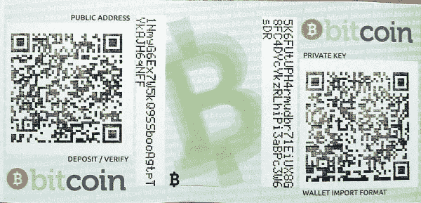
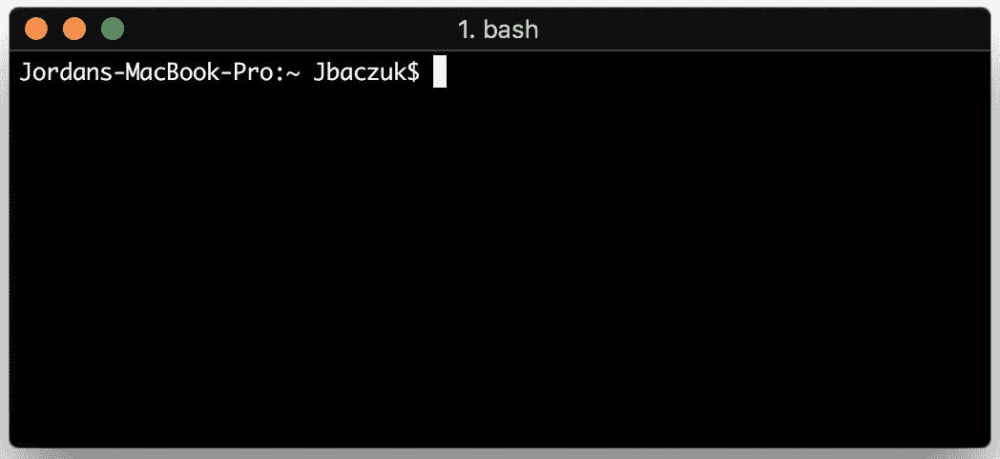
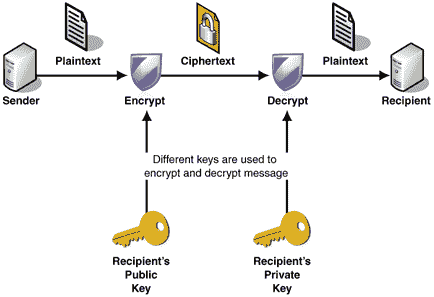
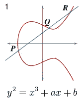
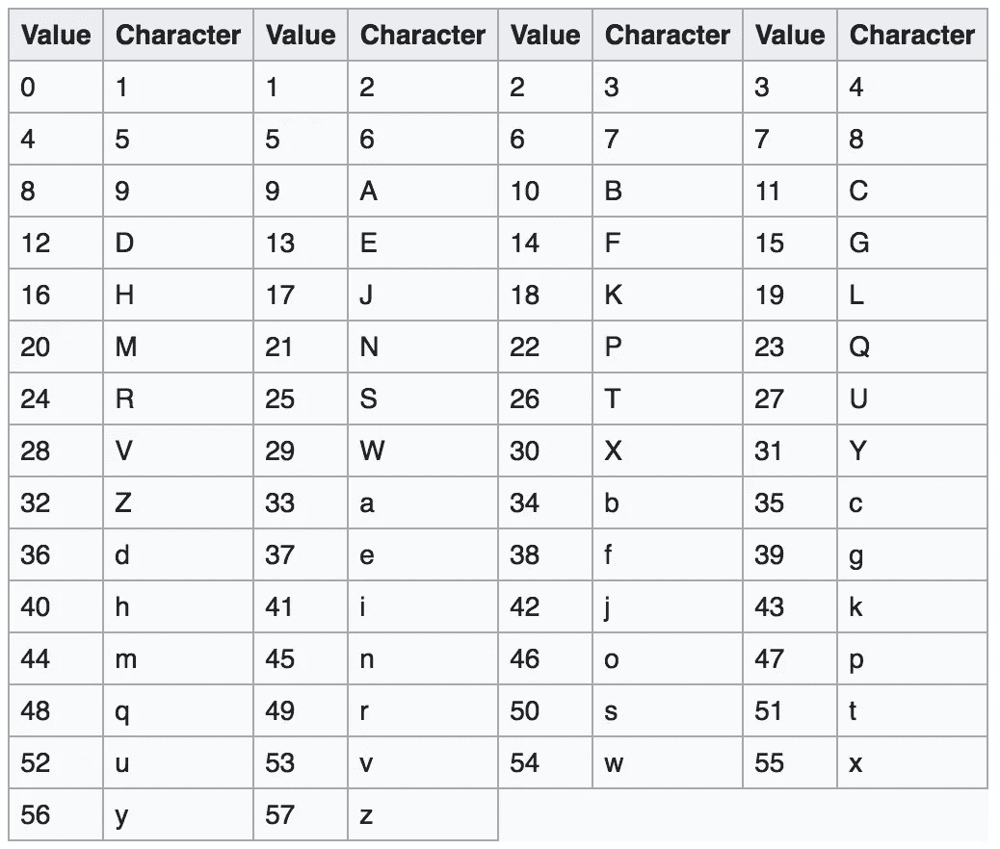

# 如何一步一步生成比特币地址

> 原文：<https://medium.com/coinmonks/how-to-generate-a-bitcoin-address-step-by-step-9d7fcbf1ad0b?source=collection_archive---------0----------------------->



下面是一个 bash 脚本，它的作用如下:[https://gist . github . com/JBaczuk/dab 51 daf 6280 f 6a 2d 4b 58897 d6b 36 e 9 b](https://gist.github.com/JBaczuk/dab51daf6280f6a2d4b58897d6b36e9b)

# 介绍

这是一个实用的技术指南，介绍了比特币地址的生成，包括私钥和公钥，以及相关的加密技术。虽然这将工作，但最好是使用您的钱包来生成和管理您的地址，这是出于教育目的。

> 了解更多，加入 [**完整比特币/区块链课程**](https://www.udemy.com/course/create-your-own-blockchain/?referralCode=9A52F48CA8455AC77928) 全球 48 个国家的人。

本指南将带您完成在 Mac 上使用命令行生成比特币地址的所有步骤。在使用类似加密工具的其他操作系统上，类似的步骤应该是可能的。以`$`开头的行表示终端命令，您可以键入并运行这些命令(当然没有`$`)。



Mac Terminal (iTerm 2)

## 属国

*   `brew` —安装:[https://brew.sh/](https://brew.sh/)
*   `pip` —安装:`sudo easy_install pip`
*   `libressl` —安装:`brew install libressl`
*   `[base58](https://github.com/keis/base58)` —安装:`pip install base58`

> 注意:为了执行包含的`openssl` cli 命令，我安装了`libressl`以便一些椭圆曲线命令能够工作，因为 mac 上当前版本的 openssl cli 有一个[错误](https://github.com/libressl-portable/portable/issues/395)。

# 密码学初级读本

## 公钥加密

或非对称加密是一种使用密钥对的加密方法，每个密钥对都是唯一的。该对密钥包括公钥和私钥。这是比特币用来控制资金的一种加密技术。公钥可以从私钥生成，但不能从私钥生成公钥(计算上太困难)。同样，用私钥加密的东西可以用公钥解密，反之亦然，因此它们是非对称的。



Assymetric Encryption

**用例**

*   加密:当用户拥有一个公钥时，可以使用公钥对消息进行加密，只有拥有私钥的人才能读取公钥。反之亦然。
*   数字签名:用户可以使用他们的私钥和一些数据的散列，使用诸如 ECDSA 之类的数字签名算法来计算数字签名。然后，另一个用户可以使用该算法，使用公钥和相同数据的散列来验证该签名。如果通过，这证明用户确实提交了特定的消息，该消息没有被篡改。
*   数字指纹:是一种表示任意大的数据集的方法，通过计算它的散列来生成标准大小的指纹。如果没有完全相同的数据，这个指纹将很难复制，因为可以假定这些数据没有被篡改。

私钥可以证明你可以发送已经发送给你的比特币。它就像你银行账户的密码。如果你把它弄丢了或者被别人得到了，你就完了。

公钥帮助人们知道如何向你发送比特币。

> 了解更多信息，加入我的课程，与全球 48 个国家的人们一起学习如何[成为一名比特币+区块链程序员](https://www.udemy.com/course/create-your-own-blockchain/?referralCode=9A52F48CA8455AC77928)。

# 创建比特币地址

## 私钥生成

私钥可以是从`0x1`到`0xFFFF FFFF FFFF FFFF FFFF FFFF FFFF FFFF BAAE DCE6 AF48 A03B BFD2 5E8C D036 4140`的任何 256 位(32 字节)值。

因此，私钥的可能总数是 2 个⁵⁶或 1.16 个 10⁷⁷.想象你身体里的原子总数，然后想象每一个原子都是一个地球。所有这些地球上的原子总数大约是 7 x 10⁷⁷.实际上，您的随机私钥是不可能被随机生成或被其他人发现的。


创建私钥的一种常见(但不是最安全的)方法是从种子开始，比如随机选取的一组单词或密码短语。该种子然后通过 SHA256 算法，该算法将总是方便地生成 256 位值。这是可能的，因为每个计算机字符都由一个整数值表示(见 ASCII 和 Unicode)。

> 注意:SHA256 是一个单向的、确定性的函数，这意味着它很容易在一个方向上计算，但你不能逆转它。为了找到一个特定的输出，你必须尝试所有可能的输入，直到你得到想要的输出(蛮力)，它将总是产生相同的输出给相同的输入，分别。

如果将来使用相同的散列算法，该种子可以用于生成相同的私钥，因此只需要保存该种子。

```
$ echo "this is a group of words that should not be considered random anymore so never use this to generate a private key" | openssl sha256a966eb6058f8ec9f47074a2faadd3dab42e2c60ed05bc34d39d6c0e1d32b8bdf
```

这个私钥是十六进制或十六进制的。每两个数字代表 8 位或 1 个字节。因此，64 个字符总共有 256 位。

> 了解更多信息，并与全球 48 个国家的人们一起参加我的课程，学习如何[成为比特币+区块链程序员](https://www.udemy.com/course/create-your-own-blockchain/?referralCode=9A52F48CA8455AC77928)。

## 公钥生成

公钥是使用椭圆曲线(`[secp256k1](https://en.bitcoin.it/wiki/Secp256k1)`)乘法使用公式`*K = k * G*`从比特币中的私钥生成的，其中`*K*`是公钥，`*k*`是私钥，`*G*`是称为生成器 Point⁴的常数，对于`secp256k1`等于:

```
04 79BE667E F9DCBBAC 55A06295 CE870B07 029BFCDB 2DCE28D9 59F2815B 16F81798 483ADA77 26A3C465 5DA4FBFC 0E1108A8 FD17B448 A6855419 9C47D08F FB10D4B8
```

似乎不知道曲线的设计者是如何选择这个点的。此外，这种算法是一种单向算法，或者说是一种“陷阱门”功能，因此私钥不能从公钥中导出。值得注意的是，[椭圆曲线乘法](https://en.wikipedia.org/wiki/Elliptic_curve_point_multiplication)与标量乘法不同，尽管它们有相似的属性。



Elliptic Curve Example

要在终端中使用我们的私钥来实现这一点，

```
$ openssl ec -inform DER -text -noout -in <(cat <(echo -n "302e0201010420") <(echo -n "a966eb6058f8ec9f47074a2faadd3dab42e2c60ed05bc34d39d6c0e1d32b8bdf") <(echo -n "a00706052b8104000a") | xxd -r -p) 2>/dev/null | tail -6 | head -5 | sed 's/[ :]//g' | tr -d '\n' && echo043cba1f4d12d1ce0bced725373769b2262c6daa97be6a0588cfec8ce1a5f0bd092f56b5492adbfc570b15644c74cc8a4874ed20dfe47e5dce2e08601d6f11f5a4
```

这个公钥包含前缀`0x04`和椭圆曲线上的 x 和 y 坐标`secp256k1`。

## 压缩公钥

大多数钱包和节点实现压缩公钥作为默认格式，因为它是未压缩密钥的一半大，节省了区块链空间。要将未压缩的公钥转换为压缩的公钥，可以省略 y 值，因为 y 值可以使用椭圆曲线的等式来求解:y = x + 7。因为方程求解 y，方程的右边可以是正的也可以是负的。因此，`0x02`被加到正 y 值的前面，`0x03`被加到负 y 值的前面。如果 y 坐标的最后一个二进制数是 0，那么这个数就是偶数，对应的是正数。如果是 1，那么就是负的。公钥的压缩版本变成:

```
023cba1f4d12d1ce0bced725373769b2262c6daa97be6a0588cfec8ce1a5f0bd09
```

前缀是`0x02`，因为 y 坐标以`0xa4`结尾，它是偶数，因此为正。

> 了解更多信息，加入我关于如何[成为比特币+区块链程序员](https://www.udemy.com/course/create-your-own-blockchain/?referralCode=9A52F48CA8455AC77928)的课程，与全球 48 个国家的人们一起。

## 地址形成

有多种比特币地址类型，目前`P2SH`或支付到脚本哈希是大多数钱包的默认设置。`P2PKH`是其前身，代表付费公钥哈希。脚本给你更多的功能，这是它们更受欢迎的一个原因。我们将首先生成一个`P2PKH`原始格式的地址，然后是现在标准的`P2SH`。

**哈希**

先前输出的公钥首先使用`sha256`散列，然后使用`ripemd160`散列。这缩短了输出字节的数量，并确保在椭圆曲线和 sha256 之间存在一些不可预见的关系的情况下，另一个不相关的哈希函数将显著增加反转操作的难度:

```
$ echo 023cba1f4d12d1ce0bced725373769b2262c6daa97be6a0588cfec8ce1a5f0bd09 | xxd -r -p | openssl sha256
(stdin)= 8eb001a42122826648e66005a549fc4b4511a7ad3fc378221aa1c73c5efe77ef$ echo 8eb001a42122826648e66005a549fc4b4511a7ad3fc378221aa1c73c5efe77ef | xxd -r -p | openssl ripemd160
(stdin)= 3a38d44d6a0c8d0bb84e0232cc632b7e48c72e0e
```

> 注意，由于输入是一个字符串，`xxd -r -p`会将十六进制字符串转换成二进制，然后以 hexdump 格式(ascii)输出，这是 openssl 散列函数期望的输入。

**编码**

既然我们已经散列了公钥，现在我们执行`base58check`编码。 [Base58check](https://en.bitcoin.it/wiki/Base58Check_encoding) 允许散列以更紧凑的方式显示(使用更多的字母表字母),同时避免可能相互混淆的字符，例如 0 和 O，因为输入错误可能会导致您损失资金。应用校验和来确保地址被正确传输，而没有任何数据损坏，例如地址输入错误。



Base58 Encoding Table

**地址格式**

比特币`P2PKH`地址以表示地址类型的版本字节值`0x00`开始，以 4 字节校验和结束。首先，我们将版本字节(前缀)添加到我们的公钥哈希中，并在使用`base58`进行编码之前计算和添加校验和:

```
$ echo 003a38d44d6a0c8d0bb84e0232cc632b7e48c72e0e | xxd -p -r | base58 -c && echo
16JrGhLx5bcBSA34kew9V6Mufa4aXhFe9X
```

> 注:`-c`表示将应用校验和。校验和计算如下:校验和= SHA256(SHA256(前缀+数据))，只有哈希的前 4 个字节附加到数据的末尾。

得到的值是一个可以用来接收比特币的`P2PKH`地址:**16 jrghlx 5 bcbsa 34 kew 9 V6 mufa 4 axh Fe 9 x**

> 了解更多信息，加入我关于如何[成为一名比特币+区块链程序员](https://www.udemy.com/course/create-your-own-blockchain/?referralCode=9A52F48CA8455AC77928)的课程，与全球 48 个国家的人们一起。

## 付款至脚本哈希

新的默认地址类型是付费脚本哈希，而不是付费公钥哈希，它是一个脚本哈希。比特币有一种脚本语言，你可以在这里阅读更多关于它的信息。基本上，它允许像发送比特币的多重签名要求或在你被允许发送资金之前的时间延迟等事情。一个常用的脚本是 p 2 wpkh(Pay to Witness Public Key Hash):`OP_0 0x14 <PubKey Hash>`其中 PubKey Hash 是公钥`SHA256`的`RIPEMD160`，和前面一样，0x14 是 PubKey Hash 中的字节数。因此，要将这个脚本转换成一个地址，您只需将`BASE58CHECK`应用到脚本`OP_0 0x14 <PubKey Hash>`的`SHA256`的`RIPEMD160`中，除了您将`0x05`而不是`0x00`添加到脚本散列中，以表示地址类型是一个`P2SH`地址。

```
$ echo 00143a38d44d6a0c8d0bb84e0232cc632b7e48c72e0e | xxd -r -p | openssl sha256
(stdin)= 1ae968057eaef06c3e13439695edd7a54982fc99f36c3aa41d8cc41340f30195$ echo 1ae968057eaef06c3e13439695edd7a54982fc99f36c3aa41d8cc41340f30195 | xxd -r -p | openssl ripemd160
(stdin)= 1d521dcf4983772b3c1e6ef937103ebdfaa1ad77$ echo 051d521dcf4983772b3c1e6ef937103ebdfaa1ad77 | xxd -p -r | base58 -c && echo
34N3tf5m5rdNhW5zpTXNEJucHviFEa8KEq
```

> 了解更多信息，并与全球 48 个国家的人们一起参加我的课程，学习如何[成为比特币+区块链程序员](https://www.udemy.com/course/create-your-own-blockchain/?referralCode=9A52F48CA8455AC77928)。

参考

*   [https://en.bitcoin.it/wiki/Private_key](https://en.bitcoin.it/wiki/Private_key)
*   [https://education.jlab.org/qa/mathatom_05.html](https://education.jlab.org/qa/mathatom_05.html)，[https://education.jlab.org/qa/mathatom_04.html](https://education.jlab.org/qa/mathatom_04.html)
*   https://crypto . stack exchange . com/questions/1145/一年内暴力破解一个 256 位密钥需要多少美元
*   https://en.bitcoin.it/wiki/Secp256k1⁴

> 加入 Coinmonks [电报频道](https://t.me/coincodecap)和 [Youtube 频道](https://www.youtube.com/c/coinmonks/videos)获取每日[加密新闻](http://coincodecap.com/)

## 另外，阅读

*   [密码电报信号](http://Top 4 Telegram Channels for Crypto Traders) | [密码交易机器人](/coinmonks/crypto-trading-bot-c2ffce8acb2a)
*   [复制交易](/coinmonks/top-10-crypto-copy-trading-platforms-for-beginners-d0c37c7d698c) | [加密税务软件](/coinmonks/crypto-tax-software-ed4b4810e338)
*   [网格交易](https://coincodecap.com/grid-trading) | [加密硬件钱包](/coinmonks/the-best-cryptocurrency-hardware-wallets-of-2020-e28b1c124069)
*   [加密交换](/coinmonks/crypto-exchange-dd2f9d6f3769) | [印度的加密应用](/coinmonks/buy-bitcoin-in-india-feb50ddfef94)
*   [开发人员的最佳加密 API](/coinmonks/best-crypto-apis-for-developers-5efe3a597a9f)
*   最佳[加密借贷平台](/coinmonks/top-5-crypto-lending-platforms-in-2020-that-you-need-to-know-a1b675cec3fa)
*   杠杆代币的终极指南
*   [八大加密附属计划](https://coincodecap.com/crypto-affiliate-programs) | [eToro vs 比特币基地](https://coincodecap.com/etoro-vs-coinbase)
*   [最佳以太坊钱包](https://coincodecap.com/best-ethereum-wallets) | [电报上的加密货币机器人](https://coincodecap.com/telegram-crypto-bots)
*   [交易杠杆代币的最佳交易所](https://coincodecap.com/leveraged-token-exchanges) | [购买 Floki](https://coincodecap.com/buy-floki-inu-token)
*   [3Commas 对 Pionex 对 Cryptohopper](https://coincodecap.com/3commas-vs-pionex-vs-cryptohopper) | [Bingbon 评论](https://coincodecap.com/bingbon-review)