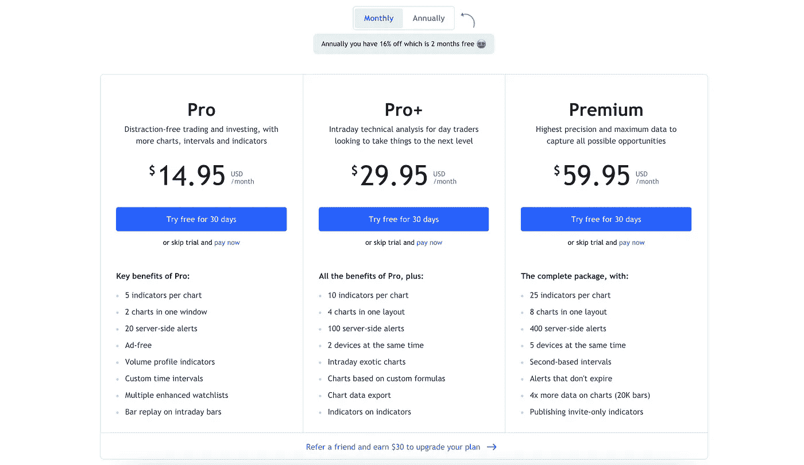
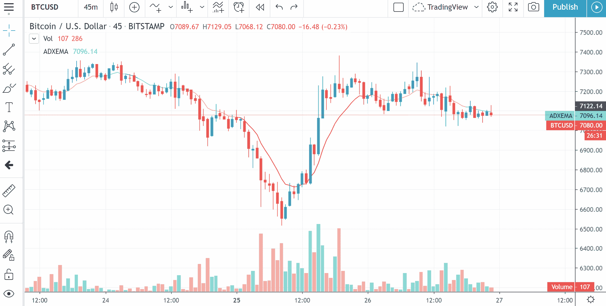

# 如何获得免费交易 View premium 帐户

> 原文：<https://medium.com/coinmonks/how-to-get-a-free-tradingview-premium-account-e39ebb8ac59d?source=collection_archive---------0----------------------->

## 您将终身免费获得 TradingView premium。

[unsplash.com](https://unsplash.com/photos/vBCVcWUyvyM)

TradingView 是我最喜欢的图表平台之一。基本软件是免费的。希望利用高级图表功能的用户，被鼓励购买一个高级包，其中充满了酷指标和附加功能。

# 交易视图计划

tradingview.com

# 基本计划

初学者基本计划就够了。有了这个计划，你将有足够的工具、数据和信息开始交易。

## 特征

*   获得实时期货。股票和外国市场
*   十万多项技术指标
*   股票筛选
*   50 多种直观的绘图工具
*   从世界各地的交易者那里获取交易理念
*   票据交易
*   交易警报

# 专业计划

专业版用户享受所有基本帐户权限，并拥有更多特性和功能

## 特征

*   5 个保存的图表模板
*   10 个交易警报
*   可定制的时间间隔
*   无广告
*   强大的观察列表
*   股票筛选(强大的筛选选项:股息支付、期间表现或 52 周高点等)

# Pro+计划

Pro 和 Pro+在大部分方面是相同的。然而，使 Pro +与众不同的是对某些功能的限制不那么严格。

## 特征

*   技术指标:升级到每张图 10 个
*   每个布局的图表数量:升级到 4 个
*   交易提醒:升级到 30
*   客户支持:支持队列中的优先级
*   设备可访问性:2 个活动设备可以同时运行

# 保费计划

高级用户可以完全使用 TradingView 平台上的所有功能。

## 特征

*   技术指标:每个图表最多 25 个，指标最多 24 个
*   每个布局最多 8 个图表
*   交易警报:升级到 400 个警报，没有失效
*   设备可访问性:多达 5 个活动设备

 [## 加密货币交易最好的制图平台有哪些？

### 如果你真的想交易加密货币，那就需要一个像样的制图平台。这篇文章概述了最好的…

medium.com](/coinmonks/what-are-the-best-charting-platforms-for-cryptocurrency-trading-85aade584d80) 

# 如何获得免保费？

如果你注册了与 TradingView 合作的经纪人或网站，你可以免费获得 [TradingView 高级版](https://coincodecap.com/go/tradingview)。例如，如果你在 Fyers broker 注册，你可以免费获得 TradingView pro 功能。Fyers 交易面板几乎是 TradingView 的复制粘贴版，具有所有高级功能。如果你从事外汇交易，你可以在 FXCM 上注册，并向他们询问高级功能。在那里，你将免费获得 1 年的保费。

如果你有账户，Upstox 还免费提供具有高级功能的 TradingView 图表。在这些平台上注册非常容易。准备好你的文件并报名。

tradingview.com

# 支持我

BTC 钱包:bc1q 078 vwjaf 76 jj 7 vnjte 23 ehkksr 09 tnyy 2 njrqg

ETH 钱包:0x4e 07987 e7bd 858695603 B2 cc 0 dcfa 36 B4 BF 540 a 0

> 加入 Coinmonks [电报频道](https://t.me/coincodecap)和 [Youtube 频道](https://www.youtube.com/c/coinmonks/videos)获取每日[加密新闻](http://coincodecap.com/)

## 另外，阅读

*   [密码电报信号](http://Top 4 Telegram Channels for Crypto Traders) | [密码交易机器人](/coinmonks/crypto-trading-bot-c2ffce8acb2a)
*   [复制交易](/coinmonks/top-10-crypto-copy-trading-platforms-for-beginners-d0c37c7d698c) | [加密税务软件](/coinmonks/crypto-tax-software-ed4b4810e338)
*   [网格交易](https://coincodecap.com/grid-trading) | [加密硬件钱包](/coinmonks/the-best-cryptocurrency-hardware-wallets-of-2020-e28b1c124069)
*   [印度的加密交易所](/coinmonks/crypto-exchange-dd2f9d6f3769) | [印度的加密应用](/coinmonks/buy-bitcoin-in-india-feb50ddfef94)
*   开发人员的最佳加密 API
*   最佳[加密贷款平台](/coinmonks/top-5-crypto-lending-platforms-in-2020-that-you-need-to-know-a1b675cec3fa)
*   杠杆代币的终极指南
*   [八大加密附属计划](https://coincodecap.com/crypto-affiliate-programs) | [eToro vs 比特币基地](https://coincodecap.com/etoro-vs-coinbase)
*   [最佳以太坊钱包](https://coincodecap.com/best-ethereum-wallets) | [电报上的加密货币机器人](https://coincodecap.com/telegram-crypto-bots)
*   [交易杠杆代币的最佳交易所](https://coincodecap.com/leveraged-token-exchanges) | [购买 Floki](https://coincodecap.com/buy-floki-inu-token)
*   [3Commas 诉 Pionex 诉 Cryptohopper](https://coincodecap.com/3commas-vs-pionex-vs-cryptohopper) | [宾邦评论](https://coincodecap.com/bingbon-review)