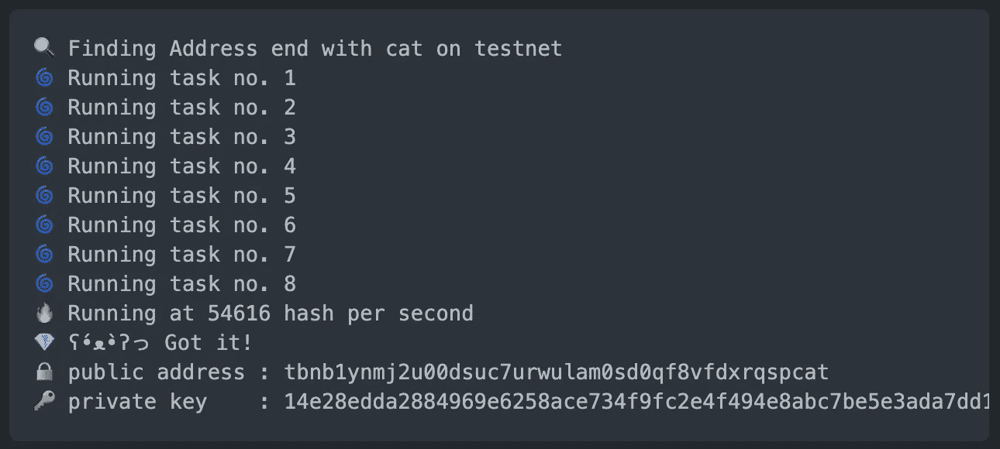

# 💎如何获得一个很酷的 BNB 钱包地址

> 原文：<https://medium.com/coinmonks/how-to-get-cool-wallet-address-4bb323c5f841?source=collection_archive---------2----------------------->

我想生成一个指定的钱包地址，而不是一个随机的，使它更酷，能够识别，而使用它。例如以`cat`结尾



cat!

我找到了 [**vanieth**](https://github.com/makevoid/vanieth) ，你可以用它来做**以太坊**，但是它不能和 **Binace 链**一起使用，所以我从[**stress**](https://github.com/octofoxio/stress)**Stellar**账户生成器中抓取了一些代码，它是由[Rungsikorn Rungsikavanich](https://medium.com/u/23ae886ef161?source=post_page-----4bb323c5f841--------------------------------)创建的，并与[币安链/go-sdk](https://github.com/binance-chain/go-sdk) 混合来为我生成账户

# TLDR；

[](https://github.com/undefiorg/vanibnb) [## underior g/vani bnb

### 一个用 golang 写的币安链虚位地址生成器。-underior g/vani bnb

github.com](https://github.com/undefiorg/vanibnb) 

## 装置

```
$ go get -u github.com/undefiorg/vanibnb
```

## 使用

*   `-s`:要查找的后缀
*   `-n`:网络 **mainnet** 或 **testnet**

## 奔跑

```
$ vanibnb -s=cat -n=testnet
```

## 输出

```
🔍 Finding Address end with cat on testnet
🌀 Running task no. 1 
🌀 Running task no. 2 
🌀 Running task no. 3 
🌀 Running task no. 4 
🌀 Running task no. 5 
🌀 Running task no. 6 
🌀 Running task no. 7 
🌀 Running task no. 8 
🔥 Running at 54616 hash per second
💎 ʕ•́ᴥ•̀ʔっ Got it! 
🔒 public address : tbnb1ynmj2u00dsuc7urwulam0sd0qf8vfdxrqspcat
🔑 private key    : 14e28edda2884969e6258ace734f9fc2e4f494e8abc7be5e3ada7dd10da6072d
```

# 支持

就是这样！如果你想给我一杯咖啡，☕️，这是我的钱包。👇

```
ETH      : 0xD63eCF4Fa7ef94ea4E9CF7429Af6a4F482B447B7
BNB(bsc) : 0x0c62B13f8116eBA444DeFdE842aBd7d1f68F964f
BNB(bc)  : bnb1uqht090p2fjs9dr2umh5w5ykm697srgr70xkat
```

未完待续…

> 加入 Coinmonks [电报频道](https://t.me/coincodecap)和 [Youtube 频道](https://www.youtube.com/c/coinmonks/videos)获取每日[加密新闻](http://coincodecap.com/)

## 另外，阅读

*   [复制交易](/coinmonks/top-10-crypto-copy-trading-platforms-for-beginners-d0c37c7d698c) | [加密税务软件](/coinmonks/crypto-tax-software-ed4b4810e338)
*   [网格交易](https://coincodecap.com/grid-trading) | [加密硬件钱包](/coinmonks/the-best-cryptocurrency-hardware-wallets-of-2020-e28b1c124069)
*   [密码电报信号](http://Top 4 Telegram Channels for Crypto Traders) | [密码交易机器人](/coinmonks/crypto-trading-bot-c2ffce8acb2a)
*   [最佳加密交易所](/coinmonks/crypto-exchange-dd2f9d6f3769) | [印度最佳加密交易所](/coinmonks/bitcoin-exchange-in-india-7f1fe79715c9)
*   面向开发者的最佳加密 API
*   最佳[密码借贷平台](/coinmonks/top-5-crypto-lending-platforms-in-2020-that-you-need-to-know-a1b675cec3fa)
*   [杠杆代币的终极指南](/coinmonks/leveraged-token-3f5257808b22)