# 如何获得。您以太坊地址的以太网域

> 原文：<https://medium.com/coinmonks/how-to-get-eth-domain-for-your-ethereum-address-b28013b61efe?source=collection_archive---------0----------------------->

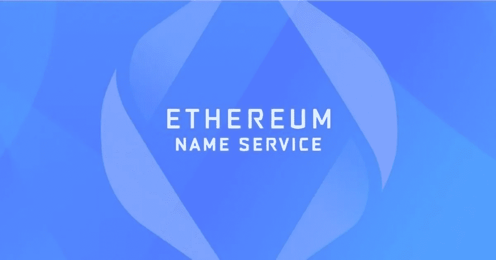

> ENS 是一个基于以太坊的 dApp，它允许您将您的长字母数字钱包地址映射成一种简单的、人类可读的格式。

[**以太坊名称服务**](https://ens.domains/) **(ENS)是一个分布式的、开放的、基于以太坊的 dApp，它提供了一个新的命名系统，加密用户可以将他们的长字母数字钱包地址转换成人类可读的格式。这意味着 ENS 的基本功能是将人类可读的名称映射到机器可读的令牌地址、内容散列和元数据。**

每个 ENS 都是独一无二的，你可以设置并使用它来接收任何加密货币。现在，设想一种情况，您不需要为不同的加密货币提供单独的地址。你可以接收 [BTC](https://bitcoin.org/en/) 、 [ETH](https://ethereum.org/en/) 、 [DOT](https://coinmarketcap.com/currencies/polkadot-new/) 或任何其他令牌，只需使用一个易于记忆的地址。要使用. ETH 地址接收令牌，只需在以太坊名称服务记录部分设置令牌地址。不仅如此你的。ETH 地址将反映在平台支持的所有 dApps 中。

在本文中，我们将解释如何注册一个新的。使用 ENS 管理器应用程序的 ETH 名称，以及如何设置不同的令牌地址并使用一个公共地址接收它们。

> **交易新手？试试** [**密码交易机器人**](/coinmonks/crypto-trading-bot-c2ffce8acb2a) **或** [**复制交易**](/coinmonks/top-10-crypto-copy-trading-platforms-for-beginners-d0c37c7d698c)

## **使用指南**

建立一个。ETH 地址，进入 ENS [页面](https://app.ens.domains/)。

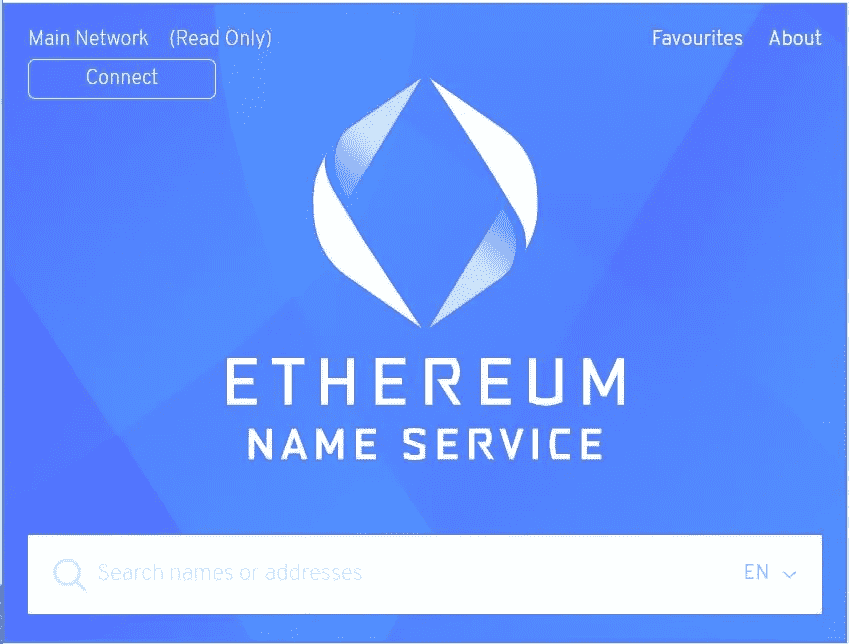

点击**连接**建立与 ENS 应用程序的连接。

您可以使用 ENS 支持的任何浏览器扩展或移动钱包。从 ENS 官方[网页](https://ens.domains/)查看支持的钱包类型的完整列表。

选择您需要的钱包类型。我们正在使用 MetaMask Chrome 桌面浏览器扩展。

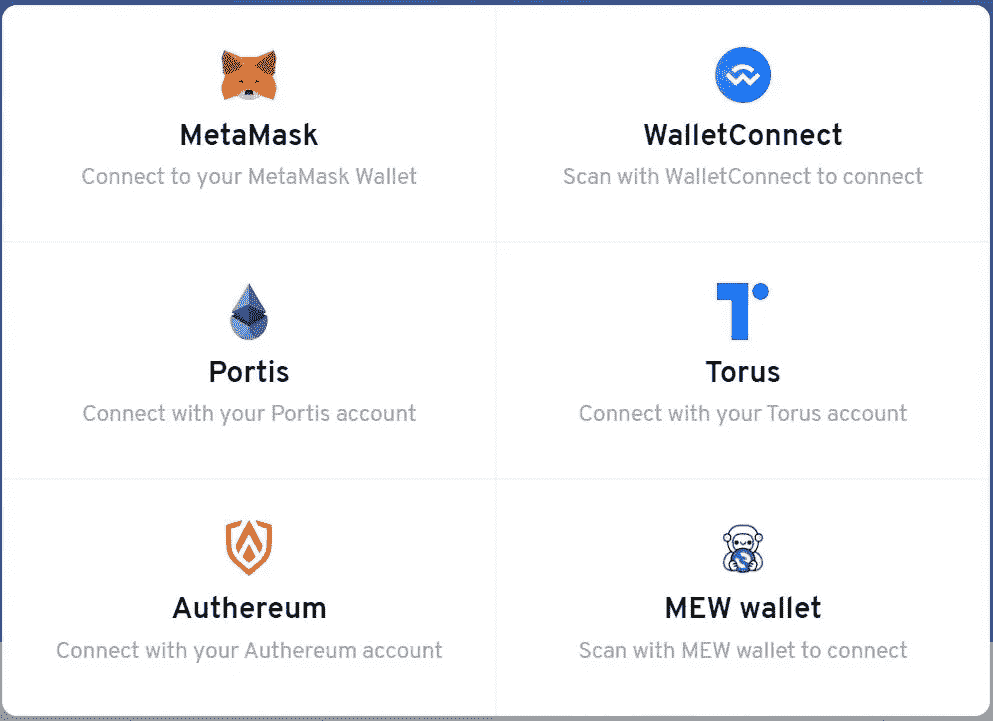

MetaMask wallet 已连接。可以看到以太坊名称服务登陆页面。

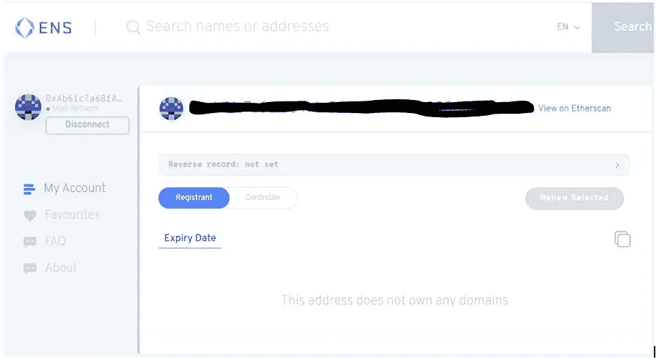

**重要提示:** *用户应使用自己想用自己名字设置的钱包地址。如果您愿意，您可以将所有权转移或解析到不同的钱包。此外，确保你有足够的钱来支付你计划选择的汽油或服务费。*

接下来你要做的就是搜索你想要的名字，包括**。ETH** 结尾。

如果您提供的名称已经被其他人注册，那么应用程序将显示一个类似下面这样的页面，其中包含以下 ENS 信息:

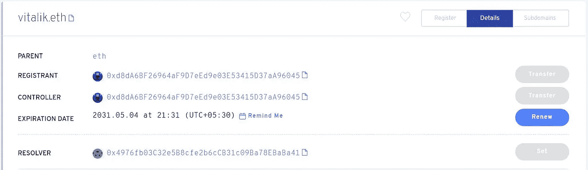

但是如果你幸运的话，你提供的名字是可用的，那么应用程序将显示下面的页面，要求你提供一些重要的强制细节。

这里要注意的一件重要的事情是，我最初尝试只给出我的名字(总共 4 个字母)进行搜索，最终的费用大约是 161 美元(不包括汽油费)。

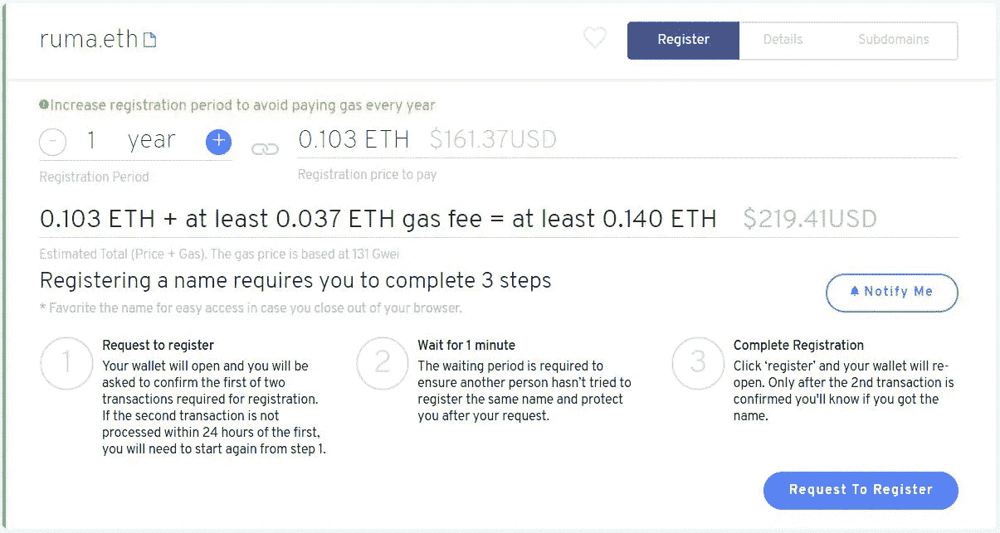

但是后来，我把我的姓和我的名放在一起(总共 7 个字母)，费用降到了只有 5 美元(不含汽油费)。

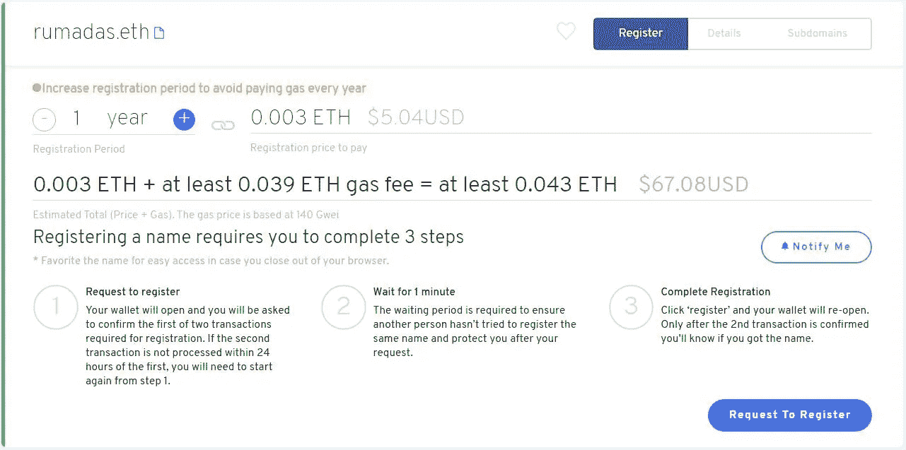

以下是的注册费。以太网名称:

*   5+性格。eth 名称:每年 5 美元 ETH(不含汽油费)
*   4 性格。eth 名称:ETH 每年 160 美元(不含汽油费)
*   3 性格。eth 命名为每年 640 美元的 ETH(不含燃气费)

输入注册期。最短注册期为 1 年。

使用“-”和“+”按钮增加注册时间。以后还可以延长注册期。

一旦您确定了注册期，您可以点击**请求注册**按钮。

触发[元掩码](https://www.altcoinbuzz.io/reviews/wallet/how-to-use-the-metamask-ethereum-mobile-wallet/)事务。确认交易。你可以看到一个绿色的进度条出现在窗口中(见截图)。

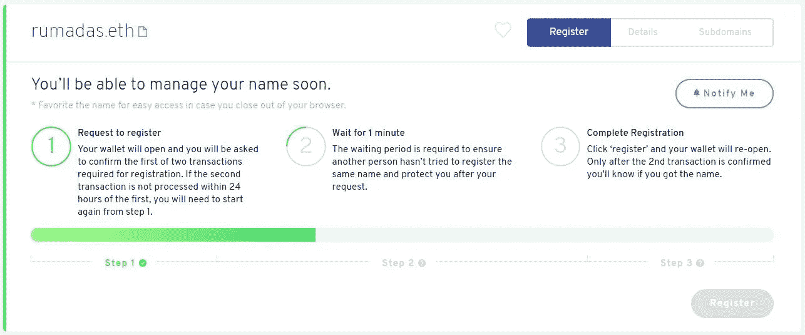

一旦第一步完成，条变成绿色，你移动到第二步，你必须等待一分钟。这是为了确保没有其他人试图用您提供的名称注册。

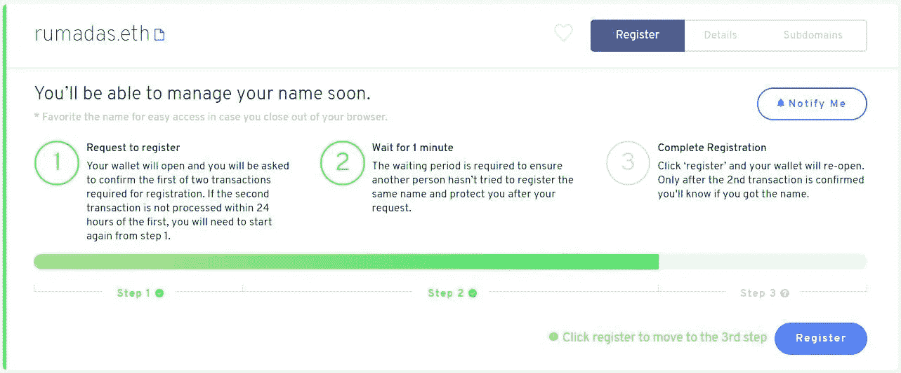

如果您的姓名通过了第 2 步，那么在第 3 步中，您需要点击**注册**以最终确认流程。

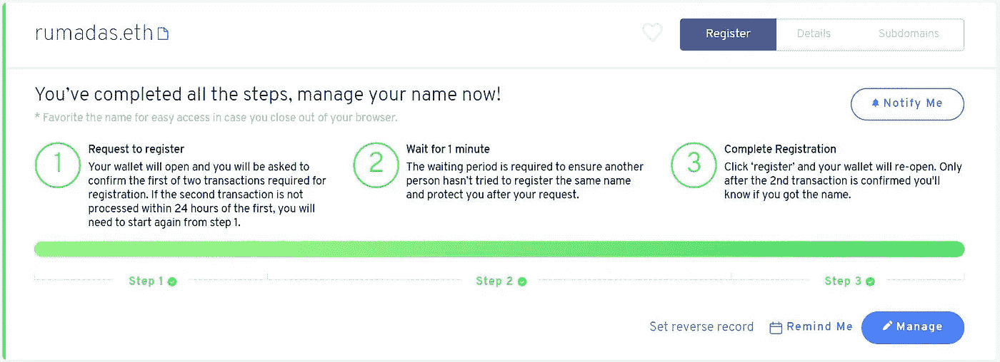

你的。ETH 域已创建。你可以看到你的域名出现在应用程序上。

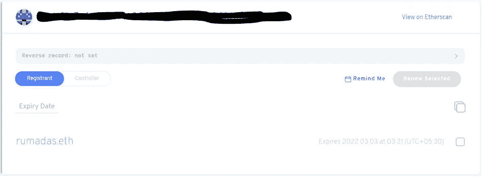

现在你可以设置和管理其他相关的东西。

**反向记录**

反向记录将地址转换成名称。一旦您设置了反向记录，即将您的[钱包](https://www.altcoinbuzz.io/tag/wallet/)地址映射到您的。ETH 地址，您将能够看到您的钱包地址已更改为。与支持 dApps 连接时的 ETH 地址。

所以，让我们试试 [Uniswap](https://uniswap.org/) 。

正如您从下面的屏幕截图中看到的，当我将钱包连接到 Uniswap 应用程序时，会显示钱包地址。

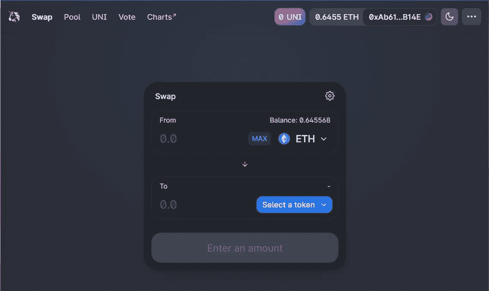

现在，进入 ENS 管理器，点击**反向记录**设置详细信息。

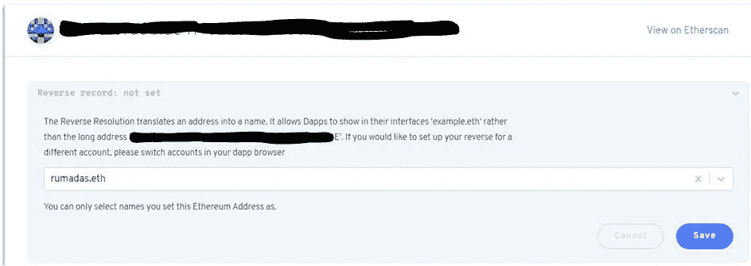

从下拉列表中，选择您的域并保存。

你可以看到你的反向记录设置为你的域名。

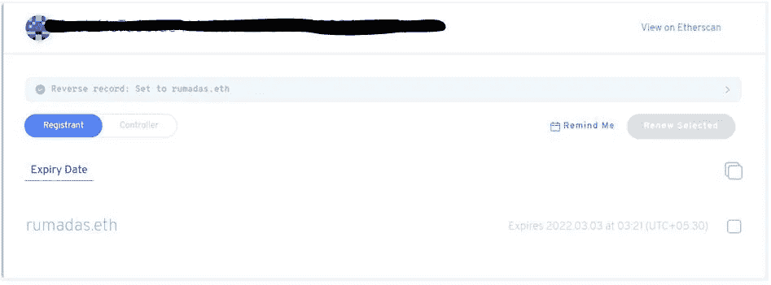

现在再次进入 [Uniswap](https://www.altcoinbuzz.io/reviews/altcoin-projects/10-reasons-to-buy-uni-uniswap-in-2021/) 并刷新页面。您会发现您的钱包地址已更改为您新创建的地址。ETH 域。

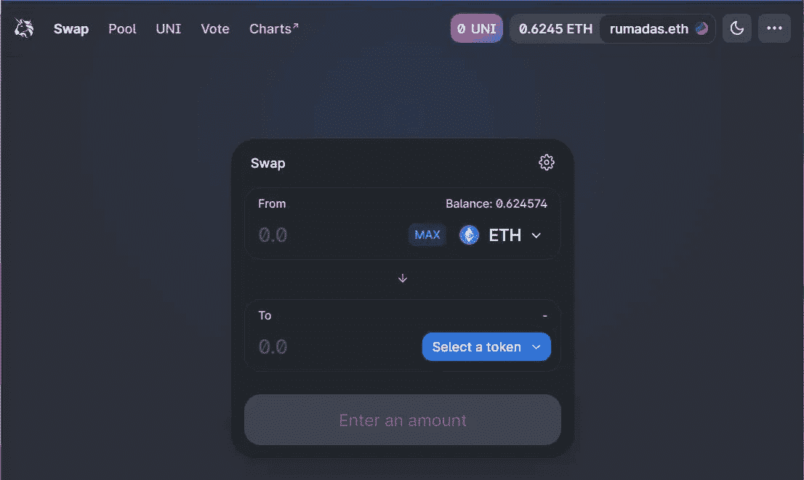

**添加/编辑记录**

您可以点击**记录**字段中的**添加/编辑记录**来添加记录。

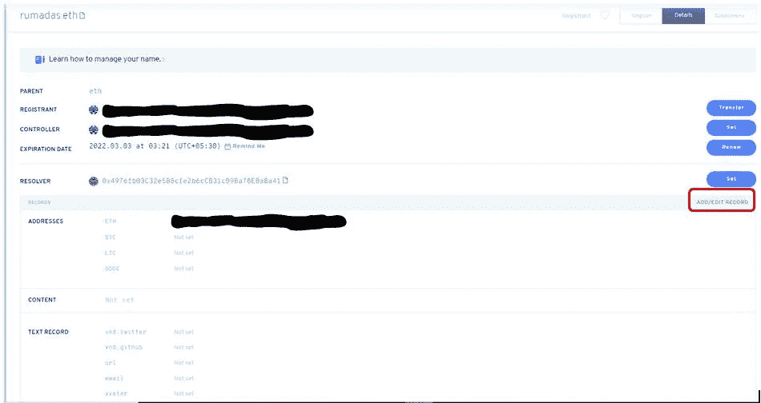

您的以太坊钱包地址将自动显示。如果您有 BTC、 [LTC](https://coinmarketcap.com/currencies/litecoin/) 或 [DOGE](https://coinmarketcap.com/currencies/dogecoin/) 令牌，您可以将地址复制并粘贴到相应的字段中。

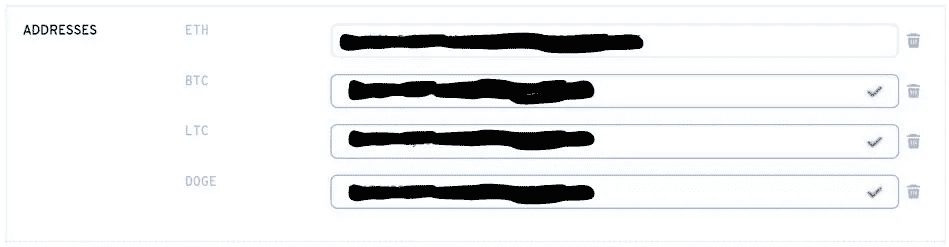

除了这四个令牌，您还可以添加其他令牌，方法是点击**添加记录**，选择您想要的记录类型并输入值。

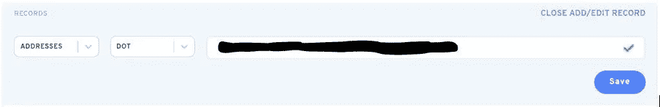

**重要提示:** *请注意，添加令牌地址或任何其他详细信息将需要您支付油费。该应用程序允许您添加多个详细信息，并使用一个单一的交易进行确认。所以，你最好一次添加所有的细节，然后再确认，以避免多次支付煤气费。*

**结论**

以太坊名称服务是一个广泛使用的去中心化应用。它将您的长字母数字以太坊钱包地址与您想要的名称进行映射，这很容易、简单且可读。易于阅读完全消除了拼错钱包地址的机会，从而消除了损失资金的可能性。另一个优点是，只需给出一个地址，就可以轻松接收多个令牌。这非常有吸引力，省事又省时，因为您不需要登录 exchange/wallet 应用程序并搜索令牌来获取存款地址以接收令牌。我们注意到的唯一缺点是页面有点模糊，捕获结果输出不清晰。

**资源:** [ENS 域](https://ens.domains/)

***注:*** *本帖首发* [*此处*](https://www.altcoinbuzz.io/bitcoin-and-crypto-guide/how-to-get-eth-domain-for-your-ethereum-address/) *上*[***altcoinbuzz . io***](http://www.altcoinbuzz.io/)*。*

使用我的推荐加入

[Crypto.com](https://binance.com/en/register?ref=E8PCD3AF)——[币安](https://platinum.crypto.com/r/sut3pd9bzn)

跟我来

**👉** [推特](https://twitter.com/rumadas123)

**👉**[**Linkedin**](https://www.linkedin.com/in/ruma-das-a1439320/)

*   **包括附属链接**

> **加入 Coinmonks [电报频道](https://t.me/coincodecap)和 [Youtube 频道](https://www.youtube.com/c/coinmonks/videos)获取每日[加密新闻](http://coincodecap.com/)**

## **另外，阅读**

*   **[密码电报信号](http://Top 4 Telegram Channels for Crypto Traders) | [密码交易机器人](/coinmonks/crypto-trading-bot-c2ffce8acb2a)**
*   **[复制交易](/coinmonks/top-10-crypto-copy-trading-platforms-for-beginners-d0c37c7d698c) | [加密税务软件](/coinmonks/crypto-tax-software-ed4b4810e338)**
*   **[网格交易](https://coincodecap.com/grid-trading) | [加密硬件钱包](/coinmonks/the-best-cryptocurrency-hardware-wallets-of-2020-e28b1c124069)**
*   **[加密交换](/coinmonks/crypto-exchange-dd2f9d6f3769) | [印度的加密应用](/coinmonks/buy-bitcoin-in-india-feb50ddfef94)**
*   **[开发人员最佳加密 API](/coinmonks/best-crypto-apis-for-developers-5efe3a597a9f)**
*   **最佳[加密借贷平台](/coinmonks/top-5-crypto-lending-platforms-in-2020-that-you-need-to-know-a1b675cec3fa)**
*   **[从 WazirX 切换到 CoinDCX 的 5 个理由](https://coincodecap.com/reasons-to-switch-from-wazirx-to-coindcx)**
*   **[Unocoin 评论](https://coincodecap.com/unocoin-review) | [最佳加密赌注硬币](https://coincodecap.com/best-crypto-staking-coins)**
*   **[如何使用 MetaMask Wallet 获得 KCC 地址？](https://coincodecap.com/kcc-address-metamask)**
*   **[如何获得自己的。XYZ 领域？](https://coincodecap.com/xyz-domain)**
*   **[最佳加密交换平台](https://coincodecap.com/best-crypto-swap-platforms) | [最佳加密交易所](https://coincodecap.com/crypto-exchange)**
*   **[购买比特币印度](/coinmonks/buy-bitcoin-in-india-feb50ddfef94) | [Pionex 评论](/coinmonks/pionex-review-exchange-with-crypto-trading-bot-1e459d0191ea) | [加密交易机器人](/coinmonks/crypto-trading-bot-c2ffce8acb2a)**
*   **[n 零审核](/coinmonks/ngrave-zero-review-c465cf8307fc) | [Phemex 审核](/coinmonks/phemex-review-4cfba0b49e28) | [PrimeXBT 审核](/coinmonks/primexbt-review-88e0815be858)**
*   **最佳[区块链分析](https://bitquery.io/blog/best-blockchain-analysis-tools-and-software)工具| [赚比特币](/coinmonks/earn-bitcoin-6e8bd3c592d9)**