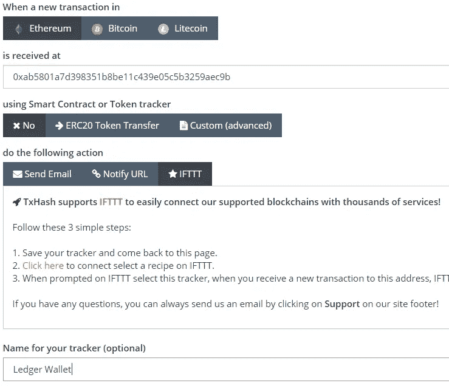

# 如何获得电子钱包支付通知—无需编码

> 原文：<https://medium.com/coinmonks/how-to-get-eth-wallet-payment-notifications-no-coding-necessary-adf90c243529?source=collection_archive---------7----------------------->

这是我不久前设置的一个小技巧，我觉得其他人可能会想用。这非常简单，每次你的 ETH 钱包里有新的存款时，它都会通知你的手机。超级方便，而且默认情况下，它似乎应该被放入以太坊生态系统中。

以太坊作为一种加密货币，几乎是目前在稳固的*实际货币*和基于大区块链的“下一代”计算平台(具有智能合约、自动化等花哨功能)之间进行平衡的最佳选择。等等。)，但对于一个未来的基于通用网络的密码安全钱包系统来说，它在某种程度上可悲地缺乏简单的一体化解决方案，以完成简单的任务，比如，你知道，让你知道你什么时候拿到钱。

所以，事不宜迟，这里有一个 5 分钟的修复程序，一旦你选择的任何以太钱包收到以太，它就会直接向你的手机发送通知——无需编码、无需登录、无需魔法。

1.  在[TXHASH.COM 跟踪应用](https://app.txhash.com)上注册，并添加您选择的以太网地址，以观察新的交易。在“执行以下操作”下，选择“IFTTT”。

2.在 IFTTT 上添加 [TXHASH 通知小程序](https://ifttt.com/applets/wPH4geth-receive-a-notification-on-your-phone-when-your-ethereum-address-receives-ether)(你也必须注册——我知道我知道，更多的注册，我保证之后一切顺利。老实说，这是一个甜蜜的应用程序，每个人和他们的母亲都应该有)

3.在下拉框中选择您的 ETH 地址。然后在手机上下载 IFTTT app。

现在，只要你有新的乙醚存款，只要它一进入你的钱包，你就会知道。这实际上也适用于比特币和莱特币钱包，所以开始吧。