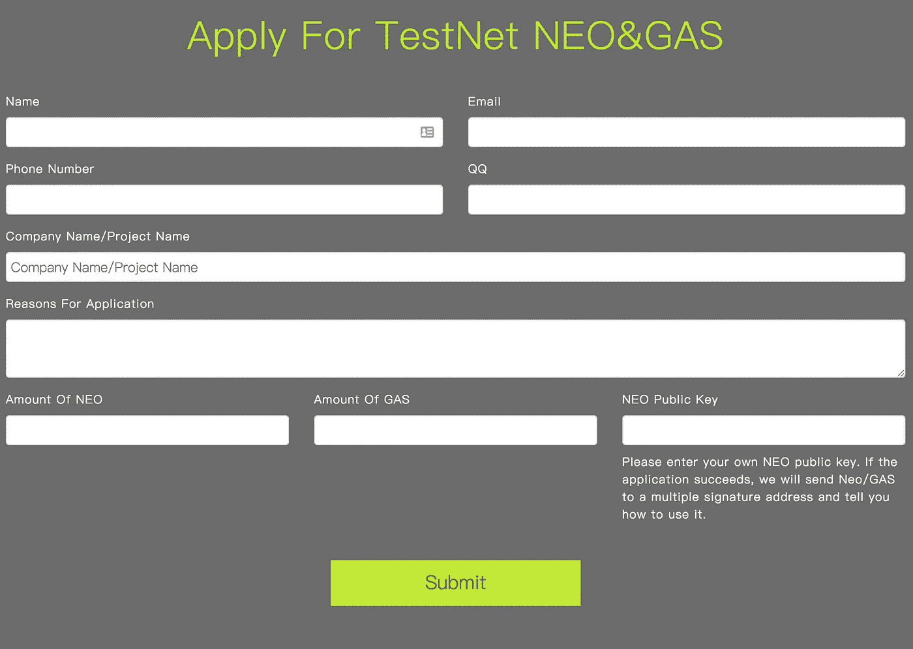
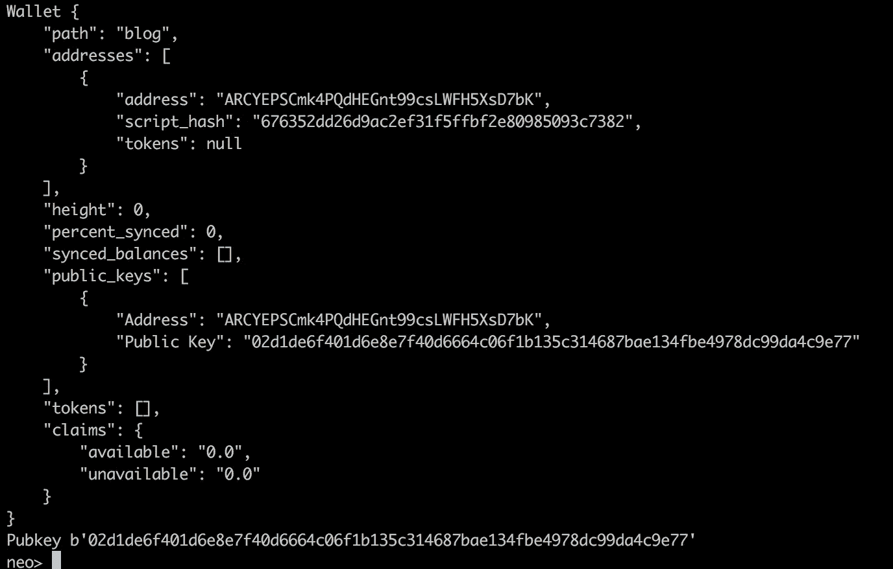
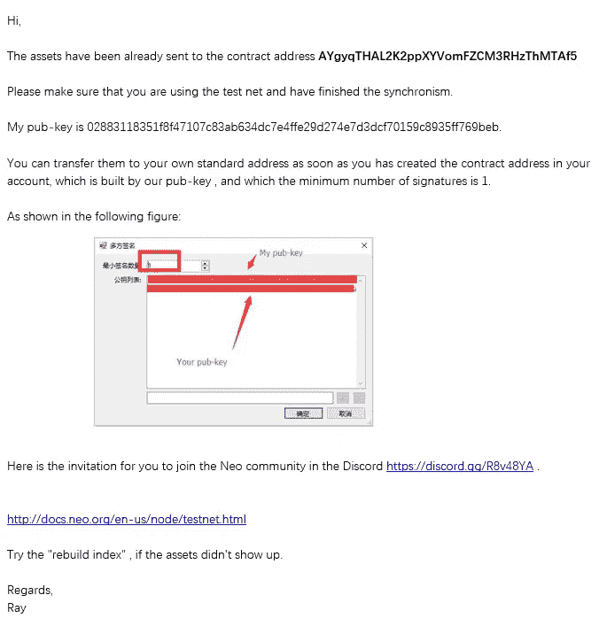
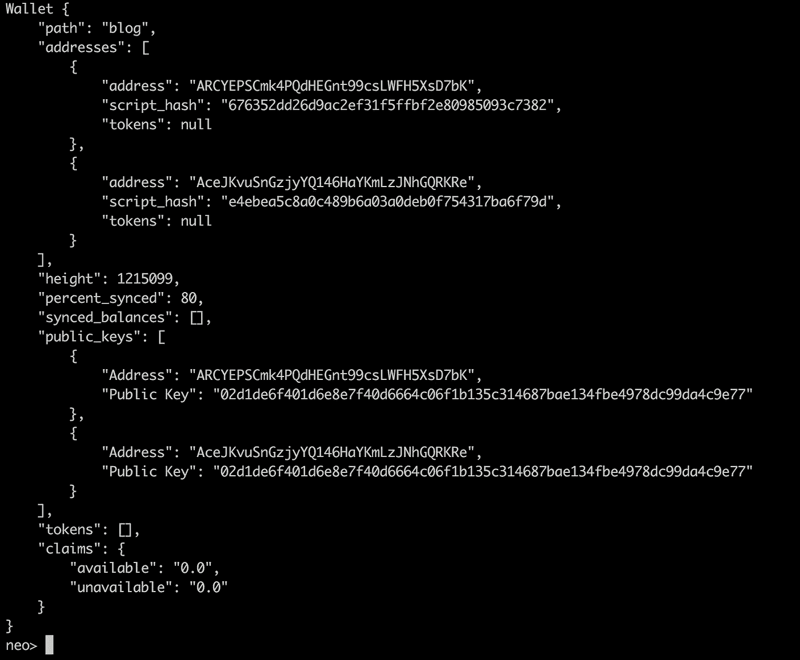
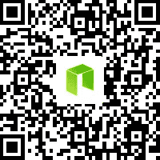

# 如何为近地天体测试网获取气体

> 原文：<https://medium.com/coinmonks/how-to-get-gas-for-the-neo-test-net-907d73c36479?source=collection_archive---------2----------------------->

因此，到目前为止，您应该在私有网络上对您的智能合约代码进行全面测试。如果没有，请参考我之前的[帖子](/@nickfujita/neo-development-tutorials-b59ed2e0be3c)中关于如何建立自己的[私有网络](/@nickfujita/neo-dev-environment-setup-tutorial-e495f5364ada)的内容，并先在那里测试你的代码。

为了让近地天体或气体进入近地天体测试网，您需要填写由近地天体小组运行的以下申请表。

该表单应如下所示:



像往常一样填写您的详细信息，并记住智能合同要求每次导入至少需要 90 GAS，500 GAS 用于私有存储(NEP5 令牌合同)，或者 1000 GAS 用于动态调用功能(您可能不需要这个)。

还有一个名为`NEO Public Key`的字段，您需要在这里提供您希望接收资金的地址的公钥。请注意，您的公钥和您的地址是两回事，提供正确的公钥很重要。

在 Neon Wallet 中，私钥唯一可见的时间是您第一次创建钱包的时候。当调出接收选项时，您会看到您的地址。这些是不同的事情。

因此，如果您想查看您的公钥，请打开您的 neo-python 提示符，打开或导入您的钱包，并键入`wallet`命令。您应该看到以下内容。



您的公钥是`public_keys."Public Key"`下的 wallet 对象中的值。复制这个值，在本例中是`02d1de...4c9e777`，并将其粘贴回应用程序表单。

一旦提交此表格，NEO 团队可能需要几天时间才能给您回复，因此请做好准备，并在您需要时提前发送此请求(建议提前 1 周)。

当你收到邮件时，它应该是这样的。

aygygthal 2k 2 ppxyvomfzcm 3 rhzthmtaf 5



如果你在 windows 上使用 neo-gui，我建议你看看这个教程。

暂时请**忽略`contract address`后第一行的**值。不要求提取资金。它实际上是一个[多签名地址](https://en.bitcoin.it/wiki/Multisignature)，具有 1/2 访问设置。这意味着，使用该地址，您或创建该地址的 NEO 团队成员只需从您的一个地址签字即可获得资金。

这封邮件中的**重要值**在中间，就在`My pub-key`之后，在这种情况下，该值为`0288...9beb`。

复制这个值，并打开 neo-python。

进入 neo-python 后，打开应用程序使用的钱包。

要将此地址导入您的钱包，我们将使用以下命令:

```
import multisig_addr {pubkey in wallet} {minimum # of signatures required} {signing pubkey 1} {signing pubkey 2}…
```

您将为此命令使用的输入值如下:

*   `pubkey in wallet` —您最初随应用程序一起发送的钱包中的公钥，在本例中，值为`02d1...9e77`
*   `minimum # of signatures requires` —数值`1`
*   `signing pubkey 1` —同样，您的钱包中的公钥与您最初随应用程序一起发送的公钥相同，在这种情况下，值为`02d1...9e77`
*   `signing pubkey 2` —紧接在`My pub-key`之后的值，在这种情况下，该值为`0288...9beb`

因此，基于 neo-python 中示例钱包的屏幕截图，查询将如下所示(不含地址缩写，是的，上面提供的钱包截图和电子邮件截图中的公钥不匹配)

```
import multisig_addr 02d1...9e77 1 02d1...9e77 0288...9beb
```

导入地址后，您的钱包应该看起来像这样:



现在，您可以使用以下命令从 multisig 地址向自己发送资金

```
send {assetId or name} {to_addr} {amount} --from-addr={from_addr}
```

在这种情况下，它将看起来像

```
send GAS ARCY...D7bK 5 --from-addr=AceJ...RKRe
```

执行后，在下一块，你应该有你的测试网资金！

恭喜你。现在您可以将您的惊人的新合同部署到 testnet 了！

[其他教程](/@nickfujita/neo-development-tutorials-b59ed2e0be3c)

[O3 手机钱包](https://o3.network/)



NEO/GAS/NEP5 donations AR8rRBxgWw5siKsp1dUmfTLy6QQTjcqoqB

[制作自己的 NEO/GAS/NEP5 二维码！！！](https://o3.network/nep9)