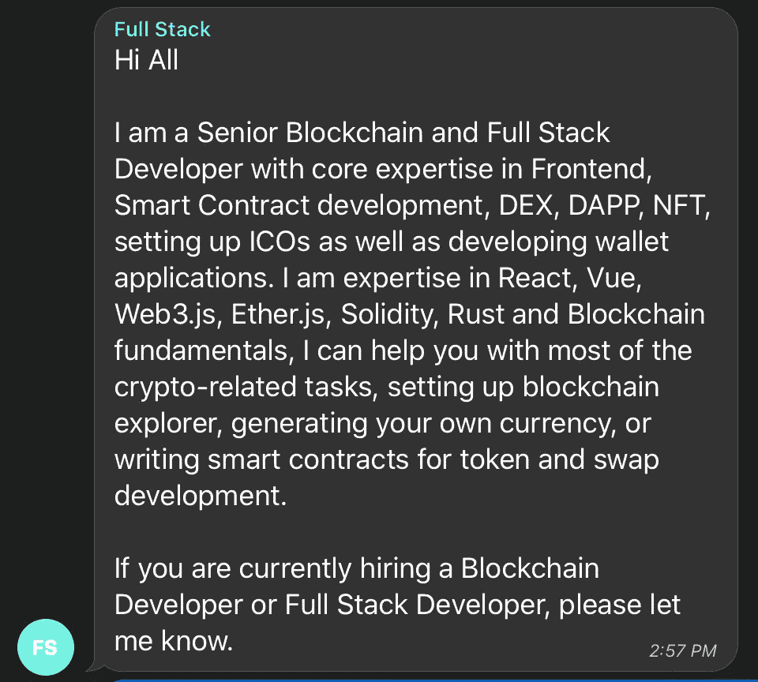
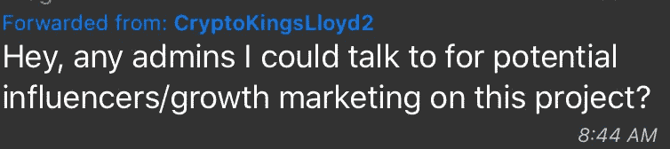
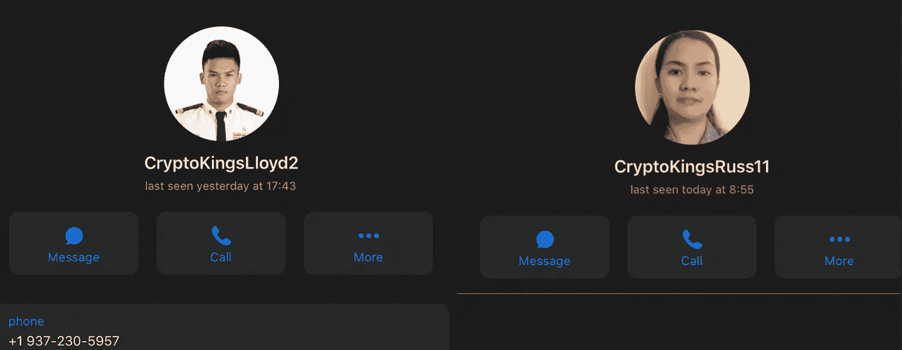
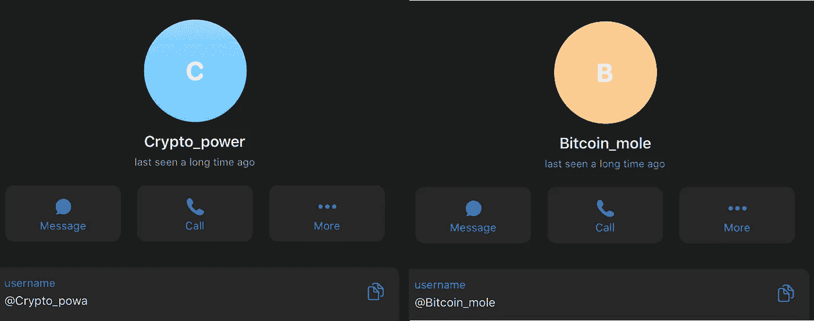
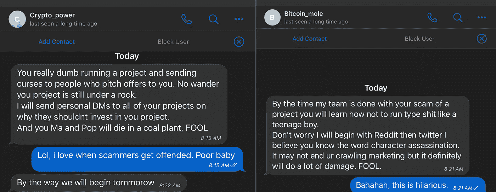

# 如何在 Crypto 中获得演出(以及如何不获得)

> 原文：<https://medium.com/coinmonks/how-to-get-gigs-in-crypto-and-how-not-to-4992bb72c526?source=collection_archive---------6----------------------->

Serious effort required, thank you.

我是几个加密货币项目和一些其他基于社交媒体的团体的社区管理员。我想我会写这篇文章来帮助那些提供合法服务的人找到他们想要联系的人。

在我们开始之前，我想让你对你所面临的情况有所了解。骗子淹没了加密货币项目的社交媒体群。继骗子之后，平庸服务的报价是第二多产的。

我怎么强调这个事实都不为过。

This person is immediately and utterly ignored

上面的“全栈”不符合我下面给出的每一条指导原则，很可能是一个骗子。我怎么能做出这样的假设呢？

因为我们已经 ***认识了*** 他们。我们了解他们，因为多年来，我们已经和他们的方法的翻版打过几百次交道。一开始，是的，我们上当了。我们给了他们 100 美元，他们却携款潜逃了。或者他们做了一些半途而废的链接丢弃。或者他们进入 25 个电报频道，说“<在这里插入硬币>是纵容！Woot！”

我们，社交媒体管理员，团队成员和加密项目的社区，已经了解他们。我们知道他们可怕的方法，他们可怕的 You-tube 频道，他们虚假的<insert coin="" here="">社区。</insert>

这篇文章不是给他们看的，它取笑他们。

这篇文章是写给那些试图为加密项目提供服务(通常是营销)的人的。我以这种方式开始这篇文章，以帮助解释为什么当你带着你的“营销想法”来到一个社区时，我们不相信你。这就是为什么，当你直接给我发信息的时候，我会用我的键盘快捷键告诉你“死在火里”。那我就屏蔽你。然后，我会将你从社区和与该项目相关的所有其他渠道中删除。

这篇文章回答了一个常见的问题:

> “但是，如果你不提供信息，刚起步的人如何获得他们需要的信息呢？”

# 信任是一个水桶，一次只能装满一滴

The Goal: A bucket full of trust, but even partially filled is better than empty

本文的其余部分是关于装满水桶。大多数人在最初的 10 秒钟内就放弃了。当项目信任你时，他们会听你的。

## 我们不关心你

大多数项目都有经验丰富的领导、顾问和社区管理员，他们能很快发现并清除垃圾邮件和诈骗。那么，为什么你会在电报聊天中说“我有一个营销想法，想和团队分享一下。我联系谁？”

你到底是谁？为什么会有人在乎你的欲望？你花了零分钟建立融洽关系，为什么你会认为人们会给你一天的时间？99.9%的时候，这些“想法”都是诈骗方法、极低质量的服务或彻头彻尾的骗局。那么，当我们每天都被这些淹没时，我们为什么要假设你的努力是特别的呢？如果你想让人觉得你有什么特别的，那么 ***就是*** 特别！

## 我们观察你的行为

Too many people assume that whining leads to success

很多时候，人们在聊天时会问类似“我该联系谁……”他们所要求的是有人把信息放在银盘上，上面放一颗樱桃。好像其他人必须为他们工作。我们故意设置小路障来过滤掉渣滓。当这些人被视为骗子时，他们会做以下四件事之一:

1.  他们不停地重复自己的话，当然是善意的，希望有人能给他们一个答案。(提示:我们不会在社交媒体上给出项目负责人的联系信息，因为如上所述，99.9%的“提议”都是糟糕的、无用的或骗局)。这些人通常会被静音一天。
2.  **他们发脾气**。他们会生气。他们互相指责。就像一个得不到想要的东西的孩子。为什么我们会花时间和你在一起，当你在加入社区的前五分钟就发脾气的时候？在我们截屏发脾气后，这些家伙就被封杀了。令人震惊的是，他们从来没有因为任何事情被雇佣过。
3.  **他们威胁**。好像发脾气还不够，他们从他们的一个 alt 用户账户给我发信息。他们会威胁使用他们令人惊讶的平庸技能在社交媒体上抨击这个项目。然后他们会试图，以某种方式，放大我的“死于火灾”的评论，并告诉我他们将如何伤害我。但是他们没有读过这篇文章，所以他们不知道我真的不关心他们。他们也从社区获得截屏、屏蔽和全球禁令。
4.  **提高**。看到有人改变路线，或者至少真正理解我们为什么以这种方式管理团队，这是一种非常美妙的感觉。当管理员告诉他们如何获得他们正在寻找的信息时，这种改进是以实际倾听的形式出现的。他们将参与社区，寻求帮助，分享相关信息，也许描述他们已经完成的一些工作。*他们干活去填桶。*

*如果你是一个经验丰富的商人，营销或其他方面的，那么我到目前为止所说的一切都不令人惊讶。我们假设，如果你是专业人士，那么你会表现得很专业。*

*这意味着，你有兴趣和动力去熟悉你要推销的项目。这也意味着你不需要被灌输所有的东西，比如:你应该联系谁来推销你的产品。但是对于那些刚开始的人来说，这里有一个可能的工作流程。*

* [## 最佳免费加密交易机器人——前 16 名比特币交易机器人[2021]

### 2021 年币安、比特币基地、库币和其他密码交易所的最佳密码交易机器人。四进制，位间隙…

medium.com](/coinmonks/crypto-trading-bot-c2ffce8acb2a) 

## 查看项目网站

通读整本书。因为，我提到我们不关心你，我们也不关心你要说什么。所以当你说要雇用你时，最好是相关的，否则我们会以禁令的形式把你扫地出门。所以看网站。你不需要理解技术是如何工作的，你需要理解它的用途和项目想要达到的目标。

在项目的网站上，你通常会找到联系方式。它将是通用的，类似于“info@cryptoproject.com”，但它通常会被读取。你也可以找到一个论坛。你会发现项目参与的社交媒体平台。

你也可以找到团队领导。这就是 LinkedIn 等其他社交媒体平台有用的地方。你可以在那里找到如何联系特定人的信息。但是不要超越你自己。在 LinkedIn 上给 Elon Musk 发一条 DM 可能会导致你的信息被完全忽略。在最好的情况下，它将通过他雇佣来管理他的社交媒体的走狗进行过滤。对于加密项目也是如此。我不认为通过 LinkedIn 直接发送信息就能得到你想要的东西。但它很可能会被别人读到，所以:要特别。直接点。简洁点。具体点。展示你不只是把意大利面扔在墙上，希望有东西粘在上面。

## 做一个真实的人

如果你花了零分钟来创建你的账户，以一种表明你是一个有情感的人的方式，没有人会回复你。我不会和网上的一些随机的人一起工作。用你的名字。给你的图标一些个性。对自己有一个描述。加入相关渠道。

## 建立融洽关系

好吧，你熟悉了这个项目，你知道谁是谁，我有办法知道你的账户背后有一个人。现在怎么办？

**说话。**

在社交媒体上，你可以简单地与社区互动。提供有趣的想法。帮助比你懂得少的人。告诉人们你是做什么的。讲一个有趣的故事。告诉人们你正在做的与项目相关的事情。避开性暗示和种族歧视。避开 cryptobro 的谈话，比如“加油！”还是“文月亮？”或者“这枚硬币只是需要更大的交换”。你很无聊，而且你没有装满水桶。你希望你的谈话能包容尽可能多的人。

在社交媒体平台上，你可能会发现项目负责人将在何时何地出现的公告。此外，好的项目会让他们的团队领导加入聊天。这是你的机会！在聊天中跟他们聊！

**亲自或在线参加会议。**

加密项目领导人在这些活动中非常容易接近，大多数人都很乐意亲自交谈。通过面对面交谈，人们可以更好地评估你的沟通、你的信心和你的奉献精神，而不是在短信应用程序上发短信。因此，与你想向其推销的项目负责人面对面交流。

**转到加密特定事件**

到处都有很多这样的东西。每个城市都有秘密之夜。有教育性的会面。有秘密慈善机构试图在你的领域提供帮助。去找他们，加入他们，你会遇到最终需要你服务的加密人。一般来说，亲自建立关系网是你的朋友。

# 不要做什么

这是一个非常简单的列表。对于那些不是骗子或者不擅长诈骗的人来说，这是显而易见的。

1.  DONT 试图跳过适当的沟通渠道(如上所述)。你会被忽略。
2.  不要直接留言。出于对神圣事物的热爱，除非特别要求，否则不要发送 DM。如果你在想，“如果我直接给管理员发消息会更快”，那就打自己一巴掌，不要这么做。除非你想被告知死于火灾。
3.  DONT 当人们在你想要的时候没有给你想要的东西时，你会发牢骚，变得粗暴。在那之后为什么还会有人想和你一起工作？你在展示这种体验会是什么样的。

## 不要做什么的例子

只是为了好玩，我想我会分享我最近的经验。这个人打破了每一条规则。

It started like this

这个项目有一个完整的市场部。如果他们上了网站，就会知道这一点。大多数“影响者”完全是一个笑话，纯粹的 30 分钟的畏缩。为什么是劳埃德？我怎么可能认为这里有什么特别的呢？我为什么要在这上面浪费时间？这并不违反在我们社区发帖的任何规则，但它没有得到答复。

然后，这两个可爱的 DM 我。

I’m sure these are actual pictures of Lloyd and Russ and that is their true phone number

DM 与上面的内容完全相同，但是内容更加缺乏内容。天哪，累死了。告诉他们死于火灾，等到阅读它，屏幕捕捉，阻止，并禁止主聊天。在主聊天中不经邀请就允许他人加入，这违反了他们加入时注册的社区规则。即时禁令。

好吧，接下来的部分很少见，但确实发生了。通常骗子会走开。他们每天试图打电话给几十个人，当他们已经暴露时，抱怨和抱怨对他们没有好处。但不是这两个密码王！

不到一小时,“Crypto_Power”和“Bitcoin_Mole”给我发来了威胁性的短信，其中提到了之前的信息。我是说，说到试镜明显队长！

These are fine samples of the cryptosphere

Well the Crypto Kings really went all out.

他们引用了我的评论，但没有引用这个项目。很有可能他们遇到了太多的项目，以至于他们不知道他们威胁的是哪一个。别介意，我不做项目。我帮助管理一个电报组。去吧，记下电报，你这个卑鄙小人。

# 包裹

无论如何，我希望这篇文章对那些问“但是我如何联系到我想向其出售服务的人？”的人有所帮助我还希望，对于那些合法地试图向密码部门推销服务的人，你可以理解为什么你会得到如此简洁，甚至是无礼的回应。

如果很容易，每个人都会去做…然后就不盈利了。

其他 Telegram 和 Discord 社区管理员请注意:让我们把“死于火灾”作为直接消息中对这些请求的标准实际回应，这样我就不会看起来像个怪人。

> 加入 [Coinmonks 电报频道](https://t.me/coincodecap)，了解加密交易和投资

## 另外，阅读

*   [什么是保证金交易](https://blog.coincodecap.com/margin-trading) | [美元成本平均法](https://blog.coincodecap.com/dca)
*   [BigONE 交易所评论](/coinmonks/bigone-exchange-review-64705d85a1d4) | [电网交易机器人](https://blog.coincodecap.com/grid-trading)
*   [3 商业评论](/coinmonks/3commas-review-an-excellent-crypto-trading-bot-2020-1313a58bec92) | [Pionex 评论](/coinmonks/pionex-review-exchange-with-crypto-trading-bot-1e459d0191ea) | [Coinrule 评论](/coinmonks/coinrule-review-2021-a-beginner-friendly-crypto-trading-bot-daf0504848ba)
*   [莱杰 vs Ngrave](/coinmonks/ledger-vs-ngrave-zero-7e40f0c1d694) | [莱杰 nano s vs x](/coinmonks/ledger-nano-s-vs-x-battery-hardware-price-storage-59a6663fe3b0) | [币安评论](/coinmonks/binance-review-ee10d3bf3b6e)
*   [Bybit Exchange 审查](/coinmonks/bybit-exchange-review-dbd570019b71) | [Bityard 审查](/coinmonks/bityard-review-7d104239be35) | [CoinSpot 审查](https://blog.coincodecap.com/coinspot-review)
*   [3 commas vs crypto hopper](/coinmonks/3commas-vs-pionex-vs-cryptohopper-best-crypto-bot-6a98d2baa203)|[赚取加密利息](/coinmonks/earn-crypto-interest-b10b810fdda3)
*   最好的比特币[硬件钱包](/coinmonks/the-best-cryptocurrency-hardware-wallets-of-2020-e28b1c124069?source=friends_link&sk=324dd9ff8556ab578d71e7ad7658ad7c) | [BitBox02 回顾](/coinmonks/bitbox02-review-your-swiss-bitcoin-hardware-wallet-c36c88fff29)
*   [BlockFi vs Celsius](/coinmonks/blockfi-vs-celsius-vs-hodlnaut-8a1cc8c26630)|[Hodlnaut 点评](/coinmonks/hodlnaut-review-best-way-to-hodl-is-to-earn-interest-on-your-bitcoin-6658a8c19edf) | [KuCoin 点评](https://blog.coincodecap.com/kucoin-review)
*   [Bitsgap 审查](/coinmonks/bitsgap-review-a-crypto-trading-bot-that-makes-easy-money-a5d88a336df2) | [Quadency 审查](/coinmonks/quadency-review-a-crypto-trading-automation-platform-3068eaa374e1) | [Bitbns 审查](/coinmonks/bitbns-review-38256a07e161)*