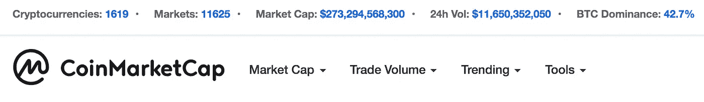
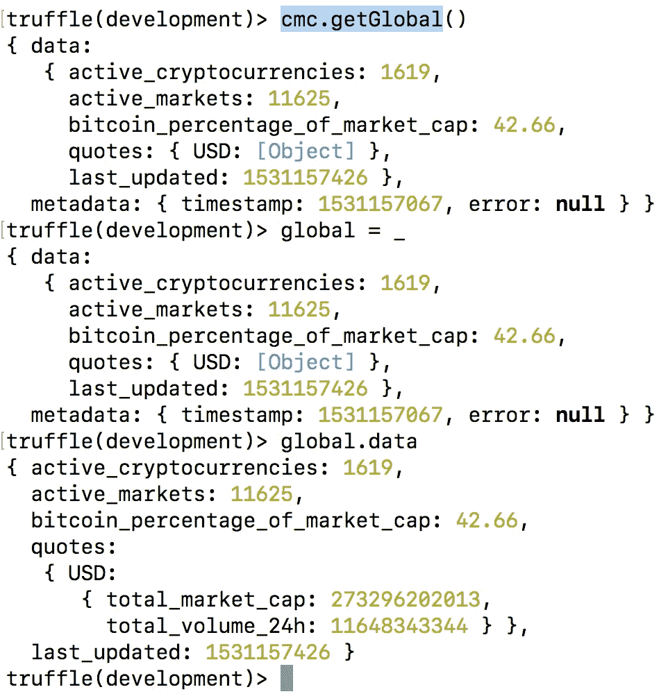
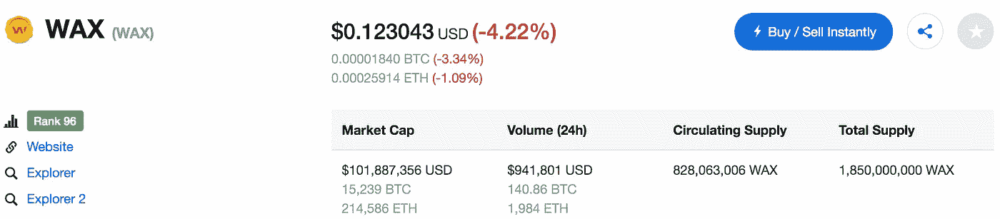
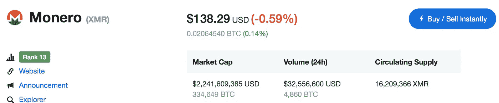

# 如何获得全球加密市场数据和大概的价格信息

> 原文：<https://medium.com/coinmonks/how-to-get-global-crypto-market-data-and-approximate-price-info-4dea89a795e1?source=collection_archive---------5----------------------->

## 使用[coin market cap](http://coinmarketcap.com)API # how to guidl(6/n)

获取加密货币和代币信息的方式有很多种。如果你对探索感兴趣，这里有一些想法，可以帮助你开始用价格、交易量或排名数据建立自己的网站。请注意，这不是一个全面的可用资源套件，但我会不时更新这个博客，用各种方法获取市场数据。

[CoinMarketCap](http://coinmarketcap.com) 是一个包含一系列基本加密市场事实和数据的网站。你会看到加密货币、市场、市值、24H 量和 BTC 优势的总数。然后出现所有可用的加密货币和代币的列表，按照它们的顺序列出——你猜对了——硬币市值，这只是流通中的数字乘以当前价格的任意数字。它被用作比较硬币的一种方法。我们可以在代码中获得与网站上看到的相同的信息。

让我们首先安装用于 CMC 的开源 javascript RESTful API 包装器。
我使用的是[tiaanduplessis/coinmarketcap-API](https://github.com/tiaanduplessis/coinmarketcap-api)的[分叉版本](https://github.com/emmonspired/coinmarketcap-api-1)。
完整的 API 文档可以在这里[阅读。](https://coinmarketcap.com/api/)

```
npm install coinmarketcap-api`
```

现在它已经在我们的项目中可用了，获取对库的引用，并实例化 API 对象的一个实例。

```
CMC = require("coinmarketcap-api")
cmc = new CMC();
```



使用`cmc.getGlobal()`异步函数获得相同的信息。



响应返回的是用`active_cryptocurrencies`、`active_markets`、`bitcoin_percentage_of_market_cap`填充的`data`属性，以及用`total_market_cap`和`total_volume_24h`填充的`quotes.USD`属性。如果您愿意，您可以使用相同的数据创建一个网站，但以不同的方式进行设计。

接下来，让我们研究如何获取所有可用的不同货币的信息。也许你对找出某个硬币的 id 感兴趣，比如 Monero。

`cmc.getListings()`异步函数将返回全套硬币:

```
{ data: [  
{ id: 1, name: 'Bitcoin',  symbol: 'BTC', website_slug: 'bitcoin'},
{ id: 2, name: 'Litecoin', symbol: 'LTC',website_slug: 'litecoin'},
{ id: 3, name: 'Namecoin', symbol: 'NMC',website_slug: 'namecoin' },
// ... more items ],
  metadata: { timestamp: 1531157458, num_cryptocurrencies: 1619,  error: **null** } }
```

注意每枚硬币都有一个`id` `name` `symbol`和`website_slug`。
`listings.data.length`是与`active_cryptocurrencies`相匹配的`1619`。

现在让我们搜索第一个名为“Monero”的列表。

```
xmr = listings.data.filter(l => l.name === 'Monero' )[0];
{ id: 328, name: 'Monero', symbol: 'XMR', website_slug: 'monero' }
```

我们将使用它来查找关于该货币的一些细节，因为 API 的另一部分需要它。用我们的变量属性来引用它:`xmr.id`。

让我们对另一个符号为`WAX`的密码做同样的事情。

```
wax = listings.data.filter(l => l.symbol === 'WAX' )[0];
{ id: 2300, name: 'WAX', symbol: 'WAX', website_slug: 'wax' }
```

太好了。我们现在可以向 API 请求关于`xmr`和`wax`的股票信息。

有一个带可选参数的异步函数`getTicker`:

`cmc.getTicker({id:wax.id})`

```
{ data: { id: 2300, name: 'WAX', symbol: 'WAX', website_slug: 'wax', rank: 96, circulating_supply: 828063006, total_supply: 1850000000, max_supply: **null**, quotes: { USD: { price: **0.123043**, volume_24h: 941801, market_cap: 101887356, percent_change_1h: 0.21, percent_change_24h: -4.22, percent_change_7d: -6.92 } }, last_updated: 1531158940 }, metadata: { timestamp: 1531158616, error: **null** } }wax_ticker = _;
```



同样，您会注意到`data.quotes.USD.price`与您在网站上看到的值相同(截至这个日期和时间:$0.123043)。

让我们对`xmr`做同样的事情:

`cmc.getTicker({id:xmr.id})`

```
{ data: { id: 328, name: 'Monero', symbol: 'XMR', website_slug: 'monero', rank: 13, circulating_supply: 16209366, total_supply: 16209366, max_supply: **null**, quotes: { USD: { price: **138.291**, volume_24h: 32556600, market_cap: 2241609385, percent_change_1h: 0.56, percent_change_24h: -0.59, percent_change_7d: -0.16 } }, last_updated: 1531159466 }, metadata: { timestamp: 1531159117, error: **null** } }xmr_ticker = _;
```

我们再次看到 API 返回的价格信息与站点匹配。



现在我们已经在`wax_ticker`和`xmr_ticker`中存储了两个不同的报价，我们可以做一些快速的数学计算来近似 WAX 和 XMR 之间的转换率。

```
xmr_price = xmr_ticker.data.quotes.USD.price; // 138.291
wax_price = wax_ticker.data.quotes.USD.price; // 0.123043
xmrwax = xmr_price / wax_price; // 1123.9241565956618
```

我们可以从该信息中得出，大约需要 1124 个`wax`代币才能在单个`xmr`代币中获得相同数量的美元价值。或者你可以这样想:1 个 Monero 代币可以买你~1124 个蜡代币。

大多数交易所使用常见的碱基对，如 BTC/美元或瑞士联邦理工学院/BTC，或 XMR/BTC，但通常不会发现列出的不常见的碱基对。既然你现在知道了如何获得给定股票的价格信息，你就可以使用`coinmarketcap-api`为自己获得一个好的估价，也许还可以在你的网站上构建一个定制股票。

请记住，CoinMarketCap 上的价格信息可能会延迟，并且不会准确反映给定货币的买卖价差。因此，这些数据只能用于提供信息，而不能用于交易或风险管理决策。如果没有别的，我希望它能引发你对其他东西的好奇心，甚至是一种更方便用户的方式来比较完全不相关的货币。

在上面的例子中，我们在`truffle console`中运行函数，但是如果你需要等待一个函数的结果，你会想要利用便利的`async/await`库。我在这里提供了一个简短的例子供您参考。`get_cmc_price_in_usd`是一个`async`函数，它接受一个`id`并返回一个`Promise`，当`getTicker`结果可用时，该函数将被解析。可以为任何其他 API 数据编写类似的函数。

```
const async = require('asyncawait/async');
const await = require('asyncawait/await');async function get_cmc_price_in_usd(cmc_id) { return new Promise(function(res, rej) {

          cmc.getTicker({id:cmc_id}).then( function(t) {
            res(t.data.quotes.USD.price);
          } ); });
};let xmr_price = await get_cmc_price_in_usd(xmr.id);
```

在下一篇文章中，我们将看看如何从 Kucoin 这样的交易所获得更准确和最新的价格信息。CoinMarketCap 可以用于一次性探索，并为您提供更长时间的价格参考点，但交易决策应基于实时价格数据。

*Dan Emmons 是区块链开发者，*[*Emmonspired LLC*](http://www.emmonspired.com/)*所有者，a* [*认证比特币专业人士*](http://cryptoconsortium.org/lookup/6f0d14) *，认证以太坊开发者，全栈开发者，加密货币项目顾问。他还是一个名为*[*# ByteSizeBlockchain*](https://www.youtube.com/watch?v=SVBZ7mdgGcA)*的 Youtube 频道和 iTunes 播客的创造者。*