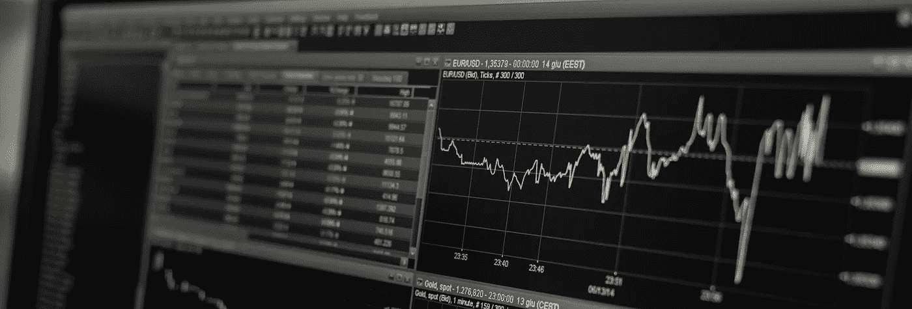

# 如何获取历史加密货币数据

> 原文：<https://medium.com/coinmonks/how-to-get-historical-crypto-currency-data-954062d40d2d?source=collection_archive---------0----------------------->

## 通过 exchange APIs 下载分钟分辨率 OHLC 数据

## 更新:

由于对此事的普遍兴趣，我创建了一个数据集，包括来自 *Bitfinex* 交换 API 的所有 OHLC 数据，并将其作为 [**公共数据集上传到 Kaggle**](https://www.kaggle.com/tencars/392-crypto-currency-pairs-at-minute-resolution) 上。

## 介绍