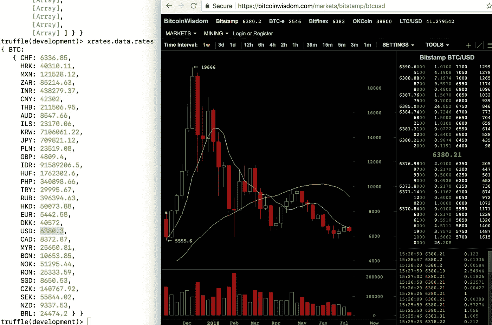
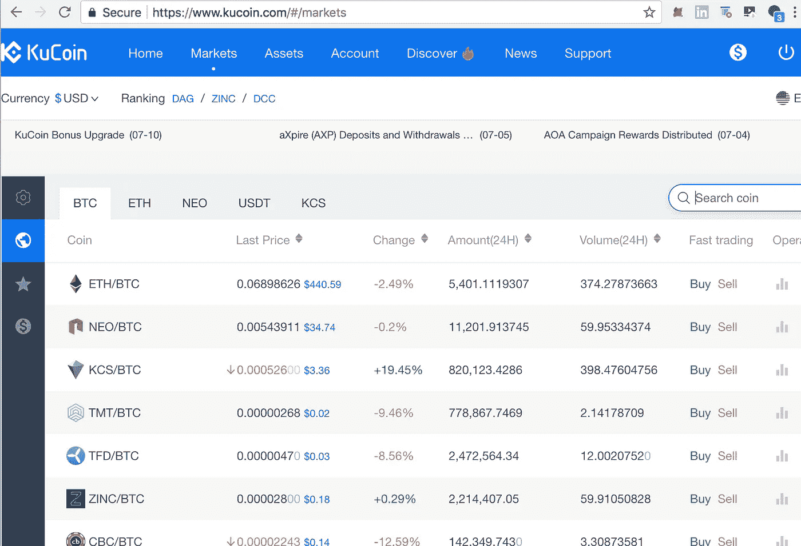
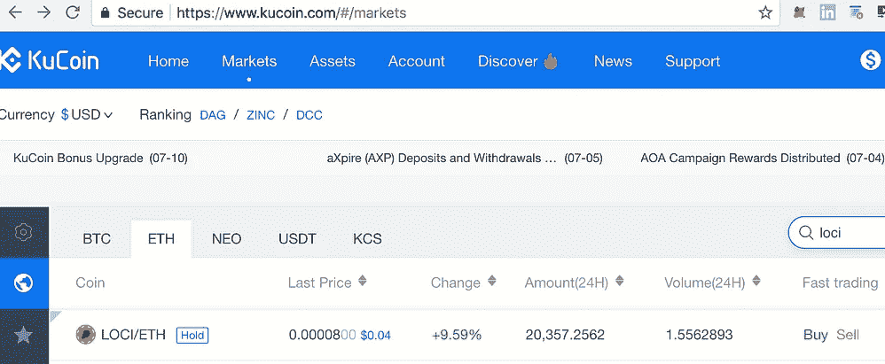
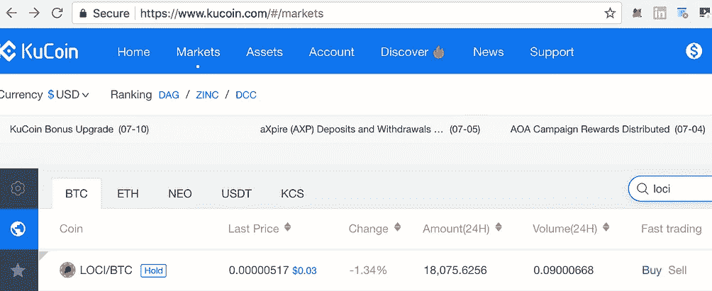
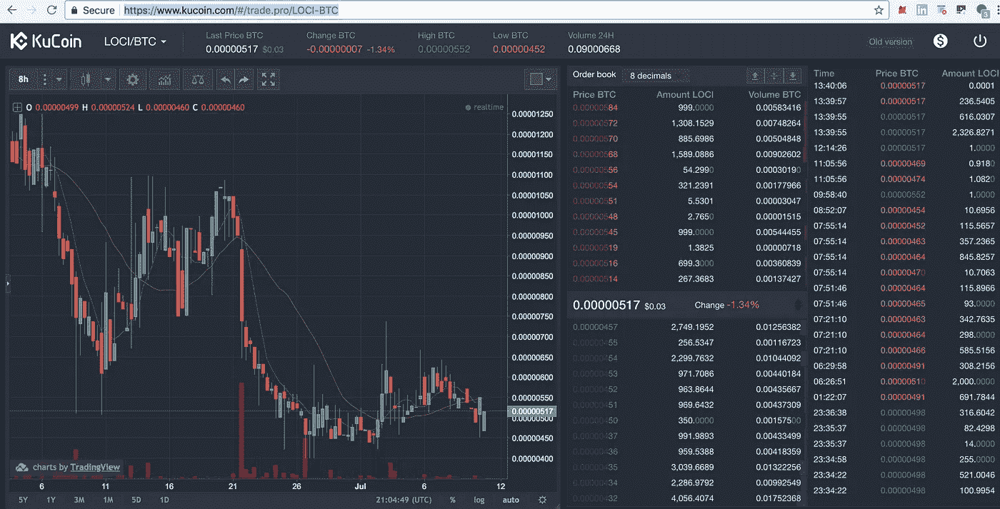
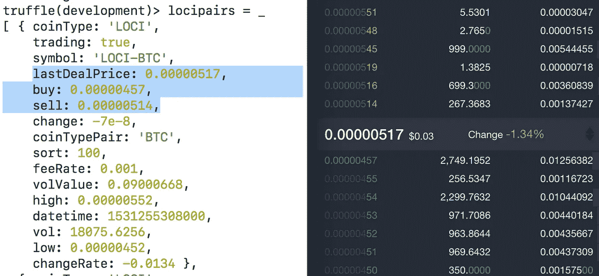
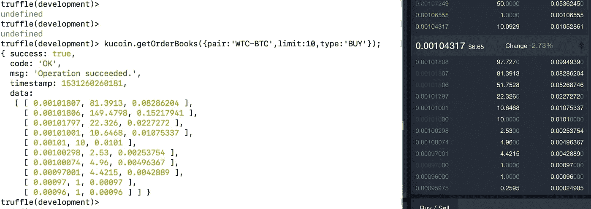
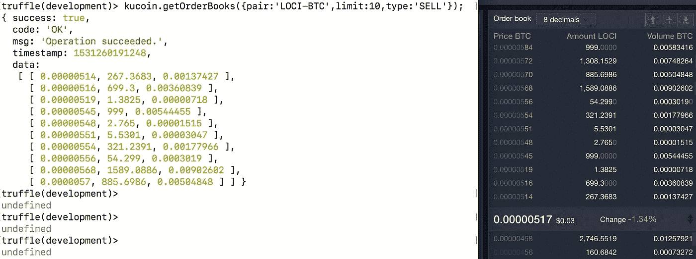
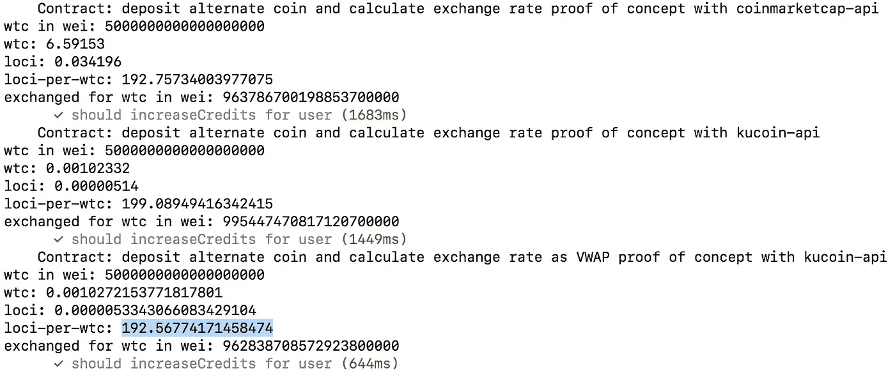

# 如何获得实时加密市场数据

> 原文：<https://medium.com/coinmonks/how-to-get-real-time-crypto-market-data-522a102f7f4a?source=collection_archive---------2----------------------->

## 使用[库币](https://www.kucoin.com)交换 API # how to guidl(7/n)

> 在上一篇文章中，我们关注于获取任何交易所上市的任何加密货币或 ERC20 令牌的大致价格数据。一些从事 crypto 的人不一定需要最新的数据，所以关于使用 CoinMarketCap API 的[的文章可能就足够了。它提供了“足够好”的数据，让人们对整个市场有了一些了解。对于那些试图实际建立业务，用代币交换商品和服务，经营商店，为密码出售物品，或活跃的交易者，CMC 只是不够好。](/coinmonks/how-to-get-global-crypto-market-data-and-approximate-price-info-4dea89a795e1)
> 
> 你在 crypto 呆的时间越长，在某些时候你会需要更准确的数据。要获得这些信息，你需要一个市场数据服务提供商，或者更直接地说，一个交易所本身。

对于这组代码示例，我们将看看#构建一个命令行工具或定制的 web 应用程序，用于从 [K](https://www.kucoin.com) ucoin API 请求当前的贸易数据。你甚至可以大胆地创建一个定制的 [AirSwap 团队](https://medium.com/u/b501917dd00d?source=post_page-----522a102f7f4a--------------------------------) maker，这样你就可以与#去中心化市场工具集成，让你安全地参与原子互换。" [AirSwap 不仅仅是一个市场，而是一个安全的消费者令牌交易网络，只能通过真正去中心化的点对点协议才能存在。当您在 AirSwap 上进行买卖时，您是在与世界各地的其他人进行交易，在买方、卖方和智能合约之间进行钱包对钱包的交易。没有摩擦，没有监护，没有费用。](https://blog.airswap.io/the-app-store-of-ethereum-is-powered-by-tokens-25a3af0f71da)”

> [发现并审查最佳加密 api 提供商](https://coincodecap.com/category/crypto-api)

做市商通过建议一种数量的代币对另一种数量的代币的汇率来提供流动性，接受者接受出价或报价，从而创建了一种原子代币互换，如果没有当前针对 BTC 进行两种不同交易的集中选项，这种互换实际上是不可能的。现在，如果你想为 AirSwap 创建自己的制造商，你最好有一些关于当前市场价格的信息，所以我们将研究你如何通过 Kucoin 获得这些信息。

> AirSwap 是在考虑到做市商的情况下从头开始构建的。我们已经为 [JavaScript 和 Python](https://github.com/airswap/developers) 发布了交换协议客户端，快速入门指南即将发布。— [唐·莫斯提斯](https://medium.com/u/19fca2ef04ea?source=post_page-----522a102f7f4a--------------------------------)

[Kucoin](https://www.kucoin.com) [是一家总部位于香港的中国数字货币交易所](https://intro.kucoin.com/)。我在这个例子中选择它，是因为在这里列出一枚硬币通常比像币安这样的东西更容易或更实惠，因此，它包含了我将在我的例子中使用的一些硬币。此外，这似乎是一个更可靠的交流，据我所知，没有遭受任何安全漏洞。作为一个额外的奖励，Kucoin 与 KCS 代币持有者分享费用利润，因此用户有动力持有代币作为被动股息收入。这在集中式加密交换中有点罕见。让我们开始吧。

让我们为 Kucoin 安装开源的 javascript RESTful API 包装器。
我使用的是[satoshinaire/ku coin-API](https://github.com/Satoshinaire/kucoin-api)的[分叉](https://github.com/emmonspired/kucoin-api)版本。
完整的 API 文档可以在这里[阅读。
特别感谢](https://kucoinapidocs.docs.apiary.io/#) [Satoshinaire](https://medium.com/u/9b53b1fd5a7e?source=post_page-----522a102f7f4a--------------------------------) 的 API 包装器！

```
npm install kucoin-api
```

现在它已经在我们的项目中可用了，获取对库的引用，并实例化 API 对象的一个实例。

```
Kucoin = require("kucoin-api");
kucoin = new Kucoin(); // read only, not passing in API (key,secret)
```

## 探索 API

让我们用 async `getCoins`函数获得所有可用硬币的列表。

```
kucoin.getCoins();
coins = _;
```

现在我们来检查一下。我们会在列表中看到和网站上一样的 177 枚硬币。

`coins.data.length; //177`

`locicoin = coins.data.filter(c=> c.coin==’LOCI’)[0];`

```
{ withdrawMinFee: 4, coinType: 'ERC20', withdrawMinAmount: 10, withdrawRemark: **null**, orgAddress: **null**, txUrl: 'https://etherscan.io/tx/{txId}', userAddressName: **null**, withdrawFeeRate: 0.001, confirmationCount: 12, infoUrl: **null**, enable: true, name: 'LOCIcoin', tradePrecision: 4, depositRemark: **null**, enableWithdraw: true, enableDeposit: true, coin: 'LOCI' }
```

位点的 JSON 表示告诉我们一些有趣的事情。我们可以确定它是一个 ERC20 `coinType`，您必须至少有 10 个才能提取，有一个 4 硬币`withrawMinFee`用于任何转出交易所，任何转入交易所必须等待 12 `confirmationCount`才能计算任何余额。

```
kucoin.getLanguages();{ success: true, code: 'OK', msg: 'Operation succeeded.', timestamp: 1531253711223, data: [ [ 'en_US', 'English', true ], [ 'ru_RU', 'русский', true ], [ 'ko_KR', '한국어', true ], [ 'pt_PT', 'Portugues', true ], [ 'zh_CN', '中文简体', true ], [ 'nl_NL', 'Nederlands', true ], [ 'zh_HK', '中文繁体', true ], [ 'de_DE', 'Deutsch', true ], [ 'fr_FR', 'Français', true ], [ 'es_ES', 'Español', true ], [ 'vi_VN', 'Tiếng Việt', true ], [ 'tr_TR', 'Türkçe', true ] ] }languages = _;
```

嗯。好的。Kucoin 在现场提供支持。非常适合国际化。一定有办法通过 API 改变用户的首选语言。我年轻的时候学过一些西班牙语，但是现在我不会去管它。美式英语`en_US`就可以了。

虽然这一切都很有趣，但这不是我们来这里的目的。有时简单地探索一个 API 并在代码中摆弄它是必要的，只是为了获得你的方向并确定你能做什么和不能做什么。初级开发人员通常不理解“软件开发”不仅仅是整天敲打精确的代码。它包括探索、计划、导航代码，当然还有写作，但更多的是阅读你没有写的代码，而且通常那些写了的代码已经不在公司了。这是你通过检查其他项目和学习如何浏览新代码库而积累的经验的一部分。

## Papa 比特币的汇率

有个函数叫`getExchangeRates`。听起来像是我们真正感兴趣的事情。

```
kucoin.getExchangeRates();
xrates = _;
```

现在`xrates.data.currencies`包含了一个【名称，符号】对的数组列表。

```
[[ 'USD', '$' ], [ 'EUR', '€' ], [ 'AUD', '$' ], ... ]
```

而`xrates.data.rates`包含一个用于`BTC`的属性，该属性是这些货币到该货币中的值的映射:

```
BTC : { /*...*/ EUR: 5442.33, DKK: 40570.1, **USD: 6380.3**, /*...*/ }
```

现在，这些汇率一直在变动，所以我真的不能从我提取汇率时抓取一个准确的截图，但是如果我看一下 Bitstamp 报告的 BTC/美元汇率，它也是~ **6380** 。由于库币没有真正的美元法币交易对，你能得到的最接近的是比较 BTC/USDT，这是一对与“稳定的硬币”称为 USDT 或系绳。



bitcoinwisdom.com/markets/bitstamp/btcusd

因此，如果你有一个在 BTC 定价的股票，比如 LOCI/BTC，你可以用当前价格乘以`xrates.data.rates.BTC.USD`得到等值的美元价格。

## 交易对和价格数据

那么，我们如何通过 Kucoin Exchange API 找到可用的交易符号对呢？嗯，有个`getTradingSymbols`功能。这比仅仅`getCoins`更进一步。不是每个硬币都有所有的`BTC`、`ETH`、`NEO`、`USDT`和`KCS`对。大多数只有`BTC & ETH.`

```
kucoin.getTradingSymbols();
symbols = _;symbols.data.length; // 353 
```

你可以在 Kucoin 网站的市场屏幕上看到这个图表。



https://www.kucoin.com/#/markets

所以我们可以看到交易符号对比硬币多，这是我们预料到的。在我们之前的`getCoins`例子中，`locicoin`是一枚硬币，而

`locipairs = symbols.data.filter( s=> s.coinType === locicoin.coin );`

是一套所有对为`locicoin.coin`(硬币属性为`'LOCI'`)。

```
[ 
{ coinType: 'LOCI', trading: true, symbol: 'LOCI-BTC', lastDealPrice: **0.00000517**, buy: 0.00000457, sell: 0.00000514, change: -7e-8, coinTypePair: 'BTC', sort: 100, feeRate: 0.001, volValue: 0.09000668, high: 0.00000552, datetime: 1531255308000, vol: 18075.6256, low: 0.00000452, changeRate: -0.0134 },{ coinType: 'LOCI', trading: true, symbol: 'LOCI-ETH', lastDealPrice: 0.00008, buy: 0.0000675, sell: 0.000081, change: 0.000007, coinTypePair: 'ETH', sort: 0, feeRate: 0.001, volValue: 1.55628934, high: 0.00008, datetime: 1531255308000, vol: 20357.2562, low: 0.0000652, changeRate: 0.0959 }

]
```

因此，当我们转到市场屏幕并使用`loci`的过滤/搜索小部件时，我们可以看到它果然作为`LOCI-BTC`和`LOCI-ETH`对进行交易。



Filtered [https://www.kucoin.com/#markets](https://www.kucoin.com/#markets) page.

注意`LOCI-BTC`的价格在用户界面上被列为`0.00000517(BTC)`。这与我们在下面的`locibtcpair`中检索到的实时数据相匹配。

```
locibtcpair = locipairs.filter( p=> p.coinTypePair === 'BTC' )[0];
locibtc = locibtcpair.lastDealPrice; // 0.00000517lociusd = locibtc * xrates.data.rates.BTC.USD; // 6380.30 is BTCUSD
```

现在我们可以把那个`locibtc`转换成`lociusd` = $0.032986151 或者~$0.03。
可以肯定的是，如果我们打开 Kucoin 上的图形交易界面，我们看到的是 0.03 美元。



[https://www.kucoin.com/#/trade.pro/LOCI-BTC](https://www.kucoin.com/#/trade.pro/LOCI-BTC)

在我们继续之前，让我们看看`locibtcpair`的其他一些属性，看看是否还有其他有用的东西。果然，有一个`buy`和`sell`属性，匹配了订单簿中的最高买价和卖价。



locipairs[0].buy is the highest bid, locipairs[0].sell is the lowest offer

`buy`表示最高出价`0.00000457 BTC per LOCI`，而`sell`表示最低出价`0.00000514 BTC per LOCI`。我们也可以在出价中称之为 457 satoshis(或简称为 sats ),在出价中称之为 514 sats。买卖差价就是价差。在交易量较低的硬币中，这种差价可能很大，因为在每个价格水平上没有足够的交易量。如果你试图确定在这个特定的时间点，你可以在市场上购买或出售多少枚硬币，这会影响你的定价。

将来，我们可以通过使用方便的`getTicker`函数更快地获得上面的信息，该函数带有一个`pair`属性参数。

`kucoin.getTicker({pair:locibtcpair.symbol}); // {pair:'LOCI-BTC'}`

这只是获取特定报价器的一种稍微有效的方式，而不是像`kucoin.getTradingSymbols()`那样一次获取所有报价器。

还记得在我们的 CoinMarketCap 示例中，我们想要确定一个`XMR`代币可以购买多少个`WAX`代币的等值美元。现在让我们用另一双鞋试试同样的东西。像`LOCI/WTC`这样的定制款怎么样？我想知道多少个`LOCI`相当于一个`Waltonchain`币。

## 首先是一些让我们生活更轻松的设置:

```
const async = require('asyncawait/async');
const await = require('asyncawait/await');async function get_kucoin_ticker_price_in_btc(pair) {
  return new Promise(function(res, rej) {          
    kucoin.getTicker({pair:pair}).then( function(ticker) {
      res(ticker.data.**lastDealPrice**); 
    });
  });
}
```

现在我们可以做一些快速呼叫:

```
let locibtc = await get_kucoin_ticker_price_in_btc('LOCI-BTC');
let wtcbtc  = await get_kucoin_ticker_price_in_btc('WTC-BTC');// locibtc = 0.00000517 BTC
// wtcbtc  = 0.00100298 BTClet loci_per_wtc = wtcbtc / locibtc; // ~194 LOCI per WTC
```

我们可以用这些信息做什么？我们可以估算出一个给定的 WTC 相对于 LOCI 的美元当量，甚至不用转换成美元。非常聪明。这意味着我们可以想出我们自己的碱基对，这些碱基对除了在你自己的网站上找不到。或者，您可以构建一个服务，在特定条件下将不同种类的令牌作为“兼容令牌”，作为交换支付的等效方法。您还可以构建一个筛选程序，显示您投资组合中的一组代币与您拥有的其他代币在相对强度基础上的表现，或者使用非陈旧数据，而不是从 Kucoin 交换数据，为您提供一个快速的方法，立即查看您可以积累的 X 代币比硬币 Y 多多少。

## 但是等等！我们还没完。

请记住，最终目标是为一组令牌提供一个定制的碱基对，这些令牌通常不会像`LOCI-BTC`那样相互列出，而是使用我们可以通过实时 exchange 数据源获得的最准确的信息。在前面的例子中，我们从`**lastDealPrice**`中获取信息，并根据它得出汇率的估计值。好像很合理吧？嗯，仅仅因为它过去在那里交易，它仍然是一个陈旧的报价，仅仅因为其他人用一些代币交易`LOCI`或`WTC`对`BTC`并不意味着确切的交易价格将再次可用。

我们不能交易我们希望存在的市场，也不能交易过去。我们只能交易*现在*实际存在的市场。如果你想把你的一些`WTC`换成等量的`LOCI`，你实际上必须在现实生活中进行两笔交易:(1)以最高的可用`bid`卖出你的`WTC`；以及(2)以最低的可用报价买入你的`LOCI`。在现实生活中，你会在两边的价差上放弃一点，所以我们的*定制碱基对* `LOCI-WTC`价格估计应该会考虑到这一点。

## 检查订单簿

*检索 LOCI-BTC 交易对的所有当前订单:*

```
kucoin.getOrderBooks({pair:'LOCI-BTC'});
books = _;{ success: true, code: 'OK', msg: 'Operation succeeded.', timestamp: 1531259489343, data: { SELL: [ [Array], [Array], [Array], [Array], [Array], [Array] ], BUY: [ [Array], [Array], [Array], [Array], [Array], [Array] ], timestamp: 1531259319987 } }
```

注意，`books.data`包含了`SELL`(报价)和`BUY`(出价)双方。我们实际上可以指定一个`type`,这样我们只获得`BUY`或`SELL`的数据，我们可以包含一个`limit`,以便从响应中引入更多行的数据。

```
kucoin.getOrderBooks({pair:'LOCI-BTC',limit:10,type:'SELL'});
loci_offers = _;kucoin.getOrderBooks({pair:'WTC-BTC',limit:10,type:'BUY'});
wtc_bids = _;
```



`wtc_bids.data`包含多行数组。每一行中的元素代表返回到用户界面上的相同数据:
`[ priceBTC, amountOfCoin, amountOfCoinInBTC ]`



`loci_offers.data`也包含数组行。每一行中的元素代表返回到用户界面上的相同数据:
`[ priceBTC, amountOfCoin, amountOfCoinInBTC ]`

`loci_offers.data`和`wtc_bids.data`中的第一个元素与从`getTickers({pair:'LOCI-BTC'}).then(t=>t.data.sell)`或`getTickers({pair:'WTC-BTC'}).then(t=>t.data.buy)`返回的元素相同。如果我们只关心最高出价和最低出价，我们可以只使用当前的 WTC 出价和 LOCI 出价，作为足够接近的实时近似值。看起来大概是这样的:

```
async function get_kucoin_price_in_btc(pair,side) {
  return new Promise(function(res, rej) {
    kc.getOrderBooks({pair:pair}).then( function(books) {
      res(books.data[side][0][0]); 
    });
  });
}let allowance =  5000000000000000000; // 5 WTC in wei (18 decimals)

let wtcprice = await get_kucoin_price_in_btc('WTC-BTC','BUY');           let lociprice = await get_kucoin_price_in_btc('LOCI-BTC','SELL'); let wtcloci = wtcprice / lociprice;  // .00101807 / .00000514 = ~198
let exchanged = wtcloci * allowance; // About 5*198 = ~990.34 LOCI
```

在这个例子中，使用买价和卖价让我们更接近 LOCI-WTC 的实时汇率，大约是 1 WTC = 198 LOCI。

## 还有一件事…

如果我们在交换非流动硬币，或者大量硬币，我们最好考虑从`getOrderBooks`数据中得到的数量。

我们可以做得更好，而不是简单地假设我们可以以最接近的`BUY`或`SELL`价格购买或出售我们的全部数量。我们可以尝试的一种方法是计算大米的 VWAP 或体积。

我们可以通过下面的方法来计算 VWAP 的粗略估计。我们将`data`行`reduce`和每个`priceBTC * amountOfCoin`相加，并将结果记为`total_price_times_volume`。
2。我们`reduce`了`data`行，把体积加起来就成了`total_volume`。
3。将`total_price_times_volume`除以`total_volume`。

下面是上述算法在实践中的编码方式

```
const sum_price_times_volume = function(total,row) { 
  return parseFloat(total) + 
    (parseFloat(row[0])*parseFloat(row[1])); 
}const sum_volume = function(total,row) { 
  return parseFloat(total) + parseFloat(row[1]); 
}async function **get_kucoin_vwap_in_btc**(pair,side) { return new Promise(function(res, rej) {
    kucoin.getOrderBooks({pair:pair}).then( function(books) {
      let total_price_times_volume =   
        books.data[side].reduce(sum_price_times_volume);      // #1
      let total_volume = books.data[side].reduce(sum_volume); // #2
      **res(total_price_times_volume / total_volume);           // #3**
    });
  });
}let allowance =  5000000000000000000; // 5 WTC in wei (18 decimals)

let wtcprice = await get_kucoin_vwap_in_btc('WTC-BTC','BUY');
let lociprice = await get_kucoin_vwap_in_btc('LOCI-BTC','SELL');let wtcloci = wtcprice / lociprice;
let exchanged = wtcloci * allowance; 
```

我们在处理实时数据，所以账面上的价格已经改变了。为了演示的目的，我编写了一个`truffle test`来看看结果。在结果中，我们将看到使用陈旧的`coinmarketcap-api`数据、略显幼稚的`bid`和`ask`价格以及使用上述`**get_kucoin_vwap_in_btc**` 方法的最终结果之间的细微差别。



请注意`loci-per-wtc`费率是如何根据所提供的定价数据源而变化的，对于单个用例来说，这似乎没有太大的区别。然而，对于重复转移或相对较大的交易量来说，这可能意味着天壤之别。

## 关键要点

*   支持实时数据而非陈旧数据，以获得准确的定价数据。
*   如果可能，从数据源获取数据，如`kucoin-api`对`coinmarketcap-api`
*   考虑一下利差的实际情况。
*   利用*当前订单簿*数据计算实际数量。
*   将订单簿数据整合到一个 *VWAP* 中，以获得更好的结果。

如果你对如何使用 API 有更多的想法，请在下面留下你的评论！

*丹·埃蒙斯(Dan Emmons)是一名区块链开发者，* [*埃蒙斯皮雷德有限责任公司*](http://www.emmonspired.com/) *，一名* [*认证比特币专业人士*](http://cryptoconsortium.org/lookup/6f0d14) *，认证以太坊开发者，全栈开发者，加密货币项目顾问。他还是一个名为*[*# ByteSizeBlockchain*](https://www.youtube.com/watch?v=SVBZ7mdgGcA)*的 Youtube 频道和 iTunes 播客的创作者。*