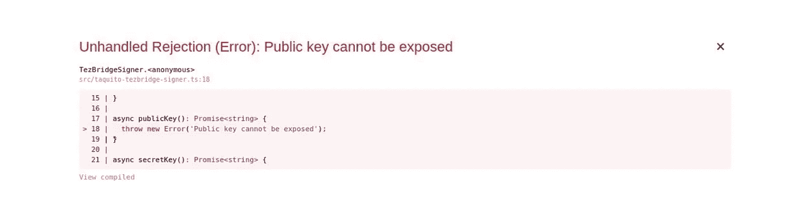
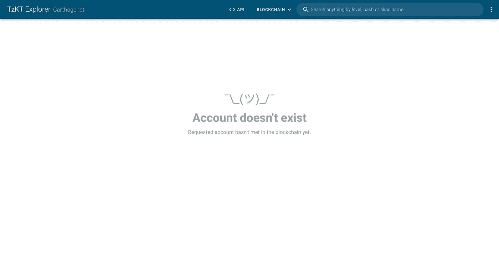
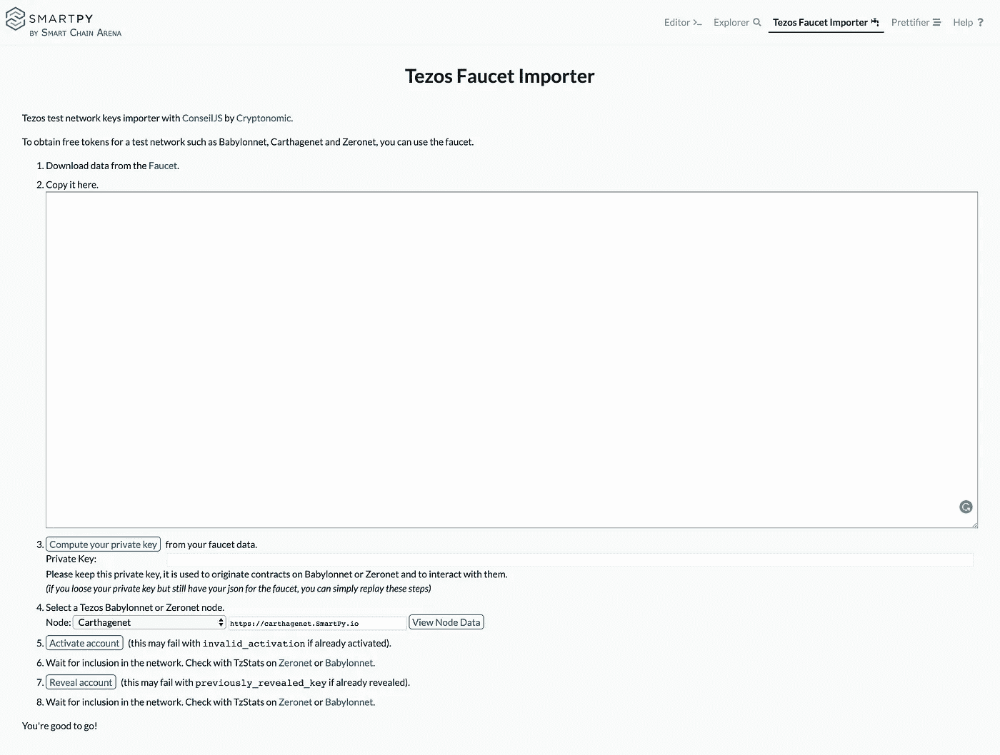
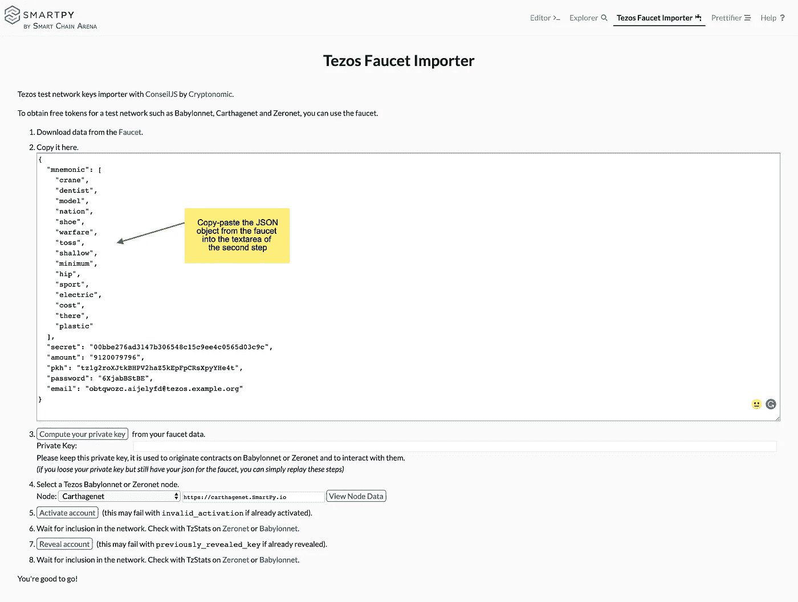
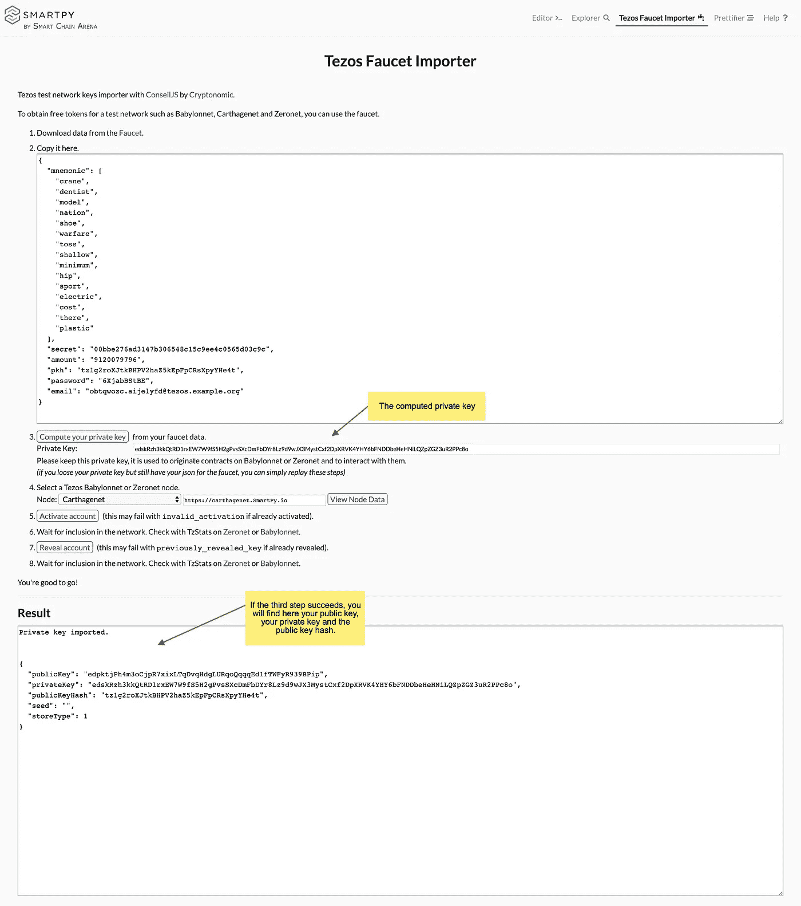
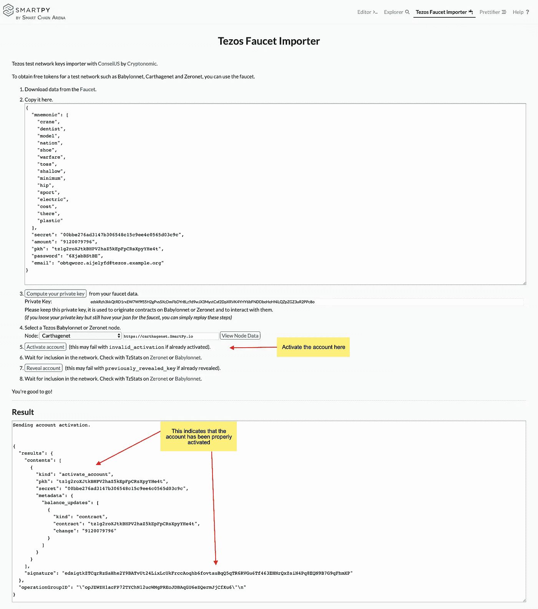
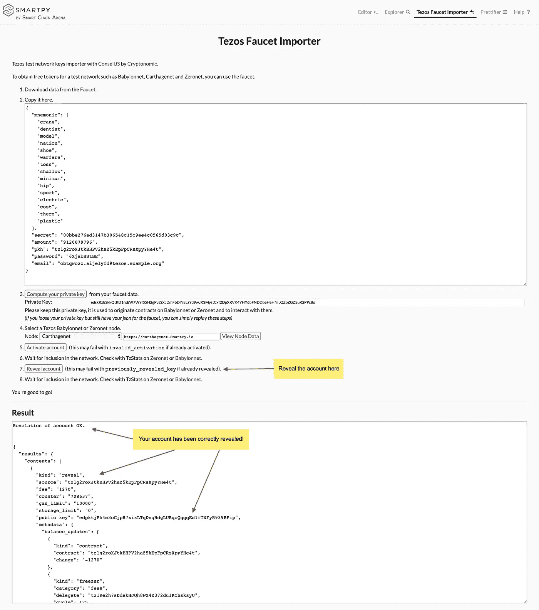
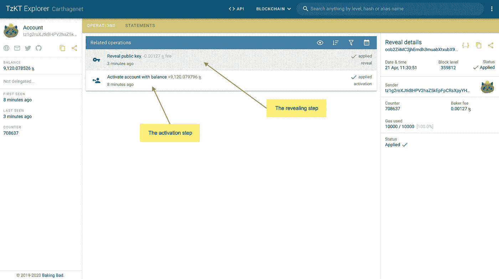

# 如何摆脱“公钥不能暴露”的错误

> 原文：<https://medium.com/coinmonks/how-to-get-rid-of-the-public-key-cannot-be-exposed-error-ee8687abf8fa?source=collection_archive---------2----------------------->

激活并显示您的 Tezos 测试密钥，使其与您的 dapp 配合使用

我开始编写关于 Tezos 开发的教程，因为我希望更多像我一样的自学和/或初学者加入这个令人惊叹的生态系统。自 2020 年初以来，这似乎正在发生，新的开发人员试图自学如何为 Tezos 区块链编写智能合同和 dapps😊

这也产生了大量的问题。其中，我在一个月内多次看到同样的问题，我决定写一个简短的教程来解释如何解决它。

许多为 Tezos 开发 dapps 的开发者从 faucet.tzalpha.net 那里得到了一个测试密钥。网站首页提到:

> 水龙头ꜩ可以用在所有的测试网和零网

所以你得到你的密钥，你把它保存在 TezBridge 中，你试着使用它，你在控制台中得到下面的错误:**公钥不能暴露⛔️** 。在大多数情况下，发生这种情况是因为您的密钥没有在您使用的网络上公开。看起来问题来自于 TezBridge，但与此无关。

如果你想确保你的密钥被泄露，你可以进入 [tzkt.io](https://tzkt.io/) ，点击页面右上角的三个点，选择你正在使用的测试网络，搜索你的密钥。您可能会看到下面的屏幕:

TzKT Page

如果是这种情况，您可以肯定错误消息来自于密钥没有被公开的事实。但是不要害怕，只需要你 2 分钟就可以解决这个小问题，然后继续开发你的 dapp！

我们将使用 [SmartPy 水龙头导入器](http://smartpy.io/demo/faucetImporter.html)。这是一个不可思议的工具，将帮助您在任何时候揭示您的帐户。转到网站，您应该会看到类似这样的内容:

现在复制您从 tzalpha 上的水龙头中获得的整个 JSON 对象，并将其粘贴到第二步的 textarea 中:

接下来，点击**计算您的私钥**。如果一切正常，您应该在页面底部的返回框中获得以下信息:

This step returns the private key, public key and public key hash

如果一切正常，您现在应该有了您的私钥、公钥和公钥散列。现在让我们继续并激活帐户！

第四步，选择您想要激活密钥的网络。如果你想测试你的 dapp，建议使用 Carthagenet，因为越来越多的节点去掉了对 Babylonnet 的支持。

下一步，点击**激活账户**按钮。几秒钟后，检查底部的结果框:

Account Activation

现在帐号已经被激活了，是时候进行最后一步了:展示！

点击**显示账户**按钮:

Reveal the account

如果你在返回框中看到“账户显示正常”,它就工作了。就这样，你的帐户已经显示，并准备在你的 dapp 🥳使用

您可以返回 tzkt.io，检查该帐户现在是否存在:

请在评论中告诉我这是否对你有效，或者你是否遇到了其他错误！

如果你喜欢这个教程，可以考虑给**tz 1 sjr neue 4 zypgszpogdz D5 tvryixndsd 2v**发送一些 tezzies，不要犹豫留下你的意见或建议！

> [在您的收件箱中直接获得最佳软件交易](https://coincodecap.com/?utm_source=coinmonks)

