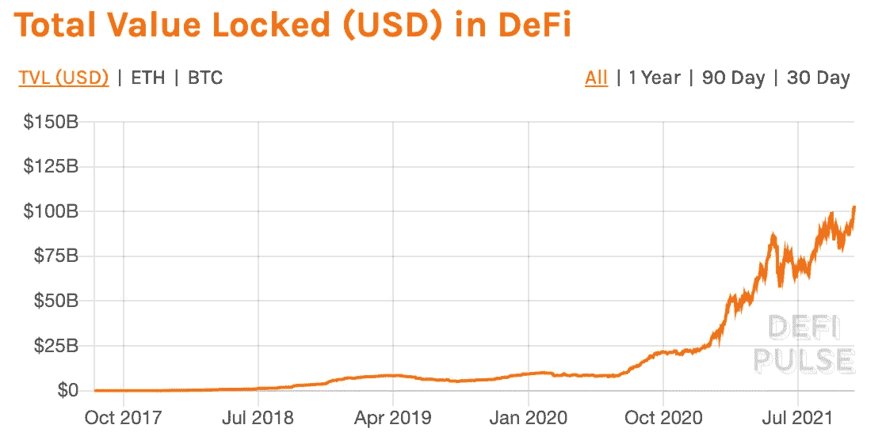

# 如何在 DeFi 中入门

> 原文：<https://medium.com/coinmonks/how-to-get-started-in-defi-c0de6337b7aa?source=collection_archive---------3----------------------->

到现在为止，你可能已经听说过密码世界中的一些新术语，比如 DeFi 和 yield farming。你想参与，但不知道从哪里开始。

如果你错过了比特币和以太坊等加密工具，不要担心，因为现在你仍然可以在不投资不稳定资产的情况下获得丰厚的回报。

你为什么看着迪菲？我的猜测是，这可能是因为你不喜欢把闲钱放在 0.01% APY 的银行账户里。

# 涉及的步骤

## 第一步——决定你想从多少美元开始

你可以做世界上所有的研究，阅读所有的协议和技术，但最终如果你不实际投资，它将一无所获。节省你自己的时间，提前决定多少钱你可以放心开始。

## 第 2 步—将法币转换为加密币/美元(稳定硬币)

在你使用 DeFi 或 crypto 做任何事情之前，你需要一个斜坡来把你的法定货币转换成 crypto。要做到这一点，你需要在比特币基地或币安这样的集中交易所注册一个账户。没有真正简单的方法来解决这个问题。不先考上 CeFi 就不能跳进 DeFi。

开始向新创建的账户进行银行转账。

## 第三步- CeFi 还是 DeFi？

现在你有了一些密码，决定你是否想坚持 CeFi 或 DeFi 平台。有了 CeFi，你不必管理自己的加密钱包，也不必太担心丢失密码和私钥。

CeFi 的例子有 BlockFi、FTX/Bitfinex/Poloniex/币安贷款、Nexo、Celsius、Hodlnaut 等。这些地方的马厩回报率可能在 8%左右。

如果你决定就这样走下去，那么你没有必要走得更远。恭喜你，你现在的美元收益率为 8%，而你的银行可能会付给你 0.01%。

## 第四步——获得一个加密钱包

也许你更懂技术，希望在涌现的数百种新协议中获得更高的收益。那么是时候买一个加密钱包了。

与 DeFi 协议交互的最常见的钱包是 Metamask。下载钱包并按照所有说明安全保存您的私钥/种子短语。

## 第 5 步—决定您想要接触的链和协议

周围有以太坊、比特币、币安智能链、Solana、Avalanche、Polygon、Arbitrum、Fantom、Celo 等各种链。每一个都有自己的优点和缺点，我不会真的进入这里。每个房间都有油费。如果你投资的金额很小，那么以太坊对你来说没有意义，因为交易成本可能高达数百英镑。

在所有链和协议的列表中查看 https://defillama.com/protocols。

## 步骤 6 —方案涉及的风险

并非所有的协议都是相同的，这就是为什么它们之间的产量差异很大。一些产生 100 万 APY 的东西会有一些危险信号，你应该在放入你的密码之前知道。从一开始就存在的方案，如化合物和 AAVE，可能产量较低，但风险较小。

在进入协议之前，您需要注意以下几点:

1.  创始人有成功的记录吗？
2.  创始人匿名还是知名？
3.  这个团队有著名的风投支持吗？
4.  协议有多分散？
5.  代码被审计了吗？
6.  这个协议已经存在多久了？
7.  该协议之前是否遭到过黑客攻击？
8.  团队成员在社交媒体上活跃吗？你能和他们不和谐地聊天吗？
9.  你了解协议和它声称能做什么吗？
10.  收益率一致吗？
11.  减值损失风险
12.  汽油费是多少？
13.  产量来源是什么。它是你的基础代币还是你正在赚取的其他代币？

## 第七步——继续检查你的投资

现在你已经把你的密码放在了一些协议中，使用一个跟踪工具，比如[https://zapper.fi/](https://zapper.fi/)来监视事情。池会不断升级或变得冗余，因此这不是一个真正的“一劳永逸”的方法。

如果你已经应用了良好的风险管理实践，你应该能够避免被拉地毯。

祝你好运，享受复利的魔力

> 加入 Coinmonks [电报频道](https://t.me/coincodecap)和 [Youtube 频道](https://www.youtube.com/c/coinmonks/videos)了解加密交易和投资

## 也阅读

 [## 最佳加密交易所| 2021 年十大加密货币交易所

### ICON _ PLACEHOLDEREstimated 预计阅读时间:28 分钟加密货币交易所的加密交易需要知识…

blog.coincodecap.com](https://blog.coincodecap.com/crypto-exchange)  [## 2021 年 10 大最佳加密贷款平台| CoinCodeCap

### 当谈到加密货币贷款时，大量因素等同于良好的收入状况。此外，借款的一部分…

blog.coincodecap.com](https://blog.coincodecap.com/crypto-lending)  [## 2021 年最佳免费加密交易机器人

### 2021 年币安、比特币基地、库币和其他密码交易所的最佳密码交易机器人。四进制，位间隙…

medium.com](/coinmonks/crypto-trading-bot-c2ffce8acb2a)  [## 最佳 4 个加密交易信号电报通道

### 这是乏味的找到正确的加密交易信号提供商。因此，在本文中，我们将讨论最好的…

medium.com](/coinmonks/best-crypto-signals-telegram-5785cdbc4b2b)  [## BlockFi 评论 2021:利弊和利率| CoinCodeCap

### 今天，我们提出了一个全面的 BlockFi 评论，这是一个成立于 2017 年的加密贷款平台，拥有其…

blog.coincodecap.com](https://blog.coincodecap.com/blockfi-review)  [## 如何在印度购买比特币？2021 年购买比特币的 7 款最佳应用[手机版]

### 如何使用移动应用程序购买比特币印度

medium.com](/coinmonks/buy-bitcoin-in-india-feb50ddfef94)  [## 加密税务软件——五大最佳比特币税务计算器[2021]

### 不管你是刚接触加密还是已经在这个领域呆了一段时间，你都需要交税。

medium.com](/coinmonks/best-crypto-tax-tool-for-my-money-72d4b430816b)  [## 存储比特币的最佳加密硬件钱包[2021] | CoinCodeCap

### 保管您的数字资产很容易，但找到正确的存储方式却是一项繁琐的任务。在线钱包有一个风险…

blog.coincodecap.com](https://blog.coincodecap.com/best-hardware-wallet-bitcoin)