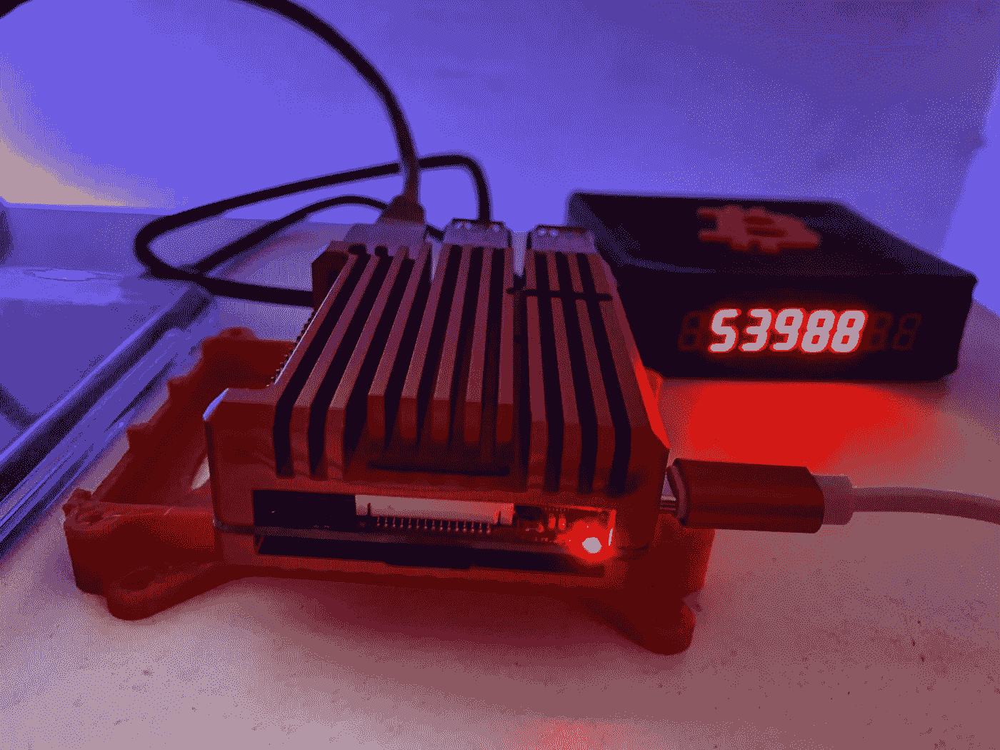
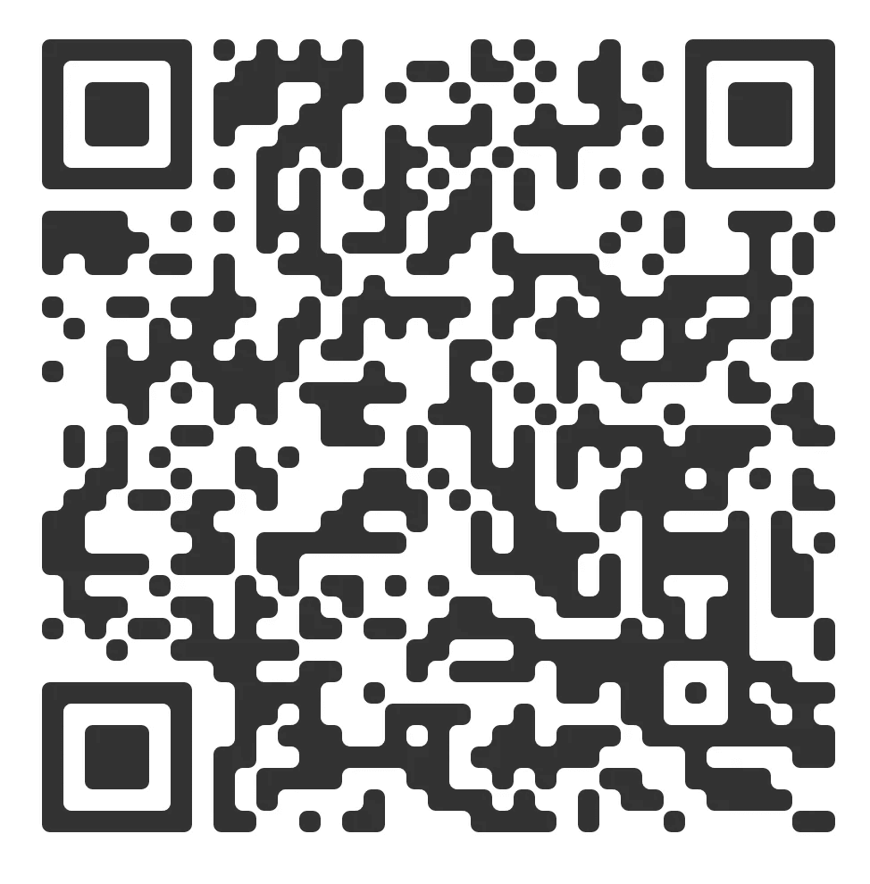

# 如何用你的比特币节点获得创世纪区块

> 原文：<https://medium.com/coinmonks/how-to-get-the-genesis-block-with-your-bitcoin-node-6f6ea9e554a7?source=collection_archive---------10----------------------->

## 用你的本影节点找到创世块的指南

Genesis 区块，顾名思义，是中本聪开采的第一个区块，开启了比特币网络。

它复制了《泰晤士报》封面上刊登的确认日期为 2009 年 1 月 3 日的消息。这也向世界传递了一个经济和政治信息，说明比特币为何如此重要。

现在我们知道它是什么，让我们在我们的节点上做一些工作。

通过 ssh 连接到您的节点，在您的终端中键入 umbrel@umbrel.local。

1.  ~/um brel/bin/bit coin-CLI getblockhash 0
2.  ~/um brel/bin/bit coin-CLI get block 000000000019d 6689 c 085 AE 165831 e 934 ff 763 AE 46 a2 a 6 c 172 B3 f1 b 60 A8 ce 26 f 22。
3.  echo 04 ffff 001d 0104455468652054696d 65732030332 f 4a 616 e2f 323039204368616 e 63656 c6c 6 f 72206 f 6e 206272696 E6 b 206 f 6207365636 f 6e 64206261696 c6f 7574206666 f 7

创世街区在那里！

不要相信，验证！

My Umbrel Node enforcing the bitcoin network rules.

You can tip me here with your LN wallet.

lnurl 1 DP 68 gun 8g HJ 7 mrw w3 uxy mm 59 e 3k 7 MF 0d 3h 82 un v9 acxz 7 flw 4 ek 2 unw v9 kk 20 tzd 96 xmmfdejhyvfh 396d 73