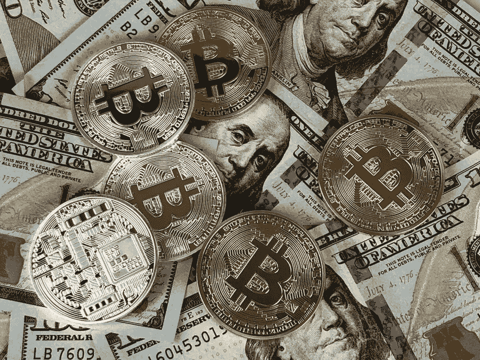
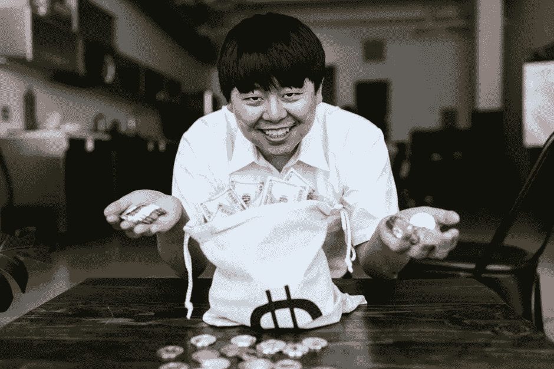

# 如何从加密货币中获得最大的投资回报

> 原文：<https://medium.com/coinmonks/how-to-get-the-most-roi-from-your-cryptocurrency-54cf545e4ddd?source=collection_archive---------16----------------------->

Image by [David McBee](https://www.pexels.com/@davidmcbee) from [Pexels](https://www.pexels.com/photo/round-silver-and-gold-coins-730564/)

随着最近加密货币的蓬勃发展，许多人都想知道如何才能从投资中获得最大回报。这是一个有效的问题！有几十种加密货币都声称是下一个最好的东西。但是他们有潜力吗？哪些明天会暴涨，哪些只是注定失败的昙花一现？你如何判断一种有效的数字货币具有长期价值和可持续性？

**什么影响加密货币估值？**

有很多因素最终会影响你的加密货币的估值。如果你是投资新手，这些信息可能会令人困惑，所以在选择投资哪种硬币之前，理解这些概念是很重要的:

**供给和需求** —供给指现存的硬币数量，而需求则基于谁想要它们。这个等式涉及的另一个因素来自个人的购买能力或不购买(即，他们是否能负担得起)。

就像你作为公司老板所做的任何商业决策一样；硬币投资应该根据你对这些特定产品未来利润的预期来进行！

**效用**——实际硬币本身的功能将决定其需求，因为投资者倾向于投资他们可以使用或具有某种使用价值的硬币。比特币等硬币比专门为投资目的创造的硬币具有更高的潜在效用，因为它被用于交易，而新硬币只是被买卖。

**创新** —如果一种加密货币已经被发明出来，但并不广为人知，它可能会因为从热门新闻媒体上曝光而增值。

稀缺性——开采一枚硬币的难度或硬币数量的上限会增加其价值。例如，比特币只允许挖掘 2100 万个比特币，而流通中的比特币超过 120 亿个。

还有其他几个因素会影响加密货币的估值，包括媒体曝光率、政府干预/立法和技术创新。

choose wisely

有些硬币比其他的更适合投资。

首先，让我们明确一件事:你现在不会因为购买加密货币而变得富有。但是，如果你知道你在做什么，你可以看到一些不错的投资回报。

**下面是如何选择哪种加密货币的投资回报率最好:**

-决定你应该投资的加密货币/你可以投入多少资金。例如，如果你的投资是每月 500 美元，有 10 个月的可用时间，挑选 5 枚交易价值高的硬币，这样就不会有太大的风险。然后随着时间的推移观察每一枚硬币，看看它们的市场是如何波动的，同时留意关于它们的任何其他重要新闻或更新。

-通过寻找已经存在足够长时间的加密货币来证明其可行性和可持续性，而不是仅仅作为一种没有历史或背景信息的全新硬币，来确定哪些硬币值得投资。这些货币可能会提供最好的投资回报，因为由于其他投资者的需求，它们倾向于将价格稳定在较高水平，这使它们更加稳定，而不是像许多不太成熟的货币那样，在人们看到价格到处波动后不断下跌。这就是你如何判断你的加密货币投资是否有潜力！

例如，如果你在 Litecoin 刚推出时投资了它，你的投资回报率会比你投资一个没有稳定价格历史的 ICO coin 高得多。很少有加密货币具有这种稳定性，即使如此，它们也很可能永远无法达到或超过早期投资比特币(BTC)、莱特币(LTC)、以太坊(ETH)、Monero (XMR)等成熟货币所能获得的投资收益。

-这里有一件非常重要的事情要记住——不要在任何一种货币上投入太多资金，因为它们也有下跌到比以往任何时候都低的风险！如果最坏的情况发生，只投资你愿意失去的东西！

如果你有多余的钱来投资，分散投资几种不同的货币还是好得多，因为如果一种货币比以前下跌得更低，甚至完全崩溃，你的其他投资将弥补损失。还有一些时候，多种不同的加密货币会同时飙升，并有助于抵消不太成功的投资造成的损失。

-投资加密货币的另一个提示是，只投资你愿意完全失去的金额。这些市场的波动性使得它们风险很大，尽管它们最近涨幅很大。当你想购买一种新的货币时，把你计划购买的金额留出，但在投资有回报之前，不要从你的账户中取出更多的钱。

如果投资没有回报，你还有钱存起来以防万一，如果成功了，你可以从你的账户里拿更多的钱作为投资回报。

-同时投资多种不同的货币，甚至分散投资于多种不同类型的加密货币，绝对没有错，因为许多加密货币构成了更大的市场，在那里它们通常被发现在一起。当这种情况发生时，对于那些想要一种稳定的加密货币，随着时间的推移稳步增长，但不想限制自己只投资于一种货币的人来说，这是非常有益的，特别是因为大多数投资这些硬币的人往往对一种货币比对另一种货币有个人偏好。

如果你通过这个过程发现一种加密货币真正吸引你，那么就利用上面的所有信息，尽可能多地投资它。然后留意其他货币，它们可能会突然看起来像一个好的投资，把你的钱也投进去！最终，由每个投资者选择他们认为能给他们带来最佳投资回报的方式。

**底线:**

加密货币现在是一个热门话题，很可能你们中的许多人已经考虑投资这个利润丰厚的市场。但是在你最终决定如何投资之前，有些事情你应该知道。一方面，加密货币的波动性使得投资者很难预测其在任何给定时间的实际价值。此外，在交易所或通过经纪人交易加密货币时，还需要考虑税收等因素。作为消费者，我们能做的最好的事情就是在对哪些产品值得投资或不值得投资做出任何最终决定之前，及时了解当前的价格波动。仅仅因为许多人相信某样东西会有价值，并不意味着它就会有价值。

> 加入 Coinmonks [电报频道](https://t.me/coincodecap)和 [Youtube 频道](https://www.youtube.com/c/coinmonks/videos)了解加密交易和投资

## 另外，阅读

*   [网格交易机器人](https://blog.coincodecap.com/grid-trading) | [Cryptohopper 审查](/coinmonks/cryptohopper-review-a388ff5bae88) | [Bexplus 审查](https://blog.coincodecap.com/bexplus-review)
*   [7 个最佳零费用加密交易平台](https://blog.coincodecap.com/zero-fee-crypto-exchanges)
*   [去中心化交易所](https://blog.coincodecap.com/what-are-decentralized-exchanges) | [比特恩斯 FIP](https://blog.coincodecap.com/bitbns-fip) | [Pionex 评论](https://blog.coincodecap.com/pionex-review-exchange-with-crypto-trading-bot)
*   [用信用卡购买密码的 10 个最佳地点](https://blog.coincodecap.com/buy-crypto-with-credit-card)
*   [最好的卡达诺钱包](https://blog.coincodecap.com/best-cardano-wallets) | [Bingbon 副本交易](https://blog.coincodecap.com/bingbon-copy-trading)
*   [印度最佳 P2P 加密交易所](https://blog.coincodecap.com/p2p-crypto-exchanges-in-india) | [柴犬钱包](https://blog.coincodecap.com/baby-shiba-inu-wallets)
*   [8 大加密附属计划](https://blog.coincodecap.com/crypto-affiliate-programs) | [eToro vs 比特币基地](https://blog.coincodecap.com/etoro-vs-coinbase)
*   [最佳以太坊钱包](https://blog.coincodecap.com/best-ethereum-wallets) | [电报上的加密货币机器人](https://blog.coincodecap.com/telegram-crypto-bots)
*   [交易杠杆代币的最佳交易所](https://blog.coincodecap.com/leveraged-token-exchanges) | [购买 Floki](https://blog.coincodecap.com/buy-floki-inu-token)
*   [3Commas 对 Pionex 对 Cryptohopper](https://blog.coincodecap.com/3commas-vs-pionex-vs-cryptohopper) | [Bingbon 评论](https://blog.coincodecap.com/bingbon-review)
*   [加密复制交易平台](/coinmonks/top-10-crypto-copy-trading-platforms-for-beginners-d0c37c7d698c) | [如何在 WazirX 上购买比特币](/coinmonks/buy-bitcoin-on-wazirx-2d12b7989af1)
*   [CoinLoan 点评](https://blog.coincodecap.com/coinloan-review)|【Crypto.com】点评 | [火币保证金交易](/coinmonks/huobi-margin-trading-b3b06cdc1519)