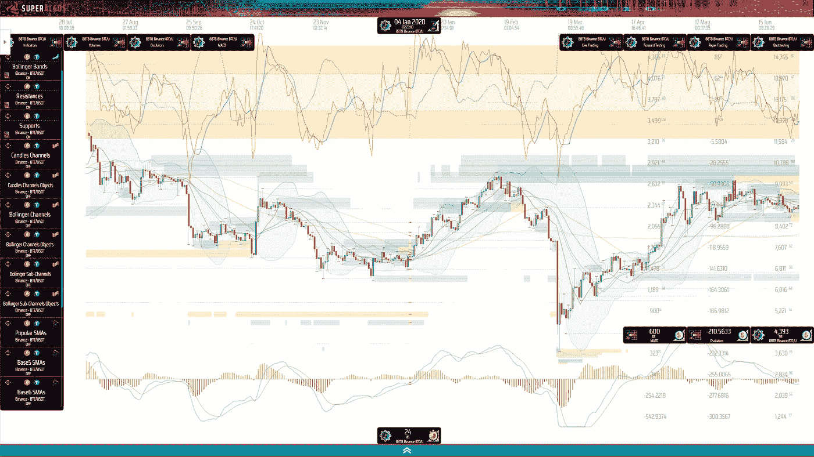
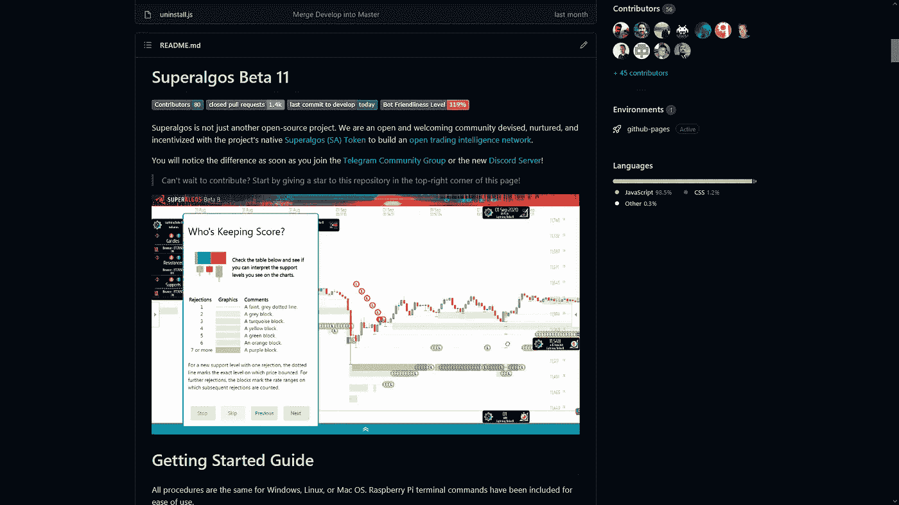

# 如何在最有前景的去中心化社交交易网络推出之前获得代币

> 原文：<https://medium.com/coinmonks/how-to-get-tokens-from-the-most-promising-decentralized-social-trading-network-before-they-launch-52a447588346?source=collection_archive---------2----------------------->

## 分散金融

## 学习终极策略，在 Superalgos 的治理项目还没有被发现的时候，从它们的治理项目中榨取最多的代币。

Pink Floyd Cover Art

[*Superalgos*](https://superalgos.org/) *是一个我非常了解的开源项目。* [*我是团队核心成员*](https://superalgos.org/about-team.shtml) *和联合创始人。我也对治理体系相当了解，因为我自己记录了* [*最新发布的*](/superalgos/superalgos-distributes-the-governance-of-the-token-and-the-project-18e1bf372eca) *。*

我将在本文中展示的机会可以总结如下:

> 只需很少的努力，你就可以从一个月下载量+2k 的项目中获得代币，而这个项目仍处于测试阶段，在市场营销和公关活动开始前的几周就已经开始了。

# 这是给谁的？

如果你能做到以下几点，你会发现这个机会很有意思:

*   是一个爱好者的加密，并正在寻找有趣的加密项目；
*   对密码交易感兴趣，并希望了解该领域的前沿技术；
*   是希望为有趣的开源项目做贡献的开发人员；
*   对权力下放和治理感兴趣；
*   觉得现在的金融体系需要升级；
*   希望将无许可的金融产品和服务带给最需要的人。

注意:你需要熟练操作电脑。你需要遵循一个有点技术性的安装指南。

Superalgos Platform Charting Space

# 一点背景知识

我们花了四年时间构建了终极市场研究和加密交易自动化平台。

> 在 2017 年牛市的热潮中，我们没有在白皮书上推出 ICO，而是选择了引导和构建。

我们花了 2018–2019 年的冬季加密编码。到 2020 年中期，少数勇敢的早期采用者正在用 Beta 5 版本进行现场交易[。](/@julian_superalgos/new-open-source-bitcoin-strategy-support-resistance-indicator-trades-snapshots-and-more-c225be392e8)

2021 年初，[我们推出了令牌](/@julian_superalgos/superalgos-launches-the-superalgos-sa-token-and-starts-distribution-among-contributors-e1c62801f5dd)来激励贡献——即将上市的 [Superalgos (SA)令牌](https://superalgos.org/token-overview.shtml)专门在贡献者中分发。

上周[我们发布了 Beta 11](/superalgos/superalgos-distributes-the-governance-of-the-token-and-the-project-18e1bf372eca) ,其特点是治理系统支持项目和令牌的去中心化治理。这是我们在开始营销之前需要完成的最后一个战略步骤。

> 今天，我们的仓库是 Github.com 第一个交易机器人的[和第二个交易项目](https://github.com/search?q=trading+bots)的[。](https://github.com/search?q=trading)
> 
> 凭借每月+2k 的下载量，我们的社区在 [Telegram 和 Discord](https://superalgos.org/community-join.shtml) 中有几千名算法交易者，大部分是通过口头传播增长的——直到现在！

# 开发大众市场

[Superalgos 平台](https://superalgos.org/crypto-trading-bots-platform.shtml)旨在为 algo 交易者提供服务，这是交易者/加密/有技术背景的交易者的一小部分市场。

[该项目现已进入第 2 阶段](https://superalgos.org)，为大众市场(即所有加密用户)打造产品和服务，截至目前，这一数字已超过 2 亿。

这就是我们如何构建终极的去中心化社交交易网络:

*   在该协议的激励下，算法交易者竞相制作和传播交易信号。
*   影响者挑选信号提供者并向他们的追随者传播选择的信号。
*   加密用户关注影响者(或算法交易者)，并在移动、桌面或服务器应用程序上免费获得他们的信号。这些应用程序实现了简单的自动交易，由专家提供免费的情报(交易信号)。
*   algo 交易者和影响者都从协议中获得报酬，而加密用户则免费获得所有产品和服务。

> 情报通过一个开放的、没有权限的对等网络传播。随着摩擦的减少和最终用户的零成本，Superalgos 处于颠覆曲线的末端。

以上是我们将要实现的第一个模型。将来，还会有促进其他形式合作的替代激励设计。例如，用户可以在交易策略的开发中共同投资和合作的模型，或者产生用户可以选择付费的溢价信号的模型。

# 发布会

在短期内，Superalgos 将:

*   开始营销和公关活动，
*   为算法交易者推出 Superalgos 平台，
*   列出 Superalgos (SA)令牌。

社交交易网络计划在 Q1 2022 年推出，目前处于公开测试阶段。

# 我为什么要告诉你这些？

简而言之，我们希望给每个人一个尽早获得项目令牌的公平机会。我们认为令牌的公平和广泛分发对于项目弹性至关重要。

与此同时，一个开放的集体通过分散的治理来领导项目，这也是项目具有可辩护性的一部分。

出于上述原因，参与治理是有激励的，这意味着您可以通过加入各种计划来获得项目令牌。这就是机会所在。

# 通过治理获得 Superalgos (SA)代币

现在，您已经听说了 Superalgos，让我们让您了解一下获得代币的机会。

稍后我会更详细地向您介绍这个过程，但首先让我简短地向您介绍一下:

*   您将下载并启动 Superalgos 平台。你应该在 10 分钟内就可以开始运行了。
*   您将通过前三个互动教程学习 Superalgos 的基本操作。这需要 2 到 3 个小时。我保证系统和教程会让你大吃一惊。如果他们没有，删除 Superalgos 文件夹，忘记我们！
*   您将浏览治理教程。您将创建您的用户配置文件，加入一些程序，并将您的配置文件提交到存储库。那应该需要大约 30 分钟。

> 就是这样！在接下来的代币分发活动中，您将在 3 到 4 个小时的宝贵时间里赢得大约[*] 5，000 个 SA 代币。按照最新的象征性估值，这相当于 0.005 BTC，或者按照当前 BTC 平均汇率，相当于+300 美元。

确切的数量很难确定，因为它取决于许多变量。

*[**]上一次估值可以追溯到 2018 年初的老友记&家庭赛，当时我们还勉强处于 MVP 阶段。在这种汇率下，代币可能会被严重低估。*

> 但这还不是全部！*现在设置您的用户档案，您也可以在未来的版本中获得类似的奖励，因为 Superalgos 每个月都会在参与治理的档案中分发令牌！*
> 
> *如果您维护您的个人资料，您也将参与未来的分发，而无需您付出任何额外的努力！*

# 逐步指南

让我们继续吧！

## 1.下载和设置

要设置 Superalgos，您必须[遵循存储库自述文件](https://github.com/Superalgos/Superalgos)中的入门指南。向下滚动页面。

该指南看起来相当长，因为有多种方式来部署平台。但是，除非你是开发人员，否则我强烈推荐最简单的一种:本地安装。

> 因此，坚持遵循 Windows、Mac OS 或 Linux 的主要安装选项。
> 
> *如果在任何一点出了问题，不要犹豫，加入* [*电报支援小组*](https://t.me/superalgossupport) *或者我们的* [*不和谐*](https://discord.gg/CGeKC6WQQb) *提问。*

## 2.点燃超级合金

完成设置部分后，继续按照指南进行操作。继续使用一节。您将很快使用该应用程序！

Welcome to Superalgos!

## 3.前三个教程

当 UI 在您的浏览器中打开时，您将看到三个交互式教程中的第一个。

教程的反馈很惊人。伴随着发现这个系统的行为，他们让第一次使用 Superalgos 的体验变得既惊讶又震撼。

令人惊讶的是，很少有开源项目如此深入，并有如此完善的文档记录。势不可挡，因为，嗯…你会在短时间内学到很多东西。

您必须完成前三个教程，以获得关于如何使用该平台的所有基本知识。这是必要的，以便您可以处理设置和贡献您的用户概要文件以参与治理的任务。

> 如果你跳过这些教程，你很可能会迷路！被警告！

完成所有三个教程大约需要三个小时。在那段时间里，你将会学到很多关于自动化交易的知识:数据挖掘、交易系统、交易执行，以及 Superalgos 如何处理围绕这些主题的所有复杂性。

## 4.治理教程

完成前三个教程后，您将加载*令牌分发 Superalgos* 插件工作区。在前三个教程中，您将学习如何加载工作区，所以现在不必担心这个问题。

一旦工作空间加载完毕，您将会看到*创建您的用户概要教程*。这将引导您完成加入以下治理计划的过程:

1.  **Airdrop 计划:**该计划奖励您完成前几个教程的努力。在即将到来的分销活动中，您可能会获得高达 1，000 SA 的奖励。
2.  Github 计划:该计划为与 Github.com 相关的三种不同活动提供奖励。通过该计划，您可以获得高达 3，000 SA 的收入！

> 仅这两个项目就能让你赚到 4000 澳元。但有趣的是，这些程序会无限期地保持活动状态，因此您将在每次分发活动中获得更多代币，而无需您付出任何额外的努力！

该教程继续下去，并帮助您加入三个以上的程序。最有潜力的是推荐项目。这就是它的工作原理。

*   你宣布是谁推荐你去 Superalgos 的。如果你通过这篇文章了解了 Superalgos，你可以指出我(julian-molina)。如果有人向您推荐这篇文章，您也可以声明一些其他的用户配置文件——在这种情况下，您将有不止一个推荐人。如何做到这一点是在教程中解释，所以我不会进入。

这样，您只需参与该计划即可获得象征性的奖励。我们不知道奖金会有多少，因为这取决于还有多少人参加这个项目。

> 当您带着您的朋友和同事加入 Superalgos 时，该计划的真正潜力就会显现出来。然后你为你带来的每个人赚取象征性的奖励，也为他们带来的每个人赚取象征性的奖励，以此类推！
> 
> *不仅如此……随着推荐网络的不断扩大，你可以在每次发行中获得这些奖励。*

本教程最后向您展示了如何将您的概要文件提交到存储库。这是在分布中计算您的概要文件所需的最后一步。

# 什么时候？

该项目在每个月的第一天举办一次分发活动。我建议您现在就开始，这样我们就有时间在下次活动之前帮助您，以防您遇到任何问题！

# 离别的思绪

Superalgos 是一个社区运营的开源项目，其愿景是:一个机器为人类工作的世界。

我们正在构建的社交交易解决方案包括让机器人在人类历史上增长最快的市场之一免费为人类工作。

> 这只是第一步。如果您能尽早加入我们的努力，我们将非常高兴！

## 也阅读

 [## 最佳加密交易所| 2021 年十大加密货币交易所

### 加密货币交易所的加密交易需要了解市场，这可以帮助你获得利润…

blog.coincodecap.com](https://blog.coincodecap.com/crypto-exchange)  [## 2021 年 9 大最佳加密贷款平台| CoinCodeCap

### 当谈到加密货币贷款时，大量因素等同于良好的收入状况。此外，借款的一部分…

blog.coincodecap.com](https://blog.coincodecap.com/crypto-lending)  [## 2021 年最佳加密交易机器人(免费和付费)

### 2021 年币安、比特币基地、库币和其他密码交易所的最佳密码交易机器人。四进制，位间隙…

medium.com](/coinmonks/crypto-trading-bot-c2ffce8acb2a)  [## 最佳 4 个加密交易信号电报通道

### 这是乏味的找到正确的加密交易信号提供商。因此，在本文中，我们将讨论最好的…

medium.com](/coinmonks/best-crypto-signals-telegram-5785cdbc4b2b)  [## BlockFi 评论 2021:利弊和利率| CoinCodeCap

### 今天，我们提出了一个全面的 BlockFi 评论，这是一个成立于 2017 年的加密贷款平台，拥有其…

blog.coincodecap.com](https://blog.coincodecap.com/blockfi-review)  [## 如何在印度购买比特币？2021 年购买比特币的 7 款最佳应用[手机版]

### 如何使用移动应用程序购买比特币印度

medium.com](/coinmonks/buy-bitcoin-in-india-feb50ddfef94)  [## 加密税务软件——五大最佳比特币税务计算器[2021]

### 不管你是刚接触加密还是已经在这个领域呆了一段时间，你都需要交税。

medium.com](/coinmonks/best-crypto-tax-tool-for-my-money-72d4b430816b)  [## Pionex 评论-被动交易者的简单交易机器人

### 在本文中，我们将回顾 Pionex，它提供了加密交易机器人自动化工具，集成了一个…

blog.coincodecap.com](https://blog.coincodecap.com/pionex-review-exchange-with-crypto-trading-bot)  [## 存储比特币的最佳加密硬件钱包[2021]

### 保管您的数字资产很容易，但找到正确的存储方式却是一项繁琐的任务。在线钱包有一个风险…

blog.coincodecap.com](https://blog.coincodecap.com/best-hardware-wallet-bitcoin)