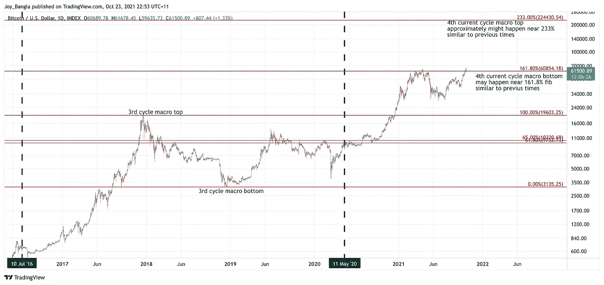

# 如何猜测#比特币的周期顶部和底部？

> 原文：<https://medium.com/coinmonks/how-to-guesstimate-the-cycle-top-and-bottom-of-bitcoin-80ee2661b602?source=collection_archive---------5----------------------->

与流行的观点相反，一种模式已经运作了 10 多年，用来大致猜测宏观顶部和底部。

按照以下步骤，大概估计周期顶部和底部的$BTCUSD:

1.  开放式指数:基于交易视图
2.  将布局更改为对数刻度
3.  从第一宏观顶部到第一宏观底部拉伸纤维。确保 fib 也在对数标度上。
4.  请注意 161.8%和 233%的水平。161.8%是下一个宏观底部。233%是下一个宏观顶部

请看下面的图表作为证据:

**从第一个周期**猜测第二个周期的顶部和底部

高分辨率图像:【https://www.tradingview.com/x/qBr9fHCw/ 

**从第二周期猜测第三周期的顶部和底部**

高分辨率图像:[https://www.tradingview.com/x/SeYaLIiF/](https://www.tradingview.com/x/SeYaLIiF/)

**使用第三周期**猜测当前周期的顶部和底部

高分辨率图像:[https://www.tradingview.com/x/OsYuxdgR/](https://www.tradingview.com/x/OsYuxdgR/)

# 结论

当前周期**宏顶部**可能处于 233% fib 值 **$224，430** 。当前周期**宏观底部**可能在**60，854 美元**的 161.86% fib 值

免责声明:请记住，过去的表现并不代表未来的结果。不同类型的投资包含不同程度的风险。我们不能保证本新闻稿(文章)中直接或间接提及的娱乐信息将是有利可图的，等同于任何相应的历史表现水平，或者以任何形式或形式适合您。由于各种因素，包括不断变化的市场条件，内容可能不再反映当前的观点或立场。此外，如果您不认为本简讯(文章)中包含的任何讨论或信息是对您的财务顾问的个性化投资建议的接收或替代，那将是最好的。我不是财务顾问。我没有资格做财务顾问。这只是为了娱乐。不要以任何其他方式误用它。如果读者对上述任何具体问题的适用性有任何疑问，鼓励他/她向自己选择的专业顾问咨询。我和我的指标都不对任何实际交易中滥用信息承担任何责任。我在现实生活中确实有秘密职位。

> 加入 Coinmonks [电报频道](https://t.me/coincodecap)和 [Youtube 频道](https://www.youtube.com/c/coinmonks/videos)了解加密交易和投资

## 另外，阅读

*   [如何购买 Monero](https://blog.coincodecap.com/buy-monero) | [IDEX 评论](https://blog.coincodecap.com/idex-review) | [BitKan 交易机器人](https://blog.coincodecap.com/bitkan-trading-bot)
*   [如何在 Bitbns 上购买柴犬(SHIB)币？](https://blog.coincodecap.com/buy-shiba-bitbns) | [印度币安](https://blog.coincodecap.com/binance-in-india)
*   [币安 vs 比特邮票](https://blog.coincodecap.com/binance-vs-bitstamp) | [比特熊猫 vs 比特币基地 vs Coinsbit](https://blog.coincodecap.com/bitpanda-coinbase-coinsbit)
*   [如何购买 Ripple (XRP)](https://blog.coincodecap.com/buy-ripple-india) | [非洲最好的加密交易所](https://blog.coincodecap.com/crypto-exchange-africa)
*   [非洲最佳加密交易所](https://blog.coincodecap.com/crypto-exchange-africa) | [晤交易所评论](https://blog.coincodecap.com/hoo-exchange-review)
*   [eToro vs robin hood](https://blog.coincodecap.com/etoro-robinhood)|[MoonXBT vs by bit vs Bityard](https://blog.coincodecap.com/bybit-bityard-moonxbt)
*   [Stormgain 回顾](https://blog.coincodecap.com/stormgain-review) | [Bexplus 回顾](https://blog.coincodecap.com/bexplus-review) | [币安 vs Bittrex](https://blog.coincodecap.com/binance-vs-bittrex)
*   [Bookmap 评论](https://blog.coincodecap.com/bookmap-review-2021-best-trading-software) | [美国 5 大最佳加密交易所](https://blog.coincodecap.com/crypto-exchange-usa)
*   [如何在 FTX 交易所交易期货](https://blog.coincodecap.com/ftx-futures-trading) | [OKEx vs 币安](https://blog.coincodecap.com/okex-vs-binance)
*   [如何在势不可挡的域名上购买域名？](https://blog.coincodecap.com/buy-domain-on-unstoppable-domains)
*   [印度的加密税](https://blog.coincodecap.com/crypto-tax-india) | [altFINS 审查](https://blog.coincodecap.com/altfins-review) | [Prokey 审查](/coinmonks/prokey-review-26611173c13c)
*   [布洛克菲 vs 比特币基地](https://blog.coincodecap.com/blockfi-vs-coinbase) | [比特坎评论](https://blog.coincodecap.com/bitkan-review) | [币安评论](/coinmonks/binance-review-ee10d3bf3b6e)
*   [Coldcard 评论](https://blog.coincodecap.com/coldcard-review) | [BOXtradEX 评论](https://blog.coincodecap.com/boxtradex-review)|[uni swap 指南](https://blog.coincodecap.com/uniswap)
*   [阿联酋 5 大最佳加密交易所](https://blog.coincodecap.com/best-crypto-exchanges-in-uae) | [SimpleSwap 评论](https://blog.coincodecap.com/simpleswap-review)
*   购买 Dogecoin 的 7 种最佳方式
*   [iTop VPN 审查](https://blog.coincodecap.com/itop-vpn-review) | [曼陀罗交易所审查](https://blog.coincodecap.com/mandala-exchange-review)
*   [美国最佳加密交易机器人](https://blog.coincodecap.com/crypto-trading-bots-in-the-us) | [经常性评论](https://blog.coincodecap.com/changelly-review)
*   [A-Ads 审查](https://blog.coincodecap.com/a-ads-review) | [Bingbon 审查](https://blog.coincodecap.com/bingbon-review) | [Mudrex 投资](https://blog.coincodecap.com/mudrex-invest-review-the-best-way-to-invest-in-crypto)