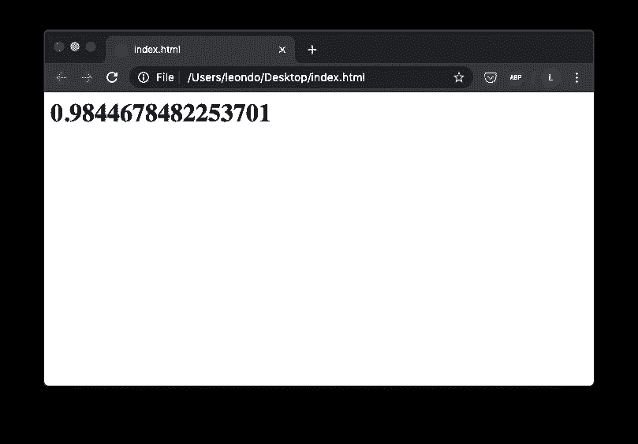
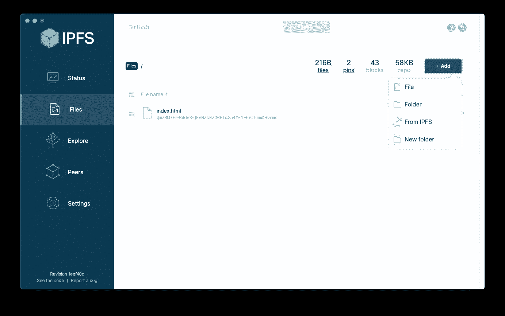
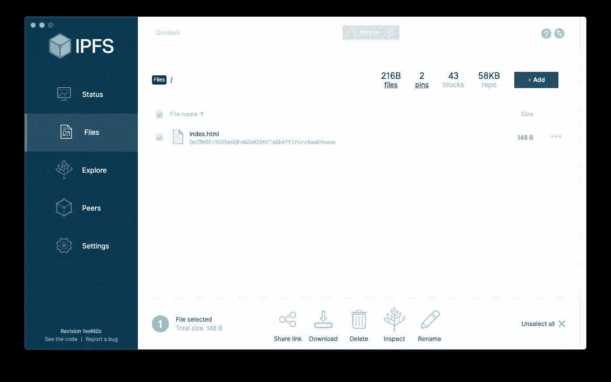
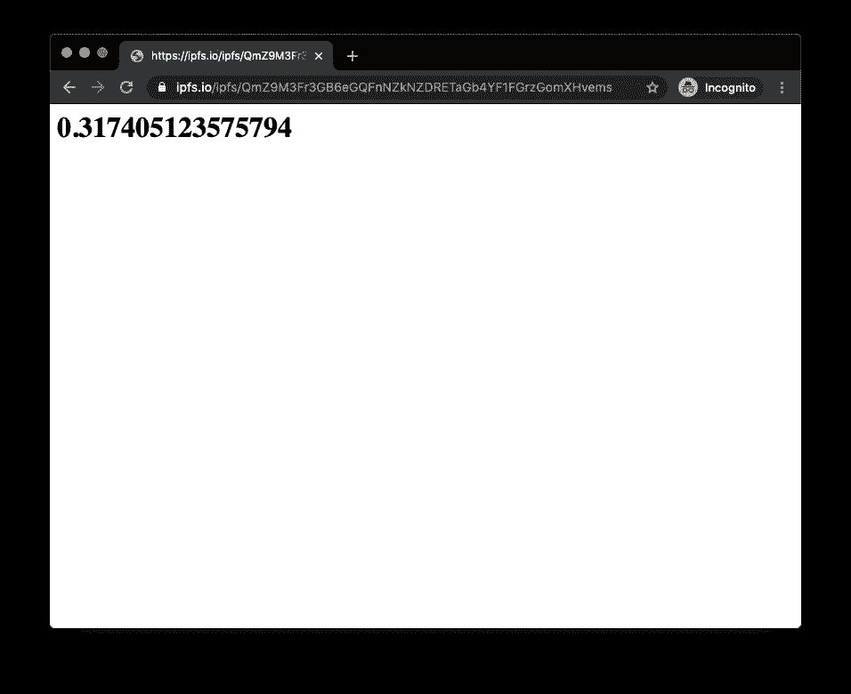
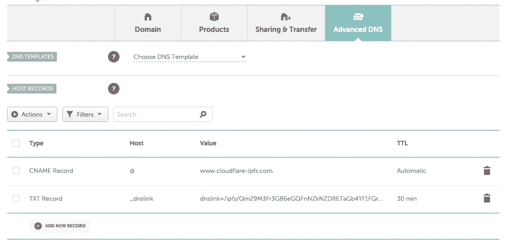
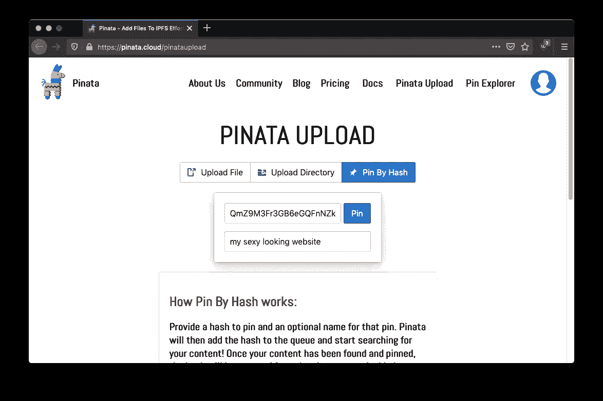

# 如何在 IPFS 上托管一个网站(带 DNS)

> 原文：<https://medium.com/coinmonks/how-to-host-a-website-on-ipfs-with-dns-82f1f2fe6361?source=collection_archive---------1----------------------->

## 愚蠢的简易指南


Photo by [Alina Grubnyak](https://unsplash.com/@alinnnaaaa?utm_source=medium&utm_medium=referral) on [Unsplash](https://unsplash.com?utm_source=medium&utm_medium=referral)

# 介绍

你读了 IPFS 的书，对这项技术很感兴趣。现在你想在 IPFS 上建立自己的网站。你如何开始？

# 第一步:收集工具

1.  一个域名。唯一会让你付出代价的。
2.  IPFS 桌面 App 或 [CLI](https://github.com/ipfs-shipyard/ipfs-desktop) 。
3.  可选: [Pinata](https://pinata.cloud/) 帐户，轻松“锁定”您的文件。

# 第二步:编码

写一些 HTML

```
<!-- index.html -->
<body>
  <h1 id="randomNum"></h1>
</body><script>
  document.getElementById("randomNum").innerHTML = Math.random();
</script>
```

这将创建一个性感的网站



(a sexy looking website)

# 第三步:在 IPFS 上发布

打开 IPFS 桌面，然后添加+一个文件。



添加后，选择文件。您应该会看到一个“共享链接”按钮。不要害羞。点击它。



该链接应该类似于:

[https://ipfs . io/ipfs/qmz 9m 3 fr 3 GB 6 egqfnzknzdretag B4 YF 1 fgrzgomxhvems](https://ipfs.io/ipfs/QmZ9M3Fr3GB6eGQFnNZkNZDRETaGb4YF1FGrzGomXHvems)

QmZ9M3F 是你的特殊散列。有一个内置的安全功能，但那是另一天。给它几分钟，你应该活了！



# 第四步:域名系统

登录您的 DNS 提供商。我用的是 Namecheap。

输入以下内容:



第 1 行:注意“.”后通讯器。

```
CNAME
@
[www.cloudflare-ipfs.com](http://www.cloudflare-ipfs.com).
```

第 2 行:用你的散列替换 qmz 9m 3 fr 3g……

```
TXT Record
_dnslink
dnslink=/ipfs/QmZ9M3Fr3GB6eGQFnNZkNZDRETaGb4YF1FGrzGomXHvems
```

你完了！

旁注:注意我们正在使用 [cloudflare](https://blog.cloudflare.com/distributed-web-gateway/) ？这是因为它们充当了网关的角色。IPFS 网关是为你获取内容的第三方节点。

# 第五步:皮纳塔派对(奖金)

我是皮纳塔的忠实粉丝。他们确保你的内容停留在 IPFS，所以你不必。

参观:[https://pinata.cloud/pinataupload](https://pinata.cloud/pinataupload)

“按哈希 Pin”并输入您的哈希 QmZ9M3Fr3G…



鳍。

# 信用

感谢[胡安·贝内](https://medium.com/u/6238e2d24931?source=post_page-----82f1f2fe6361--------------------------------)、 [IPFS](https://medium.com/u/30a067dbeb93?source=post_page-----82f1f2fe6361--------------------------------) 和[协议实验室](https://medium.com/u/7369a3c69ff2?source=post_page-----82f1f2fe6361--------------------------------)团队构建未来。

谢谢你，[马特·奥伯](https://medium.com/u/a446d4aefa91?source=post_page-----82f1f2fe6361--------------------------------)和[皮纳塔](https://medium.com/u/3bf682b0b4e7?source=post_page-----82f1f2fe6361--------------------------------)团队让未来变得易于使用。

> [在您的收件箱中直接获得最佳软件交易](https://coincodecap.com/?utm_source=coinmonks)

[](https://coincodecap.com/?utm_source=coinmonks)[](https://coincodecap.com)