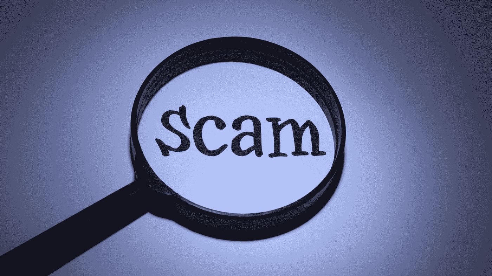

# 如何识别和避免加密货币骗局

> 原文：<https://medium.com/coinmonks/how-to-identify-and-avoid-cryptocurrency-scams-fdb8e8bdd117?source=collection_archive---------2----------------------->

利用本帖中分享的信息和策略，开发识别和避免加密货币骗局所需的知识和本能，保护您的资金。

> “近年来，比特币等加密货币价值的显著增长吸引了投资者、投机者和小偷。”~CipherTrace

根据由[知名加密货币分析](https://cryptosorted.info/top-13-blockchain-analytics-and-crypto-investigation-tools/)公司 Cyphertrace 发布的[报告](https://info.ciphertrace.com/crypto-aml-report-q218)，2018 年共有 17 亿美元损失于加密货币骗局。

根据《华尔街日报》(WSJ)的一份报告，[仅在 2019 年](https://www.wsj.com/articles/cryptocurrency-scams-took-in-more-than-4-billion-in-2019-11581184800)，加密货币诈骗就获利超过 40 亿美元。

据 Bitcoin.com[报道](https://news.bitcoin.com/crypto-scammers-steal-381-million-in-2020-while-twitter-hackers-direct-funds-to-mixers/#:~:text=Cryptocurrency%20related%20scams%20have%20taken,crimes%20so%20far%20in%202020.&text=In%202019%2C%20scams%20accounted%20for,%25%20of%20crypto%2Drelated%20crimes.)，截至 2020 年 7 月，加密货币诈骗已经造成超过 3 . 81 亿美元的损失。

# 什么是加密货币骗局？

加密货币骗局是任何设计用来欺骗你的计划或系统。

他们主要利用你的无知、贪婪和快速致富的欲望。

向你承诺“免费的钱”或“一生一次的机会”，以获得一些非常不切实际的投资回报(ROI)。

> *简单易行。你所需要做的就是*发送这一小笔$$金额。如果你想立刻“赚大钱”,就从你的退休储蓄账户中拿出一些钱。布拉布拉布拉"

而谁不想“一夜暴富”。但是不要。

# 加密货币诈骗的类型

现在，让我们来看看加密货币骗子的常见操作方式以及他们用来欺骗您向他们汇款的策略。

**加密货币骗局的类型**

如果你想略读，你可以点击任何一个跳转到页面上相应的部分。

好了，这是一个很长的列表。

让我们简要地解释一下它们，它们是如何工作的，以及避免它们的最佳方法。

# 加密货币诈骗的类型:

# 1.预售或 ICO 骗局

初始硬币发行(ICO)和预售是加密货币项目通过以折扣价向早期投资者出售代币来筹集资金的一种方式。

所以，你被要求通过他们的网站、电报、discord 等购买代币。打折出售。

很简单，发送您想要购买的令牌的比特币或以太坊等价物，并成为首批持有者。

预售结束后，代币将以更高的价格在交易所上市交易，通常是 ICO 价格的两倍，如果你不想长期持有，你可以卖掉它获得高额利润。

或者你可以卖掉一部分，拿走你的原始资本和部分利润，然后把剩下的部分送上月球或地狱。

现在，这是理想的工作方式，但骗子正在利用这一点来欺骗不知情的投资者。

在骗局 ICO 或预售中，一切照常进行，但您不会收到承诺的令牌。

有时，他们甚至会给你送代币，但会悄悄地走开。因此留给你一个比擦屁股还不值钱的令牌。

你不能用它来卖或做任何事情。你只是被抢劫了。

随意为你的钱组织一个悼念派对，因为它已经不在了。

**如何避免成为牺牲品？**

1.  永远不要参与匿名团队的 ico 项目。句号！
2.  仅买入通过已建立的交易所的启动平台(初始交易所发行-ieo)和平台如 [TrustSwap](https://cryptosorted.info/trustswap-fundamental-analysis-and-price-prediction-for-2020-2025/) Launchpad 等进行的 ico。几乎所有的主要(前 10 名)交易所现在都有你可以参与的启动平台。
3.  此外，IEOs 保证代币或硬币将在 IEO 所在的交易所上市。从而保证你想卖就能卖。

# 2.比特币账户经理骗局

> *我想说非常感谢“骗子名字”帮助我管理我的比特币账户。In 只向他们投资了 1500 美元，不到两周，他们就增加到了 15000 美元。我劝你想让钱翻倍就试试“骗子名”。*
> 
> *嗨！我是“骗子名”。加密货币账户经理。你想让你的钱翻倍吗？*

这是最蹩脚的加密货币骗局之一。

它们无处不在。

尤其是在 Twitter、Instagram、脸书、Telegram groups 等热门帖子的评论部分。

一旦你把你的比特币或任何加密货币发给他们，让他们帮你“管理”或“增长”，他们就会消失，屏蔽你，或者告诉你，你需要发送更多才能获得收入。

**如何避免成为受害者？**

# 3.网络钓鱼诈骗

网络钓鱼诈骗者克隆流行公司的应用程序或网站，以便让您向他们提供您的个人信息，如您的电子邮件地址、密码、信用卡信息或任何其他敏感信息，从而帮助他们访问主网站并窃取您的密码。

这种方式的工作原理是，你会看到一个网站或手机应用程序，看起来就像一个你可能有账户的知名公司的网站或手机应用程序。

骗子会鼓励你通过这个网站或应用程序登录，以更新你的帐户或任何理由。

钓鱼网站长这样:**bihance.com**(模仿**binance.com**)，cryptostered . info(cryptostereb . info)模仿**cryptostered . info)**

如果你不警惕，你几乎不会注意到拼写错误的网址。

一旦您通过他们的克隆网站或应用程序登录，您的密码将自动发送给他们，他们将使用该密码来访问您在原始网站上的帐户。

**如何避免成为牺牲品**

1.  在你点击之前，一定要反复检查邮件中的链接，一旦进入网站，要反复检查以确保网址是原公司网站的网址。
2.  千万不要点击你邮件中的短网址。此外，验证电子邮件的来源，以确保它来自官方网站。
3.  请始终通过您之前使用的相同链接登录您的帐户。将其加入书签或手动键入 URL。停止关注你在电子邮件或社交媒体社区中看到的每个链接。
4.  在你下载手机应用程序之前，阅读评论，并检查下载次数，以确保你现在得到的是假的。
5.  如果可能的话，直接去公司的网站点击下载链接到你的应用商店。它会把你带到原来的那个地方。
6.  不要因为任何原因对任何过于紧急的登录请求反应太快。这种兴奋的时刻不会让你看到拼写错误的网址或你正在下载的明显假冒的手机应用程序

# 4.支持团队骗局

这是一个典型的支持假冒骗局，骗子假装是你的交易所，钱包，或任何其他网站的支持团队成员，你有钱。

骗子会通过电子邮件、电报、Twitter 或任何他们可以联系到你的地方来接近你，假装是支持团队的成员，并主动帮助你解决你遇到的问题。

这在电报上很流行。一旦你加入了一个新的社区或者在群里问了一个问题，一个有着和管理员一样的名字和图片以及几乎一样的用户名的骗子就会给你发邮件。

请求你向他们解释你的问题，这样他们可以尽快帮你解决。

最后，他们会询问您的登录详细信息或私钥，或者要求您在他们提供给您的钱包中存入少量资金，以便加快问题的解决。

如果你做到了以上任何一条，你就已经成功被骗了。你钱包里或交易所里的所有资金都将化为乌有。

**如何避免成为受害者？**

1.  支持团队从来不会先给你发信息。所以无论谁在你的 DM 或收件箱里，不管他们看起来多么合法，都是骗子。
2.  大多数情况下，支持团队只能通过实时聊天或电子邮件联系官方网站。如有疑问，请访问他们的网站并单击支持链接，了解如何联系支持部门。
3.  如果你不得不寄钱来解决问题，这是一个骗局。
4.  如果你必须给他们你的密码或私人密钥来解决问题，这也是一个骗局。

# 5.(云)采矿骗局

加密货币挖掘是一种通过一些复杂的数学过程使新硬币成为现实的方法，这需要使用特殊的设备。

许多采矿池和云采矿服务已经涌现出来，以分解复杂的采矿，并使普通人有可能从加密货币采矿中赚钱，而不必处理压倒性的技术细节。

你所要做的就是为这些矿池做贡献，或者购买一个虚拟采矿设备，公司会根据你在矿池中的份额按比例分配一部分采矿奖励给你。

采矿骗局的运作方式是，他们向你承诺非常高且不切实际的每日、每周或每月采矿奖励，以吸引你投资。

你所要做的就是在他们那里创建一个账户，购买你能负担得起的数量的矿产资源——越多越好。

然后坐以待毙，看着钱滚滚而来。

没那么快！一旦你发现你挖掘的比特币只是屏幕上的一些数字。你不能把它们提取到你自己的钱包里，你的原始资本永远不会回来。

# 如何避免成为受害者？

*   忽略所有采矿报价，尤其是那些承诺非常高的持续固定日报酬的报价，因为采矿不能保证固定回报。
*   避免使用任何没有可验证的跟踪记录和大量客户评论或证明的挖掘池或云挖掘服务。
*   当有疑问时，不要投资。顺便说一句，对于小投资者来说，采矿不再有利可图，为什么还要冒险呢？

# 6.投资平台骗局

投资平台诈骗不再像以前那样猖獗(2017-2019)，但仍然存在。

这些平台要求你向它们投资，你将每天、每周或每月获得一定的固定比例。

通常，有各种投资计划可供选择，每个计划都有具体的金额。

声称用你的钱做各种事情，从交易到采矿或其他一些复杂的事情。

这是一个彻头彻尾的骗局，新投资者的钱被用来支付老投资者，以鼓励更多的人加入，直到事情变糟。

如何不成为受害者？

# 7.抽水和倾倒骗局

泵和转储诈骗有两种方式。

第一种是通过抽取和转储小组，第二种是项目团队定期向投资者抽取和转储他们自己的硬币。

在第一种情况下，抽水和倾倒组通过在每个人(成员)之前购买硬币，并在发出呼叫后立即向他们倾倒来从成员中获利。

他们让成员们抽自己的袋子，倒在他们身上，重复并冲洗。

最终，只有极少数成员从这种做法中受益，剩下的人手中的硬币价值还不到原来的一半。

他们甚至会要求你去做某种形式的营销，以获得新的买家来购买你的劣质硬币，或者鼓励你在他们将要打电话的下一个加油站尝试更快地买卖。

都是骗局。从这些组中受益的唯一的人是打电话的管理员。任何其他人都只是幸运地获得了利润。

在第二种情况下，一些项目的存在是为了通过泵和转储使创始人致富。

创始人会为了自己的利益，通过任何手段定期操纵硬币的价格。

在大多数情况下，几乎不可能用这些硬币实现收支平衡，因为团队不断地榨取价值市场，可能没有足够的需求来维持任何有机的价格上涨运动。

除了你可以在抛售后买入，等待下一次抛售，然后迅速获利。

你可以很容易地通过他们团队的漠不关心和不专业的态度来识别这种类型的项目。他们几乎没有对项目的进展表现出任何形式的严肃关注，除了保持泵和倾卸程序为他们运行所必需的。

有些人甚至会更进一步，用他们制造的和过度宣传的谦逊和透明来愚弄你。

我见过一些团队实际上对项目表现出某种程度的承诺，令人质疑的透明度，但他们不断在市场上投放广告。(我不会提名字，但我知道几个)。

他们的承诺和大肆宣传的透明度只是掩盖他们在幕后所做的真实事情的烟幕。

如何不成为受害者？

1.  永远不要参加任何有组织的泵和泵组或计划。
2.  当你发现一个项目有一个漠不关心和/或不专业的团队时，避开他们。
3.  当心*过多宣传*他们是多么透明和致力于项目的团队。首先，透明度和承诺不是吹牛的权利。这是他们自然应该做的，但愚蠢的骗子认为他们通过“透明”和承诺来帮助任何人。
4.  如果一枚特定的硬币定期经历一些不规则的无法解释的起伏，并且几乎成为一种模式，要小心了。

# 8.赠品骗局

你最近一次在社交媒体上看到由大公司、有影响力的人或名人发布的促销赠品的帖子或网站是什么时候？

要求你发送任何数量的邮件并得到 2 到 10 倍的回报？

这是典型的赠品骗局。

如何不成为受害者？

1.  如果要送钱才能收到赠品，那就是骗局。没有例外。
2.  核实赠品是通过他们的官方社交媒体账户或网站组织的。否则就是骗局。没有例外。
3.  即使是来自他们的官方账户，也要从一两个来源进行核实。赠品是在他们的网站、推特和电报组上公布的吗？
4.  这些公司和有影响力的人的账户可以被黑客攻击，并被用来进行诈骗赠品，就像上次 Twitter 被黑客攻击一样，因此从多个渠道进行验证是新的标准。
5.  最后，你需要停止寻找免费的钱。看在上帝的份上，没有人想让你的钱翻倍。

# 9.影响者骗局

这变得非常令人担忧，因为你最喜欢的影响者为了钱出卖了你。

影响者骗局有几种工作方式。

首先，这些人被雇来推荐一些有问题的项目。在某些情况下，他们推广这些项目，让他们的追随者买进，这样他们就可以带着利润退出(转储)。

如何不成为受害者？

1.  认识到影响者是商业人士。在他们的议程中，你的兴趣充其量只是次要的。他们首先忠于自己的口袋，其次忠于给他们发工资的公司，最后才是你。
2.  倾听每一件事和每一个人，但要让你的决定个性化。你独自对你的投资决定的结果负责。
3.  避免听信那些因宣传蛇油和可疑项目而出名的有影响力的人。(约翰·迈克菲我在看着你)。
4.  在投资任何东西之前，总是 DYOR。要负责任。

# 10.独家私人销售池骗局

一些私人的严密保护的团体存在，以帮助其成员参与新加密货币项目的私人销售。

这些组的成员贡献给一个公共池，管理员使用该公共池来购买私有销售令牌，并根据成员在池中的份额按比例分发给成员。

现在，代币的价格在私下出售时通常会大幅打折，但资本要求很高，这就是为什么小投资者会集中资源来帮助自己。

不像合法的，诈骗池将收集成员的钱，然后消失。让你孤立无援。

**如何不成为牺牲品？**

1.  除非你非常了解管理人员，否则不要参与池。
2.  如果你不知道任何私人销售池的管理员，那么和你的好朋友一起组织一个。反正应该是给一群封闭的朋友看的。不是给陌生人的。

# 11.场外交易诈骗

场外交易市场是大型投资者之间直接买卖大量加密货币的地方。

有私人场外交易小组，一些项目有面向大额买家的场外交易柜台。

即使在这个精英市场，也有骗子。

他们会试图向你出售不属于他们的比特币，使用他们钱包里的比特币的假视频、伪造和难以消化的协议书、伪造的 KYC 文件等。我所做的一切都是为了说服和迷惑潜在的买家来汇款。

并且通常会要求你在他们发送硬币之前先转账，并且会使用不必要的复杂过程来执行交易，以便做出非理性的行为。

更有甚者，他们提供 5%到 15%的慷慨折扣，让这笔交易对你非常有吸引力。

如何不成为受害者？

1.  尽可能面对面进行所有场外交易。
2.  要求您使用托管服务或聘请一级律师来促成交易。
3.  要求你们双方通过托管进行 KYC 和反洗钱验证。
4.  一有欺诈迹象就退出交易。
5.  使用主要交易所的大型场外柜台服务，如[币安](https://www.binance.com/en/register?ref=17116985)来执行您的交易。

# 12.地毯拉骗局

拉地毯是 2020 年由 DeFi 项目创始人推广的一个经典骗局。

通常，当一个新的 DeFi(加密)项目通过 ICO 或预售启动时，创始人和团队的令牌分配会通过第三方智能合同进行时间锁定。

这给了投资者信心，团队不会抛弃他们，让市场崩溃，然后离开项目。

发生的情况是，几个项目没有锁定其流动性，当足够多的买家购买代币时，他们只是出售，让所有人的市场崩溃。

让投资者陷入困境。

有创意的骗子，尽管锁定了流动性，也找到了通过铸造更多代币来欺骗你的方法。

流动资金将被锁定，但团队将产生更多的代币，并以市场价格出售，然后离开。

这对于打开了[造币功能](https://ethereum.stackexchange.com/questions/49867/what-is-minting-how-is-minting-prevented-after-ico/49877)的代币是可能的。

**如何不成为牺牲品？**

1.  验证项目的智能合同是否由声誉良好的审计公司正式审计。
2.  核实流动性在合理的长时间内被锁定。6 个月到 5 年都可以。
3.  验证令牌智能合约代码是开源的，以便任何人都可以检查代码。
4.  验证团队不能铸造新的硬币，并且代码中没有留下后门。

# 13.内部(自黑)骗局

最近有越来越多的几个 DeFi 项目被黑客攻击或利用的案例。

导致他们的本地令牌价格崩溃，在大多数情况下-70%到 99%。

虽然其中一些案例可能是合法的，并且是坏人所为，但我认为也有很多是内部策划的利用或黑客行为。

这很难证明，但请放心，这是正在发生的，它只可能在加密。

即使他们有时试图补偿投资者，你将得到的也无法弥补你因股票价格下跌而遭受的损失。

**如何不成为牺牲品？**

# 14.诈骗密码交易所

这就像它的名字所说的那样。

虚假的加密货币交易所竭尽全力让你在他们的平台上注册和存款。

一旦他们收集到足够的存款，团队就会以一个或另一个站不住脚的借口消失。

或者他们干脆自己动手，声称所有资金都被黑客窃取了。

如何不成为受害者？

1.  首先，尽可能避免集中交易所(CEXs)。
2.  仅在有记录的[顶级加密货币交易所](https://cryptosorted.info/top-cryptocurrency-exchanges-in-the-world/)注册和交易。
3.  完全避免新的或未知的密码交换。
4.  不要与匿名或不可验证的创始人和团队进行加密交流。甚至一些有知名团队的会诈骗你然后消失。
5.  永远相信你的勇气。一有欺诈迹象就跑，不要等着核实。

# 15.诈骗加密钱包

这类似于上面讨论的诈骗交易所。

众所周知，骗子会制造带有后门的假钱包。

一旦有足够多的用户下载钱包并存储了合理数量的密码，他们将无法提取和耗尽你账户的所有余额。

**如何不成为牺牲品？**

*   千万不要用非开源钱包。他们的代码应该是公开的，任何感兴趣的人都可以验证。
*   只使用有记录的可靠的[加密货币钱包](https://cryptosorted.info/the-11-absolute-best-ethereum-wallets-for-you/)。
*   完全避免新的或未知的加密货币钱包。

# 16.交易所上市骗局

这通常是针对加密货币项目团队，他们想让他们的令牌在集中交易所上市。

冒充一些集中交易的“上市代理”的骗子会要求某种形式的付款，以帮助谈判和促进快速上市。

我不知道有哪个项目团队已经上当了，但这是他们经常处理的一个流行的骗局。

**如何不成为牺牲品？**

# 17.合伙诈骗

这个骗局是针对项目的。

每个项目或加密初创公司都在寻找能给他们带来更大曝光率的合作伙伴关系。

这种骗局的工作方式是，骗子将冒充一个主要的，既定项目的首席执行官向他们的目标。

一些人甚至利用所谓的视频来证明他们的合法性，进行虚假的视频通话。

陷入这种困境的项目团队将被要求为合作关系的生效进行支付，如果你这样做了，你就知道这笔钱已经一去不复返了。

如何不成为受害者？

# 18.共犯骗局

最近，一位碰巧在博彩公司工作的随机电报用户联系了我。

交易是让我参加，他保证我会赢。就这么简单。

他可以影响中奖号码，但他需要有人来安排这件事，让他们分享收益。

他不能这样做，因为他是一个正常的员工。

但后来我问谁来提供赌金？他说是我，我让他滚蛋。

这是典型的共犯骗局。

如何不成为受害者？

# 19.推荐(附属)骗局

推荐是一种赚钱的方式，通过推广一个特定的项目来赚取佣金。

这种骗局以几种方式运作，有时骗局和业务之间的界限是模糊的。

首先是推荐骗局，项目不支付承诺的佣金或操纵奖励。

例如，有一个新的 DeFi 项目前几天启动，承诺给每个完成特定任务的成员价值 360 美元的代币，并为他们介绍的每个人提供更多。

他们没有付钱，而是要求你购买他们的代币才能得到你的奖励。骗局！

其次，一些项目会在没有*事先通知*的情况下*突然*改变推荐系统或者完全停止。

所以你已经做的推广工作是免费的。这方面的一个例子是原子钱包所做的事情。

推荐是推广者的一种业务形式，没有足够的事先通知就改变规则或停止是一种骗局。

以勇敢推荐系统为例。

当他们想结束这个项目时，他们提前了大约两个月的通知，这样每个营销人员都有时间结束他们的促销活动。

这就是一个合法的推荐系统应该如何工作。

永远不要相信任何因为一些蹩脚自私的原因而在比赛中途改变规则或者取消比赛的公司。

虽然推荐诈骗可能不会直接花费你的现金，但它们会占用你的时间和其他资源，我们都知道时间就是金钱。

一些营销人员甚至用他们的钱来推广公司，希望从佣金中获利。

所以关闭它或突然改变规则并拒绝支付应计佣金是一个骗局！

最后，正如我之前所说的，很难判断该公司何时实际计划诈骗，何时正在开展正常业务。

不管怎样，这种做法的错误之处在于，没有给予足够的通知，因此推广该项目的营销人员可以相应地调整他们的活动。

就是不专业。

对于那些要求你购买他们的本地令牌来要求你推荐的人来说，这是一个彻头彻尾的骗局。

**如何不成为受害者？**

# 20.乞讨骗局

这很简单，有不同的形状和大小。例如:

你所属的一个电报成员公开要求小 ETH 支付他的交易费。

Twitter 上有人声称他的儿子生病了，只需要 100 美元的药费。他很穷，甚至买不起 10 美元的药。他需要帮助。

另一个是在你的 DM 中声称他已经输给了骗子，需要任何你可以帮助他们生存的东西。

理由层出不穷，但目标是一致的。恳求你的慷慨和怜悯，这样你就可以给他们寄些钱了。

你怎么知道谁有真正的需求，谁只是想利用你的善良？

你不需要。

完全无视陌生人的乞求。他们有朋友，他们可以很容易地寻求帮助，或者如果他们是任何社区的固定成员，有人认识他们，他们可以寻求帮助。

或者真的想给就给。但是请记住，这个人很可能是个骗子。

# 21.爱情骗局

乞讨骗子吸引你的仁慈和怜悯，而爱情骗子吸引你的性欲和对爱的需求。

你有没有见过你 DM 里那个模特美女声称昨晚在梦里见过你，瞬间就知道你们俩是天生一对？

还是那个有 6 块腹肌(是的，他真的给你发了他的半裸照片)和漂亮脸蛋的帅哥？

由于这样或那样的原因，比如来拜访你，解决紧急情况，他们需要你寄(借)一些钱给他们。

大多数时候，原因(看起来)是如此真实，情感是如此真实，以至于你觉得不得不遵从他们的要求。

如何不成为受害者？

1.  如果你需要的话，我相信你知道去哪里找妓女。当然不是在社交媒体或你的电子邮件中。
2.  如果你要送交通费让他们来看你，这是一个骗局。
3.  如果这家伙实际上很富有，但由于某些情况，无法获得现金来解决紧急情况，需要你*向他们*紧急借现金，这是一个骗局。
4.  如果这种关系只需要你自己的钱就能扎根，那就是爱情骗局。记住，你并没有发起这场恋爱，那么为什么要独自出资呢？

# 仅仅知道不同类型的加密货币骗局是不够的

了解已知的骗子操作策略只是第一步。

骗子是有创造力的天才，他们使用非常简单到极其复杂的方法来骗走你的钱。

一旦一种特定的格式广为人知并被记录在案，他们就会发明一种新的格式。

因此，你需要建立一个心理框架或系统来识别和避免任何骗局。

成功的骗子善于利用你的无知、贪婪、恐惧和其他情绪。

通常会在你最脆弱的时候接近你。当你需要他们声称能给你的东西的时候。

但是不管他们用什么新策略来欺骗你，很少有方法可以消除或大大减少他们成功的机会。

1.  不要相信。验证。如果你不能证实，那么假设这是一个骗局，继续前进。你肯定会错过一些机会，但你被骗的机会大大减少。在证明之前，一切都是骗局。
2.  随时控制你的贪婪。问问你自己，我将要采取的这个行动，是出于贪婪还是纯粹的商业逻辑。如果主要是因为你的贪婪别说了！
3.  自我教育。几乎什么都懂一点。加入志同道合的加密投资者社区。如有疑问，请提问。如果你缺乏在任何事情上做出明智决定的知识和经验，寻求社区中可信任成员的意见。欢迎加入[加密电报社区](https://t.me/CryptoSorted)。
4.  学会做你自己的研究(DYOR ),知道寻找什么来验证一个提议的合法性。如果好得不像真的，那就假设这是个谎言，然后继续前进。
5.  永远相信你的直觉。如果你觉得这是骗局，就假设这是骗局。

这样，你就可以一直做好准备，你做傻事和赔钱的机会也就几乎被消除了。

# 结论

所有加密货币骗局都有一些共同点。

*   这些提议异常慷慨，并且保证成功。
*   它们主要迎合你的贪婪、恐惧、爱、信任、遗憾、同情、怜悯等情感。
*   它们通常以紧迫性为特征。

让自己在新旧骗局中保持领先的主要方法是保持消息灵通，并控制自己的情绪。

而由*留下的“不要相信，验证”*哲学。因为 crypto 仍然是你所知道的狂野西部。

下一次你发现一种加密货币，在这里报告它[。](https://cryptosorted.info/how-to-identify-and-avoid-cryptocurrency-scams/tc.gov/complaint.)

> *永远不要独自行走！加入我和其他知识渊博、充满激情的密码投资者的* [***电报社区***](https://t.me/CryptoSorted) *。*

您还使用哪些策略来识别和避免加密货币诈骗？请在下面的评论区与我们分享。

## 另外，阅读

*   最好的[密码交易机器人](/coinmonks/crypto-trading-bot-c2ffce8acb2a)
*   [Deribit 审查](/coinmonks/deribit-review-options-fees-apis-and-testnet-2ca16c4bbdb2) |选项、费用、API 和 Testnet
*   FTX 密码交易所评论
*   最好的比特币[硬件钱包](/coinmonks/the-best-cryptocurrency-hardware-wallets-of-2020-e28b1c124069?source=friends_link&sk=324dd9ff8556ab578d71e7ad7658ad7c)
*   [密码本交易平台](/coinmonks/top-10-crypto-copy-trading-platforms-for-beginners-d0c37c7d698c)
*   最好的[加密税务软件](/coinmonks/best-crypto-tax-tool-for-my-money-72d4b430816b)
*   [最佳加密交易平台](/coinmonks/the-best-crypto-trading-platforms-in-2020-the-definitive-guide-updated-c72f8b874555)
*   最佳[密码借贷平台](/coinmonks/top-5-crypto-lending-platforms-in-2020-that-you-need-to-know-a1b675cec3fa)
*   [莱杰 vs 特雷佐](/coinmonks/ledger-vs-trezor-best-hardware-wallet-to-secure-cryptocurrency-22c7a3fd391e)
*   [block fi vs Celsius](/coinmonks/blockfi-vs-celsius-vs-hodlnaut-8a1cc8c26630)vs Hodlnaut
*   [bits gap review](/coinmonks/bitsgap-review-a-crypto-trading-bot-that-makes-easy-money-a5d88a336df2)——一个轻松赚钱的加密交易机器人
*   为专业人士设计的加密交易机器人
*   [PrimeXBT 审查](/coinmonks/primexbt-review-88e0815be858) |杠杆交易、费用和交易
*   HaasOnline 评论享受九折优惠
*   Bitmex 保证金交易的白痴指南
*   [eToro 评论](/coinmonks/etoro-review-78807ddeb33c) |交易股票、密码、交易所交易基金、差价合约和商品
*   [Bitmex 高级保证金交易指南](/coinmonks/bitmex-advanced-margin-trading-guide-2270c195ce25?source=friends_link&sk=1d986cca731f5084b9a2db4a4bc4a7ad)
*   开发人员的最佳加密 API
*   [最佳区块链分析工具](https://bitquery.io/blog/best-blockchain-analysis-tools-and-software)
*   [加密套利](/coinmonks/crypto-arbitrage-guide-how-to-make-money-as-a-beginner-62bfe5c868f6)指南:新手如何赚钱
*   顶级[比特币节点](https://blog.coincodecap.com/bitcoin-node-solutions)提供商
*   最佳[加密制图工具](/coinmonks/what-are-the-best-charting-platforms-for-cryptocurrency-trading-85aade584d80)
*   了解比特币最好的[书籍有哪些？](/coinmonks/what-are-the-best-books-to-learn-bitcoin-409aeb9aff4b)

> [在您的收件箱中直接获得最佳软件交易](https://coincodecap.com?utm_source=coinmonks)

*原载于 2020 年 11 月 23 日*[*https://cryptosorted . info*](https://cryptosorted.info/how-to-identify-and-avoid-cryptocurrency-scams/)*。*