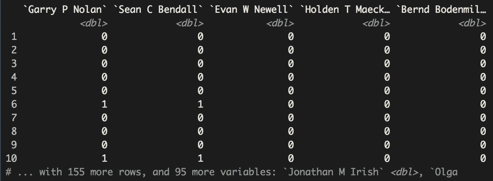
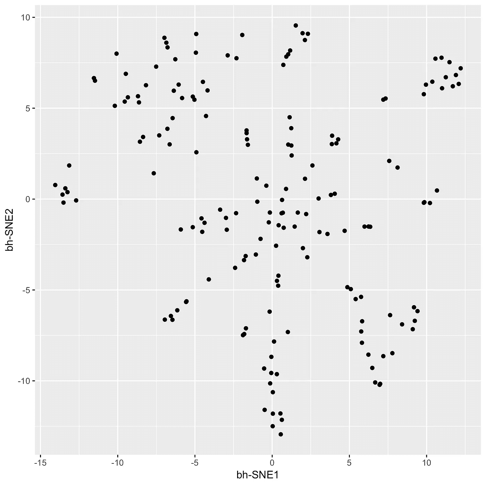
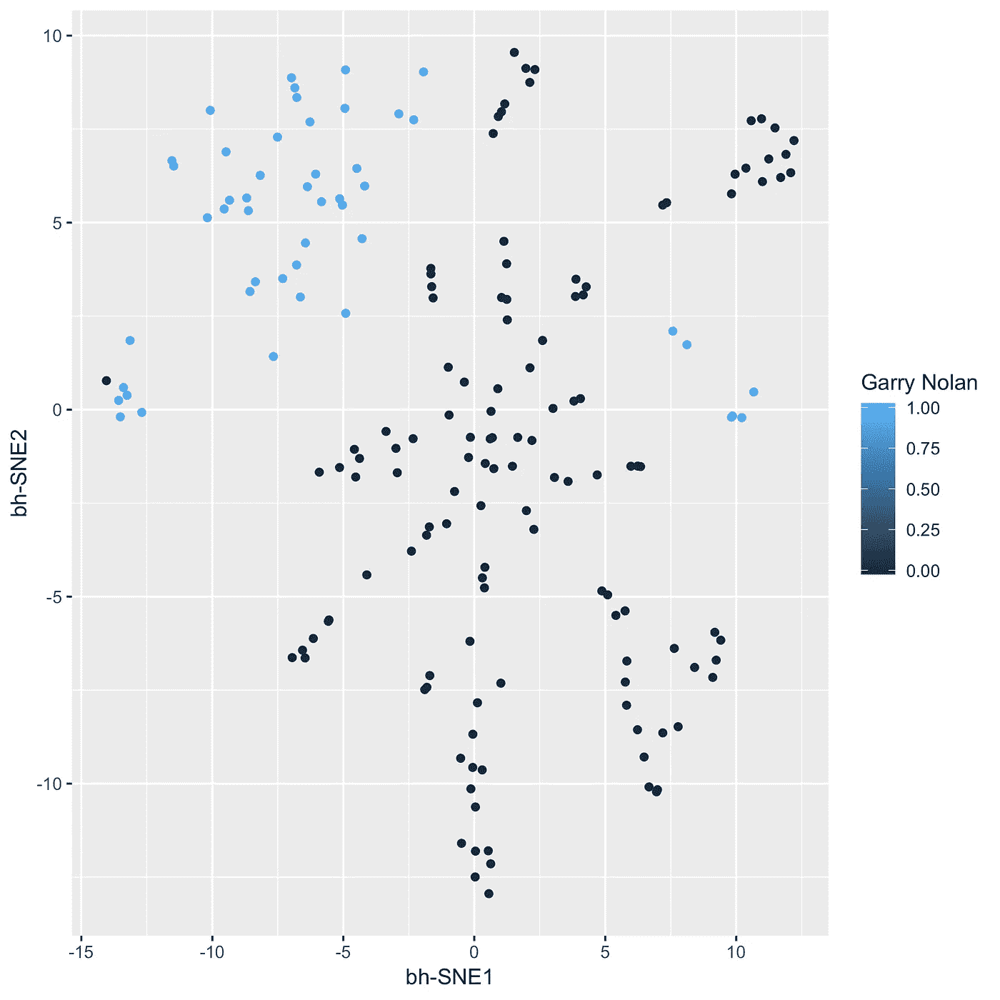
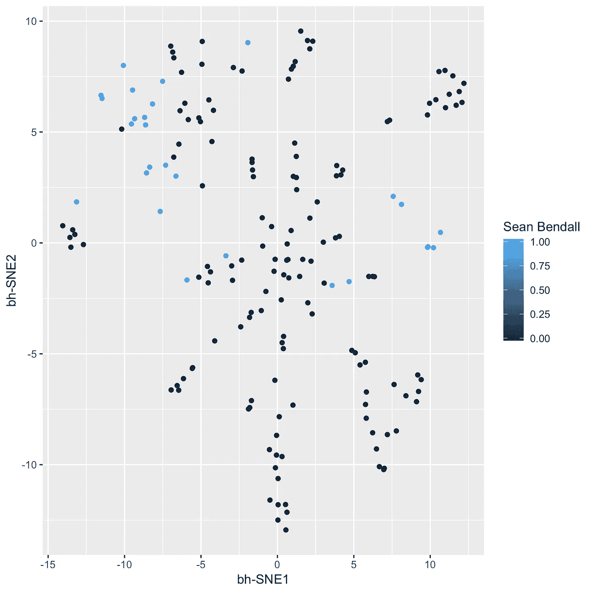
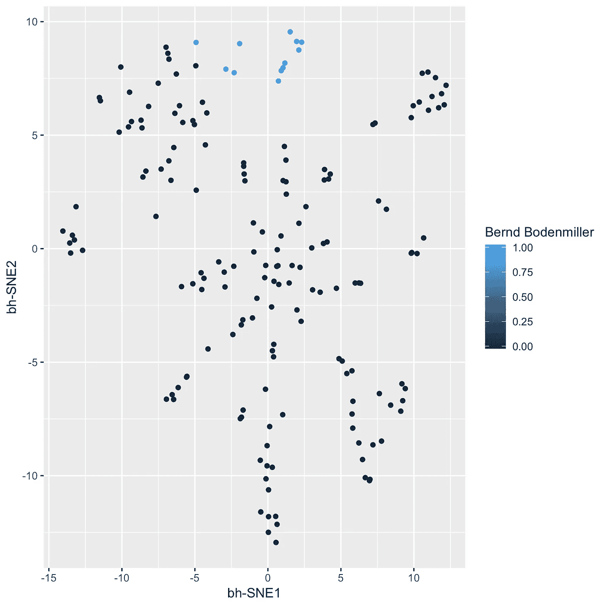
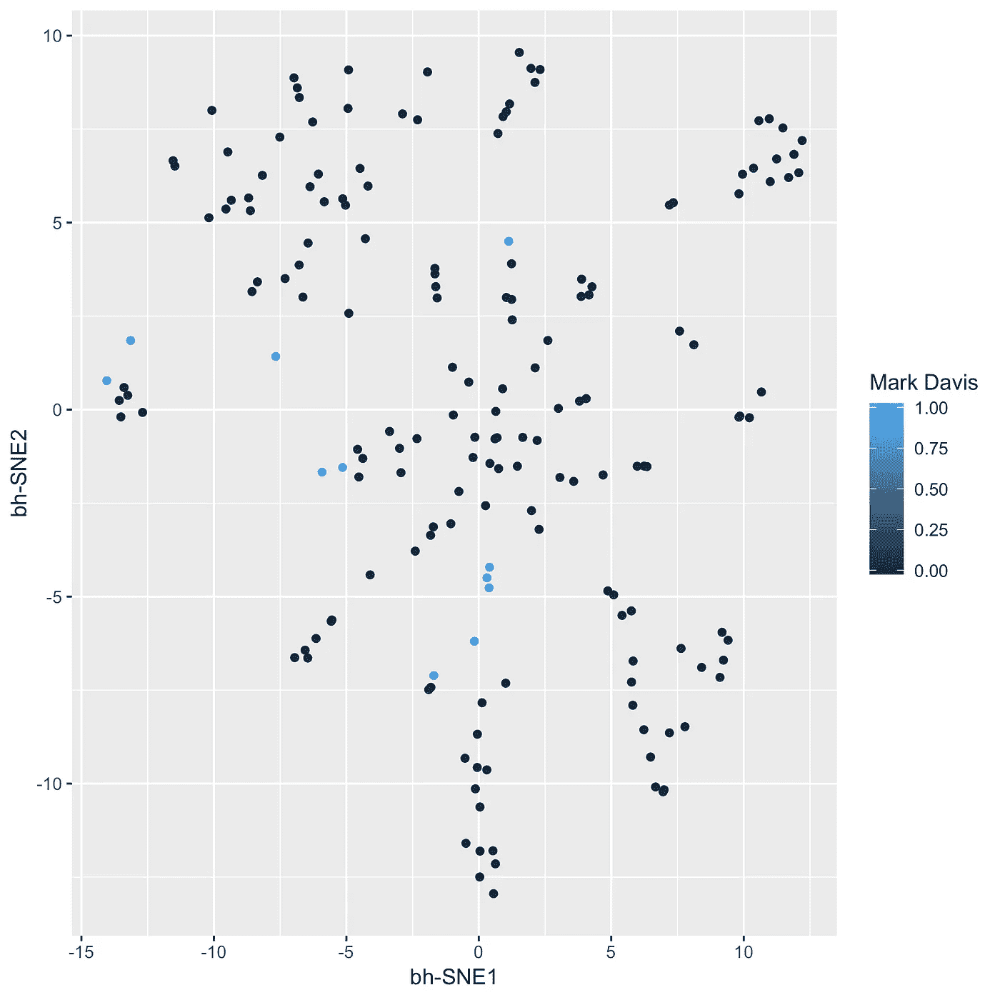
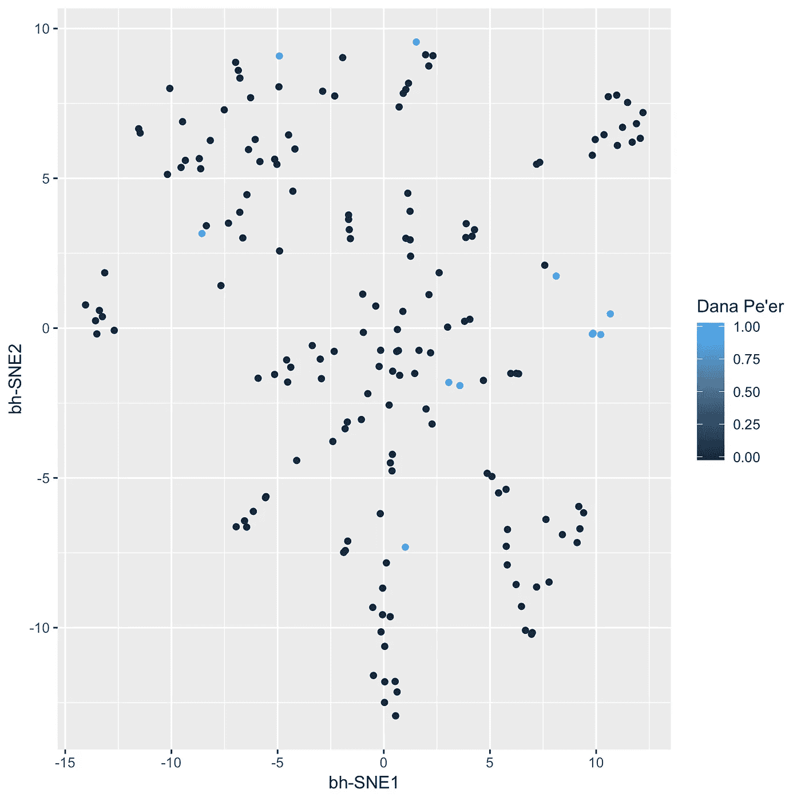
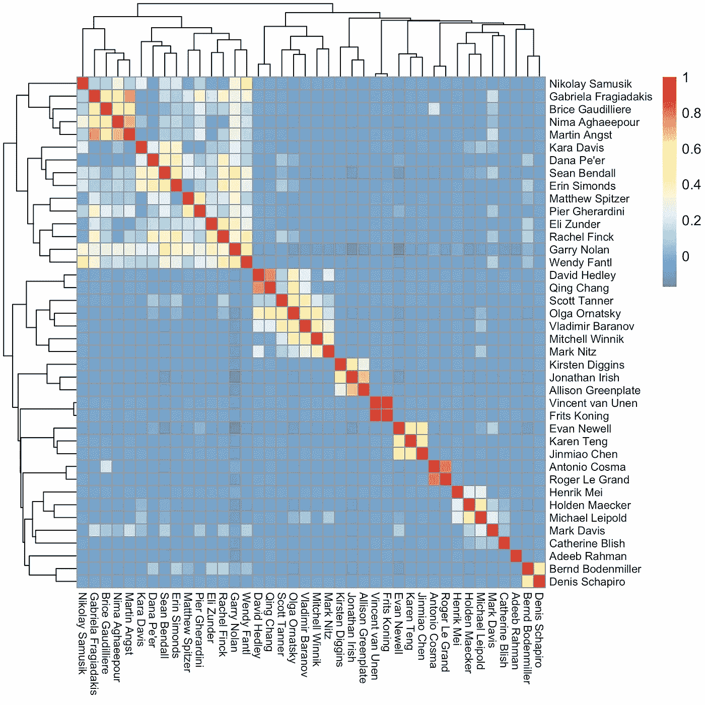

# 如何识别思想领袖并可视化他们的影响力

> 原文：<https://medium.com/coinmonks/how-to-identify-thought-leaders-and-visualize-their-influence-c01aa218090e?source=collection_archive---------5----------------------->

Image provided by igorr at 123rf.com

当你需要快速了解一个新领域时，确定谁是主要的知识权威是很重要的。这有助于人们找到该领域的开创性论文，以及由知名人士撰写的评论。这是我写的上一篇文章的后续，那篇文章着眼于随着时间的推移科学文献中的趋势。

正如我在上一篇文章中所做的那样，我使用 CRAN 的 [RISmed](https://cran.r-project.org/web/packages/RISmed/index.html) 包来提取给定时间范围内的科学论文信息。我不看出版率，而是看作者是如何分布的。在我的分析中，我不知道谁是第一作者，谁是最后作者。我只是报告给定论文中涉及的所有作者，不管他们的立场如何。我也不看它发表在哪个期刊上。唯一的标准是它能进入 PubMed(所以它不是预印的)。

# 量化作者身份

我使用搜索词“肿块细胞学”，因为这是我熟悉的领域，所以我可以相应地确认和解释结果。让我们来看看 2010 年至 2018 年间每个作者的论文数量。

X 轴是作者(第一个，最后一个)，Y 轴是在特定时间范围内发表的论文总数。你可以看到加里·诺兰出现在最多的论文上，这是意料之中的，因为他是这个领域的先驱。紧随其后的是 Sean Bendall，他和 Erin Simonds 一起发表了论文[推广了用于免疫学的大规模细胞计量术](https://www.ncbi.nlm.nih.gov/pubmed/21551058)。在这个列表中值得注意的是 Bernd Bodenmiller，因为他开创了[成像质量细胞计量术](http://www.bodenmillerlab.com/research-2/imaging-mass-cytometry/)，所以当你输入搜索词“质量细胞计量术”时，他的一部分论文会相应地被引导到那里。

如何处理这样的信息图？如果你需要了解质量细胞计量术，你可以找出智力领袖(在这个条形图的左边)，然后找到包括他们作为作者的评论。但是“大规模细胞计量术”领域有许多子域，每个子域大概都有自己的思想领袖。我们如何识别这些？

# 映射每篇论文的作者身份

让我们再深入一点。每篇论文都是作者的集合，通过合适的工具，我们可以感受到一个给定作者的“影响力”,这是通过一个人发表的其他作者的数量来定义的。实现这一点的一个高度可视化的方法是将每张纸变成一个高维对象，并进行降维可视化，就像处理大规模细胞计数或单细胞 RNA 测序数据一样。这个高维物体看起来是这样的:

每行是一篇论文，每列是一个作者。第 6 行和第 10 行是加里·诺兰和肖恩·本道尔共同撰写的论文，如他们各自列中的“1”所示。

现在，如果你做了正确的降维，你可以绘制每篇论文，并查看它们是如何根据作者分组的，有效地创建了迄今为止发表的所有质谱分析论文的直观地图。

对于数据科学家和其他感兴趣的人，我通过只查看前 100 名最多产的作者来最小化稀疏性，给定其余的数据是每个作者一篇或两篇论文。这个清理步骤是产生良好可视化的关键。我使用[逻辑 PCA](https://cran.r-project.org/web/packages/logisticPCA/vignettes/logisticPCA.html) (适用于稀疏二进制数据)将数据集的维度降低到 30，并在这 30 个维度上运行 t-SNE。值得注意的是，这些结果是相似的，并揭示了相同的结论，尽管可能有点清晰，只是在所有 100 个维度上运行 t-SNE 而没有任何维度的减少。

对于其他人，我们来看看这些地图吧！

在上面的地图中，每个点都是一张纸。有共同作者的论文被归类在一起。具体来说，每个点是一系列 0 和 1，对应于论文上所有作者的集合。现在让我们给上面的一些作者上色，并做出相应的解释。

停在这里，你可以看到包含加里诺兰的文件主要落在地图的特定区域，另一边是另一个小岛。Sean Bendall，第二多产的质谱细胞术作者，与 Garry Nolan 有很大的重叠。这可能既来自于他是诺兰实验室中该方法的先驱，也来自于他在斯坦福建立了自己的实验室并保持合作。

当质谱仪出现时，Bernd Bodenmiller 也是 Nolan 实验室的博士后。你可以看到他的三篇论文与诺兰/本道尔地区重叠，但在地图上还有另一个非常独特的岛屿，不属于加里·诺兰和肖恩·本道尔。在诺兰实验室之后，Bernd Bodenmiller 在苏黎世大学建立了自己的实验室，并开始开创所谓的成像质量细胞术。鉴于这种活动是在另一个大陆上，并且与加里·诺兰和肖恩·本道尔各自的方向不同，所以在这张地图上形成一个独立的岛屿是有道理的。

在这里，我展示了两位作者，马克·戴维斯和达纳·皮尔，他们的作者身份似乎比我展示的前三位作者更加分散。我用他们的专业知识来解释这一点。马克·戴维斯是 T 和 B 细胞免疫学方面的权威，而达纳·皮尔是计算系统生物学方面的权威。因此，多个拥有大量细胞计数技术专长的团队与他们合作。

# 映射作者关系

查看每篇论文作者关系发现的另一种方式是热图。只需获取二进制数据，并从中制作皮尔逊相关矩阵。这被称为 [Phi 系数](https://en.m.wikipedia.org/wiki/Phi_coefficient)，它映射了二进制数据集的列之间的关系。如果两个作者相互对每在一起，那么这个值对他们来说将是 1。如果两个作者没有一起发表论文，那么这个值对他们来说就是 0。以下是前 40 位最多产作者的相关热图(Pheatmap R package)。

你可以看到有一些模块的作者一起发表文章(如前所示的加里·诺兰和肖恩·本道尔)，还有一些跨越多个模块的作者(如前所示的马克·戴维斯和达纳·皮尔)。尽管 Adeeb Rahman 非常多产，但他没有和名单上的任何人配对，因为他的合著者不在“前 40 名最多产作者”名单中。这使他与马克·戴维斯和达娜·皮尔处于同一类别。

# 讨论

综合起来，使用两种视觉技术，我揭示了大规模细胞计数领域的两类作者，它们依次与存在的思想领袖的类型相关。第一种是倾向于和相似的人一起发表文章的作者，这是任何给定的实验室或相互合作的实验室所期望的(Garry Nolan，Sean Bendall，Bernd Bodenmiller)。第二类是倾向于与不同人群一起发表文章的作者(马克·戴维斯、达纳·皮尔、阿德布·拉赫曼)。前一个类别可以进一步查询特定的专门化。后一类表明，这些人在塑造领域方面有着更加微妙(和关键)的作用，而不仅仅是他们发表的论文数量。

如果你在寻找某个领域的关键思想领袖，你需要同时寻找这两类人。仅仅根据某个作者的多产程度来分类是不够的。这两个类别可以进一步量化，例如，找到最排他的作者团体及其所做的事情，或者找到具有合著多样性分数的最去中心化的作者。

在后面的帖子中，我将探索向该数据集添加其他功能，如网格术语和位置信息，以确定谁是什么的思想领袖，以及这如何随着时间的推移而变化。