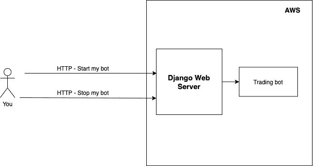

# 如何实现一个加密交易机器人(为假人)-概述

> 原文：<https://medium.com/coinmonks/how-to-implement-a-crypto-trading-bot-for-dummies-overview-b9511664ed74?source=collection_archive---------8----------------------->

## 一个初学者友好的教程，以建立一个币安加密交易机器人。

在本教程中，我们在币安上构建了一个[加密交易机器人](https://blog.coincodecap.com/best-crypto-trading-bots)。这是一个初学者友好的教程。建议有基本的编码经验。

本教程面向以下个人:

*   对密码感兴趣
*   想要提高他们的编码技能
*   想开始一个副业项目，可能会产生一些收入

与其说是钱，不如说是知识。

该项目的目标是拥有一个全天在云中运行的交易机器人。该机器人试图通过利用加密市场的波动性来最大化硬币的数量。它使用一种[贪婪算法](https://en.wikipedia.org/wiki/Greedy_algorithm)来最大化硬币数量。

Executed trades by my bot from 23.5.2021 to 29.5.2021\. The amount of coins for sells of the same coin are highlighted with the same color. For example, the bot sold 1,4280 FIL and 1,6392 FIL. So it accumulated 0,2112 FIL in that period.

本教程有三个部分:

*   [假人加密交易机器人——第一部](/coinmonks/how-to-implement-a-crypto-trading-bot-for-dummies-part-1-efc9d14dffb7)
*   [假人加密交易机器人——第二部分](/coinmonks/how-to-implement-a-crypto-trading-bot-for-dummies-part-2-d16fc8acde03)
*   假人加密交易机器人——第三部分

# 我们将建造什么

在**的第一部分**，我们设置了一切，以便在本地机器上运行 bot。

在**第二部分**中，我们在本地机器上用 [Django](https://www.djangoproject.com/) 建立了一个 [web 服务器](https://en.wikipedia.org/wiki/Web_server)。网络服务器帮助我们通过 [HTTP](https://en.wikipedia.org/wiki/Hypertext_Transfer_Protocol) 与我们的机器人交流。当我们出去吃冰淇淋时，我们可以告诉机器人停止或开始交易。

在**第三步**，我们将整个项目推入云中( [AWS](https://en.wikipedia.org/wiki/Amazon_Web_Services) )。我们的目标是机器人日夜运行。

旁注:我会一直链接维基百科的原始页面。如果太复杂，你可以在简单的维基百科里面搜索(我在学习计算机科学的时候从来没有用过)😉😉).

给自己来杯☕️，让我们准备好吧！

A mapping of terminal commands. These commands are used in the tutorials.

如果一个命令丢失了，谷歌类似“[我的操作系统]中的[已用命令]”

*随时联系我* [*LinkedIn*](https://www.linkedin.com/in/lorenzhofmannwellenhof/) *。订阅我的* [*时事通讯*](http://eepurl.com/hx6Jvf) *，当我写博客讲述我作为软件工程师的个人经历时，我会收到通知。你对如何成为一名更好的软件工程师感兴趣吗？编码快乐！*

 [## 为什么解决算法问题会让你成为更好的软件工程师

### 我从 LeetCoding 中学到的 6 件事

levelup.gitconnected.com](https://levelup.gitconnected.com/why-solving-algorithmic-problems-make-you-a-better-software-engineer-bc543cb034e)