# 如何实现一个加密交易机器人(针对傻瓜)——第 1 部分

> 原文：<https://medium.com/coinmonks/how-to-implement-a-crypto-trading-bot-for-dummies-part-1-efc9d14dffb7?source=collection_archive---------1----------------------->

## 设置 bot 在您的本地机器上运行


在教程的这一部分，我们设置了一个在币安上执行交易的加密机器人。查看[概述](/coinmonks/how-to-implement-a-crypto-trading-bot-for-dummies-overview-b9511664ed74)以了解我们正在构建的内容。

给自己来杯☕️，我们开始吧！

# 币安—设置

*   你需要做的第一件事是去币安注册一个账户。
*   在“安全性”中设置两步认证。

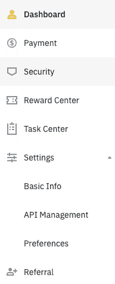

In “Security” you set up 2FA. In a later step we need to come back to “Settings” → “API-Management”.

# 下载机器人的代码

首先，我们创建一个文件夹来保存我们项目的所有文件。打开终端或 CMD，写下:

```
$ mkdir crypto-for-dummies
$ cd crypto-for-dummies
```

第一个命令创建一个文件夹`crypto-for-dummies`。第二个命令 **c** 将 **d** 目录切换到该文件夹。让我们暂时保持终端开放。

我们使用一个公开可用的贸易机器人。我们将根据我们的需要改变这个机器人。一个普遍的指导原则是，如果处理你的钱的代码不是你自己的代码，你就不应该相信它。我研究了机器人的代码。它值得我信赖，我从 2021 年 2 月开始使用它。还有一个 [Discord](http://binance-trade-bot-master) 频道，用户在那里谈论机器人。在本教程的最后，我们将深入研究机器人的逻辑，以了解它是如何工作的。

按下“代码”按钮下载代码。解压文件夹，并将解压后的文件夹移动到`crypto-for-dummies`文件夹中。在终端中键入`ls`将会输出:

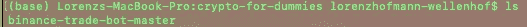

在终端输入`cat binance-trade-bot-master/requirements.txt`。这会列出一堆外部需求(包)。我们的机器人需要这些包才能正常运行。

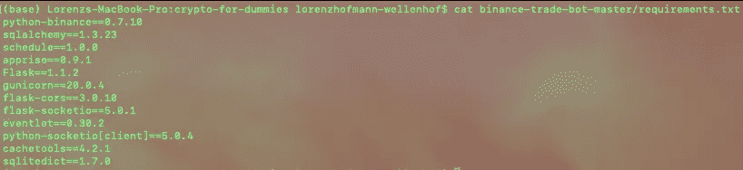

Necessary external packages. *Side note: There is a mapping of macOS to Windows terminal commands in the overview article in case they are different.*

为了管理外部包，我们将使用 Anaconda。

# 下载蟒蛇

前往 [Anaconda](https://docs.anaconda.com/anaconda/install/) 并为你的操作系统下载它。成功安装后，重启你的终端/ CMD 并输入`conda`。您应该得到如下输出:

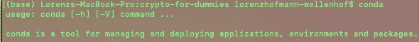

*边注:我很久以前就装了 Anaconda。如果你遇到任何麻烦，检查他们的文件，否则随时联系。*

首先，我们创建一个 Anaconda [环境](https://conda.io/projects/conda/en/latest/user-guide/tasks/manage-environments.html)。类型`conda create --name crypto-for-dummies python=3.8`。如果要求继续，请确认。等到蟒蛇完成。通过键入`conda activate crypto-for-dummies`激活环境。

Anaconda 环境对于跨不同项目管理外部包非常有用。例如，在我们的项目中，`requirements.txt`中列出的所有外部包都将被安装到 Anaconda 环境“虚拟加密”中。如果您启动另一个项目，您将创建另一个 anaconda 环境，外部包将被安装到第二个环境中。

# 下载 PyCharm

我们需要的下一个程序是 PyCharm。前往[那里](https://www.jetbrains.com/pycharm/download)并下载社区版本。PyCharm 是一个开发环境。这是我们将要编写代码的地方。

一旦你安装了 PyCharm，启动它并点击“打开”。找到你的`crypto-for-dummies`文件夹并选择它。

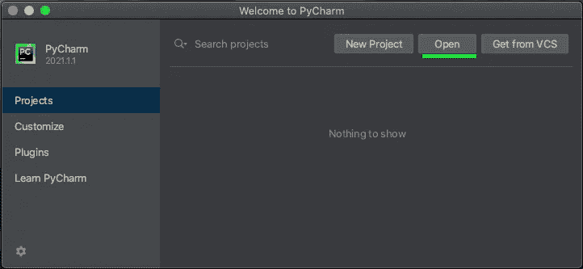

为了验证你选择了正确的文件夹，在你的终端中输入`ls -a`。这将列出`crypto-for-dummies`文件夹中的所有文件夹和文件(甚至是不可见的文件/文件夹)。应该有两个文件夹:`.idea`和`binance-trade-bot-master`。`.idea`文件夹保存了 PyCharm 的一系列配置。不用担心这些。

接下来我们想把 PyCharm 和 Anaconda 联系起来。以便 PyCharm 知道使用哪个 Python 版本和外部包。在我的情况下，这是自动发生的。如果 PyCharm 的右下角有一小段文字写着:“Python 3.8(傻瓜密码)”，那么它就是链接的。

如果没有自动发生，进入“py charm”→“首选项”，然后搜索“解释器”。您可以将解释器手动设置到**现有的** conda 环境。

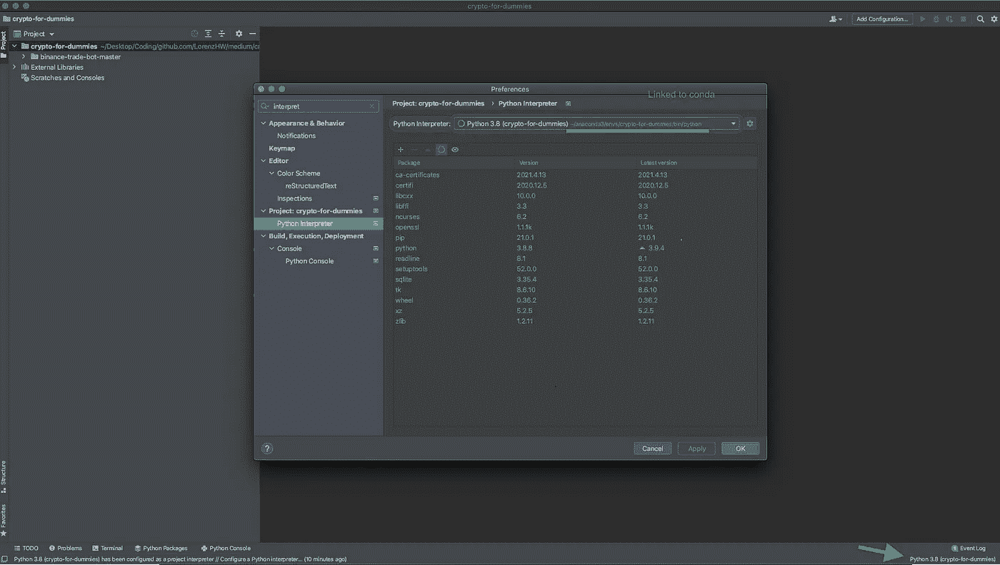

If everything is set up properly it should look like this.

让我们安装需求:

1.  打开您的终端并检查您的环境是否处于活动状态。否则用`conda activate crypto-for-dummies`激活它。
2.  安装外部软件包:`pip install -r binance-trade-bot-master/requirements.txt`

# 运行机器人

我们首先需要做几件事:

1.  在目录`binance-trade-bot-master`中创建一个新文件，并将其命名为`user.cfg`。将文件内容从`.user.cfg.example`复制到新创建的文件中。这个配置文件包含机器人操作的某些设置。
2.  去币安。在“设置”→“API 管理”中，您需要创建一个 [API](https://en.wikipedia.org/wiki/API) 密钥。你可以称之为“傻瓜密码”。有了这个密钥，我们的机器人可以与币安通信并执行交易。
3.  用币安的值替换`user.cfg`中`api_key`的值。对`api_secret_key`的值做同样的操作。保管好秘密。任何知道这个秘密的人都可以进入你的币安账户。
4.  在币安，买一枚你喜欢的硬币。花 10 美元–20 美元就够了。
5.  在`user.cfg`内设置`current_coin`的值。我买的是 Filecoin，所以在我的情况下看起来是这样的:`current_coin=FIL`。使用你的硬币的股票代号！(例如 FIL)
6.  文件`supported_coin_list`列出了机器人将要交易的所有硬币。调整到你喜欢的程度。唯一的要求是你也要添加你的`current_coin`。

好了，是时候运行机器人了:

1.  再次打开你的终端，输入:`cd binance-trade-bot-master`。检查您的 conda 环境是否处于活动状态！

2.然后键入:`python -m binance_trade_bot`。您应该会看到如下输出:

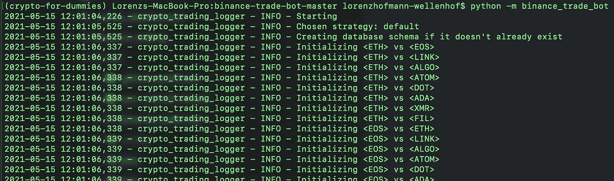

Initializing all the ratios between the coins.

有点耐心。在某个时候，将会有以下输出:

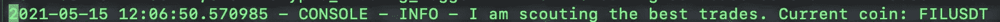

好极了👏！资产管理自动化的第一步。

# 深潜:机器人如何工作

请务必阅读[自述文件](https://github.com/edeng23/binance-trade-bot)。这个机器人遵循一个[贪婪策略](https://en.wikipedia.org/wiki/Greedy_algorithm)。机器人的目标是积累更多的硬币。它不关心法定货币。

让我们看一个例子和相应的代码。当你第一次启动这个机器人时，它会在`supported_coin_list`文件中初始化你所有硬币之间的比率(见上面的截图)。

## 初始化

比如说你的`supported_coin_list`里有 EOS 和 LINK，你现在的硬币是 EOS。EOS 的市值是 10 美元，LINK 的市值是 20 美元。在您的数据库中会有以下信息:

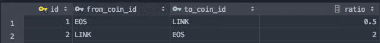

The first row shows information about the EOS → LINK. 10 / 20 is the ratio for that pair. The second row shows information about the LINK → EOS pair.

## 侦察——跳到下一个最好的硬币

当机器人开始侦察时，它会反复调用`auto_trader.py`内部一个名为`_jump_to_best_coin`的函数:

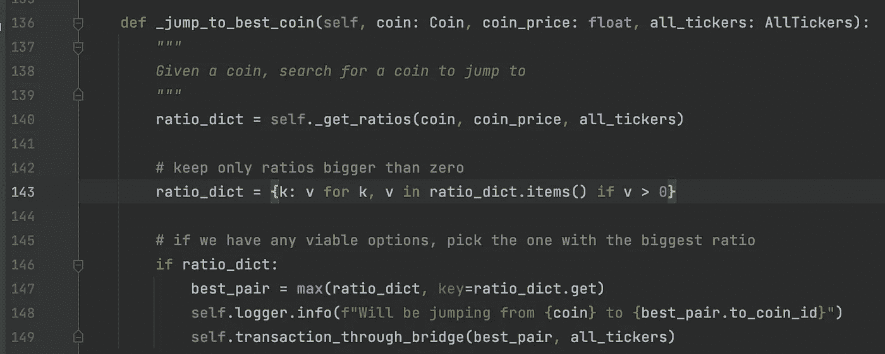

这个函数做三件事

*   在第 140 行，我们从另一个名为`self._get_ratios`的函数中得到某种[字典](https://www.w3schools.com/python/python_dictionaries.asp)。不要管`self._get_ratios`是怎么工作的。我们稍后会对此进行调查。在`ratio_dict`中，我们存储的键值对可能是这样的:

```
# The key of the dictionary is a pair of coins
# The value of the dictionary is some kind of ratio{
  EOS->ETH: -1.3,
  EOS->ALGO: -0.5,
  EOS->ATOM: 0.01,
  EOS->LINK: 0.04
}
```

*   在第 143 行，我们只保存比率大于 0 的值。所以`ratio_dict`会是这个样子。

```
{
  EOS->ATOM: 0.01,
  EOS->LINK: 0.04
}
```

*   在第 146–149 行:`best_pair`表示比率最高的一对。在我们的例子中，这是 EOS → LINK。在这种情况下，机器人将出售所有的 EOS 硬币，目前在你的拥有和购买链接(第 149 行)。如果没有比率> 0，机器人重新开始。

## 侦察——获取比率

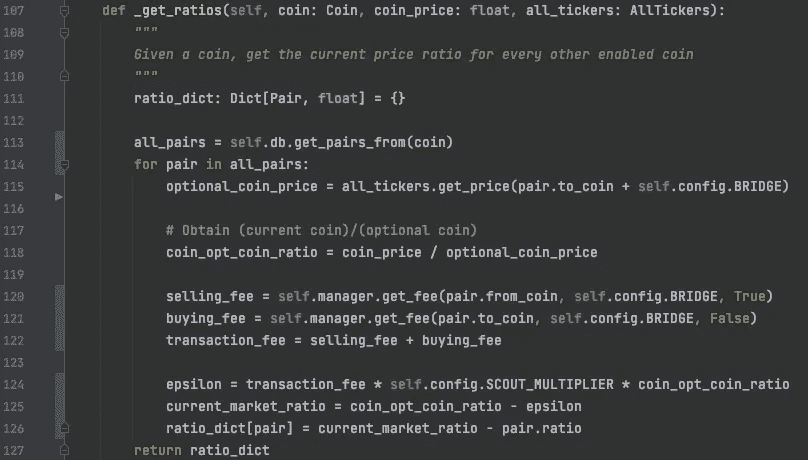

_get_ratios function inside auto_trader.py. I slightly modified the function for better understanding.

这个函数的目标是构造一个字典，就像我们之前看到的一样:

1.  这个函数接收我们当前持有的硬币的**电流**`coin_price`(EOS)。让我们假设 EOS 的价格变为 15 美元。
2.  在第 113 行，我们从数据库中获得我们持有的当前`coin`的`all_pairs`(例如 EOS)。所有对是一个列表，可能看起来像这样:`all_pairs = [(EOS->LINK), (EOS->ALGO), (EOS->ATOM), (EOS->ETH)]`。
3.  在第 114 行，我们循环遍历每一对。在第 115 行，我们得到了`to_coin`的**当前**价格。让我们假设 LINK 的价格是 25 美元。
4.  在第 118 行，我们计算比率`coin_opt_coin_ratio`。这将导致 15 美元/ 25 美元= 0.6
5.  在第 120-122 行，我们得到了来自币安的费用。我们假设`transaction_fee`等于 0.02。
6.  在第 124 行`epsilon`被计算。在我们的例子中:0.02 * 5 * 0.6 = 0.06。`self.config.SCOUT_MULTIPLIER`是在`user.cfg`文件中指定的值，默认为 5。在第 125 行，我们计算出`current_market_ratio`为:0.6–0.06 = 0.54
7.  在第 126 行，我们计算比率，然后将它放入字典。在我们的例子中:0.54–0.5 = 0.04。记住`pair.ratio`是我们从初始化步骤得到的 0.5。这在`ratio_dict`中产生了第一个键值对:

```
{
  EOS->LINK: 0.04
}
```

我们对`all_pairs`中的每一对重复这些计算。

好的，太好了！那么这一切意味着什么呢？我们从基于当前市场数据(`current_market_ratio`)的比率中减去基于先前市场数据(`pair.ratio`)的比率。如果结果是 0，我们知道这将是一笔有利可图的交易。

让我们假设您将`self.config.SCOUT_MULTIPLIER`更改为一个更大的值。结果是`current_market_ratio`变小了。并且`current_market_ratio — pair.ratio`大于 0 的概率更小。这意味着你的机器人将等待更大的硬币收益/损失，直到它交易。

*随时联系我*[*LinkedIn*](https://www.linkedin.com/in/lorenzhofmannwellenhof/)*。订阅我的* [*时事通讯*](http://eepurl.com/hx6Jvf) *，当我写博客讲述我作为软件工程师的个人经历时，我会收到通知。查看本教程的第二部分。编码快乐！*

## 另外，阅读

*   [电网交易机器人](https://blog.coincodecap.com/grid-trading)
*   [密码交易机器人](https://blog.coincodecap.com/best-crypto-trading-bots)