# 如何实现一个加密交易机器人(针对傻瓜)——第 2 部分

> 原文：<https://medium.com/coinmonks/how-to-implement-a-crypto-trading-bot-for-dummies-part-2-d16fc8acde03?source=collection_archive---------5----------------------->

## 在 Django web 服务器上运行交易机器人


[**第一部分**](/coinmonks/how-to-implement-a-crypto-trading-bot-for-dummies-part-1-efc9d14dffb7)

在教程的这一部分，我们用 [Django](https://www.djangoproject.com/) 建立了一个 web 服务器。我们通过 HTTP 与服务器通信。目标是通过 HTTP 请求启动和停止交易机器人。

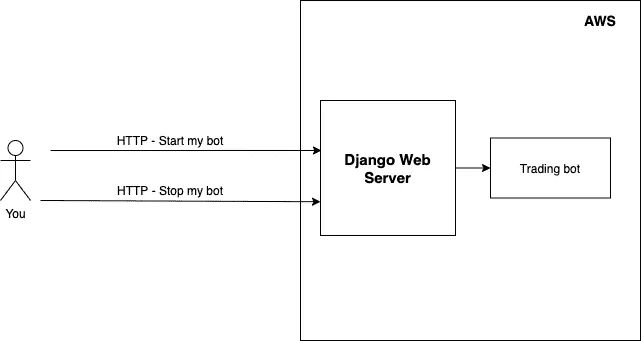

Our setup is based on the [client-server model](https://en.wikipedia.org/wiki/Client%E2%80%93server_model).

# 建立 Django 项目

打开一个终端(您也可以使用 PyCharm 中的终端)并检查我们的 conda 环境是否处于活动状态。验证我们是否在项目的根文件夹中

```
$ conda activate crypto-for-dummies
$ ls
binance-trade-bot-master
```

然后安装 Django:

```
$ pip install django
```

开始一个新的 Django 项目:

```
$ django-admin startproject myserver
$ ls
binance-trade-bot-master **myserver**
```

这将创建文件夹`myserver`。

让我们运行服务器:

```
$ cd myserver
$ python manage.py runserver
```

输出如下所示:

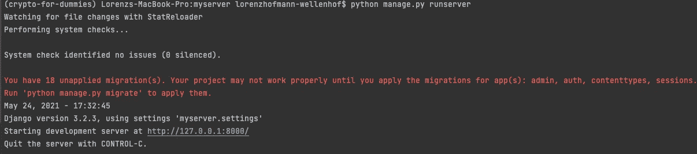

Terminal output when starting the server.

前往网址`[http://127.0.0.1:8000/](http://127.0.0.1:8000/.)`。有一个来自 Django 的欢迎页面。

# 创建一个端点

现在，我们想要创建一个 HTTP 端点。我们稍后使用这个端点来启动和停止机器人。端点总是带有特定的 URL。例如:`[http://127.0.0.1:8000/](http://127.0.0.1:8000/.)api/bot`。

首先，让我们创建一个 Django 应用程序:

```
$ python manage.py startapp bot
$ ls
**bot** db.sqlite3 manage.py myserver
```

这就创建了目录`bot`。Django 允许我们创建多个应用程序。应用程序可以区分我们服务器的不同用途。

让我们快速调查一下其他文件和文件夹:

*   `manage.py`是来自 Django 的 Python 文件。我们用那个文件管理我们的整个 Django 项目。
*   `db.sqlite3`是一个 [SQLite](https://en.wikipedia.org/wiki/SQLite) 数据库文件。Django 应用程序使用这个数据库来存储信息。我们不会使用那个数据库，因为我们已经有了另一个 SQLite 数据库。检查文件夹`binance-trade-bot-master/data`。里面是一个名为`crypto_trading.db`的文件。这也是一个 SQLite 数据库，机器人在其中存储关于我们当前硬币的信息，与其他硬币的比率，以及其他信息。
*   `myserver`是一个目录，它包含了来自 Django 的一系列 Python 文件(如`settings.py`),以使我们的 web 服务器运行。

改编`bot/views.py`内的代码:

转到`myserver/url.py`并将其修改为:

皮查姆可能会抱怨:

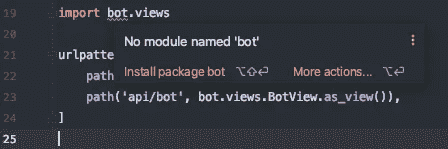

PyCharm: wrong folder set as root

要解决这个问题，右击**外部的** `myserver`文件夹。点击:“将目录标记为”→“源根目录”。

前往[邮差](https://www.postman.com/downloads/)下载。我们使用 postman 向我们的服务器发送一个 HTTP 请求，并触发新创建的端点。把 Postman 想象成[客户](https://en.wikipedia.org/wiki/Client%E2%80%93server_model)。以后，当我们出去吃冰淇淋时，我们可以用手机代替邮递员。

在 Postman 中，我们可以创建一个 GET 请求。如果一切设置正确，我们将从服务器得到一个响应:

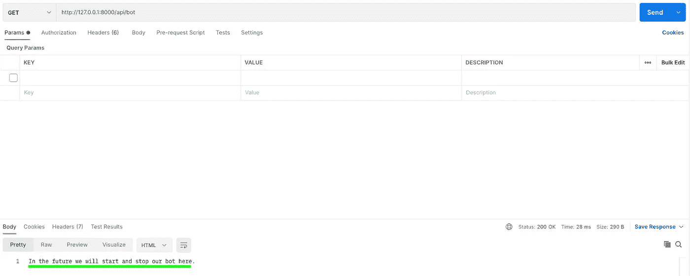

Response of the server in Postman

# 通过端点启动 bot

将文件夹`binance-trade-bot-master`移动到`myserver/bot`文件夹中:

```
$ ls
myserver binance-trade-bot-master
$ mv binance-trade-bot-master/ myserver/bot
$ ls
myserver
```

将`binacne-trade-bot-master`文件夹重命名为`binance_bot:`

```
$ cd myserver/bot
$ mv binance-trade-bot-master binance_bot //This renames the folder
$ ls
**binance_bot** **migrations** admin.py apps.py models.py ....
```

用`python manage.py runserver`重启我们的服务器会导致以下错误:

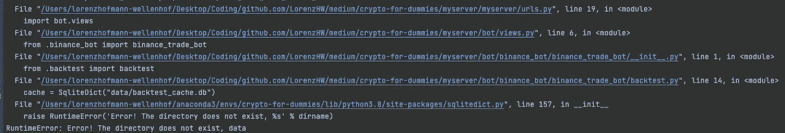

Error when starting the server.

转到错误描述中提到的文件`backtest.py`，将第 14 行改为:

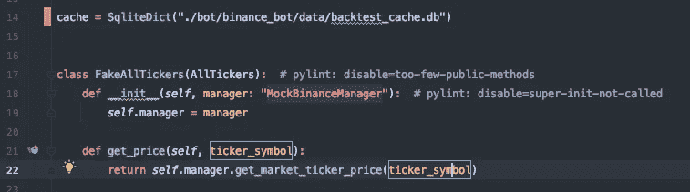

backtest.py: update line 14.

提示:按“SHIFT”两次，搜索文件。

我们现在必须更改几个文件中的路径。这是因为应用程序的根发生了变化。转到以下文件:

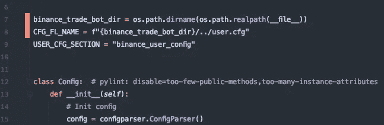

config.py: update line 7 and 8.

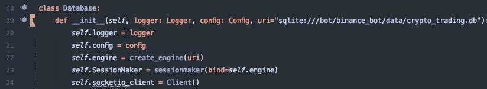

database.py: update line 19.

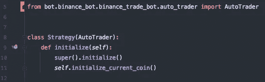

default_strategy.py: update line 5.

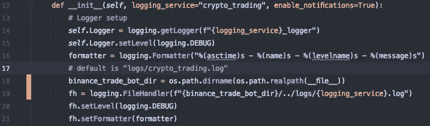

logger.py: update line 18 and 19.

现在，我们在一个新的[线程](https://en.wikipedia.org/wiki/Thread_(computing))中启动机器人:

为了更好地理解线程，请阅读本文末尾的“深入探讨:线程”。简单的解释是，我们不希望 Django 服务器在运行 bot 时被阻塞。它应该仍然能够回答 HTTP 请求。

我们还添加了一个名为`action`的[查询参数](https://en.wikipedia.org/wiki/Query_string)。转到 postman 并更新 URL:


URL with query parameter “action”

现在，我们应该能够通过 GET 请求启动 bot。

要停止 bot，我们需要在终端中按下“CMD + C”来停止服务器。

# 通过端点停止 bot

在我们继续之前，我强烈建议您阅读本文末尾的“深入探讨:线程”。否则你会很难理解我们在做什么。

为了通过 HTTP 请求停止线程，我们需要一个“可停止的”线程。将这个类添加到其他代码下面的`views.py`:

更新`BotView`。使用`StoppableThread`代替传统的`Thread`:

Line 7: Use the StoppableThread. Line 11: Calls a function to find a thread with a specific name and stops it.

在`crypto_trading.py`内部稍微修改一下代码:

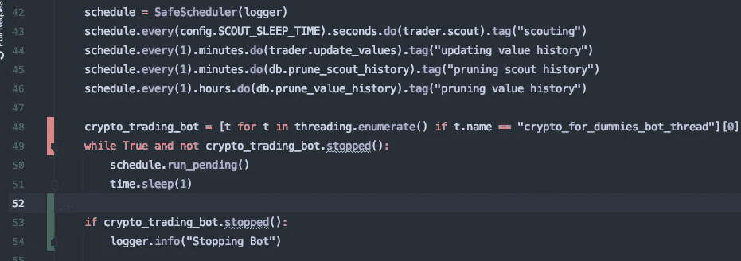

Our changes happened in line 48, 49 and 52–54.

交易机器人通过一个[调度器](https://en.wikipedia.org/wiki/Scheduling_(computing))运行。调度程序重复执行第 43 到 46 行中定义的任务。

在我们改变之前，我们有一个[无限循环](https://en.wikipedia.org/wiki/Infinite_loop) ( `while True`),其中调度程序重复执行任务。

现在，在第 48 行我们找到了我们的`StoppableThread`。在第 49 行，我们扩展了 while 循环的条件。如果 bot 线程应该停止，我们将停止执行 while 循环。

别忘了`import threading`在上面。

在第 52–54 行，我们添加了一些额外的日志记录。

现在，让我们通过 HTTP 请求再次启动 bot。然后我们发出第二个 HTTP 请求，如下所示:


Postman: HTTP request to stop the bot

我们终端的输出如下所示:

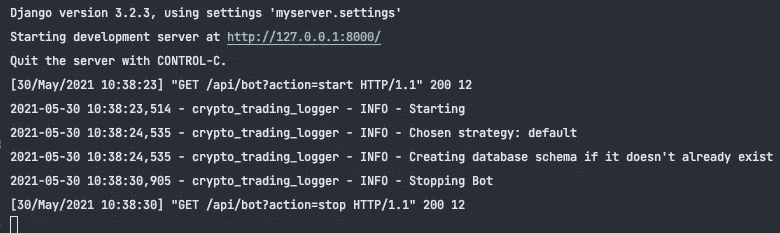

# 深潜:线程

让我们来看看[简单的维基百科](https://simple.wikipedia.org/wiki/Thread_(computer_science))对线程的定义:

> 计算机科学中的**线程**是执行的*线程的简称。线程是程序将自身划分(称为*“split”*)为两个或更多同时(或伪同时)运行的任务的一种方式。*

线程允许我们并行执行多项任务。在我们的例子中，我们有两个任务:

*   运行 Django web 服务器(主线程)
*   运行币安机器人

因此，在我们的例子中，它看起来像这样:

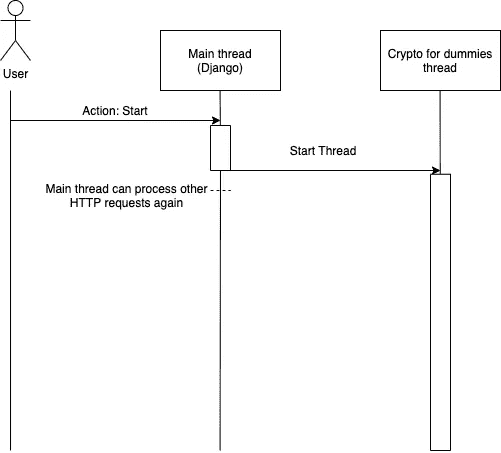

如果我们不使用另一个线程，主线程就会忙于运行交易机器人。它无法处理其他 HTTP 请求。

*随时联系我*[*LinkedIn*](https://www.linkedin.com/in/lorenzhofmannwellenhof/)*。订阅我的* [*时事通讯*](http://eepurl.com/hx6Jvf) *，当我写博客介绍我作为软件工程师的个人经历时，我会收到通知。你对如何成为一名更好的软件工程师感兴趣吗？编码快乐！*

[](https://levelup.gitconnected.com/why-solving-algorithmic-problems-make-you-a-better-software-engineer-bc543cb034e) [## 为什么解决算法问题会让你成为更好的软件工程师

### 我从 LeetCoding 中学到的 6 件事

levelup.gitconnected.com](https://levelup.gitconnected.com/why-solving-algorithmic-problems-make-you-a-better-software-engineer-bc543cb034e) 

## 另外，阅读

*   [电网交易机器人](https://blog.coincodecap.com/grid-trading)
*   [密码交易机器人](https://blog.coincodecap.com/best-crypto-trading-bots)