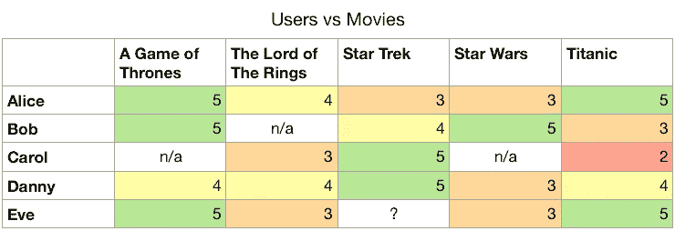
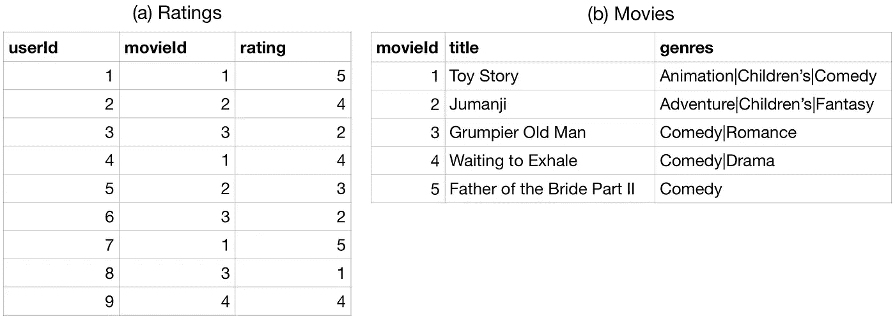
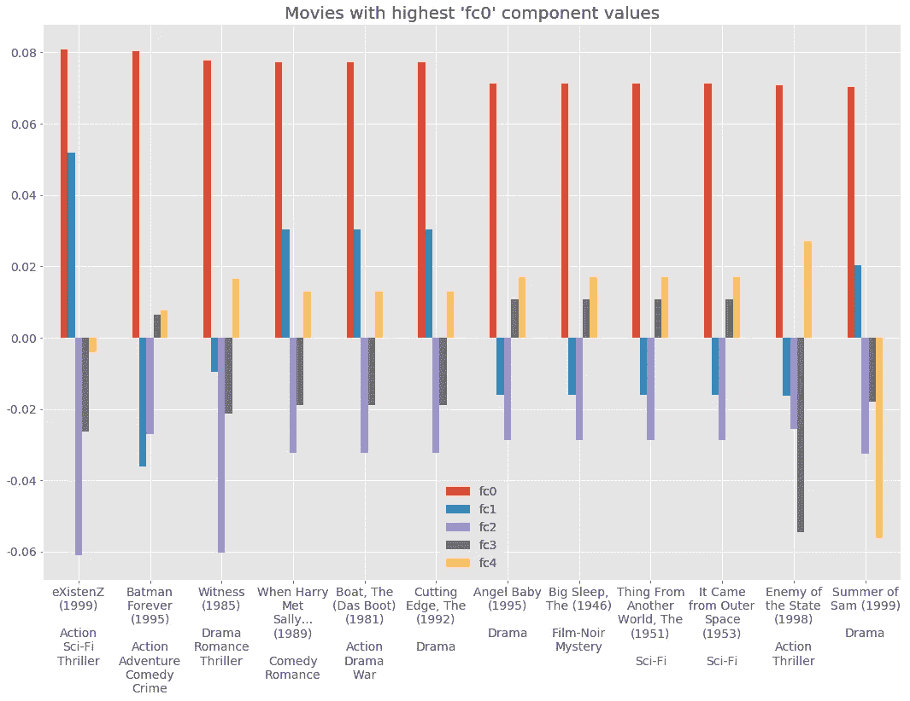
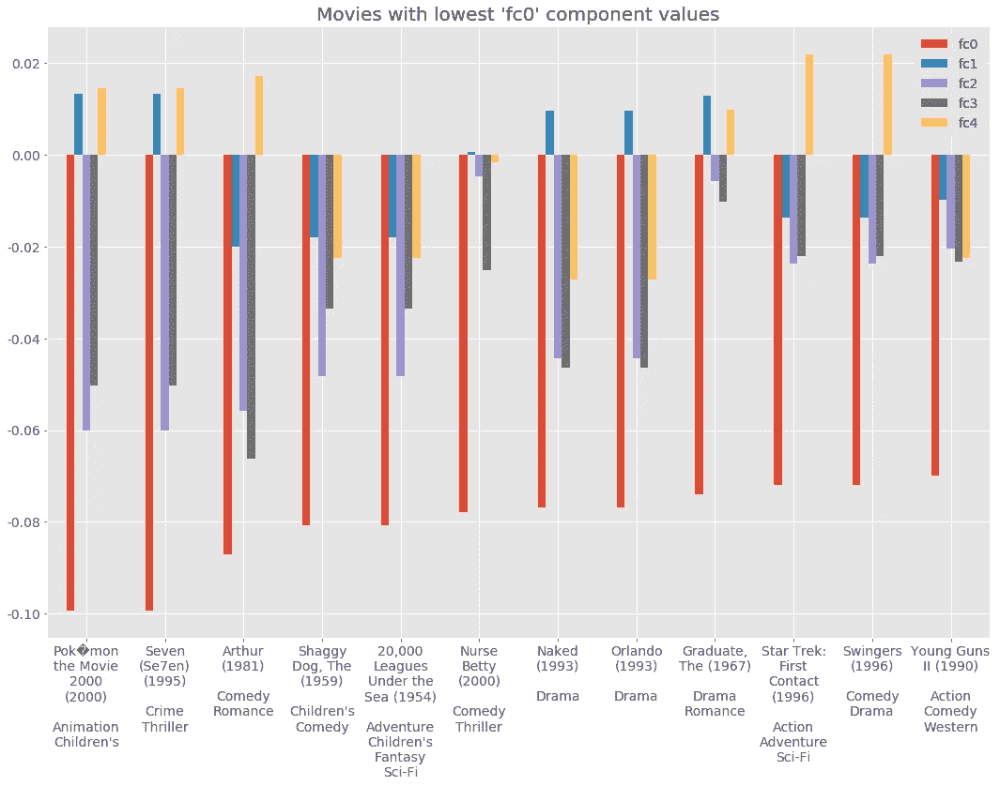

# 如何用深度学习和 PyTorch 实现推荐系统

> 原文：<https://medium.com/coinmonks/how-to-implement-a-recommendation-system-with-deep-learning-and-pytorch-2d40476590f9?source=collection_archive---------1----------------------->

## 应用神经网络制作简单的电影收视率推荐系统

最近我开始看 [fast.ai 讲座](http://course.fast.ai/)——一个关于深度学习及其应用的很棒的在线课程。在他的一次演讲中，作者讨论了一个简单的基于神经网络的推荐系统的构建，并将其应用于 [MovieLens 数据集](http://files.grouplens.org/datasets/movielens/)。虽然讲座是关于这个主题的极好的信息来源，但它主要依赖于作者开发的[库](https://github.com/fastai/fastai)来运行培训过程。这个库非常灵活，提供了几个层次的抽象。

然而，我非常想了解更多关于作者代码下的 PyTorch 框架。在这篇文章中，我将描述使用 PyTorch、Pandas 和 Scikit-Learn 实现和训练一个简单的基于嵌入式的协同过滤推荐系统的过程。我们将遵循讲座中描述的步骤，而不使用提到的库。

> **TL；DR** :请使用[这个链接](https://github.com/devforfu/pytorch_playground/blob/master/movielens.ipynb)直接导航到本文讨论的 PyTorch 实现的 Jupyter 笔记本。


Photo by [Tommy van Kessel](https://unsplash.com/@cloudypixel?utm_source=medium&utm_medium=referral) on [Unsplash](https://unsplash.com?utm_source=medium&utm_medium=referral)

# 协同过滤

每当你访问在线商店、视频或音频流媒体服务或任何其他内容交付平台时，你几乎肯定会得到一堆基于你的偏好、以前的购买和访问过的页面的推荐。实现一个能够根据以前的经验给出建议的系统的最直接的算法之一是一种叫做[协同过滤](https://en.wikipedia.org/wiki/Collaborative_filtering)的技术。主要思想是基于“相似”用户的反应来预测用户对特定项目的反应，其中“相似性”是使用这些用户留下的评级或评论来计算的。

从概念上讲，我们正在构建一个矩阵(表)，其中行标识用户，列标识他们的评级。请注意，对于一个真实的数据集，这个矩阵将会非常稀疏，也就是说，它的大部分单元格都是空的，因为通常情况下，与购买/观看它们的用户数量相比，我们有更多的项目。然后，我们使用一种训练算法来推断用户评级模式之间的相似性，以“填补空白”，预测缺失的评级。



Tabular representation of movie ratings

举个例子，假设我们有一群人给一组电影打分，如上图所示。请注意，他们中的一些人(爱丽丝和丹尼)对所有电影进行了评级，而其他人(鲍勃和卡罗尔)则没有。考虑一位新顾客 Eve，她已经看完了除《星际迷航》之外的所有电影。我们如何预测她对这一特定项目的评分？为此，我们将使用她有相似偏好的邻居的平均意见。伊芙喜欢《T2》、《权力的游戏》、《T4》和《泰坦尼克号》,但不喜欢《指环王》、《星球大战》和《星球大战》。Alice 和 Danny 的评级模式类似于 Eve 的行。所以我们可以假设 Eve 大概应该对*星际迷航有或多或少的正面评价。*

在下一节中，我们将查看具有电影评级的真实数据集，并讨论如何准备它来训练神经网络。

# MovieLens 数据集

两个数据框代表我们将要分析的数据集:(a)每部电影的用户评级和(b)关于电影的元信息，特别是电影的标题和类型。为了训练模型，我们只需要数据框(a ),而第二个数据框仅用于训练好的模型解释。



机器学习算法需要一个带有数值的数组。从技术上讲，只要我们的数据集的所有列都是数字，它就符合这些要求。然而，我们不应该将用户和电影 id 直接传递给算法，因为它会试图推断不存在的值之间的依赖关系。这些号码互不相关，仅用于识别目的。

缓解该问题的传统方法是使用[一键编码](http://scikit-learn.org/stable/modules/preprocessing.html#preprocessing-categorical-features)，这意味着用“虚拟”0/1 列替换分类列。这是一个很好的工作技术，当有几个类别，但我们有成千上万的电影和用户。

这就是嵌入发挥作用的地方。我们没有为每个类别分配单独的列，而是将它们表示为 N 维空间中的*向量。换句话说，我们使用一个查找矩阵来返回一个数组，该数组包含给定用户或电影的 ID 的 *N* 个数字:*

```
embedding = [
    [0.25, 0.51, 0.73, 0.49],
    [0.81, 0.11, 0.32, 0.09],
    [0.15, 0.66, 0.82, 0.91]
]
movie_id = 1
movie_vector = embedding[movie_id - 1]
```

我们首先用随机值初始化矩阵，然后在训练过程中调整它们。例如，如果我们只有五部电影和五个用户，并且选择 *N* 等于四，那么我们随机初始化的嵌入矩阵可能看起来像下图所示。


Tables with randomly initialized embeddings vectors

这个技巧允许我们将高维分类变量输入到神经网络中。在下一节中，我们将展示如何使用 PyTorch 框架构建这个模型。

# 嵌入网络

PyTorch 是一个允许构建各种计算图形(不仅仅是神经网络)并在 GPU 上运行它们的框架。张量、神经网络和计算图的概念超出了本文的范围，但简单地说，人们可以将该库视为一组工具，以创建计算效率高且灵活的机器学习模型。在我们的案例中，我们希望创建一个神经网络，它可以帮助我们推断用户之间的相似性，并根据可用数据预测他们的评级。


上面的图片示意性地显示了我们将要建立的模型。在最开始，我们把我们的嵌入矩阵，或查找，转换成浮点数数组的整数 id。接下来，我们把一堆全连接层与辍学。最后，我们需要返回一个预测评级的列表。为此，我们使用一个具有 sigmoid 激活函数的图层，并将其重新缩放到原始值范围(对于 MovieLens 数据集，通常是从 1 到 5)。

这个片段展示了如何使用 **PyTorch** 框架编写一个类来创建一个具有嵌入、几个隐藏的全连接层和退出的神经网络。

例如，要创建一个具有 3 个隐藏层的网络，其中 100、200 和 300 个单位之间有漏失，请使用:

```
net = EmbeddingNet(
    n_users, n_movies, 
    n_factors=150, 
    hidden=[100, 200, 300], 
    dropouts=[0.25, 0.5])

print(net)

*--------------------------------------------------------------------*

EmbeddingNet(
  (u): Embedding(6040, 150)
  (m): Embedding(3706, 150)
  (drop): Dropout(p=0.02)
  (hidden): Sequential(
    (0): Linear(in_features=300, out_features=100, bias=True)
    (1): ReLU()
    (2): Dropout(p=0.25)
    (3): Linear(in_features=100, out_features=200, bias=True)
    (4): ReLU()
    (5): Dropout(p=0.5)
    (6): Linear(in_features=200, out_features=300, bias=True)
    (7): ReLU()
  )
  (fc): Linear(in_features=300, out_features=1, bias=True)
)
```

# 训练循环

最后，我们“等式”中的最后一个变量是培训过程。我们选择[均方差](https://en.wikipedia.org/wiki/Mean_squared_error)损失作为网络质量的衡量标准。误差越大，我们的收视率预测就越不准确。我们还使用带重启的学习率余弦退火技术来匹配开箱即用的 **fastai** 库中可用的默认配置。

请点击[此链接](https://github.com/devforfu/pytorch_playground/blob/master/movielens.ipynb)查看准备数据集和训练模型所需的完整源代码。

# 额外收获:嵌入式可视化

当模型被训练和验证后，我们可以问一个问题:*我们如何解释结果*？神经网络通常被认为是黑盒算法，如果不应用特定的可视化技术，很难以有意义的方式解释它们的权重。

然而，在我们的例子中，我们可以尝试使用嵌入矩阵来解释训练结果。训练完成后，这些矩阵不再包含随机值，应该以某种方式反映我们数据集的特征。如果我们尝试可视化这些嵌入，以检查是否可以发现任何模式呢？

为此，让我们应用[主成分分析](http://setosa.io/ev/principal-component-analysis/)来降低维度，然后从电影嵌入中挑选几个样本。然后让我们用第一个分量的高正值来绘制示例，用下图所示的高负值来绘制示例。



从上面的图像中，我们可以猜测“红色”部分主要反映了电影中的“严肃程度”。喜剧、动画和冒险片具有这种负面价值，而更“戏剧化”的电影则具有这种正面价值。

# 结论

在花了几个小时使用 PyTorch 之后，我可以向任何想要建立机器学习模型的人强烈推荐这个库。这个库值得您关注，尤其是如果您已经熟悉 Python 的话。该库非常直观且易于扩展，允许您利用 Python 语言的最佳特性来构建各种复杂程度的模型。

*对 Python 语言感兴趣？离不开机器学习？看过网上的其他东西吗？*

*那么你可能会对我的博客* [*感兴趣，我的博客*](https://iliazaitsev.me/) *讲述了各种编程话题，并提供了我感兴趣的教科书和指南的链接。*

> 加入 Coinmonks [电报频道](https://t.me/coincodecap)和 [Youtube 频道](https://www.youtube.com/c/coinmonks/videos)获取每日[加密新闻](http://coincodecap.com/)

## 另外，阅读

*   [复制交易](/coinmonks/top-10-crypto-copy-trading-platforms-for-beginners-d0c37c7d698c) | [加密税务软件](/coinmonks/crypto-tax-software-ed4b4810e338)
*   [网格交易](https://coincodecap.com/grid-trading) | [加密硬件钱包](/coinmonks/the-best-cryptocurrency-hardware-wallets-of-2020-e28b1c124069)
*   [密码电报信号](http://Top 4 Telegram Channels for Crypto Traders) | [密码交易机器人](/coinmonks/crypto-trading-bot-c2ffce8acb2a)
*   [有哪些交易信号？](https://coincodecap.com/trading-signal) | [比特斯坦普 vs 比特币基地](https://coincodecap.com/bitstamp-coinbase)
*   [ProfitFarmers 回顾](https://coincodecap.com/profitfarmers-review) | [如何使用 Cornix 交易机器人](https://coincodecap.com/cornix-trading-bot)
*   [如何在势不可挡的域名上购买域名？](https://coincodecap.com/buy-domain-on-unstoppable-domains)
*   [印度的加密税](https://coincodecap.com/crypto-tax-india) | [altFINS 审查](https://coincodecap.com/altfins-review) | [Prokey 审查](/coinmonks/prokey-review-26611173c13c)
*   [最佳加密交易所](/coinmonks/crypto-exchange-dd2f9d6f3769) | [印度最佳加密交易所](/coinmonks/bitcoin-exchange-in-india-7f1fe79715c9)
*   [开发人员的最佳加密 API](/coinmonks/best-crypto-apis-for-developers-5efe3a597a9f)
*   最佳[密码借贷平台](/coinmonks/top-5-crypto-lending-platforms-in-2020-that-you-need-to-know-a1b675cec3fa)
*   杠杆代币的终极指南