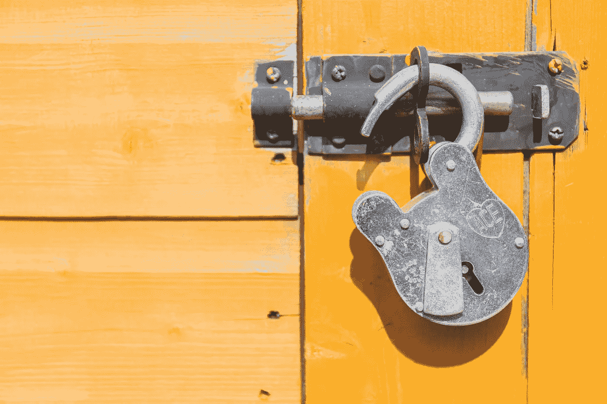

# 如何在以太坊上实现无气交易

> 原文：<https://medium.com/coinmonks/how-to-implement-gas-less-transactions-on-ethereum-9f9273d2f059?source=collection_archive---------0----------------------->

## 为大众解锁以太坊

每个人都在谈论“无气”以太坊交易，因为没有人喜欢为气付钱。但是以太坊网络的运行恰恰是因为交易是付费的。那么，你怎么能有“无气”的东西呢？这是什么魔法？