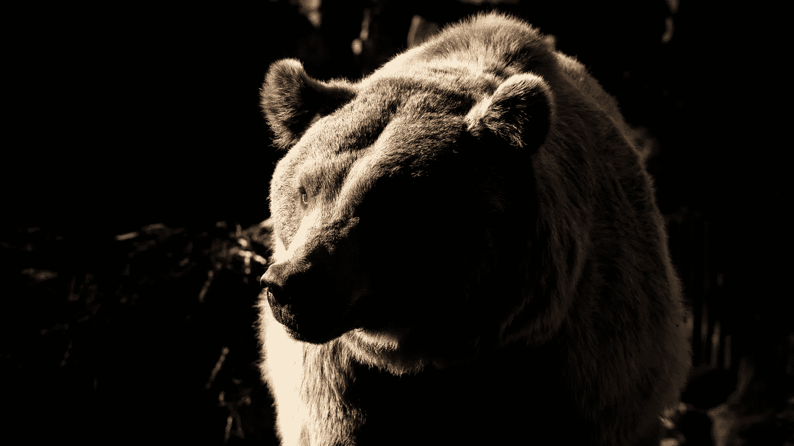

# 如何在熊市中增加你的比特币持有量——第一部分

> 原文：<https://medium.com/coinmonks/how-to-increase-your-bitcoin-holdings-in-a-bear-market-part-i-5701f34be067?source=collection_archive---------0----------------------->

## 随着价格下跌，如何处理你的比特币

## 在上周比特币崩盘期间，我们的策略实现了 26%的投资回报率。如果你注意的话，你也许还能赶上下一趟车。

*Photo by* [*Angel Luciano*](https://unsplash.com/@roaming_angel?utm_source=unsplash&utm_medium=referral&utm_content=creditCopyText) *on Unsplash.*