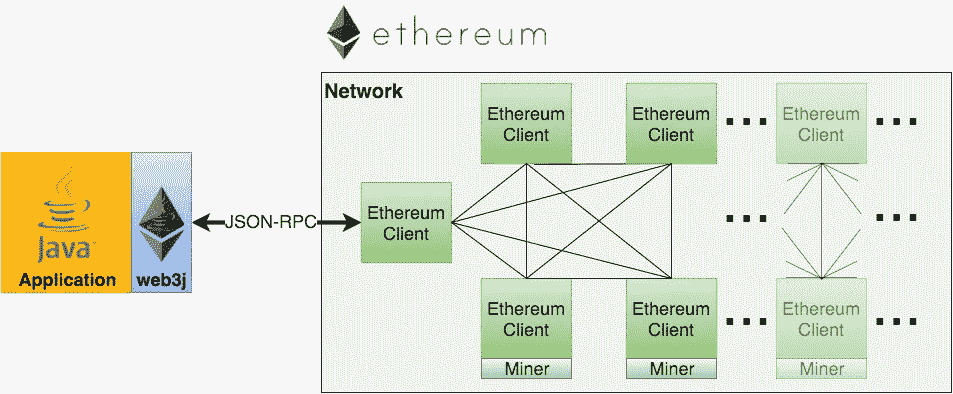

# 如何使用 JAVA 与智能合同交互

> 原文：<https://medium.com/coinmonks/how-to-interact-with-smart-contract-using-java-f5b1ce7324e7?source=collection_archive---------1----------------------->

本文重点介绍如何通过 Web3j 与智能合约交互，调用函数，部署新的智能合约到以太网



[https://web3j.readthedocs.io/en/latest/index.html](https://web3j.readthedocs.io/en/latest/index.html)

# WEB3J

该 SDK 是开发与以太坊区块链网络连接的软件的强大框架

准备一个**以太坊完全节点**来连接以太坊区块链网络或者你可以使用 [Infura](https://infura.io/) 来代替建造你自己的节点。

将 *Web3j 依赖*添加到 pom 文件中:

```
<!-- https://mvnrepository.com/artifact/org.web3j/core -->
<dependency>
    <groupId>org.web3j</groupId>
    <artifactId>core</artifactId>
    <version>3.5.0</version>
</dependency>

<!-- https://mvnrepository.com/artifact/org.web3j/parity -->
<dependency>
    <groupId>org.web3j</groupId>
    <artifactId>parity</artifactId>
    <version>3.5.0</version>
</dependency>

<!-- https://mvnrepository.com/artifact/org.web3j/parity -->
<dependency>
    <groupId>org.web3j</groupId>
    <artifactId>crypto</artifactId>
    <version>3.5.0</version>
</dependency>

<!-- https://mvnrepository.com/artifact/org.web3j/parity -->
<dependency>
    <groupId>org.web3j</groupId>
    <artifactId>abi</artifactId>
    <version>3.5.0</version>
</dependency>

<!-- https://mvnrepository.com/artifact/org.web3j/parity -->
<dependency>
    <groupId>org.web3j</groupId>
    <artifactId>codegen</artifactId>
    <version>3.5.0</version>
</dependency>
```

这是一个启动 web3j 客户端与网络交互的示例:

```
package org.blockchain.services.ethereum;

import org.blockchain.config.AppContext;
import org.web3j.crypto.WalletFile;
import org.web3j.protocol.Web3j;
import org.web3j.protocol.Web3jService;
import org.web3j.protocol.core.DefaultBlockParameterNumber;
import org.web3j.protocol.core.Request;
import org.web3j.protocol.http.HttpService;
import org.web3j.protocol.parity.Parity;
import org.web3j.protocol.parity.methods.response.ParityExportAccount;
import org.web3j.protocol.parity.methods.response.ParityTracesResponse;
import org.web3j.protocol.parity.methods.response.Trace;

import java.util.List;

public class **Web3JClient** {
    private static Web3jService ***service***= new HttpService("http://localhost:8545"); // put fullnode url here
    private static Web3j ***web3j***= Web3j.*build*(*service*);
    private static Parity ***parity***= Parity.*build*(*service*);

    public static List<Trace> getCallActionsInBlock(long blockNum) throws Exception {
        DefaultBlockParameterNumber number = new DefaultBlockParameterNumber(blockNum);
        Request<?, ParityTracesResponse> request = ***parity***.traceBlock(number);
        ParityTracesResponse response = request.send();
        return response.getTraces();
    }

    public static List<Trace> getCallAction(String hash) throws Exception {
        Request<?, ParityTracesResponse> request = ***parity***.traceTransaction(hash);
        ParityTracesResponse response = request.send();
        return response.getTraces();
    }

    public static WalletFile exportAccount(String address, String password) throws Exception {
        Request<?, ParityExportAccount> request = ***parity***.parityExportAccount(address, password);
        ParityExportAccount response = request.send();
        return response.getWallet();
    }

    public static void main(String[] args) throws Exception {
// test function here }
}
```

# 与智能合同交互

1.  **准备**:

*   准备合同。例如，我将使用 **ERC20.sol** 与 ERC20 令牌智能合约进行交互。这里可以找到
*   下载 [**solidity 编译器**](https://github.com/ethereum/solidity/releases) ，提取并添加导出环境变量**。**编译器用于将 ERC20.sol 编译成二进制格式。
*   为 [**web3j 脚本**](https://github.com/web3j/web3j/releases/tag/v3.6.0) 下载、提取并添加环境变量。这个脚本可以从 solidity 二进制文件生成 java 类。它包括 linux 和 windows 的版本脚本。

**2。将 Solidity 契约翻译成 Java 类:**

首先，我们需要编译一个 solidity 代码为*二进制*和 *abi* 格式。

*   首先使用 solidity 编译器包中的 **solc** 编译合同:

```
solc <contract>.sol --bin --abi --optimize -o <output-dir>/
```


compile contract into folder ../compiled


After compile

编译后我们会有两个文件: *ERC20.abi* 和 *ERC20.bin*

*   使用 web3j.bat (windows)将编译后的契约导入到您的项目中。通用命令:

```
web3j solidity generate [--javaTypes|--solidityTypes] /path/to/<smart-contract>.bin /path/to/<smart-contract>.abi -o /path/to/src/main/java -p com.your.organisation.name
```


generate java class from compiled contract


this is java contract class

**部署并调用合同中的函数:**

*** *注意* :** *Erc20 我这里用的是接口，所以 deploy 步骤是例子，不起作用。试试你自己的合同，看看有什么不同。*

```
package org.blockchain.services.ethereum;

import org.blockchain.model.ethereum.ERC20;
import org.web3j.crypto.Credentials;
import org.web3j.crypto.ECKeyPair;
import org.web3j.crypto.WalletFile;
import org.web3j.protocol.Web3j;
import org.web3j.protocol.Web3jService;
import org.web3j.protocol.core.DefaultBlockParameterNumber;
import org.web3j.protocol.core.Request;
import org.web3j.protocol.core.methods.response.TransactionReceipt;
import org.web3j.protocol.http.HttpService;
import org.web3j.protocol.parity.Parity;
import org.web3j.protocol.parity.methods.response.ParityExportAccount;
import org.web3j.protocol.parity.methods.response.ParityTracesResponse;
import org.web3j.protocol.parity.methods.response.Trace;
import org.web3j.tx.FastRawTransactionManager;
import org.web3j.tx.TransactionManager;
import org.web3j.tx.gas.DefaultGasProvider;
import org.web3j.tx.response.NoOpProcessor;

import java.math.BigInteger;
import java.util.List;

public class Web3JClient { private static Web3jService *service* = new HttpService("http://localhost:8545");
    private static Web3j *web3j* = Web3j.*build*(*service*);
    private static Parity *parity* = Parity.*build*(*service*); public static void main(String[] args) throws Exception {
        */**
         ** ***TEST DEPLOY AND CALL CONTRACT FUNCTION*** **/* // load private key into eckey to sign
        **String** *privatekey* = "***********************************";
        **BigInteger** *privkey* = new **BigInteger**(privatekey, 16);
        **ECKeyPair** *ecKeyPair* = **ECKeyPair**.*create*(privkey);
        **Credentials** *credentials* = **Credentials**.*create*(ecKeyPair);
        **NoOpProcessor** *processor* = new **NoOpProcessor**(*web3j*);

        //deploy new contract
        **TransactionManager** *txManager* = new **FastRawTransactionManager**(*web3j*, credentials, processor);

        **RemoteCall**<ERC20> *request* = **ERC20**.*deploy*(*web3j*, txManager, **DefaultGasProvider**.*GAS_PRICE*, **DefaultGasProvider**.*GAS_LIMIT*);
        **ERC20** token = request.send();
        **String** contractAddress = token.getDeployedAddress("3"); // 3 is ropsten testnet

        // load existing contract by address
        // ERC20 token = ERC20.load(contractAddress, web3j, txManager, DefaultGasProvider.GAS_PRICE, DefaultGasProvider.GAS_LIMIT);

        // create transaction transfer token to receiver
        **String** *receiver* = "0xa107483c8a16a58871182a48d4ba1fbbb6a*****";
        **BigInteger** *value* = new **BigInteger**("10000000000000");
        **TransactionReceipt** *receipt* = *token*.transfer(receiver, value).send();
        // get transaction result
        System.*out*.println(*receipt*.getTransactionHash());
    }
}
```

# 结论

上面的例子是一个通过 Java 与以太坊智能合约交互的简单演示。希望对此有所帮助。

Web3j 中有很多特性支持我们连接以太坊区块链网络。你可以在这里找到:【https://web3j.readthedocs.io/en/latest/index.html】T42

请在下面留下您的评论:)。

谢谢你们的掌声！:)

> 加入 Coinmonks [电报频道](https://t.me/coincodecap)和 [Youtube 频道](https://www.youtube.com/c/coinmonks/videos)获取每日[加密新闻](http://coincodecap.com/)

## 另外，阅读

*   [复制交易](/coinmonks/top-10-crypto-copy-trading-platforms-for-beginners-d0c37c7d698c) | [加密税务软件](/coinmonks/crypto-tax-software-ed4b4810e338)
*   [网格交易](https://coincodecap.com/grid-trading) | [加密硬件钱包](/coinmonks/the-best-cryptocurrency-hardware-wallets-of-2020-e28b1c124069)
*   [密码电报信号](http://Top 4 Telegram Channels for Crypto Traders) | [密码交易机器人](/coinmonks/crypto-trading-bot-c2ffce8acb2a)
*   [最佳加密交易所](/coinmonks/crypto-exchange-dd2f9d6f3769) | [印度最佳加密交易所](/coinmonks/bitcoin-exchange-in-india-7f1fe79715c9)
*   开发人员的最佳加密 API
*   最佳[密码借贷平台](/coinmonks/top-5-crypto-lending-platforms-in-2020-that-you-need-to-know-a1b675cec3fa)
*   [免费加密信号](/coinmonks/free-crypto-signals-48b25e61a8da) | [加密交易机器人](/coinmonks/crypto-trading-bot-c2ffce8acb2a)
*   [杠杆代币](/coinmonks/leveraged-token-3f5257808b22)终极指南