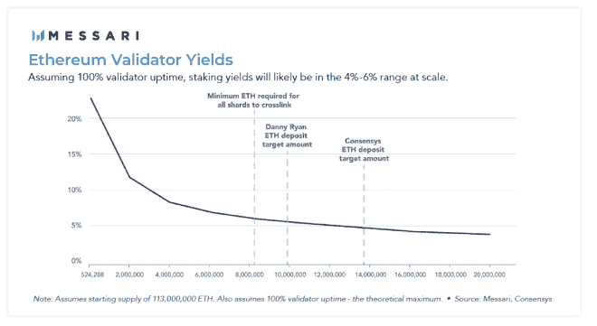

# 如何在一次投资中投资债券、股票和商品

> 原文：<https://medium.com/coinmonks/how-to-invest-in-debt-equity-and-commodities-in-one-investment-d3654a270c8?source=collection_archive---------8----------------------->

# 23 外卖 ETH 2.0:加密经济的下一次进化

Wilson Withiam 和 [Ryan Watkins](https://twitter.com/RyanWatkins_) 在他们的研究报告 ETH 2.0:加密经济的下一次进化中，对从 ETH 1.x 到 ETH 2.0 的路径进行了全面的概述。

详细概述进行过渡所需的阶段和发展里程碑。我的外卖。

# 1.ETH 2.0 将把 ETH 转变为一项资产

*ETH 2.0 不仅仅是以太坊区块链的重大升级；也是对 Ethereurm 原生资产 ETH 的一次重大升级。ETH 2.0 将把 ETH 转变为一种资产，为其提供三种资产超类的属性:资本资产、商品和价值储存——这是一种前所未有的组合 5。它还将从根本上改变以太坊的货币政策，尽管出于安全目的，该货币政策会持续通胀，但年通胀率可能会低于 1%，甚至更低…*

# 外卖食品

如果成功，ETH 2.0 实施将创建一个结合了三个超级资产类别属性的零对一资产:

*   资本资产
*   商品
*   价值的“储存”

首次投资于同一种资产，并倾向于低通胀。

# 2.ETH 2.0 利用分片来扩展网络

在 ETH 2.0 下，以太坊区块链将被划分为 64 个并行分片，每个分片都有一个处理事务块的动态节点子集。这样做的原因是为了确保运行节点的需求保持足够低，以便任何人都可以使用消费硬件来运行节点，同时仍然增加整个系统的可伸缩性。单就分片而言，其吞吐能力将比当前 PoW ETH 链上的吞吐能力提高至少 64 倍。

# 外卖食品

部署分片将以太坊扩展到 Visa 在消费者硬件上的交易吞吐量。

# 3.信标链将发布和分片联系在一起

*这是所有系统级活动和协调发生的地方。信标链存储和管理验证器及其利害关系的注册，应用共识规则，并存储对分片状态的引用。*

信标链将被分成多个槽，每个槽都是一个块被添加到信标链(和碎片)的机会。插槽被进一步组织成 epochss，每个 epoch 包含 32 个插槽，并作为网络检查点来帮助完成事务。在 ETH 2.0 的结束状态下，当系统运行在最佳状态时，每 12 秒就会添加一个信标链块和 64 个分片块。每个区块将由随机选择的验证者(区块提议者)提议，并由随机选择的验证者委员会(称为证明者)投票(每个委员会的目标为 128)。

# 外卖食品

分散式扩展是一项艰巨的挑战，ETH 2.0 有机会通过信标链成功应对。

# 4.以太是 ETH 2.0 的核心

*最后，使整个系统成为可能的 ETH 2.0 的核心是 ETH(以太)。ETH 不仅将成为以太坊的价值资产的本地存储库和交易的燃料，而且还将成为以太坊在 PoS 系统中的最终安全来源。验证者将被要求持有至少 32 个 ETH 才能参与共识过程。验证者将因充分履行其职责而获得奖励，因未能充分履行职责而受到惩罚，如果他们表现恶意，将被削减(删除他们的股份)。*

*由于推出 ETH 2.0 的复杂性，以及社区不想对当前支持繁荣经济的以太坊链(ETH 1.x)造成任何破坏，ETH 2.0 将在多年内分阶段推出。ETH 2.0 将首先与 ETH 1.x 并行运行，最终通过将 ETH 1.x 作为一个碎片合并到 ETH 2.0 中来与 ETH 1.x 合并。这些阶段分为阶段 0、阶段 1、阶段 1.5 和阶段 2。然而，重要的是要注意，尽管这些阶段是按顺序编号的，但是这些阶段的开发将会并行发生。*

# 外卖食品

资产是否对 ETH 2.0 至关重要:

*   从工作证明过渡到利益证明
*   安全运行
*   将 ETH 1.x 并入 ETH 2.0 网络
*   保持低通货膨胀率

# ETH 2.0 的 5 个关键原则

ETH 2.0 的设计考虑了五个关键原则:简单性、长期稳定性、充分性、深度防御和完全的轻客户端可验证性。

***简单****——PoS 和分片本来就复杂。简单性使 ETH 2.0 能够最大限度地降低开发成本，减少攻击面，并让用户确信协议参数选择是合理的，因为它们更容易理解(可信中立性的关键)。*

***长期稳定性****——区块链哲学中的一条分界线是沿着稳定性 vs .进化谱。稳定阵营倾向于僵化区块链，这样它的使用更可预测，因此在理论上更安全。它源于这样一种信念，即对于任何真正希望成为关键公共基础设施的区块链来说，稳定是必不可少的，尤其是对金钱等东西而言。进化阵营倾向于不断改进区块链，使其更具功能性和健壮性。它源于这样一种信念，即区块链技术还处于起步阶段，在僵化之前还有许多根本性的改进要做——就目前而言，进化是至关重要的。以太坊到目前为止更倾向于光谱的进化端，认识到区块链技术的婴儿期和它必须做出的根本性改进，以便它可以在全球范围内扩展。然而，ETH 2.0 的设计理念是，一旦构建，就很少需要长期更改，以实现必要的稳定性*

*为以太坊充当公共基础设施。*

***充分性****——虽然区块链不能太强大，因为更大的力量意味着更大的复杂性，因此也意味着更大的脆弱性，但区块链必须仍然足够强大，才能在其基础上构建第 2 层协议，既不是集中式的，也不依赖于强信任假设。为了实现这一点，区块链必须包括一种表达性(足够)的编程语言、可伸缩的数据可用性和计算，以及快速的阻塞时间。*

***纵深防御****——区块链必须具有容错能力，能够抵御攻击它们必须能够在各种可能的安全假设下正常工作。实现这一点的关键方法是设计系统，使其尽可能分散，以防止故障、共谋和攻击，并且在有害的共谋确实发生的情况下，使那些共谋的人付出极其昂贵的代价，并且使非共谋参与者容易恢复系统。同样重要的是，验证系统的参与者要参与到游戏中，系统要让个人贡献者在决策中对他们的贡献负责。*

***全光客户端可验证性****——很多用户只会通过光客户端——连接到全节点的软件与以太坊区块链互动，以便与区块链互动。因此，对于这些用户来说，重要的是能够确保给定一些假设，他们可以验证整个系统中的数据是可用的和有效的，即使在 51%的攻击下。*

# 外卖食品

为了使 ETH 2.0 取得成功，它必须:

*   做出可理解的设计选择
*   发展成为其他项目的稳定基础
*   通过第 2 层解决方案具有足够的可扩展性
*   采用一个安全模型，验证器在游戏中有皮肤
*   确保可以用现成的硬件验证数据

# 6.利益证明模型可能比工作证明更安全

经济价值损失很重要，且可能使 PoS 比电力更安全，因为经济价值损失可能很大。与基于 ASIC 的 PoW 区块链不同，比特币需要 ASIC 形式的前期资本成本，PoS 参与者投入的资本成本不会贬值。此外，考虑到利益相关者运行验证器的维护成本很低，而且利益相关者可以在短时间的提款后随时取回他们的存款，利益相关者真正承担的唯一成本是机会成本。这些要点很重要，因为它们理论上使 PoS 赌注者更愿意为每一美元的回报支付更高的资本成本，可能是一个数量级或更多，从而大大提高了攻击链的成本。

# 外卖食品

在 POW 模型中，主要的 POS 成本是利益相关者的机会成本和矿工的直接成本。

# 7.以太坊的货币政策被定义为最低必要发行量

*确保以太坊安全的最低发行额。尽管这样的货币政策可能看起来很主观，容易出现虚假调整，但像任何协议参数一样，以太坊的货币政策是通过社会共识实施的。对货币政策的任何修改都必须得到生态系统中广泛的利益相关者的同意，这绝非易事。自从以太坊的 mainnet 发布以来，它只修改了两次发行，两次调整都是为了将发行减少到这些估计的最低水平。*

*以太坊选择永久发行和无上限供应，因为它将安全性置于货币理想主义之上。与确定性发行和固定供应的加密货币(其安全预算被任意设定)不同，以太坊旨在发行足够的 ETH，以确保以太坊在现在和未来都保持安全。*

然而，选择永久发行和无上限供应并不意味着以太坊的货币政策将是高通胀和不可预测的。

# 外卖食品

以太坊的发行是由网络的安全需求决定的。迄今为止，其永久发行政策只是向下调整，从未向上调整。

# 8.信标链是 ETH 2.0 的中枢神经系统

*协调区块生产，管理验证者及其余额的注册，并应用共识规则(包括奖励和惩罚的发布)。稍后，它还将作为第一阶段的 64 个碎片链的锚点。*

# 外卖食品

信标链是 ETH 2.0 的基础。

# 9.通往 ETH 2.0 的第一步是打桩

*从高层次来看，阶段 0 完全是一种赌注。Beacon 链的到来将使 ETH 持有者成为 ETH 2.0 验证者，并从其持有的 ETH 中获得收入…*

*阶段 0 的唯一目的是引导 ETH 2.0 的验证器集，并确保网络安全地支持后续阶段引入的功能。尽管其极简，几乎类似于 testnet 的功能集，信标链将有真正的金融机会和利益相关者的后果…*

*成为 ETH 2.0 验证者的过程始于存款合同…*

*一种跨链通信解决方案，可在信标链上搭载桩机…*

*定金合同是单向的。一旦 ETH 进入存款合同，唯一的行动方针是主张 ETH 2.0 ETH 和股份。在可预见的未来，这些赌注资产以及任何通胀回报都将是完全不可移动的，因为信标链在 1.5 阶段之前无法处理交易。ETH 2.0 的研究人员探索了建立一个双向桥，但确定如果 ETH 2.0 出现任何问题，风险太大。使存款合同不可逆是一种更安全的方法，它“允许在 ETH 2.0 上更快的开发周期。*

# 外卖食品

对于愿意承担流动性风险的霍德勒来说。从第 0 阶段开始过渡到 ETH 2.0 代表了一个赚取 ETH 回报的独特机会。

# 10.信标链通过纪元、时隙和块运行

*从架构的角度来看，信标链由可进一步细分为槽的时期组成。一个时隙是一个 12 秒的窗口，用于将一个块添加到网络中，一个时期是 32 个时隙，这相当于每个时期 6 分 24 秒。在阶段 0，ETH 2.0 只包含一个链，即信标链；因此，插槽将包含单个块。一旦第一阶段到来并引入 64 个分片链，slots 将是向网络添加一个信标链块和 64 个分片块的机会。每个时段中的第一个槽通常用作网络检查点，这有助于最终确定之前添加的块(使它们基本上不可逆)，并在发生分叉时将新客户端导向正确的链……*

*对于每个时隙，信标链使用称为 RANDAO 的随机采样机制来伪随机地选择一个验证器来提议一个块。它使用相同的采样机制来伪随机地选择一组(或多组)被称为证明者的验证者，这些验证者将对新提出的块的有效性进行投票。投票由证明人的赌注秤来衡量。一组证明者代表一个委员会，每个委员会有 128 个验证者的目标成员。*

# 外卖食品

你只能用简单来扩展一个分散的网络。

# 11.奖励与验证者的表现直接相关

*Beacon Chain 使用复杂的验证者奖惩系统来避免次优执行，同时鼓励诚实的投票实践和高正常运行时间。验证者因为生产和证明(LMD·幽灵和卡斯珀·FFG 投票)得到绝大多数支持的程序块而获得奖励。完成的块的证明甚至更有价值。但是，错过投票或投票给没有最终确定的区块会导致与他们因充分履行这些职责而获得的奖励成比例的处罚(取消赌注余额……*

*验证者因表现良好而获得奖励，因表现不佳而受到惩罚，因恶意行为而可能被削减……*

# 外卖食品

对于验证者来说，块证明可能比块生产更有利可图。

# 12.产量是由验证器的数量和质量决定的

*验证者必须……考虑各种成本。*

*成本包括* ***资本获取成本*** *(最少需要 32 个 ETH 才能入股)* ***机会成本*** *(在 1.5 期之前，入股者无法撤回其股权)，以及* ***基础设施成本*** *(验证器客户端和信标节点)…*

*决定标题收益的是赌注参与和验证机正常运行时间的组合。信标链至少需要 524，288 ETH 才能启动——在这一点上，验证者每年将获得约 23%的收益…*

随着时间的推移，随着用户越来越适应赌注的风险，服务提供商越来越能够满足赌注者的需求(如流动性)，采用率应该会增加。

*根据 ConsenSys 的说法，ETH 2.0 的赌注参与率(与 ETH 1.x 的安全性相当)将低于 1600 万 ETH。在这一点上，验证者每年的理论最高收益是 4.4%。尽管在阶段 1.5 之前达到该目标可能需要很长时间。*

# 外卖食品

对灯塔链有利的事情对投资者来说未必有利。

如果一大群部署了大量高运行时间的 ETH 的质量验证人员首先受到威胁。早期投资者的实际收益率可能会令人失望。

# 13.从过渡到 POS 提高了工作效率

更全面地说，邮政将使联邦邮政成为一项比过去更有生产力资产。在当前的权力链上，ETH 拥有作为货币和天然气使用的价值储存和商品属性。在新的信标链上，ETH 还将通过在 PoS 中的使用拥有资本资产属性。回想一下，验证者需要将 32 个 ETH 作为抵押品，以在网络上注册他们的节点，从而参与共识。在这种情况下，ETH 将作为一种混合永续债券，具有类似债务和股权的特征。作为诚实行事和获得以太坊区块链的回报，赌注者将获得一笔永久的、尽管可变的、以以太坊计价的收益，该收益来自新的发行和交易费用。

# 外卖食品

向 ETH 增加资本资产可以增加其潜在的投资者基础。从吸引那些寻找永久收益工具来增加投资组合的人。

# 14.用例之间悬而未决的拔河

*在 ETH 2.0 中，ETH 将成为以太坊经济中最完整和最具生产力的资产。在 ETH 2.0 中 ETH 可以:*

*   *押出产量以保护以太坊*
*   *通过交易费用转化为区块空间(当 EIP 1559 被实施并且大部分交易费用被烧掉时，这是一种特别直接的关系)*
*   *作为以太坊的本地(因此最大程度地减少了信任)价值资产存储和转移。*

*这三者的结合可能会为每个用例所要求的 ETH 创造一场持续的拉锯战。考虑到存放在桩上的 ETH 将被锁定，这一点在 1.5 阶段之前尤其明显，从而形成一个临时供应槽。*

# 外卖食品

来自三个用例的需求以及暂时的供应下降在很大程度上解释了最近 ETH 的价格上涨。同时暗示这离结束还有很长的路要走。

# 15.信标链标桩对发行的影响最小

*随着持有人逐渐适应信标链并在存款合同中存入更多的 ETH，赌注参与可能会从低开始，并随着时间的推移而增加。这意味着，在信标链启动后的最初几个月，在达到上图中列出的理论最大值之前，发行可能会非常低。*

# 外卖食品

在 1.5 阶段与 ETH 1.x 合并之前，参与 ETH 2.0 赌注的水平不会对以太坊的通货膨胀率产生有意义的影响。

# 16.Defi 将决定汇总的形式

一年后，以太坊看起来可能会大不相同。可能会有一个巨大的 rollup 托管所有依赖于可组合性的 DeFi 协议(尽管以牺牲一些可伸缩性收益为代价)，而其他几个则更加特定于应用程序，满足游戏、NFTs 或订单簿索引等用例的需要。以太坊过渡到这种以 rollup 为中心的框架的速度取决于 Uniswap 或 Compound 等基础 DeFi 构件何时(或是否)移动。一旦这些主要协议被取消，其余的很可能会随之而来。

# 外卖食品

通过使领先的 Defi 协议适应转换，将推动以太坊以总结为中心的未来的采用。

# 17.以太坊的扩展从第一阶段开始

*第一阶段将推出网络的长期扩展解决方案:分片。分片包括将一个区块链分割成更小的相同片段，称为分片，每个分片包含一个区块链节点的子集。然后，区块链可以将处理能力分散到这些并行碎片上，以增加系统的整体事务吞吐量，从而避免每个节点处理和存储每个链上交互……*

*不同碎片之间的任何通信都是异步发生的，这意味着跨碎片事务不会同时发生(本质上，是在同一个块中)。*

# 外卖食品

杰夫·贝索斯有句名言，试图建立持久成功的企业应该关注不会改变的东西。所有致力于这些领域改进的精力都将为客户带来积极的回报。

区块链用户总是希望交易成本更低，确认速度更快。在第一阶段，以太坊开发者投入了所有的精力来构建信标链，以积极的方式有意义地改变用户的这些维度。

# 18.1.5 阶段日落工作证明

*确定将以太坊合并为单一统一网络的最佳路线是第 1.5 阶段的基础。*

*将 ETH 1.x 集成到 ETH 2.0 中有两个重要意义。首先，它正式标志着 PoW 的终结，标志着 ETH 2.0 成为以太坊的时点。从阶段 1.5 开始，以太坊将只使用 PoS 来生成新的区块和验证交易。合并后旧的战俘链将继续存在，但它将有一个临时的生命跨度，因为以太坊开发者已经编码了一个函数(称为难度炸弹)，将使采矿在未来的街区高度永久不切实际。第二，1.5 阶段将以太坊重新整合为一个具有一个本地令牌的单一网络，这将允许信标链和碎片安全地解锁交易。一旦交易生效，信标链验证者将首次能够提取他们的赌注保证金和奖励。*

# 外卖食品

当 1.5 阶段实施时，您将最终取回您的 ETH。

# 19.1.5 阶段迎来通货紧缩时代

*如阶段 0 部分所述，从信标链发出的信息将逐渐增加到从 ETH 1.x 发出的信息。这将导致整个 ETH 发出的信息略有增加，直到阶段 1.5，此时 ETH 1.x 将作为碎片链并入 ETH 2.0。然而，当合并完成后，来自 ETH 2.0 的一度增量发行将成为以太坊的唯一发行，并且很有可能以太坊的年发行利率将远低于 1%。*

*将上述分析绘制在时序图上，说明了一旦 ETH 1.x 并入 ETH 2.0，年发行率的下降将有多显著。此时，以太坊的年发行量将远低于比特币 1.7%的年发行率。*

# 外卖食品

以太坊的通货膨胀率在 1.5 阶段实施后会下降~75%。随着 3.99%的 POW 通货膨胀率消失，支持赌注所需的长期通货膨胀率稳定在 1%左右。

# 20.赌注的竞争

*1.5 阶段将出现的一个潜在的重要动态是打桩和 DeFi 产量之间的竞争，这在之前的阶段不会出现…*

*幸运的是，ETH 2.0 的货币政策是自适应的，并且有一个自我纠正的负反馈机制，可以防止押在 ETH 上的钱跌得太低……*

*如果存款降至极低水平，奖励利率将升至极高水平，以激励更多人参与其中。进一步减轻这种影响的是，利益相关者很可能不会面临一个二元决策，即在缺乏资金的情况下是投资还是出借他们的 ETH。赌注衍生品的存在将允许赌注者通过再抵押获得额外的生产力。如果 DeFi 中的收益率很高，投资者可能会通过将其持有的 ETH 衍生品投入 DeFi 来利用这些收益率…*

# 外卖食品

ETH 2.0 有适当的机制来吸引足够多的参与者，以确保网络安全。如果它被迫与建立在它之上的高收益平台直接竞争赌注者。

但是通过再抵押的金融魔法。更有可能的结果是，押注者将二次探底。通过赌注赚取其 ETH 的直接收益，并通过利用 ETH 衍生工具利用 Defi 收益机会获得间接收益。

# 21.ETH 2.0 显示了债务和权益的特征

*第 1.5 阶段进一步将 ETH 转变为一项资产，增加了两个关键的附加功能:*

*提取您的股份并申领奖励的能力*

*赚取交易费的机会*

*stake 为 ETH 提供了类似债券的特性，因为它是一种数字协议，其中以太坊充当债券发行人，stakers 充当债券持有人。就像典型的普通债券一样，赌注者预先向以太坊提供资金，以太坊定期向赌注者支付报酬。主要区别在于，与必须等到到期日相比，股东可以随时赎回他们的 ETH。该功能类似于债券的嵌入式看跌期权，提供要求提前偿还本金的权利，而非义务……*

*以太坊类似债券的特征只是整个画面的一半。使以太网类似于股票的两个关键特征是它的永久性质和它对以太坊交易费的要求。*

# 外卖食品

ETH 2.0 显示出独特的投资特点。投资者可以获得永久发行资产的风险敞口，同时获得类似债券的收入流，并可以随时赎回上述资产。

# 22.第二阶段是对冲

*第二阶段仍在路线图上，并且仍在朝着这个方向努力，但是以太坊有可能最终接受“第一阶段第五阶段完成”的方法。ETH 2.0 的长期未来将会是一个每个人都可以处理的单一高安全性执行碎片，加上一个可扩展的数据可用性层…*

*如果以太坊的“以汇总为中心的未来”战略取得成功，如上文以汇总为中心的以太坊部分所述，它可能取代第 2 阶段的需要，并导致以太坊接受“第 1.5 阶段并完成”的方法。不太极端的情况是，只有少数碎片(在 4-8 个范围内)成为智能合同执行层，而其余的仍然是汇总的数据容器。无论如何，随着汇总抢走了聚光灯，以太坊基金会已经“削弱”了第二阶段的开发工作，因为它不再是一个优先事项。*

# 外卖食品

如果第 1.5 阶段符合预期，以太坊基金会可能不会推进第 2 阶段。基金会并不认为会发生这种情况，而是继续运作，就好像需要进行第二阶段开发一样。

# 23.第二阶段之后是什么

以太坊的开发努力不会在第二阶段(或 1.5 阶段，以先到者为准)后完全停止演进。ETH 2.0 路线图包括几个更高级的特性，开发人员，如果社区同意的话，希望将这些特性添加到以太坊的基础架构中……

*多项式承诺是几项“超越第二阶段”研究成果之一，旨在提高以太坊的数据效率。他们的目标是取代 Merkle 树的使用，以大幅降低网络客户端的存储需求……*

*以太坊最终将需要升级其智能合约执行层(也称为虚拟机或 VM)。在他们看来，EVM 的理想继任者应该是 zk-SNARK 或 STARK 友好虚拟机……*

zk-SNARK 和 STARK friendly VMs 将这种隐私保护能力扩展到智能合同执行，使开发人员能够在不泄露实际代码的情况下构建和运行应用程序。进出这些应用程序的任何交易也将保持私密……

*以太坊的彻底透明是一项宝贵的资产，因为每一寸代码和每一笔交易都是完全可审计的。但是，在完全透明的区块链中，任何用户都可以监视另一个用户，这可能会改变监视用户和被监视用户之间的关系，因为用户知道他们正在被监视。130 隐私对于确保最强大的用户不会干涉较弱的用户追求自身主权非常重要……*

*在遥远的将来，以太坊可能会将其赌注证明(PoS)算法从卡斯帕·FFG 升级到 CBC(更正构造)卡斯帕…*

尽管复杂，CBC Casper 仍然在以太坊的路线图上，因为它在终结性和灵活性方面比 Casper FFG 提供了一些明显的优势。

# 外卖食品

即使在 ETH 2.0 的指数级飞跃之后。许多额外的项目被计划来最大化以太坊的潜力并确保它的未来。

[原文注释](https://roamresearch.com/#/app/slmiller79/page/5LgcDhxFc)这些外卖来自。

# 感谢您的阅读

注册我的[时事通讯](https://cryptojungle.io/newsletter/)，了解我最新的加密资产研究。

**Connect:**[Email](mailto:steve@cryptojungle.io)|[Twitter](https://twitter.com/Steven_L_Miller)|[LinkedIn](https://www.linkedin.com/in/steven-miller-cfa/)

*原载于*[*https://crypto jungle . io*](https://cryptojungle.io/2021/02/17/how-to-invest-in-debt-equity-and-commodities-in-one-investment/)*。*